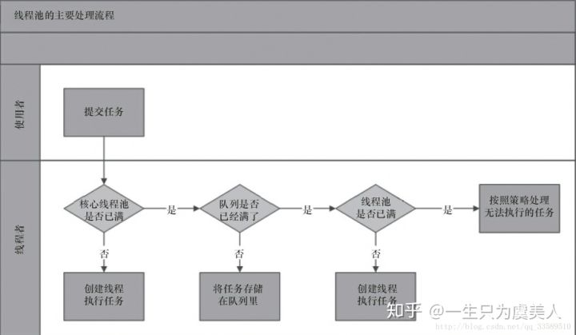
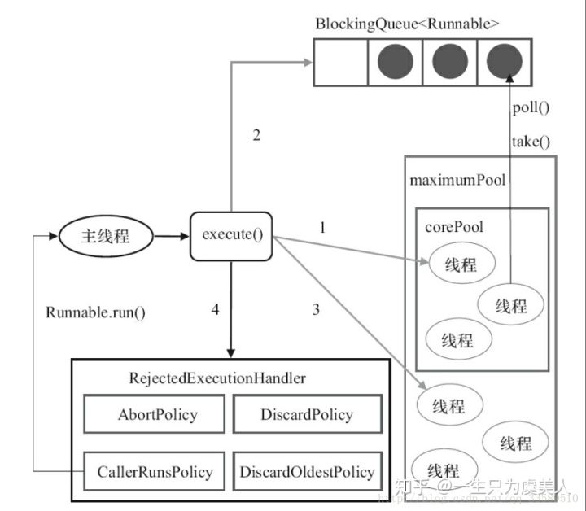
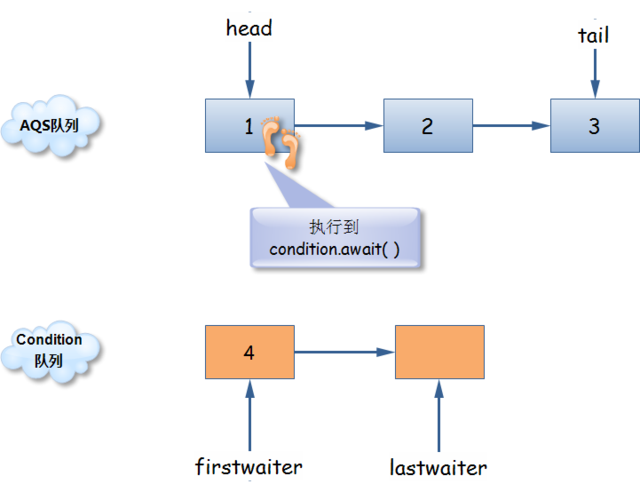
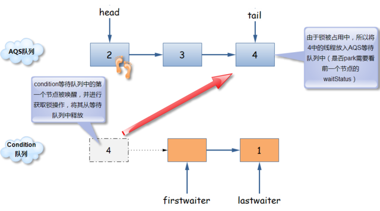
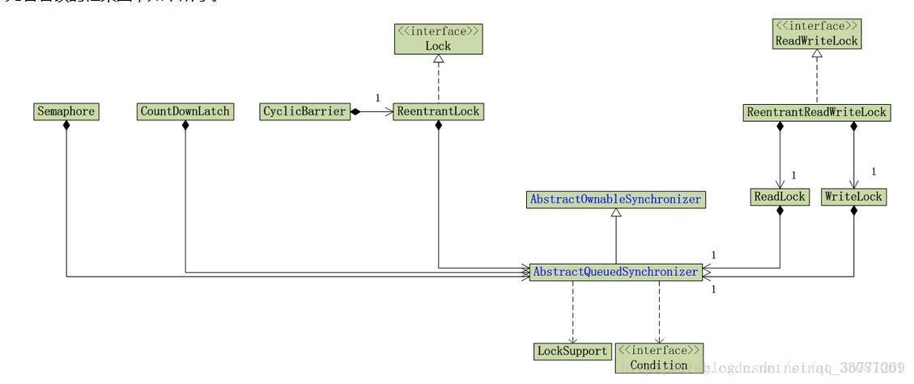
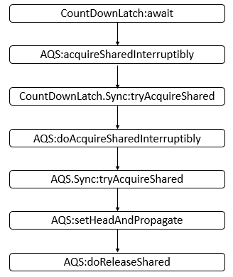
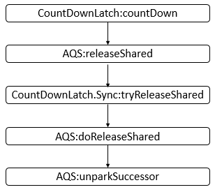
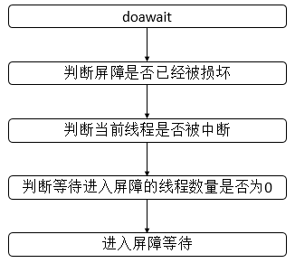
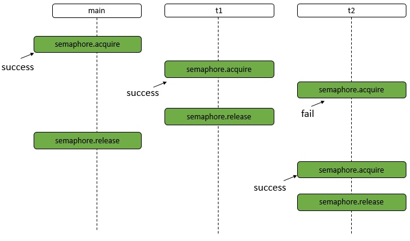
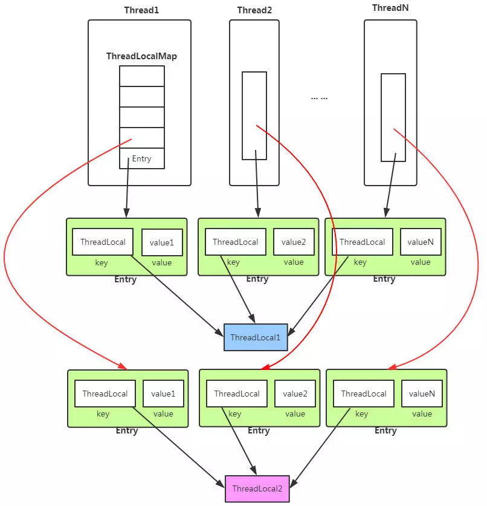

### [JUC 推荐阅读](https://www.cnblogs.com/pony1223/category/1241236.html)  

### [Java并发编程总结](http://oldblog.csdn.net/column/details/java-concurrent-prog.html) 

### [Java 多线程面试题及答案](https://mp.weixin.qq.com/s/0CI9od4DIxRrmOGFJw0SuQ)

# 一、线程状态转换


推荐阅读： **[线程状态图](https://www.cnblogs.com/mengdd/archive/2013/02/20/2917966.html)**

## 1. 新建（New）

创建后尚未启动

>  当一个Thread类或其子类的对象被声明并创建时，新生的线程对象处于新建状态

## 2. 就绪

> 处于新建状态的线程被start()后，将进入线程队列等待CPU时间片，此时它已具备了运行的条件

## 3. 可运行（Runnable）

可能正在运行，也可能正在等待 CPU 时间片

包含了操作系统线程状态中的 Running 和 Ready

>  当就绪的线程被调度并获得处理器资源时,便进入运行状态， run()方法定义了线程的操作和功能

## 4. 阻塞（Blocking）

等待获取一个排它锁，如果其线程释放了锁就会结束此状态

> 在某种特殊情况下，被人为挂起或执行输入输出操作时，让出 CPU 并临时中止自己的执行，进入阻塞状态

## 5. 无限期等待（Waiting）

等待其它线程显式地唤醒，否则不会被分配 CPU 时间片

| 进入方法                              | 退出方法                                 |
| --------------------------------- | ------------------------------------ |
| 没有设置 Timeout 参数的 Object.wait() 方法 | Object.notify() / Object.notifyAll() |
| 没有设置 Timeout 参数的 Thread.join() 方法 | 被调用的线程执行完毕                           |
| LockSupport.park() 方法             | -                                    |

## 6. 限期等待（Timed Waiting）

无需等待其它线程显式地唤醒，在一定时间之后会被系统自动唤醒

调用 Thread.sleep() 方法使线程进入限期等待状态时，常常用“使一个线程睡眠”进行描述

调用 Object.wait() 方法使线程进入限期等待或者无限期等待时，常常用“挂起一个线程”进行描述

睡眠和挂起是用来描述行为，而阻塞和等待用来描述状态

阻塞和等待的区别在于，阻塞是被动的，它是在等待获取一个排它锁。而等待是主动的，通过调用 Thread.sleep() 和 Object.wait() 等方法进入

| 进入方法                             | 退出方法                                     |
| -------------------------------- | ---------------------------------------- |
| Thread.sleep() 方法                | 时间结束                                     |
| 设置了 Timeout 参数的 Object.wait() 方法 | 时间结束 / Object.notify() / Object.notifyAll() |
| 设置了 Timeout 参数的 Thread.join() 方法 | 时间结束 / 被调用的线程执行完毕                        |
| LockSupport.parkNanos() 方法       | -                                        |
| LockSupport.parkUntil() 方法       | -                                        |

## 7. 死亡（Terminated）

可以是线程结束任务之后自己结束，或者产生了异常而结束。

> 线程完成了它的全部工作或线程被提前强制性地中止   


# 二、创建并使用线程

有四种使用线程的方法：

- 实现 Runnable 接口；
- 实现 Callable 接口；
- 继承 Thread 类。
- 线程池

实现 Runnable 和 Callable 接口的类只能当做一个可以在线程中运行的任务，不是真正意义上的线程，因此最后还需要通过 Thread 来调用。可以说任务是通过线程驱动从而执行的

## 1. 实现 Runnable 接口

需要实现 run() 方法。

通过 Thread 调用 start() 方法来启动线程。

```java
public class MyRunnable implements Runnable {
    public void run() {
        // ...
    }
}
```

```java
public static void main(String[] args) {
    MyRunnable instance = new MyRunnable();
    Thread thread = new Thread(instance);
    thread.start();
}
```

## 2. 实现 Callable 接口

- 实现 Callable 接口， 相较于实现 Runnable 接口的方式，方法可以有返回值，并且可以抛出异常
- 执行 Callable 方式，返回值通过 FutureTask 进行封装（FutureTask 是  Future 接口的实现类）

```java
public class TestCallable {
	public static void main(String[] args) {
		ThreadDemo td = new ThreadDemo();
		//1.执行 Callable 方式，需要 FutureTask 实现类的支持，用于接收运算结果
		FutureTask<Integer> result = new FutureTask<>(td);
		new Thread(result).start();
		//2.接收线程运算后的结果
		try {
			Integer sum = result.get();  //FutureTask 可用于 闭锁
			System.out.println(sum);
			System.out.println("------------------------------------");
		} catch (InterruptedException | ExecutionException e) {
			e.printStackTrace();
		}
	}
}

class ThreadDemo implements Callable<Integer>{
	@Override
	public Integer call() throws Exception {
		int sum = 0;
		for (int i = 0; i <= 100000; i++) {
			sum += i;
		}
		return sum;
	}
}
```

## 3. 继承 Thread 类

同样也是需要实现 run() 方法，因为 Thread 类也实现了 Runable 接口。

当调用 start() 方法启动一个线程时，虚拟机会将该线程放入就绪队列中等待被调度，当一个线程被调度时会执行该线程的 run() 方法。

```java
public class MyThread extends Thread {
    public void run() {
        // ...
    }
}
```

```java
public static void main(String[] args) {
    MyThread mt = new MyThread();
    mt.start();
}
```

##4. 线程池(Executor为根接口)

>  线程池可以解决两个不同问题：
>
>  - 减少了每个任务调用的开销，通常可以在执行大量异步任务时提供增强的性能，并且可以提供绑定和管理资源（包括执行任务集时使用的线程）的方法
>  - 每个 ThreadPoolExecutor 还维护着一些基本的统计数据，如完成的任务数

1. **线程池**：提供一个线程队列，保存所有等待状态的线程，避免创建与销毁额外开销，提高响应速度

2. 线程池的体系结构：

   `java.util.concurrent.Executor`： 负责线程的使用与调度的根接口

   ExecutorService 子接口： 线程池的主要接口
   * ThreadPoolExecutor 线程池的实现类
    * ScheduledExecutorService 子接口：负责线程的调度
       * ScheduledThreadPoolExecutor ：继承 ThreadPoolExecutor， 实现 ScheduledExecutorService

3. 工具类 : `Executors `

   - `ExecutorService newFixedThreadPool()` : 创建一个可重用固定线程数的线程池，以共享的无界队列方式来运行这些线程
   - `ExecutorService newCachedThreadPool()`: 创建一个可缓存线程池，如果线程池长度超过处理需要，可灵活回收空闲线程
   - `ExecutorService newSingleThreadExecutor()` : 创建单个线程池，线程池中只有一个线程
   - `ScheduledExecutorService newScheduledThreadPool()` : 创建一个定长线程池，支持定时及周期性任务执行

```java
public class TestThreadPool {
	public static void main(String[] args) throws Exception {
		//1. 创建线程池
		ExecutorService pool = Executors.newFixedThreadPool(5);
		List<Future<Integer>> list = new ArrayList<>();
		for (int i = 0; i < 10; i++) {
			//2. 为线程池中的线程分配任务
			Future<Integer> future = pool.submit(new Callable<Integer>(){
				@Override
				public Integer call() throws Exception {
					int sum = 0;
					for (int i = 0; i <= 100; i++) {
						sum += i;
					}
					return sum;
				}
			});
			list.add(future);
		}
        //3. 关闭线程池
		pool.shutdown();
		for (Future<Integer> future : list) {
			System.out.println(future.get());
		}
	}
}
```

## 5. 实现接口 VS 继承 Thread

**实现接口会更好一些**，因为：

- **Java 不支持多重继承**，因此继承了 Thread 类就无法继承其它类，但是可以实现多个接口；
- 类可能只要求可执行就行，**继承整个 Thread 类开销过大**

# 三、基础线程机制

## 1. Executor

### 1. 简介

**Executor 管理多个异步任务的执行**，无需程序员显式地管理线程的生命周期

> 异步： 指多个任务的执行互不干扰，不需要进行同步操作


主要有三种 Executor：

- `CachedThreadPool`：创建一个可缓存线程池，如果线程池长度超过处理需要，可灵活回收空闲线程
- `FixedThreadPool`：创建一个可重用固定线程数的线程池，以共享的无界队列方式来运行这些线程
- `SingleThreadExecutor`：相当于大小为 1 的 FixedThreadPool(单个后台线程)

```java
public static void main(String[] args) {
    ExecutorService executorService = Executors.newCachedThreadPool();
    for (int i = 0; i < 5; i++) {
        executorService.execute(new MyRunnable());
    }
    executorService.shutdown();
}
```

**线程调度：** 

```java
public static void main(String[] args) throws Exception {
    ScheduledExecutorService pool = Executors.newScheduledThreadPool(5);
    for (int i = 0; i < 5; i++) {
        Future<Integer> result = pool.schedule(new Callable<Integer>(){
            @Override
            public Integer call() throws Exception {
                int num = new Random().nextInt(100);//生成随机数
                System.out.println(Thread.currentThread().getName() 
                                   + " : " + num);
                return num;
            }
        }, 1, TimeUnit.SECONDS);
        System.out.println(result.get());
    }
    pool.shutdown();
}
```

### 2. 源码分析

```java
//newFixedThreadPool
public static ExecutorService newFixedThreadPool(int nThreads) {
    return new ThreadPoolExecutor(nThreads, nThreads, 0L, TimeUnit.MILLISECONDS,
                                  new LinkedBlockingQueue<Runnable>());//无界阻塞队列
}
//newSingleThreadExecutor
public static ExecutorService newSingleThreadExecutor() {
    return new FinalizableDelegatedExecutorService
        (new ThreadPoolExecutor(1, 1, 0L, TimeUnit.MILLISECONDS,
                                new LinkedBlockingQueue<Runnable>()));//无界阻塞队列
}
//newCachedThreadPool，
public static ExecutorService newCachedThreadPool() {
    return new ThreadPoolExecutor(0, Integer.MAX_VALUE, 60L, TimeUnit.SECONDS,
                                 new SynchronousQueue<Runnable>());//不存储任务的阻塞队列
}
//newScheduledThreadPool: 支持定时及周期性任务执行
public static ScheduledExecutorService newScheduledThreadPool(int corePoolSize) {
    return new ScheduledThreadPoolExecutor(corePoolSize);
}
public ScheduledThreadPoolExecutor(int corePoolSize) {//基于优先级的延时阻塞队列
    super(corePoolSize, Integer.MAX_VALUE, 0, NANOSECONDS, new DelayedWorkQueue());
}

/**
 * corePoolSize 是线程池的核心线程数，通常线程池会维持这个线程数
 * maximumPoolSize 是线程池所能维持的最大线程数
 * keepAliveTime 和 unit 则分别是超额（空闲）线程的空闲存活时间数和时间单位
 * workQueue 是提交任务到线程池的入队列
 * threadFactory 是线程池创建新线程的线程构造器
 * handler 是当线程池不能接受提交任务的时候的处理策略
 */
public ThreadPoolExecutor(int corePoolSize, int maximumPoolSize, long keepAliveTime,
                          TimeUnit unit, BlockingQueue<Runnable> workQueue) {
    this(corePoolSize, maximumPoolSize, keepAliveTime, unit, workQueue,
         Executors.defaultThreadFactory(), defaultHandler);
}
```



ThreadPoolExecutor 执行 execute()： 

- 若当前运行的线程少于`corePoolSize`,则创建新线程来执行任务(执行这一步需要获取全局锁)
- 若运行的线程多于或等于`corePoolSize`,则将任务加入`BlockingQueue` 
- 若无法将任务加入`BlockingQueue`,则创建新的线程来处理任务(执行这一步需要获取全局锁)
- 若创建新线程将使当前运行的线程超出`maximumPoolSize`,任务将被拒绝,并调用`RejectedExecutionHandler.rejectedExecution()`

目的： 在执行`execute()`时，尽量避免获取全局锁 

> 在ThreadPoolExecutor完成预热之后（当前运行的线程数大于等于corePoolSize),几乎所有的execute()方法调用都是执行步骤2,而步骤2不需要获取全局锁



**推荐阅读**： 

- [JDK8线程池-ThreadPoolExecutor源码解析](https://blog.csdn.net/fenglllle/article/details/82790242)
- [Java线程池-ThreadPoolExecutor源码解析](https://zhuanlan.zhihu.com/p/49944896)

### 3. ThreadPoolExecutor

- ThreadPoolExecutor 以内部线程池的形式对外提供管理任务执行，线程调度，线程池管理等等服务

|          参数名          | 作用                                                         |
| :----------------------: | ------------------------------------------------------------ |
|       corePoolSize       | 核心线程池大小                                               |
|     maximumPoolSize      | 最大线程池大小                                               |
|      keepAliveTime       | 线程池中超过 corePoolSize 数目的空闲线程最大存活时间         |
|         TimeUnit         | keepAliveTime 时间单位                                       |
|        workQueue         | 阻塞任务队列                                                 |
|      threadFactory       | 新建线程工厂                                                 |
| RejectedExecutionHandler | 当提交任务数超过 maxmumPoolSize + workQueue 之和时，任务会交给RejectedExecutionHandler 来处理 |

**执行过程**： 

- 线程池小于 corePoolSize 时，新提交任务将创建一个新线程执行任务，即此时线程池中存在空闲线程
- 线程池达到 corePoolSize 时，新提交任务将被放入 workQueue 中，等待线程池中任务调度执行
- 当 workQueue 已满，且 maximumPoolSize > corePoolSize 时，新提交任务会创建新线程执行任务
- 当提交任务数超过 maximumPoolSize 时，新提交任务由 RejectedExecutionHandler 处理

**RejectExecutionHandler 所采取的饱和策略**：

- `ThreadPoolExecutor.AbortPolicy()`： 抛出 java.util.concurrent.RejectedExecutionException 异常 
- `ThreadPoolExecutor.CallerRunsPolicy()`： 重试添加当前的任务，会自动重复调用execute()方法 
- `ThreadPoolExecutor.DiscardOldestPolicy()`： 抛弃旧的任务  
- `ThreadPoolExecutor.DiscardPolicy()`： 抛弃当前的任务 
- 自定义： 实现 `RejectedExecutionHandler` 接口自定义策略，如记录日志或持久化不能处理的任务

**空闲线程的回收**： 

- 当线程池中超过 corePoolSize 线程，空闲时间达到 keepAliveTime 时，关闭空闲线程
- 当设置 allowCoreThreadTimeOut(true) 时，线程池中 corePoolSize 线程空闲时间达到 keepAliveTime 也将关闭


**总结**： 

- **ThreadPoolExecutor 自定义线程池**： 
  - 如果任务量不大，可以用无界队列
  - 如果任务量非常大，要用有界队列，防止 OOM
- 如果任务量很大，还要求每个任务都处理成功，重写拒绝机制，改为阻塞提交，保证不抛弃一个任务
- **线程数**： 
  - 最大线程数： 设为 2N+1 最好，N 是CPU核数
  - 核心线程数： 如果是任务，一天跑一次，设置为0，合适，因为跑完就停掉了，如果是常用线程池，看任务量，是保留一个核心还是几个核心线程数
- 如果要获取任务执行结果，用CompletionService，但是注意，获取任务的结果的要重新开一个线程获取，如果在主线程获取，就要等任务都提交后才获取，就会阻塞大量任务结果，队列过大OOM，所以最好异步开个线程获取结果

### 4. 阻塞队列

- `LinkedBlockingQueue`：基于链表的无界阻塞队列，按 FIFO 规则存取任务，默认为 `Integer.MAX_VALUE` 

  > - LinkedBlockingQueue 是一个基于单向链表的、范围任意的（其实是有界的）、FIFO 阻塞队列 
  > - ConcurrentLinkedQueue 是一个基于链接节点的无界线程安全队列，采用先进先出的规则对节点进行排序：
  >   - 元素会添加到队列的尾部
  >   - 当我们获取一个元素时，它会返回队列头部的元素
  >   - 采用“wait－free”算法来实现

- `ArrayBlockingQueue`：基于数组的有界阻塞队列，按 FIFO 规则存取任务，必须指定队列大小

- `DelayedWorkQueue`：基于 PriorityQueue的 延时阻塞队列，DelayQueue中的元素只有当其指定的延迟时间到了，才能够从队列中获取到该元素

  > 推荐阅读： **[DelayedWorkQueue 实现原理与源码解析](https://www.cnblogs.com/java-chen-hao/p/10275910.html)**
  >
  > - **实现延时或定时任务**： 任务队列会根据任务延时时间的不同进行排序，延时时间越短地就排在队列的前面，先被获取执行
  >
  > - 优先级队列： 对插入的数据进行优先级排序，保证优先级高的数据先被获取，与数据插入顺序无关
  >
  > - **实现**： 优先级队列高效常用的一种方式就是使用**堆**

- `PriorityBlockingQueue`：具有优先级的阻塞队列，会按照元素的优先级对元素进行排序，每次出队的元素都是优先级最高的元素，容量无上限

- `SynchronousQueue`：不存储任务的阻塞队列，每一个存入对应一个取出，串行化队列

> 吞吐量：SynchronousQueue > LinkedBlockingQueue > ArrayBlockingQueue 

**非阻塞队列的方法**： 

- `add(E e)`： 将元素插入队列末尾，若插入成功，则返回true；若插入失败(即队列已满)，则抛出异常

- `remove()`：移除队首元素，若移除成功，则返回true；如果移除失败（队列为空），则会抛出异常

- `offer(E e)`：将元素插入队列末尾，若插入成功，则返回true；若插入失败(即队列已满)，则返回false

- `poll()`：移除并获取队首元素，若成功，则返回队首元素；否则返回null

- `peek()`：获取队首元素，若成功，则返回队首元素；否则返回null

**阻塞队列的方法**： 

- `put(E e)`： 用来向队尾存入元素，若队列满，则等待

- `take()`： 用来从队首取元素，如果队列为空，则等待

- `offer(E e,long timeout, TimeUnit unit)`： 用来向队尾存入元素，如果队列满，则等待一定的时间，当时间期限达到时，如果还没有插入成功，则返回false；否则返回true

- `poll(long timeout, TimeUnit unit)`： 用来从队首取元素，如果队列空，则等待一定的时间，当时间期限达到时，如果没有取到，则返回null；否则返回取得的元素

推荐阅读： **[Java并发编程：阻塞队列](https://www.cnblogs.com/dolphin0520/p/3932906.html)**

### 5. 线程池的生命周期

Executor 扩展 `ExecutorService` 接口，添加了用于生命周期管理的方法，其生命周期的状态为： 运行、关闭、已终止

- **运行**： `ExecutorService` 在初始创建时处于运行状态

- **关闭**： 

  - `shutdown()`： 执行**平缓**的关闭过程，不再接受新的任务，同时等待已提交的任务执行完成

  - `shutdownNow()`： 执行**粗暴**的关闭过程，尝试取消所有运行任务，不再启动队列中尚未开始执行的任务

  > `ExecutorService` 关闭后提交的任务将由**拒绝执行处理器**来处理：
  >
  > - 其会关闭任务
  > - 或使 execute 方法抛出一个未检查的 `RejectedExecutionExeception`

- **已终止**： 

  - 方法 `awaitTermination` 可用于等待 `ExecutorService` 到达终止状态

  - 方法 `isTermination` 可用来轮询 `ExecutorService` 是否已经终止

> - `ExecutorService` 中的所有 submit 方法都将返回一个 Future，从而将一个 Runnable 或 Callable 提交给 Executor，并得到一个 Future 用来获得任务的执行结果或取消任务

## 2. Daemon

- 定义： **守护线程是程序运行时在后台提供服务的线程**

- 当所有非守护线程结束时，程序也就终止，同时会杀死所有守护线程

- **main() 属于非守护线程**

- **守护线程用来服务用户线程**，通过**在start()方法前调用thread.setDaemon(true)把用户线程变成守护线程**

```java
public static void main(String[] args) {
    Thread thread = new Thread(new MyRunnable());
    thread.setDaemon(true);
}
```

## 3. sleep()

- `TimeUnit.SECONDS.sleep(2)`： 等同于 `Thread.sleep(2000)`，好处在于有明确的单位说明

  > 为了代码语义更清晰，建议使用 TimeUnit.SECONDS.sleep(2) 方式
  >
  > 注意 TimeUnit 是枚举类型

### 1. 简介

`Thread.sleep(millisec)` 方法会休眠当前正在执行的线程，millisec 单位为毫秒

```java
public void run() {
    try {
        Thread.sleep(3000);
    } catch (InterruptedException e) {
        e.printStackTrace();
    }
}
```

### 2. 与 wait 区别

- **来自不同类**： sleep来自Thread类，wait来自Object类

- **锁释放**： **sleep 方法没有释放锁，wait 方法释放锁**，使得其他线程可以使用同步控制块或者方法
  - sleep不出让系统资源
  - wait是进入线程等待池等待，出让系统资源，其他线程可以占用CPU

- **使用范围：**wait、notify、notifyAll 只能在同步控制方法或同步控制块中使用，而sleep可以在任何地方使用 
     synchronized(x){ 
        x.notify() 
       //或者wait() 
     }

- sleep必须**捕获异常**，而wait，notify和notifyAll不需要捕获异常

### 3. sleep() 与 sleep(0) 区别

Sleep 接口均带有表示睡眠时间长度的参数 timeout，会有条件地将调用线程从当前处理器上移除，并且有可能将它从线程调度器的可运行队列中移除，该条件取决于调用 Sleep 时timeout 参数

- 当 timeout = 0， 即 Sleep(0)： `Thread.Sleep(0)` 会触发操作系统立刻重新进行一次CPU竞争
  - 如果线程调度器的可运行队列中**有大于或等于当前线程优先级的就绪线程存在**，操作系统会将当前线程从处理器上移除，调度其他优先级高的就绪线程运行
  - 如果可运行队列中**没有就绪线程或所有就绪线程的优先级均低于当前线程优先级**，则当前线程会继续执行，就像没有调用 Sleep(0)一样

- 当 timeout > 0 时，如：Sleep(1)，会**引发线程上下文切换**：
  - 调用线程会从线程调度器的可运行队列中被移除 timeout 时间，

- `SwitchToThread()` 方法： 如果当前有其他就绪线程在线程调度器的可运行队列中，始终会让出一个时间切片给这些就绪线程，而不管就绪线程的优先级的高低与否

## 4. yield()

`Thread.yield()`： 

- 暂停当前正在执行的线程，把执行机会让给优先级相同或更高的线程
- 若队列中没有同优先级的线程，忽略此方法

```java
public void run() {
    Thread.yield();
}
```

## 5. stop

>  强制线程生命期结束

# 四、中断

```java
//中断线程（实例方法）
public void Thread.interrupt();
//判断线程是否被中断（实例方法）
public boolean Thread.isInterrupted();
//判断是否被中断并清除当前中断状态（静态方法）
public static boolean Thread.interrupted();
```

注意： **线程的中断操作对于正在等待获取的锁对象 synchronized 方法或者代码块不起作用**

## 1. InterruptedException

`interrupt()`： 用于中断线程，若线程处于阻塞、限期等待或无限期等待状态，则会抛出 InterruptedException，同时中断状态将会被复位(由中断状态改为非中断状态)

- **阻塞中断场景**： 会抛出异常，并将中断状态复位，即由中断状态改为非中断状态

  ```java
  //线程调用了 Thread.sleep() 方法，此时调用  Thread.interrupt() 会抛出 InterruptedException
  //从而提前结束线程，不执行之后的语句
  public static void main(String[] args) throws InterruptedException {
      Thread thread1 = new MyThread1();
      thread1.start();
      thread1.interrupt();
      System.out.println("Main run");
  }
  public class InterruptExample {
      private static class MyThread1 extends Thread {
          @Override
          public void run() {
              try {
                  Thread.sleep(2000);
                  System.out.println("Thread run");
              } catch (InterruptedException e) {
                  e.printStackTrace();
              }
          }
      }
  }
  
  //结果打印
  Main run
  java.lang.InterruptedException: sleep interrupted
      at java.lang.Thread.sleep(Native Method)
      at InterruptExample.lambda$main$0(InterruptExample.java:5)
      at InterruptExample$$Lambda$1/713338599.run(Unknown Source)
      at java.lang.Thread.run(Thread.java:745)
  ```

- **处于运行期且非阻塞的状态的线程**： 直接调用 `Thread.interrupt()` 中断线程不会得到响应

  原因： **处于非阻塞状态的线程需要手动进行中断检测并结束程序**

  ```java
  public class InterruputThread {
      public static void main(String[] args) throws InterruptedException {
          Thread t1=new Thread(){
              @Override
              public void run(){
                  while(true){
                      System.out.println("未被中断");
                  }
              }
          };
          t1.start();
          TimeUnit.SECONDS.sleep(2);
          t1.interrupt();
      }
  }
  //结果：
  //未被中断
  //未被中断
  //未被中断
  //......
  ```

- **调用 `isInterrupted()` 进行手动中断检测**： 非阻塞状态调用 `interrupted()` 不会导致中断状态重置

  ```java
  public class InterruputThread {
      public static void main(String[] args) throws InterruptedException {
          Thread t1 = new Thread(){
              @Override
              public void run(){
                  while(true){
                      //判断当前线程是否被中断
                      if (this.isInterrupted()){
                          System.out.println("线程中断");
                          break;
                      }
                  }
                  System.out.println("已跳出循环,线程中断!");
              }
          };
          t1.start();
          TimeUnit.SECONDS.sleep(2);
          t1.interrupt();
      }
  }
  //输出: 
  /**
   * 线程中断
   * 已跳出循环,线程中断!
   */
  ```

  

## 2. interrupted()

调用 interrupt() 方法会设置线程的中断标记，此时在循环体中使用 interrupted() 方法来判断线程是否处于中断状态，从而提前结束线程

```java
public static void main(String[] args) throws InterruptedException {
    Thread thread2 = new MyThread2();
    thread2.start();
    thread2.interrupt();
}

public class InterruptExample {
    private static class MyThread2 extends Thread {
        @Override
        public void run() {
            while (!interrupted()) {
                // ..
            }
            System.out.println("Thread end");
        }
    }
}

//结果
Thread end
```

## 3. Executor 的中断操作

- `shutdown()`： 会等待线程都执行完毕之后再关闭
- `shutdownNow()`： 相当于调用每个线程的 interrupt() 方法

```java
public static void main(String[] args) {
    ExecutorService executorService = Executors.newCachedThreadPool();
    executorService.execute(() -> {
        try {
            Thread.sleep(2000);
            System.out.println("Thread run");
        } catch (InterruptedException e) {
            e.printStackTrace();
        }
    });
    executorService.shutdownNow();
    System.out.println("Main run");
}

//结果
Main run
java.lang.InterruptedException: sleep interrupted
   at java.lang.Thread.sleep(Native Method)
   at ExecutorInterruptExample.lambda$main$0(ExecutorInterruptExample.java:9)
   at ExecutorInterruptExample$$Lambda$1/1160460865.run(Unknown Source)
   at java.util.concurrent.ThreadPoolExecutor.runWorker(ThreadPoolExecutor.java:1142)
   at java.util.concurrent.ThreadPoolExecutor$Worker.run(ThreadPoolExecutor.java:617)
   at java.lang.Thread.run(Thread.java:745)
```

**中断 Executor 的一个线程**： 

- 使用 submit() 方法提交一个线程，得到一个 Future<?> 返回对象
- 调用该对象的 cancel(true) 方法来中断该线程

```java
Future<?> future = executorService.submit(() -> {
    // ..
});
future.cancel(true);
```

# 五、互斥同步

**java 锁机制**： 控制多个线程对共享资源的互斥访问

- JVM 实现的 synchronized
- JDK 实现的 ReentrantLock

## 1. synchronized

推荐阅读： **[深入理解Java并发之synchronized实现原理](https://blog.csdn.net/javazejian/article/details/72828483)** 

Synchronized 会在同步块的前后分别形成 `monitorenter和monitorexit` 两个字节码指令： 

- 执行 `monitorenter` 指令时，先尝试获取对象锁，如果该对象没被锁定，或当前线程已拥有对象锁，则把锁的计算器加 1

- 执行 `monitorexit` 指令时，将锁计算器减 1，当计算器为 0 时，锁被释放，若获取对象锁失败，则当前线程阻塞，直到对象锁被另一个线程释放为止

### 1. synchronized 应用方式

- **修饰实例方法**： 作用于当前实例加锁，进入同步代码前要获得当前实例的锁

  ```java
  public synchronized void func () {
      // ...
  }
  
  //同步一个类
  public class SynchronizedExample {
      public void func2() {
          synchronized (SynchronizedExample.class) {
              for (int i = 0; i < 10; i++) {
                  System.out.print(i + " ");
              }
          }
      }
  }
  //测试： 两个线程调用同一个类的不同对象上的同步语句，也会进行同步
  public static void main(String[] args) {
      SynchronizedExample e1 = new SynchronizedExample();
      SynchronizedExample e2 = new SynchronizedExample();
      ExecutorService executorService = Executors.newCachedThreadPool();
      executorService.execute(() -> e1.func2());
      executorService.execute(() -> e2.func2());
  }
  //结果
  0 1 2 3 4 5 6 7 8 9 0 1 2 3 4 5 6 7 8 9
  ```

- **修饰静态方法**： 作用于当前类对象加锁，进入同步代码前要获得当前类对象的锁

  注意： 

  - **作用于整个类**
  - **非静态方法的锁默认为 this，静态方法的锁对应 Class 实例** 
  - **一个静态同步方法获取 Class 实例锁后，其他静态同步方法必须等待该方法释放锁才能获取锁**

  ```java
  public synchronized static void fun() {
      // ...
  }
  ```

- **修饰代码块**： 指定加锁对象，对给定对象加锁，进入同步代码库前要获得给定对象的锁

  ```java
  public class SynchronizedExample {
      public void func1() {
          synchronized (this) {
              for (int i = 0; i < 10; i++) {
                  System.out.print(i + " ");
              }
          }
      }
  }
  
  //测试一： 两个线程调用相同对象的同步代码块
  public static void main(String[] args) {
      SynchronizedExample e1 = new SynchronizedExample();
      ExecutorService executorService = Executors.newCachedThreadPool();
      executorService.execute(() -> e1.func1());
      executorService.execute(() -> e1.func1());
  }
  //结果
  0 1 2 3 4 5 6 7 8 9 0 1 2 3 4 5 6 7 8 9
      
  //测试二： 两个线程调用不同对象的同步代码块
  public static void main(String[] args) {
      SynchronizedExample e1 = new SynchronizedExample();
      SynchronizedExample e2 = new SynchronizedExample();
      ExecutorService executorService = Executors.newCachedThreadPool();
      executorService.execute(() -> e1.func1());
      executorService.execute(() -> e2.func1());
  }
  //结果
  0 0 1 1 2 2 3 3 4 4 5 5 6 6 7 7 8 8 9 9
  ```

### 2. synchronized 底层原理

- Java 虚拟机中的同步(Synchronization)**基于进入和退出管程(Monitor)对象实现**
  - 执行 `monitorenter` 指令时，先尝试获取对象锁，如果该对象没被锁定，或当前线程已拥有对象锁，则把锁的计算器加 1
  - 执行 `monitorexit` 指令时，将锁计算器减 1，当计算器为 0 时，锁被释放，若获取对象锁失败，则当前线程阻塞，直到对象锁被另一个线程释放为止

- **Java 对象头是实现 synchronized 锁对象的基础**，synchronized 使用的锁对象存储在 Java 对象头中

  > JVM中的对象在内存中布局分为三块区域：**对象头、实例数据和对齐填充**

### 3. 其他特性

#### 1. 可重入性

**可重入**： 

- 当一个线程试图操作一个由其他线程持有的对象锁的临界资源时，将会处于阻塞状态
- 但当一个线程再次请求自己持有对象锁的临界资源时，请求将会成功

注意： 当子类继承父类时，子类也可以通过可重入锁调用父类的同步方法

```java
public void run() {
    for(int j=0;j<1000000;j++){
        //this,当前实例对象锁
        synchronized(this){
            i++;
            increase();//synchronized的可重入性
        }
    }
}

public synchronized void increase(){
    j++;
}
```

#### 2. 中断与synchronized

- 对于 synchronized 来说，如果一个线程在等待锁，则结果只有两种： 
  - 要么它**获得这把锁继续执行**
  - 要么它就**保存等待**，即使调用中断线程的方法，也不会生效

```java
public class SynchronizedBlocked implements Runnable{
    public synchronized void f() {
        System.out.println("Trying to call f()");
        while(true) // Never releases lock
            Thread.yield();
    }
    //在构造器中创建新线程并启动获取对象锁
    public SynchronizedBlocked() {
        //该线程已持有当前实例锁
        new Thread() {
            public void run() {
                f(); // Lock acquired by this thread
            }
        }.start();
    }
    public void run() {
        //中断判断
        while (true) {
            if (Thread.interrupted()) {
                System.out.println("中断线程!!");
                break;
            } else {
                f();
            }
        }
    }
    public static void main(String[] args) throws InterruptedException {
        SynchronizedBlocked sync = new SynchronizedBlocked();
        Thread t = new Thread(sync);
        //启动后调用f()方法,无法获取当前实例锁处于等待状态
        t.start();
        TimeUnit.SECONDS.sleep(1);
        //中断线程,无法生效
        t.interrupt();
    }
}
```

#### 3. 等待唤醒机制与synchronized

- 等待唤醒机制： 指 `notify, notifyAll, wait`方法
- 使用这3个方法时： 必须处于synchronized代码块或者synchronized方法中，否则就会抛出IllegalMonitorStateException 异常
- 原因： 
  - 因为调用这几个方法前必须拿到当前对象的监视器 monitor 对象，即 notify/notifyAll/wait 方法依赖于monitor对象
  - monitor 存在于对象头的 Mark Word 中(存储monitor引用指针)，而 synchronized 关键字可以获取 monitor 

## 2. ReentrantLock（同步锁）

- ReentrantLock 实现 Lock 接口，提供与 synchronized 相同的互斥性和内存可见性
- 相较于synchronized 提供了更高的处理锁的灵活性

**主要功能**： 

- **等待可中断**： 持有锁的线程长期不释放时，正在等待的线程可以选择放弃等待，避免出现死锁

- **公平锁**： 多个线程等待同一个锁时，必须按照申请锁的时间顺序获得锁

  > ReentrantLock 默认创建非公平锁，可以通过参数 true 设为公平锁，但公平锁表现的性能不是很好

- **锁绑定多个条件**： 一个 ReentrantLock 对象可以同时绑定对个对象

**ReentrantLock 获取锁的方式**：

- `lock()`： 
  - 如果获取了锁立即返回
  - 如果别的线程持有锁，当前线程则一直处于休眠状态，直到获取锁
- `tryLock()`： 
  - 如果获取了锁立即返回 true
  - 如果别的线程正持有锁，立即返回false
- `tryLock(long timeout,TimeUnit unit)`： 
  - 如果获取了锁定立即返回 true
  - 如果别的线程正持有锁，会等待参数给定的时间
    - 在等待的过程中，如果获取了锁定，就返回true
    - 如果等待超时，返回false
- `lockInterruptibly`： 
  - 如果获取了锁定立即返回
  - 如果没有获取锁，当前线程处于休眠状态，直到获取锁，或者当前线程被别的线程中断

```java
public class LockExample {
    private Lock lock = new ReentrantLock();
    public void func() {
        lock.lock();
        try {
            for (int i = 0; i < 10; i++) {
                System.out.print(i + " ");
            }
        } finally {
            lock.unlock(); // 确保释放锁，从而避免发生死锁。
        }
    }
}

public static void main(String[] args) {
    LockExample lockExample = new LockExample();
    ExecutorService executorService = Executors.newCachedThreadPool();
    executorService.execute(() -> lockExample.func());
    executorService.execute(() -> lockExample.func());
}

//结果
0 1 2 3 4 5 6 7 8 9 0 1 2 3 4 5 6 7 8 9
```

## 3. 比较

推荐阅读： **[Synchronize和ReentrantLock区别](https://github.com/yangchong211/YCBlogs/blob/master/java/Java%E5%A4%9A%E7%BA%BF%E7%A8%8B/05.Synchronize%E5%92%8CReentrantLock%E5%8C%BA%E5%88%AB.md)**

**相同点**： 

- ReentrantLock  拥有 Synchronized 相同的并发性和内存语义，此外还多了锁投票，定时锁等候和中断锁等候

**不同点**： 

- **等待可中断**： 当持有锁的线程长期不释放锁的时候，正在等待的线程可以选择放弃等待，改为处理其他事情
  - **ReentrantLock 可中断，而 synchronized 不行**
- **锁的释放**： 
  - synchronized 在JVM层面上实现，可以通过监控工具监控 synchronized 的锁定，而且在代码执行时出现异常，JVM 会自动释放锁定
  - lock 通过代码实现，须手动 unLock() 释放锁

- **公平锁**： 公平锁是指多个线程在等待同一个锁时，必须按照申请锁的时间顺序来依次获得锁
  - **synchronized 锁非公平，ReentrantLock 默认非公平，但也可以公平**

-  **锁绑定多个条件**： 一个 ReentrantLock 可以同时绑定多个 Condition 对象

## 4. 使用选择

- `synchronized`： 在资源竞争不是很激烈的情况下，偶尔会有同步的情形下，synchronized 很合适

  原因： 编译程序通常会尽可能的进行优化 synchronized

- `ReentrantLock`:  当资源竞争激烈时，synchronized 性能下降，但 ReentrantLock 还能维持常态

  原因： ReentrantLock 提供多样化同步，比如有时间限制的同步，可以被Interrupt的同步（synchronized的同步是不能Interrupt的）

- `Atomic`:   资源竞争激烈时，Atomic 性能会优于 ReentrantLock 一倍左右

  缺点： 只能同步一个值，一段代码中只能出现一个 Atomic 变量，多于一个同步无效

**使用建议**： 

- 优先考虑 synchronized，如果有特殊需要，再进一步优化
- ReentrantLock和Atomic如果用的不好，不仅不能提高性能，还可能带来灾难

# 六、线程之间的协作

当多个线程可以一起工作去解决某个问题时，如果某些部分必须在其它部分之前完成，那么就需要对线程进行协调

## 1. join()

**在线程中调用另一个线程的 join() 方法，会将当前线程挂起，直到目标线程结束**

- 低优先级的线程也可以获得执行 

```java
//因为在 b 线程中调用了 a 线程的 join() 方法，b 线程会等待 a 线程结束才继续执行
//因此能够保证 a 线程的输出先于 b 线程的输出
public class JoinExample {
    private class A extends Thread {
        @Override
        public void run() {
            System.out.println("A");
        }
    }
    private class B extends Thread {
        private A a;
        B(A a) {
            this.a = a;
        }
        @Override
        public void run() {
            try {
                a.join();
            } catch (InterruptedException e) {
                e.printStackTrace();
            }
            System.out.println("B");
        }
    }
    public void test() {
        A a = new A();
        B b = new B(a);
        b.start();
        a.start();
    }
    public static void main(String[] args) {
        JoinExample example = new JoinExample();
        example.test();
    }
}

//结果
A
B
```

## 2. wait() notify() notifyAll()

**notify 丢失(虚假唤醒)**： 

- 线程 A 与 B 被同一个 Object.wait() 挂起，但等待条件不同
- 假设线程 B 的条件被满足，执行一个 notify 操作
- JVM 从 Object.wait() 的多个线程（A/B）中挑选一个唤醒，不幸的选择了 A
- 但 A 的条件不满足，于是 A 继续挂起，B 仍然在等待被唤醒

**虚假唤醒的解决方式**： 

- 使用 `notifyall()`，避免使用

  > notifyall() 会唤醒所有线程，但只有一个线程能够得到锁，因此会带来大量的上下文切换和大量的竞争锁请求

- wait() 最好放在 while 循环中，以避免“虚假唤醒”的情形

  ```java
  synchronized(obj){
     while(<condition does not hold>){
       obj.wait();
     }
  }
  ```

**wait() 和 sleep() 的区别** 

- **wait() 是 Object 的方法，而 sleep() 是 Thread 的静态方法**

- **wait() 会释放锁，sleep() 不会** 

- **wait、notify、notifyAll 只能在同步控制方法或同步控制块中使用，而sleep可以在任何地方使用** 

  推荐阅读： **[wait(),notify(),notifyAll()必须在同步方法/代码块中调用](https://www.cnblogs.com/xiohao/p/7118102.html)**

  - 当一个线程需要调用对象的 wait()方法时，该线程必须拥有该对象的锁，接着它会释放这个对象锁并进入等待状态直到其他线程调用这个对象上的 notify() 方法
  - 当一个线程需要调用对象的 notify() 方法时，它会释放这个对象的锁，以便其他在等待的线程就可以得到这个对象锁
  - 由于所有的这些方法都需要线程持有对象的锁，这样就只能通过同步来实现，所以他们只能在同步方法或者同步块中被调用

## 3. Condition 的 await() signal() signalAll()

**Condition 类**： 位于 `java.util.concurrent`，可以使用 Lock 来获取 Condition 对象

- `await()` 方法使线程等待，但可以指定等待的条件，因此更加灵活
- `signal() 或 signalAll()` 方法唤醒等待的线程

```java
public class AwaitSignalExample {

    private Lock lock = new ReentrantLock();
    private Condition condition = lock.newCondition();

    public void before() {
        lock.lock();
        try {
            System.out.println("before");
            condition.signalAll();
        } finally {
            lock.unlock();
        }
    }

    public void after() {
        lock.lock();
        try {
            condition.await();
            System.out.println("after");
        } catch (InterruptedException e) {
            e.printStackTrace();
        } finally {
            lock.unlock();
        }
    }
    
    public static void main(String[] args) {
        ExecutorService executorService = Executors.newCachedThreadPool();
        AwaitSignalExample example = new AwaitSignalExample();
        executorService.execute(() -> example.after());
        executorService.execute(() -> example.before());
    }
}

//结果
before
after
```

### 1. 实现原理

推荐阅读： **[java Condition源码分析](https://blog.csdn.net/coslay/article/details/45217069)**

- **初始化状态**：AQS 等待队列有 3个Node，Condition 队列有1个Node(也有可能1个都没有)

  

- **节点1执行 Condition.await()** 

  - 将 head 后移 
  - 释放节点 1 的锁并从 AQS 等待队列中移除 
  - 将节点 1 加入到 Condition 的等待队列中 
  - 更新 lastWaiter 为节点1

  

- **节点2执行signal()操作** 

  - 将 firstWaiter 后移 
  - 将节点 4 移出 Condition 队列 
  - 将节点 4 加入到 AQS 的等待队列中去 
  - 更新 AQS 的等待队列的 tail

  

执行流程： 

1. 线程 1 调用 reentrantLock.lock 时，线程被加入到 AQS 的等待队列中

2. 线程 1 调用 await 方法被调用时，该线程从 AQS 中移除，对应操作是锁的释放

3. 接着马上被加入到Condition的等待队列中，以为着该线程需要 signal 信号

4. 线程 2，因为线程1释放锁的关系，被唤醒，并判断可以获取锁，于是线程2获取锁，并加入到AQS的等待队列

5. 线程 2 调用 signal 方法，这个时候Condition的等待队列中只有线程1一个节点，于是它被取出来，并被加入到AQS的等待队列中。  注意，这个时候，线程1 并没有被唤醒

6. signal 方法执行完毕，线程2调用reentrantLock.unLock()方法，释放锁。这个时候因为AQS中只有线程1，于是，AQS释放锁后按从头到尾的顺序唤醒线程时，线程1被唤醒，于是线程1回复执行

7. 直到释放所整个过程执行完毕

### 2. 源码分析

- Condition 内部有一个 FIFO 队列

  ```java
  //AbstractQueuedSynchronizer 中的内部类 ConditionObject
  private transient Node firstWaiter;
  private transient Node lastWaiter;
  ```

- `await()`

  ```java
  public final void await() throws InterruptedException {
      // 1.如果当前线程被中断，则抛出中断异常
      if (Thread.interrupted())
          throw new InterruptedException();
      // 2.将节点加入到Condition队列中
      Node node = addConditionWaiter();
      // 3.调用tryRelease，释放当前线程的锁
      long savedState = fullyRelease(node);
      int interruptMode = 0;
      // 4.自旋(while)挂起，直到被唤醒，超时，CACELLED等
      // signal操作将Node从Condition队列中拿出并放入到等待队列中
      // 若不在AQS等待队列中，就park当前线程，若在，则退出循环
      while (!isOnSyncQueue(node)) {
          LockSupport.park(this);
          if ((interruptMode = checkInterruptWhileWaiting(node)) != 0)
              break;
      }
      // 5.自旋等待尝试再次获取锁，调用acquireQueued方法
      if (acquireQueued(node, savedState) && interruptMode != THROW_IE)
          interruptMode = REINTERRUPT;
      if (node.nextWaiter != null)
          unlinkCancelledWaiters();
      if (interruptMode != 0)
          reportInterruptAfterWait(interruptMode);
  }
  ```

- `signal() 与 signalAll()`

  ```java
  public final void signal() {
      if (!isHeldExclusively())
          throw new IllegalMonitorStateException();
      Node first = firstWaiter;
      if (first != null)
          doSignal(first);
  }
  
  private void doSignal(Node first) {
      do {
          if ((firstWaiter = first.nextWaiter) == null)
              lastWaiter = null;
          first.nextWaiter = null;
      } while (!transferForSignal(first) &&(first = firstWaiter) != null);
  }
  
  final boolean transferForSignal(Node node) {
      //设置node的waitStatus：Condition->0
      if (!compareAndSetWaitStatus(node, Node.CONDITION, 0))
          return false;
  	//加入到AQS的等待队列，让节点继续获取锁
      //设置前置节点状态为SIGNAL
      Node p = enq(node);
      int c = p.waitStatus;
      if (c > 0 || !compareAndSetWaitStatus(p, c, Node.SIGNAL))
          LockSupport.unpark(node.thread);
      return true;
  }
  ```

  


# 七、等待唤醒机制

###1. synchronized 实现

```java
//生产者消费者案例
public class TestProductorAndConsumer {
	public static void main(String[] args) {
		Clerk clerk = new Clerk();
		
		Productor pro = new Productor(clerk);
		Consumer cus = new Consumer(clerk);
		
		new Thread(pro, "生产者 A").start();
		new Thread(cus, "消费者 B").start();
		
		new Thread(pro, "生产者 C").start();
		new Thread(cus, "消费者 D").start();
	}
}

//店员
class Clerk{
	private int product = 0;
	//进货
	public synchronized void get(){
		while(product >= 1){//为了避免虚假唤醒问题，应该在循环中使用 wait()
			System.out.println("产品已满！");
			try {
				this.wait();
			} catch (InterruptedException e) {}
		}
		System.out.println(Thread.currentThread().getName() + " : " + ++product);
		this.notifyAll();
	}
	//卖货
	public synchronized void sale(){//product = 0; 循环次数：0
		while(product <= 0){
			System.out.println("缺货！");
			try {
				this.wait();
			} catch (InterruptedException e) {}
		}
		System.out.println(Thread.currentThread().getName() + " : " + --product);
		this.notifyAll();
	}
}

//生产者
class Productor implements Runnable{
	private Clerk clerk;

	public Productor(Clerk clerk) {
		this.clerk = clerk;
	}
	@Override
	public void run() {
		for (int i = 0; i < 20; i++) {
			try {
				Thread.sleep(200);
			} catch (InterruptedException e) {
			}
			clerk.get();
		}
	}
}

//消费者
class Consumer implements Runnable{
	private Clerk clerk;

	public Consumer(Clerk clerk) {
		this.clerk = clerk;
	}
	@Override
	public void run() {
		for (int i = 0; i < 20; i++) {
			clerk.sale();
		}
	}
}
```

###2. ReentrantLock 实现(Condition)

```java
//生产者消费者案例
public class TestProductorAndConsumerForLock {
	public static void main(String[] args) {
		Clerk clerk = new Clerk();

		Productor pro = new Productor(clerk);
		Consumer con = new Consumer(clerk);

		new Thread(pro, "生产者 A").start();
		new Thread(con, "消费者 B").start();

//		 new Thread(pro, "生产者 C").start();
//		 new Thread(con, "消费者 D").start();
	}
}

class Clerk {
	private int product = 0;
	private Lock lock = new ReentrantLock();
	private Condition condition = lock.newCondition();
	// 进货
	public void get() {
		lock.lock();
		try {
			if (product >= 1) { // 为了避免虚假唤醒，应该总是使用在循环中。
				System.out.println("产品已满！");
				try {
					condition.await();
				} catch (InterruptedException e) {}
			}
			System.out.println(Thread.currentThread().getName() + " : " + ++product);
			condition.signalAll();
		} finally {
			lock.unlock();
		}
	}
	// 卖货
	public void sale() {
		lock.lock();
		try {
			if (product <= 0) {
				System.out.println("缺货！");
				try {
					condition.await();
				} catch (InterruptedException e) {}
			}
			System.out.println(Thread.currentThread().getName() + " : " + --product);
			condition.signalAll();
		} finally {
			lock.unlock();
		}
	}
}
// 生产者
class Productor implements Runnable {
	private Clerk clerk;
	public Productor(Clerk clerk) {
		this.clerk = clerk;
	}
	@Override
	public void run() {
		for (int i = 0; i < 20; i++) {
			try {
				Thread.sleep(200);
			} catch (InterruptedException e) {
				e.printStackTrace();
			}
			clerk.get();
		}
	}
}
// 消费者
class Consumer implements Runnable {
	private Clerk clerk;
	public Consumer(Clerk clerk) {
		this.clerk = clerk;
	}
	@Override
	public void run() {
		for (int i = 0; i < 20; i++) {
			clerk.sale();
		}
	}
}
```

###3. 线程按序交替

```java
/*
 * 编写一个程序： 开启 3 个线程，ID 分别为 A、B、C，
 * 每个线程将自己的 ID 在屏幕上打印 10 遍，要求输出的结果必须按顺序显示
 *	如：ABCABCABC…… 依次递归
 */
public class TestABCAlternate {
	public static void main(String[] args) {
		AlternateDemo ad = new AlternateDemo();
        
		new Thread(new Runnable() {
			@Override
			public void run() {
				for (int i = 1; i <= 20; i++) {
					ad.loopA(i);
				}
			}
		}, "A").start();
		
		new Thread(new Runnable() {
			@Override
			public void run() {
				for (int i = 1; i <= 20; i++) {
					ad.loopB(i);
				}
			}
		}, "B").start();
		
		new Thread(new Runnable() {
			@Override
			public void run() {
				for (int i = 1; i <= 20; i++) {
					ad.loopC(i);
					System.out.println("-----------------------------------");
				}
			}
		}, "C").start();
	}
}

class AlternateDemo{
	private int number = 1; //当前正在执行线程的标记
	
	private Lock lock = new ReentrantLock();
	private Condition condition1 = lock.newCondition();
	private Condition condition2 = lock.newCondition();
	private Condition condition3 = lock.newCondition();
	
	//param totalLoop : 循环第几轮
	public void loopA(int totalLoop){
		lock.lock();
		try {
			//1. 判断
			if(number != 1){
				condition1.await();
			}
			//2. 打印
			for (int i = 1; i <= 1; i++) {
				System.out.println(Thread.currentThread().getName() 
                                   + "\t" + i + "\t" + totalLoop);
			}
			//3. 唤醒
			number = 2;
			condition2.signal();
		} catch (Exception e) {
			e.printStackTrace();
		} finally {
			lock.unlock();
		}
	}
	
	public void loopB(int totalLoop){
		lock.lock();
		try {
			//1. 判断
			if(number != 2){
				condition2.await();
			}
			//2. 打印
			for (int i = 1; i <= 1; i++) {
				System.out.println(Thread.currentThread().getName() 
                                   + "\t" + i + "\t" + totalLoop);
			}
			//3. 唤醒
			number = 3;
			condition3.signal();
		} catch (Exception e) {
			e.printStackTrace();
		} finally {
			lock.unlock();
		}
	}
	
	public void loopC(int totalLoop){
		lock.lock();
		try {
			//1. 判断
			if(number != 3){
				condition3.await();
			}
			//2. 打印
			for (int i = 1; i <= 1; i++) {
				System.out.println(Thread.currentThread().getName() 
                                   + "\t" + i + "\t" + totalLoop);
			}
			//3. 唤醒
			number = 1;
			condition1.signal();
		} catch (Exception e) {
			e.printStackTrace();
		} finally {
			lock.unlock();
		}
	}
}
```

### 4. ReadWriteLock 读写锁

- ReadWriteLock 维护一对读写锁
  - `writeLock()`： 用于写入操作，写入锁是独占的
  - `readLock()`： 用于只读操作，读取锁可以由多个 reader 线程同时保持

```java
/*
 * ReadWriteLock : 读写锁
 * 
 * 写写/读写 需要“互斥”
 * 读读 不需要互斥
 */
public class TestReadWriteLock {
	public static void main(String[] args) {
		ReadWriteLockDemo rw = new ReadWriteLockDemo();
		
		new Thread(new Runnable() {
			@Override
			public void run() {
				rw.set((int)(Math.random() * 101));
			}
		}, "Write:").start();
		
		for (int i = 0; i < 100; i++) {
			new Thread(new Runnable() {
				@Override
				public void run() {
					rw.get();
				}
			}).start();
		}
	}
}

class ReadWriteLockDemo{
	private int number = 0;
	private ReadWriteLock lock = new ReentrantReadWriteLock();
	//读
	public void get(){
		lock.readLock().lock(); //上锁
		try{
			System.out.println(Thread.currentThread().getName() + " : " + number);
		}finally{
			lock.readLock().unlock(); //释放锁
		}
	}
	//写
	public void set(int number){
		lock.writeLock().lock();
		try{
			System.out.println(Thread.currentThread().getName());
			this.number = number;
		}finally{
			lock.writeLock().unlock();
		}
	}
}
```

### 5. 线程八锁

>  线程八锁的关键：
>
>  - 非静态方法的锁默认为  this,  静态方法的锁为对应的 Class 实例
>  - 某一个时刻内，只能有一个线程持有锁

**题目：** 判断打印的 "one" or "two" ?

1. 两个普通同步方法，两个线程，标准打印

```java
//one  two
public class TestThread8Monitor {
	public static void main(String[] args) {
		Number number = new Number();
		
		new Thread(new Runnable() {
			@Override
			public void run() {
				number.getOne();
			} 
		}).start();
		
		new Thread(new Runnable() {
			@Override
			public void run() {
				number.getTwo();
			}
		}).start();
	}
}

class Number{
	public synchronized void getOne(){
		System.out.println("one");
	}
	public synchronized void getTwo(){
		System.out.println("two");
	}
}
```

2. 新增 Thread.sleep() 给 getOne() 

```java
//one  two
public class TestThread8Monitor {
	public static void main(String[] args) {
		Number number = new Number();
		
		new Thread(new Runnable() {
			@Override
			public void run() {
				number.getOne();
			} 
		}).start();
		
		new Thread(new Runnable() {
			@Override
			public void run() {
				number.getTwo();
			}
		}).start();
	}
}

class Number{
	public synchronized void getOne(){
		try {
			Thread.sleep(3000);
		} catch (InterruptedException e) {}
		System.out.println("one");
	}
	public synchronized void getTwo(){
		System.out.println("two");
	}
}
```

3. 新增普通方法 getThree()

```java
//three  one   two
public class TestThread8Monitor {
	public static void main(String[] args) {
		Number number = new Number();
		
		new Thread(new Runnable() {
			@Override
			public void run() {
				number.getOne();
			} 
		}).start();
		
		new Thread(new Runnable() {
			@Override
			public void run() {
				number.getTwo();
			}
		}).start();
      
      new Thread(new Runnable() {
			@Override
			public void run() {
				number.getThree();
			}
		}).start();
	}
}

class Number{
	public synchronized void getOne(){
		try {
			Thread.sleep(3000);
		} catch (InterruptedException e) {}
		System.out.println("one");
	}
	public synchronized void getTwo(){
		System.out.println("two");
	}
    //没有 synchronized
	public void getThree(){
		System.out.println("three");
	}
}
```

4. 两个普通同步方法，两个 Number 对象

```java
//two  one
public class TestThread8Monitor {
	public static void main(String[] args) {
        //两个对象
		Number number = new Number();
		Number number2 = new Number();
		
		new Thread(new Runnable() {
			@Override
			public void run() {
				number.getOne();
			} 
		}).start();
		
		new Thread(new Runnable() {
			@Override
			public void run() {
				number2.getTwo();
			}
		}).start();
	}
}

class Number{
	public synchronized void getOne(){
		try {
			Thread.sleep(3000);
		} catch (InterruptedException e) {}
		System.out.println("one");
	}
	public synchronized void getTwo(){
		System.out.println("two");
	}
}
```

5. 修改 getOne() 为静态同步方法

```java
//two one ？？
//非静态方法的锁默认为 this，静态方法的锁对应 Class 实例
public class TestThread8Monitor {
	public static void main(String[] args) {
		Number number = new Number();
		
		new Thread(new Runnable() {
			@Override
			public void run() {
				number.getOne();
			} 
		}).start();
		
		new Thread(new Runnable() {
			@Override
			public void run() {
				number.getTwo();
			}
		}).start();
	}
}

class Number{
    //改为静态方法： 作用于整个类
	public static synchronized void getOne(){
		try {
			Thread.sleep(3000);
		} catch (InterruptedException e) {}
		System.out.println("one");
	}
	public synchronized void getTwo(){
		System.out.println("two");
	}
}
```

6. 修改两个方法均为静态同步方法，一个 Number 对象

```java
//one  two
public class TestThread8Monitor {
	public static void main(String[] args) {
		Number number = new Number();
		
		new Thread(new Runnable() {
			@Override
			public void run() {
				number.getOne();
			} 
		}).start();
		
		new Thread(new Runnable() {
			@Override
			public void run() {
				number.getTwo();
			}
		}).start();
	}
}

class Number{
	public static synchronized void getOne(){//均为静态同步方法
		try {
			Thread.sleep(3000);
		} catch (InterruptedException e) {
		}
		System.out.println("one");
	}
	public static synchronized void getTwo(){//均为静态同步方法
		System.out.println("two");
	}
}
```

7. 一个静态同步方法，一个非静态同步方法，两个 Number 对象

```java
//two  one
public class TestThread8Monitor {
	public static void main(String[] args) {
        //两个对象
		Number number = new Number();
		Number number2 = new Number();
		
		new Thread(new Runnable() {
			@Override
			public void run() {
				number.getOne();//先睡眠 3s
			} 
		}).start();
		
		new Thread(new Runnable() {
			@Override
			public void run() {
				number2.getTwo();
			}
		}).start();
	}
}

class Number{
    //静态同步方法
	public static synchronized void getOne(){
		try {
			Thread.sleep(3000);
		} catch (InterruptedException e) {
		}
		System.out.println("one");
	}
	public synchronized void getTwo(){
		System.out.println("two");
	}
}
```

8. 两个静态同步方法，两个 Number 对象

```java
//one  two
//一个静态同步方法获取 Class 实例锁后，其他静态同步方法必须等待该方法释放锁才能获取锁
public class TestThread8Monitor {
	public static void main(String[] args) {
        //两个对象
		Number number = new Number();
		Number number2 = new Number();
		
		new Thread(new Runnable() {
			@Override
			public void run() {
				number.getOne();
			} 
		}).start();
		
		new Thread(new Runnable() {
			@Override
			public void run() {
				number2.getTwo();
			}
		}).start();
	}
}

class Number{
    //均为静态同步方法
	public static synchronized void getOne(){
		try {
			Thread.sleep(3000);
		} catch (InterruptedException e) {
		}
		System.out.println("one");
	}
	//均为静态同步方法
	public static synchronized void getTwo(){
		System.out.println("two");
	}
}
```

# 八、JUC



## 1.JUC 简介 

`JUC(java.util.concurrent)`： 

- 增加了并发编程常用的实用工具类，用于定义类似线程的自定义子系统，包括线程池、异步 IO 和轻量级任务框架，提供可调的、灵活的线程池
- 提供了设计用于多线程上下文的 Collection 实现

## 2. volatile 关键字与内存可见性

**volatile 关键字** ：当多个线程进行操作共享数据时，可以保证内存中的数据可见

- **保证内存可见性，但不保证原子性**

**内存可见性：** 确保当一个线程修改了对象状态后，其他线程能够看到发生的状态变化，避免可见性错误

- **可见性错误**： 指当读操作与写操作在不同的线程中执行时，无法确保执行读操作的线程能适时地看到其他线程写入的值

- **解决方式**： 
  - 通过同步机制保证对象被安全发布
  - 使用 volatile 变量

## 3. 原子变量与CAS算法

####1. **CAS 算法：**  

- **定义**： CAS (Compare-And-Swap) 是一种硬件对并发的支持，针对多处理器而设计的一种特殊指令
- **作用**： 用于管理对共享数据的并发访问，是一种无锁的非阻塞算法的实现
- **组成**： 内存值 V，旧值 A，新值 B
- **ABA 问题**： 设置版本号来解决该问题

####2. **模拟 CAS 算法:** 

```java
public class TestCompareAndSwap {
	public static void main(String[] args) {
		final CompareAndSwap cas = new CompareAndSwap();
		for (int i = 0; i < 10; i++) {
			new Thread(new Runnable() {
				@Override
				public void run() {
					int expectedValue = cas.get();
					boolean b = cas.compareAndSet(expectedValue, 
                                                  (int)(Math.random() * 101));
					System.out.println(b);
				}
			}).start();
		}
	}
}

class CompareAndSwap{
	private int value;
	//获取内存值
	public synchronized int get(){
		return value;
	}
	
	//比较
	public synchronized int compareAndSwap(int expectedValue, int newValue){
		int oldValue = value;
		
		if(oldValue == expectedValue){
			this.value = newValue;
		}
		return oldValue;
	}
	
	//设置
	public synchronized boolean compareAndSet(int expectedValue, int newValue){
		return expectedValue == compareAndSwap(expectedValue, newValue);
	}
}
```

# 九、J.U.C - AQS

## 1. 简介

推荐阅读： **[Java并发之AQS详解](https://www.cnblogs.com/waterystone/p/4920797.html)**

>  java.util.concurrent（J.U.C）大大提高了并发性能，**AQS 被认为是 J.U.C 的核心**

AQS 定义两种资源共享方式：

- Exclusive（独占，只有一个线程能执行，如ReentrantLock）
- Share（共享，多个线程可同时执行，如Semaphore/CountDownLatch）

AQS 的实际应用： 

- `ReentrantLock`： 只支持独占方式的获取操作
- `Semaphore`： 将 AQS 的同步状态用于保存当前可用许可的数量
- `CountDownLatch`： 在同步状态中保存的是当前的计数值
- `FutureTask`： AQS 同步状态被用来保存任务的状态
- `ReentrantReadWriteLock`： 单个 AQS 子类将同时管理读取加锁和写入加锁，并以两个 16 位的状态来分别表示读取/写入锁的计数	

**自定义同步器实现时，只需要实现共享资源 state 的获取与释放方式**

几种方法：

- `isHeldExclusively()`：该线程是否正在独占资源，只有用到condition才需要去实现它
- `tryAcquire(int)`：独占方式。尝试获取资源，成功则返回true，失败则返回false
- `tryRelease(int)`：独占方式。尝试释放资源，成功则返回true，失败则返回false
- `tryAcquireShared(int)`：共享方式。尝试获取资源。负数表示失败；0表示成功，但没有剩余可用资源；正数表示成功，且有剩余资源
- `tryReleaseShared(int)`：共享方式。尝试释放资源，如果释放后允许唤醒后续等待结点返回true，否则返回false

**举例**： 

- 以ReentrantLock为例： state 初始化为0，表示未锁定状
  - A线程lock()时，会调用 tryAcquire() 独占该锁并将state+1
  - 其他线程再tryAcquire()时就会失败，直到A线程unlock()到state=0（即释放锁）为止
  - 释放锁之前，A线程自己是可以重复获取此锁的（state会累加），即**可重入**
  - 注意，获取多少次就要释放多么次，这样才能保证state是能回到零态的。

- 以CountDownLatch以例： 任务分为 N 个子线程去执行，state 也初始化为N
  - N 个子线程并行执行，每个子线程执行完后 countDown() 一次，state 会 CAS 减1
  - 所有子线程都执行完后(即state=0)，会 unpark() 主调用线程，然后主调用线程就会从await()函数返回，继续后余动作

### 1. acquire(int)

流程： 

- `tryAcquire()` 尝试直接去获取资源，如果成功则直接返回
- `addWaiter()` 将该线程加入等待队列的尾部，并标记为独占模式
- `acquireQueued()` 使线程在等待队列中获取资源，一直获取到资源后才返回。如果在整个等待过程中被中断过，则返回true，否则返回false
- 如果线程在等待过程中被中断过，它是不响应的。只是获取资源后才再进行自我中断selfInterrupt()，将中断补上


```java
public final void acquire(int arg) {
    if (!tryAcquire(arg) && acquireQueued(addWaiter(Node.EXCLUSIVE), arg))
        selfInterrupt();
}
//尝试去获取独占资源。如果获取成功，则直接返回true，否则直接返回false
//需要自定义实现，如： state
protected boolean tryAcquire(int arg) {
    throw new UnsupportedOperationException();
}
//用于将当前线程加入到等待队列的队尾，并返回当前线程所在的结点
private Node addWaiter(Node mode) {
    //以给定模式构造结点，mode有两种：EXCLUSIVE（独占）和SHARED（共享）
    Node node = new Node(Thread.currentThread(), mode);
    //尝试快速方式直接放到队尾
    Node pred = tail;
    if (pred != null) {
        node.prev = pred;
        if (compareAndSetTail(pred, node)) {
            pred.next = node;
            return node;
        }
    }
    enq(node); //上一步失败则通过enq入队
    return node;
}

private Node enq(final Node node) {
    for (;;) { //CAS"自旋"，直到成功加入队尾
        Node t = tail;
        if (t == null) { // 队列为空，创建一个空的标志结点作为head结点，并将tail也指向它
            if (compareAndSetHead(new Node()))
                tail = head;
        } else { //正常流程，放入队尾
            node.prev = t;
            if (compareAndSetTail(t, node)) {
                t.next = node;
                return t;
            }
        }
    }
}
//用于在等待队列中获取资源，当唤醒后返回
//流程： 
//1. 结点进入队尾后，检查状态，找到安全休息点；
//2. 调用park()进入waiting状态，等待unpark()或interrupt()唤醒自己；
//3. 被唤醒后，看能否拿到所有权。如果拿到，head指向当前结点，并返回从入队到拿到号的整个过程中是否被中断过；如果没拿到，继续流程 1
final boolean acquireQueued(final Node node, int arg) {
    boolean failed = true; //标记是否成功拿到资源
    try {
        boolean interrupted = false; //标记等待过程中是否被中断过
        for (;;) { //自旋
            final Node p = node.predecessor(); //拿到前驱
            if (p == head && tryAcquire(arg)) {
                //拿到资源后，将head指向该结点，head所指结点是当前获取到资源的那个结点或null
                setHead(node); 
                p.next = null; // help GC
                failed = false;
                return interrupted; //返回等待过程中是否被中断过
            }
            //检查状态，若可以，则进入waiting状态，直到被unpark()
            if (shouldParkAfterFailedAcquire(p, node) &&
                	parkAndCheckInterrupt())
                interrupted = true;//如果等待过程中被中断过，将interrupted 标记为 true
        }
    } finally {
        if (failed)
            cancelAcquire(node);
    }
}
//用于检查状态
private static boolean shouldParkAfterFailedAcquire(Node pred, Node node) {
    int ws = pred.waitStatus; //拿到前驱的状态
    if (ws == Node.SIGNAL)
        return true;
    if (ws > 0) {
        do {
            node.prev = pred = pred.prev;
        } while (pred.waitStatus > 0);
        pred.next = node;
    } else {
        //如果前驱正常，那就把前驱的状态设置成SIGNAL
        compareAndSetWaitStatus(pred, ws, Node.SIGNAL);
    }
    return false;
}
//让线程进入等待状态
private final boolean parkAndCheckInterrupt() {
    LockSupport.park(this); //调用park()使线程进入waiting状态
    return Thread.interrupted(); //如果被唤醒，查看自己是不是被中断的
}

static void selfInterrupt() {
    Thread.currentThread().interrupt();
}
```

### 2. release(int)

```java
public final boolean release(int arg) {
    if (tryRelease(arg)) {
        Node h = head; //找到头结点
        if (h != null && h.waitStatus != 0)
            unparkSuccessor(h); //唤醒等待队列里的下一个线程
        return true;
    }
    return false;
}
//判断该线程是否已经完成释放掉资源
protected boolean tryRelease(int arg) {
    throw new UnsupportedOperationException();
}
//用于唤醒等待队列中下一个线程
private void unparkSuccessor(Node node) {
    int ws = node.waitStatus;
    if (ws < 0) //置零当前线程所在的结点状态，允许失败
        compareAndSetWaitStatus(node, ws, 0);
    Node s = node.next; //找到下一个需要唤醒的结点 s
    if (s == null || s.waitStatus > 0) { //如果为空或已取消
        s = null;
        for (Node t = tail; t != null && t != node; t = t.prev)
            if (t.waitStatus <= 0) //从这里可以看出，<=0 的结点，都是还有效的结点
                s = t;
    }
    if (s != null)
        LockSupport.unpark(s.thread); //唤醒
}
```

### 3. acquireShared(int)

- 获取指定量的资源，获取成功则直接返回，获取失败则进入等待队列，直到获取到资源为止

流程： 

- tryAcquireShared() 尝试获取资源，成功则直接返回
- 失败则通过 doAcquireShared() 进入等待队列，直到获取到资源为止才返回

```java
public final void acquireShared(int arg) {
    if (tryAcquireShared(arg) < 0)
        doAcquireShared(arg);
}
//负值代表获取失败；0代表获取成功，但没有剩余资源
protected int tryAcquireShared(int arg) {
    throw new UnsupportedOperationException();
}
//用于将当前线程加入等待队列尾部休息，直到其他线程释放资源唤醒自己，自己成功拿到相应量的资源后才返回
private void doAcquireShared(int arg) {
    final Node node = addWaiter(Node.SHARED); //加入队列尾部
    boolean failed = true; //是否成功标志
    try {
        boolean interrupted = false; //等待过程中是否被中断过的标志
        for (;;) {
            final Node p = node.predecessor(); //前驱
            if (p == head) { 
                int r = tryAcquireShared(arg); //尝试获取资源
                if (r >= 0) { //成功
                    setHeadAndPropagate(node, r); //将head指向自己，剩余资源可唤醒之后的线程
                    p.next = null; // help GC
                    if (interrupted) //如果等待过程中被打断过，此时将中断补上
                        selfInterrupt();
                    failed = false;
                    return;
                }
            }
            //判断状态，寻找安全点，进入waiting状态，等着被unpark()或interrupt()
            if (shouldParkAfterFailedAcquire(p, node) && parkAndCheckInterrupt())
                interrupted = true;
        }
    } finally {
        if (failed)
            cancelAcquire(node);
    }
}
```

### 4. releaseShared()

- 释放指定量的资源，如果成功释放且允许唤醒等待线程，它会唤醒等待队列里的其他线程来获取资源

```java
public final boolean releaseShared(int arg) {
    if (tryReleaseShared(arg)) { //尝试释放资源
        doReleaseShared(); //唤醒后继结点
        return true;
    }
    return false;
}
```

## 2. CountdownLatch(闭锁)

推荐阅读： **[JDK1.8源码分析之CountDownLatch](https://www.cnblogs.com/leesf456/p/5406191.html)**

### 1. 简介

- CountDownLatch： 允许一个或多个线程一直等待，即用来控制一个线程等待多个线程
- 闭锁可以延迟线程的进度直到其到达终止状态，闭锁可以用来确保某些活动直到其他活动都完成才继续执行：
  - 闭锁到达终止状态==前==，任何线程不能通过
  - 闭锁到达终止状态==时==，允许所有线程通过
  - 闭锁到达终止状态==后==，不会再改变状态

维护了一个计数器 cnt，每次调用 countDown() 方法会让计数器的值减 1，减到 0 的时候，那些因为调用 await() 方法而在等待的线程就会被唤醒


```java
public class CountdownLatchExample {
    public static void main(String[] args) throws InterruptedException {
        final int totalThread = 10;
        CountDownLatch countDownLatch = new CountDownLatch(totalThread);
        ExecutorService executorService = Executors.newCachedThreadPool();
        for (int i = 0; i < totalThread; i++) {
            executorService.execute(() -> {
                System.out.print("run..");
                countDownLatch.countDown();
            });
        }
        countDownLatch.await();
        System.out.println("end");
        executorService.shutdown();
    }
}
```

```html
run..run..run..run..run..run..run..run..run..run..end
```

### 2. 源码分析

- `await()` 

  

  ```java
  public void await() throws InterruptedException {
      sync.acquireSharedInterruptibly(1); // 转发到sync对象上
  }
  /*
  具体如下：
  1、检测中断标志位
  2、调用tryAcquireShared方法来检查AQS标志位state是否等于0，如果state等于0，则说明不需要等待，立即返回，否则进行3
  3、调用doAcquireSharedInterruptibly方法进入AQS同步队列进行等待，并不断的自旋检测是否需要唤醒
  */
  public final void acquireSharedInterruptibly(int arg)
          throws InterruptedException {
      if (Thread.interrupted())
          throw new InterruptedException();
      if (tryAcquireShared(arg) < 0)
          doAcquireSharedInterruptibly(arg);
  }
  /*
      函数功能：根据AQS的状态位state来返回值，
      如果为state=0，返回 1
      如果state=1，则返回-1
  */
  protected int tryAcquireShared(int acquires) {
      return (getState() == 0) ? 1 : -1;
  }
  
  /**
   * Acquires in shared interruptible mode.
   * @param arg the acquire argument
   */
  private void doAcquireSharedInterruptibly(int arg) throws InterruptedException {
      final Node node = addWaiter(Node.SHARED); // 添加节点至等待队列
      boolean failed = true;
      try {
          for (;;) {
              final Node p = node.predecessor(); // 获取node的前驱节点
              if (p == head) { // 前驱节点为头结点
                  int r = tryAcquireShared(arg); // 试图在共享模式下获取对象状态
                  if (r >= 0) {//如果大于零，则说明需要唤醒
                      setHeadAndPropagate(node, r);
                      p.next = null; // help GC
                      failed = false;
                      return;
                  }
              }
              // 在获取失败后是否需要禁止线程并且进行中断检查
              if (shouldParkAfterFailedAcquire(p, node) && parkAndCheckInterrupt())
                  throw new InterruptedException();
          }
      } finally {
          if (failed)
              cancelAcquire(node);
      }
  }
  ```

- `countDown() `

  

  ```java
  public void countDown() {
      sync.releaseShared(1);
  }
  
  public final boolean releaseShared(int arg) {
      if (tryReleaseShared(arg)) {
          doReleaseShared();
          return true;
      }
      return false;
  }
  
  private void doReleaseShared() {
      for (;;) {
          Node h = head;
          if (h != null && h != tail) {
              int ws = h.waitStatus;
              if (ws == Node.SIGNAL) {
                  if (!compareAndSetWaitStatus(h, Node.SIGNAL, 0))
                      continue;            // loop to recheck cases
                  unparkSuccessor(h);
              }
              else if (ws == 0 &&
                       !compareAndSetWaitStatus(h, 0, Node.PROPAGATE))
                  continue;                // loop on failed CAS
          }
          if (h == head)                   // loop if head changed
              break;
      }
  }
  ```

## 2. CyclicBarrier(栅栏)

推荐阅读： **[JDK1.8源码分析之CyclicBarrier](https://www.cnblogs.com/leesf456/p/5392816.html)**

### 1. 简介

- **栅栏**： 能阻塞一组线程直到某个事件发生，类似于闭锁

- **与闭锁区别**： 所有线程必须同时到达栅栏位置，才能继续执行

- `CyclicBarrier`： 可使一定数量的参与方反复地在栅栏位置汇集，适用于迭代运算

  > - 当线程到达栅栏时，将调用 `await()` 方法，该方法将阻塞直到所有线程都到达栅栏位置
  > - 若所有线程都到达栅栏位置，则栅栏将打开，所有线程将被释放，栅栏被重置以便下次使用
  > - 若 `await()` 调用超时或 `await()` 阻塞线程被中断，所有阻塞 `await` 的调用都将终止并抛出 `BrokenBarrierException`
  > - 若成功通过栅栏，`await` 将为每个线程返回一个唯一的到达索引号，可利用这些索引来选举产生一个领导线程，并在下次迭代中由该领导线程执行一些特殊工作

- `Exchanger`： 一种**两方栅栏**，各方在栅栏位置交换数据，**适用于两方执行不对称操作**

  > 如： 缓冲区的读写线程可使用 `Exchanger` 来汇合，并将满缓冲区与空缓冲区交换

```java
/**
 * 构造函数： 
 * parties： 指示计数器的初始值
 * barrierAction： 在所有线程都到达屏障时会执行一次
 */
public CyclicBarrier(int parties, Runnable barrierAction) {
    if (parties <= 0) throw new IllegalArgumentException();
    this.parties = parties;
    this.count = parties;
    this.barrierCommand = barrierAction;
}

public CyclicBarrier(int parties) {
    this(parties, null);
}
```


```java
public class CyclicBarrierExample {
    public static void main(String[] args) {
        final int totalThread = 10;
        CyclicBarrier cyclicBarrier = new CyclicBarrier(totalThread);
        ExecutorService executorService = Executors.newCachedThreadPool();
        for (int i = 0; i < totalThread; i++) {
            executorService.execute(() -> {
                System.out.print("before..");
                try {
                    cyclicBarrier.await();
                } catch (InterruptedException | BrokenBarrierException e) {
                    e.printStackTrace();
                }
                System.out.print("after..");
            });
        }
        executorService.shutdown();
    }
}
```

```html
before..before..before..before..before..before..before..before..before..before..after..after..after..after..after..after..after..after..after..after..
```

### 2. 源码分析

```java
public class CyclicBarrier {
    // 可重入锁
    private final ReentrantLock lock = new ReentrantLock();
    // 条件队列
    private final Condition trip = lock.newCondition();
    // 参与的线程数量
    private final int parties;
    // 由最后一个进入 barrier 的线程执行的操作
    private final Runnable barrierCommand;
    // 当前代
    private Generation generation = new Generation();
    // 正在等待进入屏障的线程数量
    private int count;
}

//Generation类有一个属性broken，用来表示当前屏障是否被损坏
private static class Generation {
    boolean broken = false;
}
```

- `dowait(boolean timed, long nanos)`： 此函数为CyclicBarrier类的核心函数，CyclicBarrier类对外提供的await函数在底层都是调用该了doawait函数

  

  ```java
  private int dowait(boolean timed, long nanos)
      	throws InterruptedException, BrokenBarrierException, TimeoutException {
      // 保存当前锁
      final ReentrantLock lock = this.lock;
      // 锁定
      lock.lock();
      try {
          // 保存当前代
          final Generation g = generation;
          if (g.broken) // 屏障被破坏，抛出异常
              throw new BrokenBarrierException();
          if (Thread.interrupted()) { // 线程被中断
              // 损坏当前屏障，并且唤醒所有的线程，只有拥有锁的时候才会调用
              breakBarrier();
              // 抛出异常
              throw new InterruptedException();
          }
          // 减少正在等待进入屏障的线程数量
          int index = --count;
          if (index == 0) {  // 正在等待进入屏障的线程数量为0，所有线程都已经进入
              // 运行的动作标识
              boolean ranAction = false;
              try {
                  // 保存运行动作
                  final Runnable command = barrierCommand;
                  if (command != null) // 动作不为空
                      // 运行
                      command.run();
                  // 设置ranAction状态
                  ranAction = true;
                  // 进入下一代
                  nextGeneration();
                  return 0;
              } finally {
                  if (!ranAction) // 没有运行的动作
                      // 损坏当前屏障
                      breakBarrier();
              }
          }
          // 无限循环
          for (;;) {
              try {
                  if (!timed) // 没有设置等待时间
                      // 等待
                      trip.await(); 
                  else if (nanos > 0L) // 设置了等待时间，并且等待时间大于0
                      // 等待指定时长
                      nanos = trip.awaitNanos(nanos);
              } catch (InterruptedException ie) { 
                  if (g == generation && ! g.broken) { // 等于当前代并且屏障没有被损坏
                      // 损坏当前屏障
                      breakBarrier();
                      // 抛出异常
                      throw ie;
                  } else { // 不等于当前带后者是屏障被损坏
                      // 中断当前线程
                      Thread.currentThread().interrupt();
                  }
              }
              if (g.broken) // 屏障被损坏，抛出异常
                  throw new BrokenBarrierException();
  
              if (g != generation) // 不等于当前代
                  // 返回索引
                  return index;
              if (timed && nanos <= 0L) { // 设置了等待时间，并且等待时间小于0
                  // 损坏屏障
                  breakBarrier();
                  // 抛出异常
                  throw new TimeoutException();
              }
          }
      } finally {
          // 释放锁
          lock.unlock();
      }
  }
  ```


## 3. Semaphore(信号量)

推荐阅读： **[JDK1.8源码分析之Semaphore](https://www.cnblogs.com/leesf456/p/5414778.html)**

### 1. 简介

- **计数信号量**： 用来控制同时访问某个特定资源的操作数量，或同时执行某个指定操作的数量

  > 可用来**实现某种资源池**，或**对容器施加边界**

- **虚拟许可**： 执行操作时，先获得许可，在使用后释放许可

  > - 许可初始数量可通过构造函数来指定
  > - 当 `acquire()` 方法无许可时，将阻塞到有许可为止
  > - `release()` 方法将返回一个许可给信号量

- **二值信号量**： 初始值为 1 的信号量，可用作**互斥体**，即谁拥有该唯一许可，谁就拥有了互斥锁


```java
//模拟了对某个服务的并发请求，每次只能有 3 个客户端同时访问，请求总数为 10
public class SemaphoreExample {
    public static void main(String[] args) {
        final int clientCount = 3;
        final int totalRequestCount = 10;
        Semaphore semaphore = new Semaphore(clientCount);
        ExecutorService executorService = Executors.newCachedThreadPool();
        for (int i = 0; i < totalRequestCount; i++) {
            executorService.execute(()->{
                try {
                    semaphore.acquire();
                    System.out.print(semaphore.availablePermits() + " ");
                } catch (InterruptedException e) {
                    e.printStackTrace();
                } finally {
                    semaphore.release();
                }
            });
        }
        executorService.shutdown();
    }
}
```

```html
2 1 2 2 2 2 2 1 2 2
```

### 2. 源码分析

```java
class MyThread extends Thread {
    private Semaphore semaphore;
    public MyThread(String name, Semaphore semaphore) {
        super(name);
        this.semaphore = semaphore;
    }
    public void run() {        
        int count = 3;
        System.out.println(Thread.currentThread().getName() + " trying to acquire");
        try {
            semaphore.acquire(count);
            System.out.println(Thread.currentThread().getName() 
                               + " acquire successfully");
            Thread.sleep(1000);
        } catch (InterruptedException e) {
            e.printStackTrace();
        } finally {
            semaphore.release(count);
            System.out.println(Thread.currentThread().getName() 
                               + " release successfully");
        }
    }
}

public class SemaphoreDemo {
    public final static int SEM_SIZE = 10;
    
    public static void main(String[] args) {
        Semaphore semaphore = new Semaphore(SEM_SIZE);
        MyThread t1 = new MyThread("t1", semaphore);
        MyThread t2 = new MyThread("t2", semaphore);
        t1.start();
        t2.start();
        int permits = 5;
        System.out.println(Thread.currentThread().getName() + " trying to acquire");
        try {
            semaphore.acquire(permits);
            System.out.println(Thread.currentThread().getName() 
                               + " acquire successfully");
            Thread.sleep(1000);
        } catch (InterruptedException e) {
            e.printStackTrace();
        } finally {
            semaphore.release();
            System.out.println(Thread.currentThread().getName() 
                               + " release successfully");
        }
    }
}
```




## 4. ReadWriteLock 

推荐阅读： **[JDK1.8源码分析之ReentrantReadWriteLock](https://www.cnblogs.com/leesf456/p/5419132.html)**

```java
private int readCount = 0; //读锁持有个数
private int writeCount = 0; //写锁持有个数
//获取读锁,读锁在写锁不存在的时候才能获取
public synchronized void lockRead() throws InterruptedException {
    // 写锁存在,需要wait
    while (writeCount > 0) {
      wait();
    }
    readCount++;
}
//释放读锁
public synchronized void unlockRead() {
    readCount--;
    notifyAll();
}
//获取写锁,当读锁存在时需要wait
public synchronized void lockWrite() throws InterruptedException {
    // 先判断是否有写请求
    while (writeCount > 0) {
      wait();
    }
    // 此时已经不存在获取写锁的线程了,因此占坑,防止写锁饥饿
    writeCount++;
    // 读锁为0时获取写锁
    while (readCount > 0) {
      wait();
    }
}
//释放写锁
public synchronized void unlockWrite() {
    writeCount--;
    notifyAll();
}
```

特性： 

- **公平性选择**：支持公平与非公平（默认）的锁获取方式，吞吐量非公平优先于公平

- **可重入**：读线程获取读锁之后可以再次获取读锁，写线程获取写锁之后可以再次获取写锁

- **可降级**：写线程获取写锁后，还可以再获取读锁，然后释放掉写锁，此时该线程是读锁状态，也就是降级操作

## 5. 比较

### 1. 区别

- **应用区别**： 

  - `CountDownLatch`： 使一个线程A或一组线程A等待其它线程执行完毕后，才继续执行

  - `CyclicBarrier`：一组线程使用 await() 指定barrier，所有线程都到达各自的 barrier 后，再同时执行各自barrier 后的代码

  - `Semaphore`：用来控制同时访问特定资源的线程数量，通过协调各个线程，以保证合理的使用公共资源

- **实现方式区别**： 

  - `CountDownLatch`： **减计数方式**，计数等于 0 时，释放所有等待的线程
  - `CyclicBarrier`： **加计数方式**，计数达到构造方法中参数指定的值时，释放所有等待的线程
  - `Semaphore`： 
    - 每次semaphore.acquire()，获取一个资源，每次semaphore.acquire(n)，获取 n 个资源
    - 当达到 semaphore 指定资源数量时，就处于阻塞，必须等其它线程释放资源
    - semaphore.relase() 每次释放一个资源，semaphore.relase(n) 每次释放 n 个资源

- **CountDownLatch 与 CyclicBarrier 区别**： 

  - CountDownLatch 计数为 0 时，计数无法被重置

    CyclicBarrier 计数达到指定值时，计数置为 0 重新开始

  - CountDownLatch 调用 countDown() 方法计数减 1，调用 await() 方法只进行阻塞，对计数没任何影响

    CyclicBarrier只有一个await()方法，调用 await() 方法计数加1，若加 1 后的值不等于构造方法的值，则线程阻塞

- **计数器区别**： 

  - CountDownLatch、CyclikBarrier 这个值作为计数用，达到该次数即释放等待的线程
  - Semaphore 中所有 acquire 获取到的资源达到这个数，会使得其它线程阻塞

### 2. 相同点

- CountDownLatch与CyclikBarrier两者的共同点是都具有await()方法，并且执行此方法会引起线程的阻塞，达到某种条件才能继续执行（这种条件也是两者的不同）。Semaphore，acquire方获取的资源达到最大数量时，线程再次acquire获取资源时，也会使线程处于阻塞状态。CountDownLatch与CyclikBarrier两者的共同点是都具有await()方法，并且执行此方法会引起线程的阻塞，达到某种条件才能继续执行（这种条件也是两者的不同）。Semaphore，acquire方获取的资源达到最大数量时，线程再次acquire获取资源时，也会使线程处于阻塞状态。CountDownLatch、CyclikBarrier、Semaphore 都有一个int类型参数的构造方法。
- CountDownLatch、CyclikBarrier、Semaphore 都有一个int类型参数的构造方法。


# 十、J.U.C - 其它组件

## 1. FutureTask

```java
public class FutureTask<V> implements RunnableFuture<V>
public interface RunnableFuture<V> extends Runnable, Future<V>
```

- FutureTask 可用于异步获取执行结果或取消执行任务的场景
- 当一个任务需要执行很长时间，则可以用 FutureTask 封装该任务，主线程在完成自己的任务后再去获取结果

```java
public class FutureTaskExample {
    public static void main(String[] args) 
        throws ExecutionException, InterruptedException {
        
        FutureTask<Integer> futureTask 
            = new FutureTask<Integer>(new Callable<Integer>() {
            @Override
            public Integer call() throws Exception {
                int result = 0;
                for (int i = 0; i < 100; i++) {
                    Thread.sleep(10);
                    result += i;
                }
                return result;
            }
        });

        Thread computeThread = new Thread(futureTask);
        computeThread.start();

        Thread otherThread = new Thread(() -> {
            System.out.println("other task is running...");
            try {
                Thread.sleep(1000);
            } catch (InterruptedException e) {
                e.printStackTrace();
            }
        });
        otherThread.start();
        System.out.println(futureTask.get());
    }
}

//结果
other task is running...
4950
```

## 2. BlockingQueue

java.util.concurrent.BlockingQueue 接口有以下阻塞队列的实现：

-  **FIFO 队列** ：LinkedBlockingQueue、ArrayBlockingQueue（固定长度）
-  **优先级队列** ：PriorityBlockingQueue

提供了阻塞的 take() 和 put() 方法：

- 如果队列为空 take() 将阻塞，直到队列中有内容
- 如果队列为满 put() 将阻塞，直到队列有空闲位置

**使用 BlockingQueue 实现生产者消费者问题** 

```java
public class ProducerConsumer {

    private static BlockingQueue<String> queue = new ArrayBlockingQueue<>(5);

    private static class Producer extends Thread {
        @Override
        public void run() {
            try {
                queue.put("product");
            } catch (InterruptedException e) {
                e.printStackTrace();
            }
            System.out.print("produce..");
        }
    }

    private static class Consumer extends Thread {
        @Override
        public void run() {
            try {
                String product = queue.take();
            } catch (InterruptedException e) {
                e.printStackTrace();
            }
            System.out.print("consume..");
        }
    }
    
    public static void main(String[] args) {
        for (int i = 0; i < 2; i++) {
            Producer producer = new Producer();
            producer.start();
        }
        for (int i = 0; i < 5; i++) {
            Consumer consumer = new Consumer();
            consumer.start();
        }
        for (int i = 0; i < 3; i++) {
            Producer producer = new Producer();
            producer.start();
        }
    }
}

//结果
produce..produce..consume..consume..produce..consume..produce..consume..produce..consume..
```

## 3. ForkJoin 分支/合并框架(工作窃取)

- 主要用于并行计算，类似 MapReduce，即把**大的计算任务拆分成多个小任务并行计算**

  ```java
  public class ForkJoinExample extends RecursiveTask<Integer> {
      private final int threshold = 5;
      private int first;
      private int last;
  
      public ForkJoinExample(int first, int last) {
          this.first = first;
          this.last = last;
      }
  
      @Override
      protected Integer compute() {
          int result = 0;
          if (last - first <= threshold) {
              // 任务足够小则直接计算
              for (int i = first; i <= last; i++) {
                  result += i;
              }
          } else {
              // 拆分成小任务
              int middle = first + (last - first) / 2;
              ForkJoinExample leftTask = new ForkJoinExample(first, middle);
              ForkJoinExample rightTask = new ForkJoinExample(middle + 1, last);
              leftTask.fork();
              rightTask.fork();
              result = leftTask.join() + rightTask.join();
          }
          return result;
      }
      
      public static void main(String[] args) 
          	throws ExecutionException, InterruptedException {
          ForkJoinExample example = new ForkJoinExample(1, 10000);
          //ForkJoinPool 是一个特殊的线程池，线程数量取决于 CPU 核数
          ForkJoinPool forkJoinPool = new ForkJoinPool();
          //使用 ForkJoinPool 来启动
          Future result = forkJoinPool.submit(example);
          System.out.println(result.get());
      }
  }
  ```

- `ForkJoinPool`： 实现了工作窃取算法来提高 CPU 的利用率

  - 每个线程维护一个双端队列，用来存储需要执行的任务

  - 工作窃取算法允许空闲的线程从其它线程的双端队列中窃取一个任务来执行

  - 窃取的任务必须是最晚的任务，避免和队列所属线程发生竞争

    > 但若队列中只有一个任务时还是会发生竞争

  ```java
  public class ForkJoinPool extends AbstractExecutorService
  ```

  例如下图： Thread2 从 Thread1 的队列中拿出最晚的 Task1 任务，Thread1 会拿出 Task2 来执行

  

- **Fork/Join 框架与线程池的区别:** 

  - **采用工作窃取模式**：执行新任务时，可以将其拆分成更小的任务执行，并将小任务加到线程队列中，然后再随机从一个线程的队列中偷一个任务并把它放在自己的队列中

  - 对于线程池，若一个线程正在执行的任务由于某些原因无法继续运行，则该线程处于等待状态

    对于 fork/join 框架，若某个子问题由于等待另外一个子问题的完成而无法继续运行，则处理该子问题的线程会主动寻找其他尚未运行的子问题来执行

    > 减少了线程的等待时间，提高了性能

  ```java
  public class TestForkJoinPool {
  	public static void main(String[] args) {
  		Instant start = Instant.now();
  		ForkJoinPool pool = new ForkJoinPool();
  		ForkJoinTask<Long> task = new ForkJoinSumCalculate(0L, 50000000000L);
  		Long sum = pool.invoke(task);
  		System.out.println(sum);
  		Instant end = Instant.now();
  		System.out.println("耗费时间为：" + 
                           Duration.between(start, end).toMillis());//166-1996-10590
  	}
  	
  	@Test
  	public void test1(){
  		Instant start = Instant.now();
  		long sum = 0L;
  		
  		for (long i = 0L; i <= 50000000000L; i++) {
  			sum += i;
  		}
  		System.out.println(sum);
  		Instant end = Instant.now();
  		System.out.println("耗费时间为：" + 
                            Duration.between(start, end).toMillis());//35-3142-15704
  	}
  	
  	//java8 新特性
  	@Test
  	public void test2(){
  		Instant start = Instant.now();
  		Long sum = LongStream.rangeClosed(0L, 50000000000L)
              				 .parallel().reduce(0L, Long::sum);
  		System.out.println(sum);
  		Instant end = Instant.now();
  		System.out.println("耗费时间为：" + 
                             Duration.between(start, end).toMillis());//1536-8118
  	}
  }
  
  class ForkJoinSumCalculate extends RecursiveTask<Long>{
  	private static final long serialVersionUID = -259195479995561737L;
  	
  	private long start;
  	private long end;
  	private static final long THURSHOLD = 10000L;  //临界值
  	
  	public ForkJoinSumCalculate(long start, long end) {
  		this.start = start;
  		this.end = end;
  	}
  
  	@Override
  	protected Long compute() {
  		long length = end - start;
  		if(length <= THURSHOLD){
  			long sum = 0L;
  			for (long i = start; i <= end; i++) {
  				sum += i;
  			}
  			return sum;
  		}else{
  			long middle = (start + end) / 2;
  			ForkJoinSumCalculate left = new ForkJoinSumCalculate(start, middle); 
  			left.fork(); //进行拆分，同时压入线程队列(自动递归拆分)
  			ForkJoinSumCalculate right = new ForkJoinSumCalculate(middle+1, end);
  			right.fork();
  			return left.join() + right.join();
  		}
  	}
  }
  ```

# 十一、原子类

## 1. Unsafe

推荐阅读： **[Java中Unsafe类详解](https://www.cnblogs.com/mickole/articles/3757278.html)**

- **Unsafe 类提供了硬件级别的原子操作**

**功能**： 

- **通过 Unsafe 类可以分配内存，可以释放内存**： 
  - `allocateMemory`： 分配内存
  - `reallocateMemory`： 扩充内存
  - `freeMemory`： 释放内存

- **可以定位对象某字段的内存位置，也可以修改对象的字段值，即使它是私有的**： 

  - **字段定位**：

    - `staticFieldOffset`： 返回给定 field 的内存地址偏移量，该值对于给定的 filed 唯一且不变
    - `getIntVolatile`： 获取对象中偏移地址对应的整型 field 的值，支持volatile load语义

    - `getLong`： 获取对象中 offset 偏移地址对应的 long 型 field 值

  - **数组元素定位**：

    - `arrayBaseOffset`： 可以获取数组第一个元素的偏移地址
    - `arrayIndexScale`： 可以获取数组的转换因子，即数组中元素的增量地址

    将arrayBaseOffset与arrayIndexScale配合使用，可以定位数组中每个元素在内存中的位置。

- **挂起与恢复**： 

  - `park`方法： 将一个线程进行挂起，线程将一直阻塞直到超时或者中断等条件出现
  - `unpark`可以： 终止一个挂起的线程，使其恢复正常

  整个并发框架中对线程的挂起操作被封装在 LockSupport 类中，但最终都调用了 Unsafe.park() 方法

- **CAS 操作**： 通过 compareAndSwapXXX 方法实现

## 2. 基本类

- `AtomicBoolean`： 原子更新布尔变量
- `AtomicInteger`： 原子更新整型变量
- `AtomicLong`： 原子更新长整型变量

对于 `AtomicInteger`： 

- **字段变量**： 

  ```java
  private static final Unsafe unsafe = Unsafe.getUnsafe();
  // value字段的偏移，用于compareAndSwapInt方法
  private static final long valueOffset;
  // volatile用于在并发的时候变更值，能够及时的反应到其它线程
  private volatile int value;
  ```

## 3. 数组类

- `AtomicIntegerArray`： 原子更新整型数组的某个元素
- `AtomicLongArray`： 原子更新长整型数组的某个元素
- `AtomicReferenceArray`： 原子更新引用类型数组的某个元素

## 4. 更新器类

- `AtomicLongFieldUpdater`： 原子更新整型的字段的更新器
- `AtomicIntegerFieldUpdater`： 原子更新长整型字段的更新器
- `AtomicReferenceFieldUpdater`： 

## 5. 引用类

- `AtomicMarkableReference`： 述的一个<Object,Boolean>的对，可以原子的修改Object或者Boolean的值，这种数据结构在一些缓存或者状态描述中比较有用。这种结构在单个或者同时修改Object/Boolean的时候能够有效的提高吞吐量
- `AtomicStampedReference`： 维护带有整数“标志”的对象引用，可以用原子方式对其进行更新。
- `AtomicReference`： 原子更新引用类型

# 十二、ThreadLocal

## 1. 简介

- 定义：ThreadLocal 为变量在每个线程中都创建一个副本，则每个线程可以访问自己内部的副本变量
- 作用： **提供线程内的局部变量，这种变量在线程的生命周期内起作用，减少同一个线程内多个函数或者组件之间一些公共变量的传递的复杂度**
- 应用： 主要用于将私有线程和该线程存放的副本对象做一个映射，各个线程之间的变量互不干扰，在高并发场景下，可以实现无状态的调用，特别适用于各个线程依赖不通的变量值完成操作的场景

```java
ThreadLocal<String> threadLocalA= new ThreadLocal<String>();
ThreadLocal<Integer> threadLocalB = new ThreadLocal<Integer>();

//保存
线程1： threadLocalA.set("Sbingo");
        threadLocalB.set(99);
线程2： threadLocalA.set("sbingo");
        threadLocalB.set(100);

//使用
线程1： threadLocalA.get()  --> "Sbingo"
        threadLocalB.get()  --> "99"
线程2： threadLocalA.get() --> "sbingo"
        threadLocalB.get()  --> "100"
```




- 每个 Thread 线程内部都有一个 Map
- Map 中存储线程本地对象（key）和线程的变量副本（value）
- Thread 内部的 Map 由 ThreadLocal维护，由ThreadLocal负责向map获取和设置线程的变量值

总结： **对于不同的线程，每次获取副本值时，其他线程不能获取到当前线程的副本值，形成副本隔离，互不干扰**

## 2. 源码分析

### 1. 属性

```java
//threadLocalHashCode 用来查找 Entry 数组中的元素
private final int threadLocalHashCode = nextHashCode();
//一个原子类，用来保证 threadLocalHashCode 值的安全性
private static AtomicInteger nextHashCode = new AtomicInteger();
//表示连续分配的两个 ThreadLocal 实例的 threadLocalHashCode 值的增量
private static final int HASH_INCREMENT = 0x61c88647;

private static int nextHashCode() {
    return nextHashCode.getAndAdd(HASH_INCREMENT);
}
public final int getAndAdd(int delta) {
    return unsafe.getAndAddInt(this, valueOffset, delta);
}
```

### 2. 内部类 ThreadLocalMap

#### 1. 简介

ThreadLocalMap： 

- 内部有一个 Entry 数组，查找时通过 key 的 Hash 值和数组长度进行计算来得到 Entry 在数组中的位置，进而得到相应的value
- 特殊： **Entry 继承软引用 WeakReference** ，即 Entry 只能生存到下一次垃圾回收之前

```java
//真正弱引用的是 key 而不是 value
static class Entry extends WeakReference<ThreadLocal<?>> {
    Object value;
    Entry(ThreadLocal<?> k, Object v) {
        super(k);
        value = v;
    }
}
```

- **弱引用好处**： 能够减少内存使用

  - **ThreadLocal k = e.get() 判断其是否已经被 GC 回收**
  - 若 ThreadLocalMap 中 Entry key(ThreadLocal对象)已被回收，则调用 cleanSomeSlots() 清除相关值，来保证 ThreadLocalMap 尽可能的小

  ```java
  private boolean cleanSomeSlots(int i, int n) {
      boolean removed = false;
      Entry[] tab = table;
      int len = tab.length;
      do {
          i = nextIndex(i, len); // 下一个索引位置
          Entry e = tab[i];
          if (e != null && e.get() == null) { // 遍历到key为null的元素
              n = len;
              removed = true;
              i = expungeStaleEntry(i); // 移除i位置及之后的key为null的元素
          }
      } while ( (n >>>= 1) != 0);
      return removed;
  }
  
  private static int nextIndex(int i, int len) {
      return ((i + 1 < len) ? i + 1 : 0); //线性探测解决 hash 冲突
  }
  
  private int expungeStaleEntry(int staleSlot) {
      Entry[] tab = table;
      int len = tab.length;
      tab[staleSlot].value = null;
      tab[staleSlot] = null;
      size--;
      Entry e;
      int i;
      for (i = nextIndex(staleSlot, len);
           (e = tab[i]) != null;
           i = nextIndex(i, len)) {
          ThreadLocal<?> k = e.get();
          if (k == null) {
              e.value = null;
              tab[i] = null;
              size--;
          } else {
              int h = k.threadLocalHashCode & (len - 1);
              if (h != i) {
                  tab[i] = null;
                  while (tab[h] != null)
                      h = nextIndex(h, len);
                  tab[h] = e;
              }
          }
      }
      return i;
  }
  ```

#### 2. 与 Hash Map 比较

- 与 HashMap 最大不同： **ThreadLocalMap 采用线性探测方式**
- 线性探测： 根据初始 key 的 hashcode 值确定元素在 table 数组中的位置，如果发现这个位置上已经有其他key值的元素被占用，则利用固定的算法寻找一定步长的下个位置，依次判断，直至找到能够存放的位置

#### 3. 问题

- **问题**： 
  - ThreadLocalMap 的 key 是弱引用，而 Value 是强引用
  - ThreadLocal 在没有外部对象强引用时，发生 GC 时弱引用 Key 会被回收，而 Value 不会回收
  - 如果创建 ThreadLocal 的线程一直持续运行，则 Entry 对象中的 value 就得不到回收，发生内存泄露

### 3. get

- get()方法： 用于获取当前线程的副本变量值
- 步骤：
  - 获取当前线程的 ThreadLocalMap 对象 threadLocals
  - 从 map 中获取线程存储的 K-V Entry 节点
  - 从 Entry 节点获取存储的 Value 副本值返回
  - map 为空的话返回初始值 null，即线程变量副本为 null，在使用时需要注意判断NullPointerException

```java
public T get() {
    Thread t = Thread.currentThread();
    ThreadLocalMap map = getMap(t);
    if (map != null) {
        ThreadLocalMap.Entry e = map.getEntry(this);
        if (e != null) {
            @SuppressWarnings("unchecked")
            T result = (T)e.value;
            return result;
        }
    }
    return setInitialValue(); //ThreadLocalMap == null
}
//类似 set() 方法
private T setInitialValue() {
    T value = initialValue(); //初始化 value=null
    Thread t = Thread.currentThread();
    ThreadLocalMap map = getMap(t);//获取当前线程的 ThreadLocalMap
    if (map != null)
        map.set(this, value);
    else
        createMap(t, value);
    return value;
}

protected T initialValue() {
    return null;
}
```

### 4. set

- set()方法： 用于保存当前线程的副本变量值

- 步骤：
  - 获取当前线程的成员变量 map
  - map 非空，则重新将 ThreadLocal 和新的 value 副本放入到 map 中
  - map 空，则对线程的成员变量 ThreadLocalMap 进行初始化创建，并将 ThreadLocal 和 value 副本放入map 中

```java
public void set(T value) {
    Thread t = Thread.currentThread();
    ThreadLocalMap map = getMap(t);
    if (map != null)
        map.set(this, value);
    else
        createMap(t, value);
}
```

### 5. initialValue

- initialValue()方法： 为当前线程初始副本变量值

```java
protected T initialValue() {
    return null;
}
```

### 6. remove

- remove()方法： 移除当前前程的副本变量值

```java
public void remove() {
     ThreadLocalMap m = getMap(Thread.currentThread());
     if (m != null)
         m.remove(this);
}

private void remove(ThreadLocal<?> key) {
    Entry[] tab = table;
    int len = tab.length;
    int i = key.threadLocalHashCode & (len-1);
    for (Entry e = tab[i];
         e != null;
         e = tab[i = nextIndex(i, len)]) {
        if (e.get() == key) {
            e.clear();
            expungeStaleEntry(i);
            return;
        }
    }
}
```

# 十二、线程不安全示例

```java
public class ThreadUnsafeExample {
    private int cnt = 0;
    public void add() {
        cnt++;
    }
    public int get() {
        return cnt;
    }
    public static void main(String[] args) throws InterruptedException {
        final int threadSize = 1000;
        ThreadUnsafeExample example = new ThreadUnsafeExample();
        final CountDownLatch countDownLatch = new CountDownLatch(threadSize);
        ExecutorService executorService = Executors.newCachedThreadPool();
        for (int i = 0; i < threadSize; i++) {
            executorService.execute(() -> {
                example.add();
                countDownLatch.countDown();
            });
        }
        countDownLatch.await();
        executorService.shutdown();
        System.out.println(example.get());
    }
}

//结果
997
```

# 十三、Java 内存模型

## 1. 主内存与工作内存

- **高速缓存作用**： 解决寄存器与内存读写速度的差异

- **高速缓存的问题**： 缓存一致性

  

- 所有变量都存储在主内存中，每个线程的工作内存存储在高速缓存或者寄存器中

- 线程只能直接操作工作内存中的变量，不同线程间的变量值传递需要通过主内存完成

  

## 2. 内存间交互操作


Java 内存模型定义的完成主内存和工作内存的交互操作： 

- `read`：把一个变量的值从主内存传输到工作内存中
- `load`：在 read 之后执行，把 read 得到的值放入工作内存的变量副本中
- `use`：把工作内存中一个变量的值传递给执行引擎
- `assign`：把一个从执行引擎接收到的值赋给工作内存的变量
- `store`：把工作内存的一个变量的值传送到主内存中
- `write`：在 store 之后执行，把 store 得到的值放入主内存的变量中
- `lock`：作用于主内存的变量
- `unlock`

## 3. 内存模型三大特性

### 1. 原子性

- 下图演示两个线程同时对 int 进行操作: 

  

- AtomicInteger 保证多个线程修改的原子性： 

  

- **使用 AtomicInteger 实现线程安全**

  ```java
  public class AtomicExample {
      private AtomicInteger cnt = new AtomicInteger();
  
      public void add() {
          cnt.incrementAndGet();
      }
  
      public int get() {
          return cnt.get();
      }
      
      public static void main(String[] args) throws InterruptedException {
          final int threadSize = 1000;
          AtomicExample example = new AtomicExample(); // 只修改这条语句
          final CountDownLatch countDownLatch = new CountDownLatch(threadSize);
          ExecutorService executorService = Executors.newCachedThreadPool();
          for (int i = 0; i < threadSize; i++) {
              executorService.execute(() -> {
                  example.add();
                  countDownLatch.countDown();
              });
          }
          countDownLatch.await();
          executorService.shutdown();
          System.out.println(example.get());
      }
  }
  
  //结果
  1000
  ```

- **使用 synchronized 互斥锁保证原子性**

  - 对应的内存间交互操作为：lock 和 unlock
  - 在虚拟机实现上对应的字节码指令为 monitorenter 和 monitorexit

  ```java
  public class AtomicSynchronizedExample {
      private int cnt = 0;
      public synchronized void add() {
          cnt++;
      }
      public synchronized int get() {
          return cnt;
      }
      public static void main(String[] args) throws InterruptedException {
          final int threadSize = 1000;
          AtomicSynchronizedExample example = new AtomicSynchronizedExample();
          final CountDownLatch countDownLatch = new CountDownLatch(threadSize);
          ExecutorService executorService = Executors.newCachedThreadPool();
          for (int i = 0; i < threadSize; i++) {
              executorService.execute(() -> {
                  example.add();
                  countDownLatch.countDown();
              });
          }
          countDownLatch.await();
          executorService.shutdown();
          System.out.println(example.get());
      }
  }
  
  //结果
  1000
  ```

### 2. 可见性

- **可见性**： 指当一个线程修改了共享变量的值，其它线程能够立即得知这个修改
- **原理**：通过在变量修改后将新值同步回主内存，在变量读取前从主内存刷新变量值来实现
- **实现方式**： 
  - `volatile` 关键字
  - `synchronized`： 对变量执行 unlock 操作前，必须把变量值同步回主内存
  - `final`： final 修饰的变量在初始化后且没有发生 this 逃逸，则其它线程就能看见 final 字段的值

### 3. 有序性

- **有序性**：在本线程内观察，所有操作都是有序的；但在其他线程内观察，所有操作都是无序的

  > - 无序是因为发生了指令重排序
  > - 重排序不影响单线程程序的执行，却会影响多线程并发执行的正确性

- **保证有序性**： 

  - `volatile`： 通过添加内存屏障的方式来禁止指令重排

  - `synchronized`： 保证每个时刻只有一个线程执行同步代码，相当于是让线程顺序执行同步代码

## 先行发生原则

### 1. 单一线程原则

- 定义： **在一个线程内，程序前面的操作先行发生于后面的操作** 

  

### 2. 管程锁定规则

- **定义**： **一个 unlock 操作先行发生于后面对同一个锁的 lock 操作**

  

### 3. volatile 变量规则

- 定义： **对一个 volatile 变量的写操作先行发生于后面对这个变量的读操作**

  

### 4. 线程启动规则

- 定义： **Thread 对象的 start() 方法调用先行发生于此线程的每一个动作**

  

### 5. 线程加入规则

- 定义： **Thread 对象的结束先行发生于 join() 方法返回**

  

### 6. 线程中断规则

- 定义： **对线程 interrupt() 方法的调用先行发生于被中断线程的代码检测到中断事件的发生**

### 7. 对象终结规则

- 定义： **一个对象的初始化完成先行发生于它的 finalize() 方法的开始**

### 8. 传递性

- 定义： **如果操作 A 先行发生于操作 B，操作 B 先行发生于操作 C，那么操作 A 先行发生于操作 C**

# 十四、线程安全

## 1. 线程安全定义

- **一个类或方法可以被多个线程安全调用**

## 2. 线程安全分类

### 1. 不可变

- 不可变：一定是线程安全的

- 不可变的类型：
  - `final` 关键字修饰的基本数据类型
  - `String`
  - **枚举类型**
  - **Number 部分子类**
    - Long 和 Double 等数值包装类型，BigInteger 和 BigDecimal 等大数据类型
    - 但同为 Number 的原子类 AtomicInteger 和 AtomicLong 则是可变的

  对于集合类型，可以使用 `Collections.unmodifiableXXX()` 方法来获取不可变集合

  ```java
  public class ImmutableExample {
      public static void main(String[] args) {
          Map<String, Integer> map = new HashMap<>();
          //先对原始的集合进行拷贝
          Map<String, Integer> unmodifiableMap = Collections.unmodifiableMap(map);
          //需要对集合进行修改的方法都直接抛出异常
          unmodifiableMap.put("a", 1);
      }
  }
  ```

### 2. 绝对线程安全

- 不管运行时环境如何，调用者都不需要任何额外的同步措施

### 3. 相对线程安全

- 相对线程安全需要保证对这个对象单独的操作是线程安全的，在调用时不需要做额外的保障措施

- 但对于一些特定顺序的连续调用，就需要在调用端使用额外的同步手段来保证调用的正确性

  > java 相对线程安全类： Vector、HashTable、Collections 的 synchronizedCollection() 方法包装的集合

  ```java
  public class VectorUnsafeExample {
      private static Vector<Integer> vector = new Vector<>();
  
      public static void main(String[] args) {
          while (true) {
              for (int i = 0; i < 100; i++) {
                  vector.add(i);
              }
              ExecutorService executorService = Executors.newCachedThreadPool();
              executorService.execute(() -> {
                  for (int i = 0; i < vector.size(); i++) {
                      vector.remove(i);
                  }
              });
              executorService.execute(() -> {
                  for (int i = 0; i < vector.size(); i++) {
                      vector.get(i);//访问已被删除的元素会报错
                  }
              });
              executorService.shutdown();
          }
      }
  }
  
  //保证上面的代码能正确执行，就需要对删除元素和获取元素的代码进行同步
  executorService.execute(() -> {
      synchronized (vector) {
          for (int i = 0; i < vector.size(); i++) {
              vector.remove(i);
          }
      }
  });
  executorService.execute(() -> {
      synchronized (vector) {
          for (int i = 0; i < vector.size(); i++) {
              vector.get(i);
          }
      }
  });
  ```

### 4. 线程兼容

- 线程兼容： 指对象本身并不是线程安全的，但可以**通过在调用端正确地使用同步手段来保证对象在并发环境中可以安全地使用**

### 5. 线程对立

- 线程对立： 指无论调用端是否采取了同步措施，都**无法在多线程环境中并发使用的代码**

## 3. 线程安全的实现方法

### 1. 互斥同步

- `synchronized 和 ReentrantLock`

### 2. 非阻塞同步

- **互斥同步(阻塞同步)**： 具有线程阻塞和唤醒所带来的性能问题

- 非阻塞同步的方式： 

  - `CAS`： 先进行操作，若没有线程争用共享数据，则操作就成功，否则采取补偿措施(不断地重试，直到成功为止)

  - `AtomicInteger`： 原子类 AtomicInteger 的方法调用了 Unsafe 类的 CAS 操作

    ```java
    public final int incrementAndGet() {
        return unsafe.getAndAddInt(this, valueOffset, 1) + 1;
    }
    //getAndAddInt 源码
    //var1 指示对象内存地址，var2 指示该字段相对对象内存地址的偏移，var4 指示操作需要加的数值
    public final int getAndAddInt(Object var1, long var2, int var4) {
        int var5;
        do {
            var5 = this.getIntVolatile(var1, var2);
        } while(!this.compareAndSwapInt(var1, var2, var5, var5 + var4));
    
        return var5;
    }
    ```

  - `ABA` 问题： 添加版本号来解决

### 3. 无同步方案

- 定义： **如果方法不涉及共享数据，无须任何同步措施去保证正确性**

- 实现的方式： 

  - **栈封闭**： 多个线程访问同一个方法的局部变量时，不会出现线程安全问题，因为局部变量存储在虚拟机栈中，属于线程私有

    ```java
    public class StackClosedExample {
        public void add100() {
            int cnt = 0;
            for (int i = 0; i < 100; i++) {
                cnt++;
            }
            System.out.println(cnt);
        }
        
        public static void main(String[] args) {
            StackClosedExample example = new StackClosedExample();
            ExecutorService executorService = Executors.newCachedThreadPool();
            executorService.execute(() -> example.add100());
            executorService.execute(() -> example.add100());
            executorService.shutdown();
        }
    }
    
    //结果
    100
    100
    ```

  - **线程本地存储**： 若共享数据的代码能保证在同一个线程中执行，则可以把共享数据的可见范围限制在同一个线程之内，无须同步也能保证线程之间不出现数据争用

    - **典型应用**： 经典 Web 交互模型中的“一个请求对应一个服务器线程”的处理方式，该处理方式使得很多 Web 服务端应用都可以使用线程本地存储来解决线程安全问题

    - 使用 `java.lang.ThreadLocal` 类来实现线程本地存储功能

      ```java
      public class ThreadLocalExample {
          public static void main(String[] args) {
              ThreadLocal threadLocal = new ThreadLocal();
              Thread thread1 = new Thread(() -> {
                  threadLocal.set(1);
                  try {
                      Thread.sleep(1000);
                  } catch (InterruptedException e) {
                      e.printStackTrace();
                  }
                  System.out.println(threadLocal.get());
                  threadLocal.remove();
              });
              Thread thread2 = new Thread(() -> {
                  threadLocal.set(2);
                  threadLocal.remove();
              });
              thread1.start();
              thread2.start();
          }
      }
      
      //结果
      1
      ```

      `ThreadLocal` 的 `get() 与 set()` 方法： 

      ```java
      public void set(T value) {
          Thread t = Thread.currentThread();
          ThreadLocalMap map = getMap(t);
          if (map != null)
              map.set(this, value);
          else
              createMap(t, value);
      }
      
      public T get() {
          Thread t = Thread.currentThread();
          ThreadLocalMap map = getMap(t);
          if (map != null) {
              ThreadLocalMap.Entry e = map.getEntry(this);
              if (e != null) {
                  @SuppressWarnings("unchecked")
                  T result = (T)e.value;
                  return result;
              }
          }
          return setInitialValue();
      }
      ```

  - **可重入代码**： 可以在代码执行的任何时刻中断它，转而去执行另外一段代码(包括递归调用它本身)，而在控制权返回后，原来的程序不会出现任何错误

    > 可重入代码的共同特征：不依赖存储在堆上的数据和公用的系统资源、用到的状态量都由参数中传入、不调用非可重入的方法等

# 十五、锁优化

## 1. 自旋锁

- **自旋锁**： 让一个线程在请求一个共享数据的锁时忙循环(自旋)一段时间，若在这段时间内获得锁，就可以避免进入阻塞状态
- **适用场景**： 由于进行忙循环操作占用 CPU 时间，只适用于共享数据的锁定状态很短的场景

## 2. 锁消除

- **锁消除**： 指对于被检测出不可能存在竞争的共享数据的锁进行消除
- **实现**： 通过逃逸分析来支持，若堆上的共享数据不可能逃逸，则可以当成私有数据

## 3. 锁粗化

- **锁粗化**： 若虚拟机探测到一串零碎的操作都对同一个对象加锁，将会把加锁的范围扩展(粗化)到整个操作序列的外部

## 4. 轻量级锁

- 偏向锁和轻量级锁可以让锁拥有四个状态：**无锁状态、偏向锁状态、轻量级锁状态、重量级锁状态**

- **轻量级锁**： 相对于传统的重量级锁而言，使用 CAS 操作来避免重量级锁使用互斥量的开销
  - 先采用 CAS 操作进行同步
  - 如果 CAS 失败再改用互斥量进行同步，即膨胀为重量级锁

- **适用场景**： 线程交替执行同步块的场合

  > 如果存在同一时间访问同一锁的场合，就会导致轻量级锁膨胀为重量级锁

## 5. 偏向锁

- **偏向锁**： 如果一个线程获得了锁，那么锁就进入偏向模式，当这个线程再次请求锁时，无需再做任何同步操作，即获取锁的过程，这样就省去了大量有关锁申请的操作，从而也就提供程序的性能

## 6. 线程安全列表

推荐阅读： **[两种并发安全链表的实现和对比](https://www.cnblogs.com/apocelipes/p/9461405.html)**

- 方式一： 粗粒度锁，**完全锁住链表**

- 方案二：细粒度锁，**锁住需要修改的节点**

  注意： 

  - **锁耦合**： 在取得要修改节点的锁之前先取得前项节点的锁，然后才能取得修改节点的锁
  - **加锁顺序**： 所有操作的加锁顺序必须相同，避免死锁

## 7. 无锁数据结构

- 无锁算法： 通过非阻塞算法保护共享数据结构

- 非阻塞算法： 保证为共享资源竞争的线程，不会通过互斥让它们的执行无限期暂停

  > 如果有不管调度的系统级进程，非阻塞算法是无锁的

## 8. 死锁

推荐阅读： **[死锁的产生原因和解除](https://blog.csdn.net/leetcode8023/article/details/52063133)**

**产生死锁的条件**： 

- **互斥条件**：进程抢夺的资源是临界资源，该资源只能被一个进程所占有
- **请求和保持条件**：当一个进程持有了一个资源，申请另外的资源的时候发现申请的资源被其他进程所持有，当前进程阻塞，但不会是放自己所持有的资源
- **不可抢占条件**：进程已经获得的资源在未使用完毕的情况下不可被其他进程所抢占

- **循环等待条件**：发生死锁的时候，必然存在一个进程—资源的循环链

# 十六、多线程开发良好的实践

- 给线程起个有意义的名字，这样可以方便找 Bug

- 缩小同步范围，从而减少锁争用

- 多用同步工具少用 wait() 和 notify()，如： CountDownLatch, CyclicBarrier, Semaphore 和 Exchanger

- 使用 BlockingQueue 实现生产者消费者问题

- 多用并发集合少用同步集合，例如应该使用 ConcurrentHashMap 而不是 Hashtable

- 使用本地变量和不可变类来保证线程安全

- 使用线程池而不是直接创建线程

# 参考资料

- BruceEckel. Java 编程思想: 第 4 版 [M]. 机械工业出版社, 2007.
- 周志明. 深入理解 Java 虚拟机 [M]. 机械工业出版社, 2011.
- [Threads and Locks](https://docs.oracle.com/javase/specs/jvms/se6/html/Threads.doc.html)
- [线程通信](http://ifeve.com/thread-signaling/#missed_signal)
- [Java 线程面试题 Top 50](http://www.importnew.com/12773.html)
- [BlockingQueue](http://tutorials.jenkov.com/java-util-concurrent/blockingqueue.html)
- [thread state java](https://stackoverflow.com/questions/11265289/thread-state-java)
- [CSC 456 Spring 2012/ch7 MN](http://wiki.expertiza.ncsu.edu/index.php/CSC_456_Spring_2012/ch7_MN)
- [Java - Understanding Happens-before relationship](https://www.logicbig.com/tutorials/core-java-tutorial/java-multi-threading/happens-before.html)
- [6장 Thread Synchronization](https://www.slideshare.net/novathinker/6-thread-synchronization)
- [How is Java's ThreadLocal implemented under the hood?](https://stackoverflow.com/questions/1202444/how-is-javas-threadlocal-implemented-under-the-hood/15653015)
- [Concurrent](https://sites.google.com/site/webdevelopart/21-compile/06-java/javase/concurrent?tmpl=%2Fsystem%2Fapp%2Ftemplates%2Fprint%2F&showPrintDialog=1)
- [JAVA FORK JOIN EXAMPLE](http://www.javacreed.com/java-fork-join-example/ "Java Fork Join Example")
- [聊聊并发（八）——Fork/Join 框架介绍](http://ifeve.com/talk-concurrency-forkjoin/)
- [Eliminating SynchronizationRelated Atomic Operations with Biased Locking and Bulk Rebiasing](http://www.oracle.com/technetwork/java/javase/tech/biasedlocking-oopsla2006-preso-150106.pdf)
