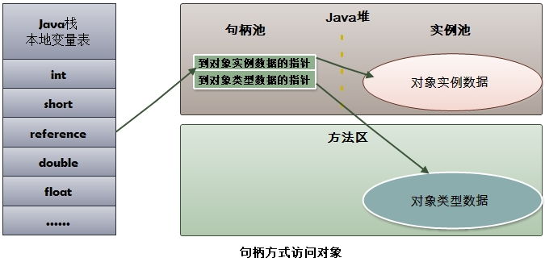
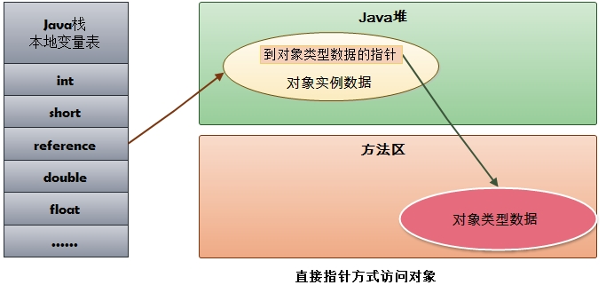
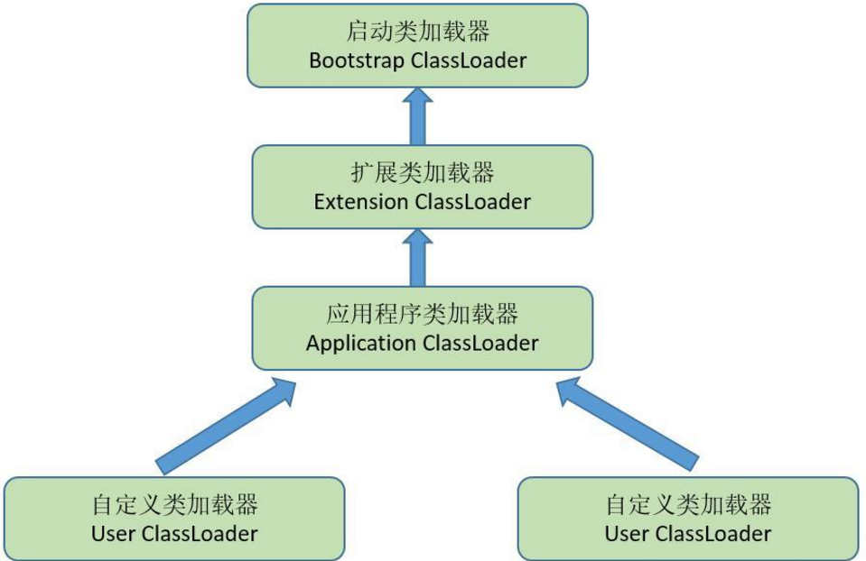
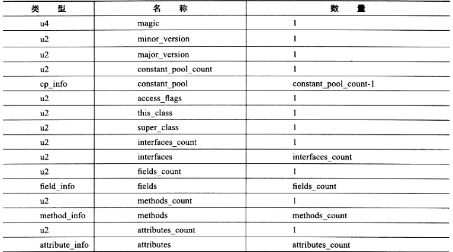
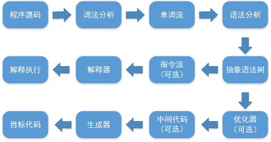
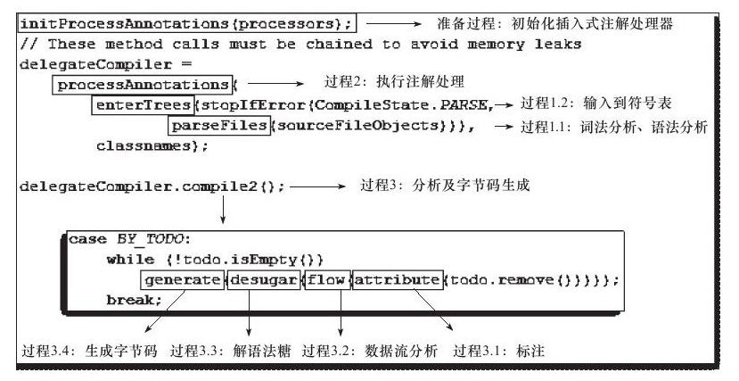
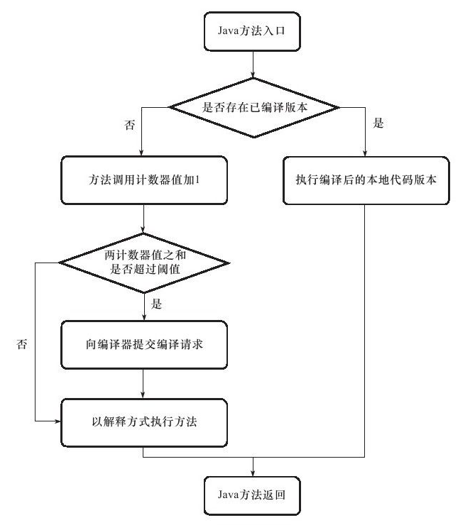

# 一、运行时数据区域

<div align="center">  </div><br>

-  **线程隔离**：线程隔离的意思，就是给不同的线程多分配的资源用，以做到不争用
-  **线程共享：**线程共享就是资源只有一个没有办法分配更多，只能共享

## 1. 程序计数器

- 程序计数器是一块较小的内存，他可以看做是当前线程所执行的行号指示器
- 字节码解释器工作的时候就是通过改变这个计数器的值来选取下一条需要执行的字节码的指令，分支、循环、跳转、异常处理、线程恢复等基础功能都需要依赖这个计数器来完成
- 如果线程正在执行的是一个Java方法，这个计数器记录的是正在执行的虚拟机字节码指令的地址；如果正在执行的是Native方法，这个计数器则为空
- 此内存区域是唯一一个在Java虚拟机规范中没有规定任何OutOfMemoryError情况的区域

**线程私有的内存：**

　　由于java虚拟机的多线程是通过线程轮流切换并分配处理器执行时间的方式来实现，在任何一个确定的时间，一个处理器(对多核处理器来说是一个内核)只会执行一条线程中的指令。因此为了线程切换能够恢复到正确的执行位置上，每条线程都有一个独立的线程计数器，各条线程之间计数器互不影响，独立存储，我们叫这类内存区域线程私有的内存

## 2. Java 虚拟机栈

- 虚拟机栈描述的是Java方法执行的内存模型：每个方法在执行的同时都会创建一个栈帧用于储存局部变量表、操作数栈、动态链接、方法出口等信息。每个方法从调用直至完成的过程，就对应着一个栈帧在虚拟机栈中入栈到出栈的过程
- 栈内存就是虚拟机栈，或者说是虚拟机栈中局部变量表的部分
- 局部变量表存放了编辑期可知的各种基本数据类型（boolean、byte、char、short、int、float、long、double）、对象引用（refrence）类型和returnAddress类型（指向了一条字节码指令的地址）
- 其中64位长度的long和double类型的数据会占用两个局部变量空间，其余的数据类型只占用1个
- 局部变量表所需的内存空间在编译器间完成分配，当进入一个方法时，这个方法需要在帧中分配多大的局部变量空间是完全确定的，在方法运行期间不会改变局部变量表的大小
- Java虚拟机规范对这个区域规定了两种异常状况：
  - 如果线程请求的栈深度大于虚拟机所允许的深度，将抛出StackOverflowError异常
  - 如果虚拟机扩展时无法申请到足够的内存，就会跑出OutOfMemoryError异常

<div align="center">  </div><br>

可以通过 -Xss 这个虚拟机参数来指定每个线程的 Java 虚拟机栈内存大小：

```java
java -Xss512M HackTheJava
```

## 3. 本地方法栈

本地方法栈和虚拟机栈发挥的作用是非常类似的，他们的区别是：

- 虚拟机栈为虚拟机执行Java方法（也就是字节码）服务
- 本地方法栈则为虚拟机使用到的Native方法服务

本地方法栈区域也会抛出StackOverflowError和OutOfMemoryErroy异常

>  本地方法一般是用其它语言（C、C++ 或汇编语言等）编写的，并且被编译为基于本机硬件和操作系统的程序，对待这些方法需要特别处理。

<div align="center">  </div><br>

## 4. Java堆

- 堆是Java虚拟机所管理的内存中最大的一块
- Java堆是被所有线程共享的一块内存区域，在虚拟机启动的时候创建
- 此内存区域的唯一目的是存放对象实例，几乎所有的对象实例都在这里分配内存。所有的对象实例和数组都在堆上分配
- Java堆是垃圾收集器管理的主要区域。Java堆细分为新生代和老年代
- Java堆可以处于物理上不连续的内存空间中，只要逻辑上是连续的即可
- 如果在堆中没有完成实例分配，并且动态扩展失败时将会抛出OutOfMemoryError异常

可以通过 -Xms 和 -Xmx 两个虚拟机参数来指定一个程序的堆内存大小，第一个参数设置初始值，第二个参数设置最大值。

```java
java -Xms1M -Xmx2M HackTheJava
```

## 5. 方法区

- 方法区用于储存已被虚拟机加载的类信息、常量、静态变量、即时编译器编译后的代码等数据
- 和堆一样不需要连续的内存，可以选择固定大小，且可以动态扩展
- 可以选择不实现垃圾收集。这个区域的内存回收目标主要是针对常量池的回收和对类型的卸载
- 当方法区无法满足内存分配需求时，将抛出OutOfMemoryErroy异常

>  HotSpot 虚拟机把它当成永久代来进行垃圾回收。但是很难确定永久代的大小，因为它受到很多因素影响，并且每次 Full GC 之后永久代的大小都会改变，所以经常会抛出 OutOfMemoryError 异常。为了更容易管理方法区，从 JDK 1.8 开始，移除永久代，并把方法区移至元空间，它位于本地内存中，而不是虚拟机内存中。

## 6. 运行时常量池

- 它是方法区的一部分
- Class文件中除了有关的版本、字段、方法、接口等描述信息外、还有一项信息是常量池
- 用于存放编辑期生成的各种字面量和符号引用
- 这部分内容将在类加载后进入方法区的运行时常量池中存放
- Java语言并不要求常量一定只有编辑期才能产生，也就是可能将新的常量放入池中，这种特性被开发人员利用得比较多的便是String类的intern()方法
- 当常量池无法再申请到内存时会抛出OutOfMemoryError异常

## 7. 直接内存

- 直接内存并不是虚拟机运行时数据区的一部分，也不是java虚拟机规范中定义的内存区域
- 在 JDK 1.4 中新加入的NIO类是一种基于通道和缓冲区的I/O方式，它可以使用Native函数库直接分配堆外内存，然后通过一个储存在Java堆中的DirectByteBuffer对象作为这块直接内存的引用进行操作，这样避免了java堆和navie堆中来回复制数据

# 二、hotspot虚拟机对象

## 1. **对象的创建**

### 1.检查 

虚拟机遇到一条new指令时，首先将去检查这个指令的参数是否能在常量池中定位到一个类的符号引用，并且检查这个符号引用代表的类是否已经被加载、解析和初始化过。如果没有，那必须先执行相应的类加载过程

###2.分配内存

- **为新生对象分配内存：** 对象所需内存在类加载完毕之后就可以完全确定，为对象分配内存空间的任务等同于把一块确定的大小的内存从Java堆中划分出来。

- **指针碰撞：** 假设Java堆中内存是绝对规整的，所有用过的内存放在一边，空闲的内存放在另一边，中间放着一个指针作为分界点的指示器，那所分配内存就仅仅是把那个指针指向空闲空间那边挪动一段与对象大小相等的距离，这个分配方式叫做**“指针碰撞”**

- **空闲列表：** 如果Java堆中的内存并不是规整的，已使用的内存和空闲的内存相互交错，那就没办法简单地进行指针碰撞了，虚拟机就必须维护一个列表，记录上哪些内存块是可用的，在分配的时候从列表中找到一块足够大的空间划分给对象实例，并更新列表上的记录，这种分配方式成为“**空闲列表**”

- 选择那种分配方式由Java堆是否规整决定，而Java堆是否规整又由所采用的垃圾收集器是否带有压缩整理功能决定

- 在分配内存的时候会出现并发的问题，比如在给A对象分配内存的时候，指针还没有来得及修改，对象B又同时使用了原来的指针进行了内存的分片

  **解决方案：** 

  1. 对分配的内存进行同步处理：CAS 配上失败重试的方式保证更新操作的原子性
  2. 把内存分配的动作按照线程划分在不同的空间之中进行，即每个线程在java堆中分配一块小内存，称为**本地缓冲区** ，哪个线程需要分配内存，就需要在本地缓冲区上进行，只有当缓冲区用完并分配新的缓冲区的时候，才需要同步锁定

###3. Init

- 执行new指令之后会接着执行Init方法，进行初始化，这样一个对象才算产生出来

  

## 2. **对象的内存布局**

在HotSpot虚拟机中，对象在内存中储存的布局可以分为3块区域：**对象头、实例数据和对齐填充**

- **对象头**：
  1. 储存对象自身的运行时数据，如哈希码、GC分带年龄、锁状态标志、线程持有的锁、偏向线程ID、偏向时间戳
  2. 类型指针，即对象指向它的类元数据的指针，虚拟机通过这个指针来确定这个对象是那个类的实例


- **实例数据：**

　　是对象正常储存的有效信息，也是程序代码中所定义的各种类型的字段内容。无论是从父类继承下来的，还是在子类中定义的，都需要记录下来

- **对齐填充：**

  不是必然存在的，仅仅是起到占位符的作用。对象的大小必须是8字节的整数倍，而对象头刚好是8字节的整数倍(1倍或者2倍)，当实例数据没有对齐的时候，就需要通过对齐填充来补全


## 3. **对象的访问定位**

### 1. **使用句柄访问**

Java堆中将会划分出一块内存来作为句柄池，reference 中存储的就是对象的句柄地址，而句柄中包含了对象实例数据与类型数据各自的具体地址

**优势：** reference 中存储的是稳定的句柄地址，在对象被移动(垃圾收集时移动对象是非常普遍的行为)时只会改变句柄中的实例数据指针，而reference本身不需要修改



### 2. **使用直接指针访问**

Java堆对象的布局就必须考虑如何访问类型数据的相关信息,而refreence中存储的直接就是对象的地址

**优势：** 速度更快，节省了一次指针定位的时间开销，由于对象的访问在Java中非常频繁，因此这类开销积少成多后也是一项非常可观的执行成本




#三、OutOfMemoryError 异常（OOM）

## 1. **Java堆溢出**

- Java堆用于存储对象实例，只要不断的创建对象，并且保证 [GC Roots](https://blog.csdn.net/fenglibing/article/details/8928927) 到对象之间有可达路径来避免垃圾回收机制清除这些对象，那么在数量到达最大堆的容量限制后就会产生内存溢出异常
- 如果是内存泄漏，可进一步通过工具查看泄漏对象到GC Roots的引用链。于是就能找到泄露对象是通过怎样的路径与GC Roots相关联并导致垃圾收集器无法自动回收它们的；掌握了泄漏对象的类型信息及GC Roots引用链的信息，就可以比较准确地定位出泄漏代码的位置
- 如果不存在泄露，换句话说，就是内存中的对象确实都还必须存活着，那就应当检查虚拟机的堆参数（-Xmx与-Xms），与机器物理内存对比看是否还可以调大，从代码上检查是否存在某些对象生命周期过长、持有状态时间过长的情况，尝试减少程序运行期的内存消耗

## 2. 虚拟机栈和本地方法栈溢出

- 对于HotSpot来说，虽然-Xoss参数（设置本地方法栈大小）存在，但实际上是无效的，栈容量只由-Xss参数设定。关于虚拟机栈和本地方法栈，在Java虚拟机规范中描述了两种异常：
  - 如果线程请求的栈深度大于虚拟机所允许的最大深度，将抛出StackOverflowError　　
  - 如果虚拟机在扩展栈时无法申请到足够的内存空间，则抛出OutOfMemoryError异常


- 在单线程下，无论由于栈帧太大还是虚拟机栈容量太小，当内存无法分配的时候，虚拟机抛出的都是StackOverflowError异常


- 如果是多线程导致的内存溢出，与栈空间是否足够大并不存在任何联系，这个时候每个线程的栈分配的内存越大，反而越容易产生内存溢出异常。解决的时候是在不能减少线程数或更换64为的虚拟机的情况下，就只能通过减少最大堆和减少栈容量来换取更多的线程

## 3. **方法区和运行时常量池溢出**

> **String.intern()**  是一个Native方法
>
> **作用**：如果字符串常量池中已经包含一个等于此String对象的字符串，则返回代表池中这个字符串的String对象；否则，将此String对象包含的字符串添加到常量池中，并且返回此String对象的引用

- 由于常量池分配在永久代中，可以通过-XX:PermSize和-XX:MaxPermSize限制方法区大小，从而间接限制其中常量池的容量。

**Intern()：** 

- JDK1.6 intern() 方法会把首次遇到的字符串实例复制到永久代，返回的也是永久代中这个字符串实例的引用，而由 StringBuilder 创建的字符串实例在Java堆上，所以必然不是一个引用
- JDK1.7 intern() 方法的实现不会再复制实例，只是在常量池中记录首次出现的实例引用，因此intern()返回的引用和由 StringBuilder 创建的那个字符串实例是同一个

# 四、垃圾收集

- **程序计数器、虚拟机栈、本地方法栈** 3个区域随线程而生，随线程而灭，在这几个区域内就不需要过多考虑回收的问题，因为方法结束或者线程结束时，内存自然就跟随着回收了
- 栈中的栈帧随着方法的进入和退出就有条不紊的执行着出栈和入栈的操作，每一个栈分配多少个内存基本都是在类结构确定下来的时候就已经确定了，这几个区域内存分配和回收都具有确定性
- 而堆和方法区则不同，一个接口的实现是多种多样的，多个实现类需要的内存可能不一样，一个方法中多个分支需要的内存也不一样，我们只能在程序运行的期间知道需要创建那些对象，分配多少内存，这部分的内存分配和回收都是动态的

## 1. 判断一个对象是否可被回收

### 1. 引用计数算法

- 给对象添加一个引用计数器，当对象增加一个引用时计数器加 1，引用失效时计数器减 1。引用计数为 0 的对象可被回收

两个对象出现循环引用的情况下，此时引用计数器永远不为 0，导致无法对它们进行回收。

正因为循环引用的存在，因此 **Java 虚拟机不使用引用计数算法** 

```java
public class ReferenceCountingGC {

    public Object instance = null;

    public static void main(String[] args) {
        ReferenceCountingGC objectA = new ReferenceCountingGC();
        ReferenceCountingGC objectB = new ReferenceCountingGC();
        objectA.instance = objectB;
        objectB.instance = objectA;
    }
}
```

### 2. 可达性分析算法

- 通过 GC Roots 作为起始点进行搜索，搜索所走过的路径成为引用链，能够到达到的对象都是存活的，不可达的对象可被回收

Java 虚拟机使用该算法来判断对象是否可被回收，在 Java 中 GC Roots 一般包含以下内容：

- 虚拟机栈中局部变量表中引用的对象
- 本地方法栈中 JNI 中引用的对象
- 方法区中类静态属性引用的对象
- 方法区中的常量引用的对象

<div align="center">  </div><br>

### 3. 方法区的回收

- 方法区主要存放永久代对象，而永久代对象的回收率比新生代低很多，因此在方法区上进行回收性价比不高
- 主要是对常量池的回收和对类的卸载

> 在大量使用反射、动态代理、CGLib 等 ByteCode 框架、动态生成 JSP 以及 OSGi 这类频繁自定义 ClassLoader 的场景都需要虚拟机具备类卸载功能，以保证不会出现内存溢出

永久代的垃圾收集主要回收两部分内容：**废弃常量和无用的类**

　　**废弃常**量：假如一个字符串abc已经进入了常量池中，如果当前系统没有任何一个String对象abc，也就是没有任何Stirng对象引用常量池的abc常量，也没有其他地方引用的这个字面量，这个时候发生内存回收这个常量就会被清理出常量池

　　**无用的类**(即：类卸载条件，但满足了也不一定会被卸载)： 

　　**1**. 该类所有的实例都已经被回收，就是Java堆中不存在该类的任何实例

　　**2**. 加载该类的ClassLoader已经被回收

　　**3**. 该类对应的 Class 对象没有在任何地方被引用，也就无法在任何地方通过反射访问该类方法

　　**4**. 垃圾收集算法

>  可以通过 `-Xnoclassgc` 参数来控制是否对类进行卸载

### 4. finalize()

finalize() 类似 C++ 的析构函数，用来做关闭外部资源等工作。但是 try-finally 等方式可以做的更好，并且该方法运行代价高昂，不确定性大，无法保证各个对象的调用顺序，因此最好不要使用。

当一个对象可被回收时，如果需要执行该对象的 finalize() 方法，那么就有可能在该方法中让对象重新被引用，从而实现自救。自救只能进行一次，如果回收的对象之前调用了 finalize() 方法自救，后面回收时不会调用 finalize() 方法。

## 2. 引用类型

无论是通过引用计算算法判断对象的引用数量，还是通过可达性分析算法判断对象是否可达，判定对象是否可被回收都与引用有关

Java 提供了四种强度不同的引用类型：

### 1. 强引用

- 类似 `Object obj = new Object()` 这类的引用，只要强引用还存在，垃圾收集器永远不会回收掉被引用的对象

```java
Object obj = new Object();
```

### 2. 软引用

- 被软引用关联的对象只有在内存不够的情况下才会被回收

使用 SoftReference 类来创建软引用：

```java
Object obj = new Object();
SoftReference<Object> sf = new SoftReference<Object>(obj);
obj = null;  // 使对象只被软引用关联
```

### 3. 弱引用

被弱引用关联的对象一定会被回收，也就是说它只能存活到下一次垃圾回收发生之前

使用 WeakReference 类来实现弱引用：

```java
Object obj = new Object();
WeakReference<Object> wf = new WeakReference<Object>(obj);
obj = null;
```

### 4. 虚引用

又称为幽灵引用或者幻影引用。一个对象是否有虚引用的存在，完全不会对其生存时间构成影响，也无法通过虚引用取得一个对象。

为一个对象设置虚引用关联的唯一目的就是能在这个对象被回收时收到一个系统通知。

使用 PhantomReference 来实现虚引用。

```java
Object obj = new Object();
PhantomReference<Object> pf = new PhantomReference<Object>(obj);
obj = null;
```

## 3. 垃圾收集算法

### 1. 标记 - 清除

<div align="center">  </div><br>

将存活的对象进行标记，然后清理掉未被标记的对象

不足：

- 标记和清除过程效率都不高；
- 会产生大量不连续的内存碎片，导致无法给大对象分配内存。

### 2. 标记 - 整理

<div align="center">  </div><br>

让所有存活的对象都向一端移动，然后直接清理掉端边界以外的内存

### 3. 复制

<div align="center">  </div><br>

将内存划分为大小相等的两块，每次只使用其中一块，当这一块内存用完了就将还存活的对象复制到另一块上面，然后再把使用过的内存空间进行一次清理。

**不足：** 只使用了内存的一半

- 现在的商业虚拟机都**采用这种收集算法来回收新生代**
- 将新生代划分为一块较大的 Eden 空间和两块较小的 Survivor 空间，每次使用 Eden 空间和其中一块Survivor
- 在回收时，将 Eden 和 Survivor 中还存活着的对象一次性复制到另一块 Survivor 空间上，最后清理 Eden 和使用过的那一块Survivor
- 当另一个 Survivor 空间没有足够空间存放上一次新生代收集下来的存活对象时，这些对象将直接通过分配担保机制进入老年代

>  HotSpot 虚拟机的 Eden 和 Survivor 的大小比例默认为 8:1，保证了内存的利用率达到 90%。如果每次回收有多于 10% 的对象存活，那么一块 Survivor 空间就不够用了，此时需要依赖于老年代进行分配担保，也就是借用老年代的空间存储放不下的对象

### 4. 分代收集

只是根据对象存活周期的不同将内存划分为几块。一般是把java堆分为新生代和老年代，这样就可以根据各个年代的特点采用最适当的收集算法。在新生代中，每次垃圾收集时都发现有大批对象死去，只有少量存活，那就选用复制算法，只需要付出少量存活对象的复制成本就可以完成收集。而老年代中因为对象存活率高、没有额外空间对它进行分配担保，就必须使用标记清理或者标记整理算法来进行回收


现在的商业虚拟机采用分代收集算法，它根据对象存活周期将内存划分为几块，不同块采用适当的收集算法。

一般将堆分为新生代和老年代

- 新生代使用：复制算法（因为每次垃圾收集时都发现有大批对象死去，只有少量存活）
- 老年代使用：标记 - 清除 或者 标记 - 整理 算法（因为对象存活率高、没有额外空间对它进行分配担保）

## 4. 垃圾收集器

<div align="center">  </div><br>

以上是 HotSpot 虚拟机中的 7 个垃圾收集器，连线表示垃圾收集器可以配合使用。

- 单线程与多线程：单线程指的是垃圾收集器只使用一个线程进行收集，而多线程使用多个线程；
- 串行与并行：串行指的是垃圾收集器与用户程序交替执行，这意味着在执行垃圾收集的时候需要停顿用户程序；并行指的是垃圾收集器和用户程序同时执行。除了 CMS 和 G1 之外，其它垃圾收集器都是以串行的方式执行

### 1. Serial 收集器

<div align="center">  </div><br>

- 这个收集器是一个单线程的收集器，因此以串行的方式执行
- **优点：** 简单高效，对于单个 CPU 环境来说，由于没有线程交互的开销，因此拥有最高的单线程收集效率
- **缺点：** 只使用一个 CPU 或一条收集线程去完成垃圾收集工作，并且它在进行垃圾收集时，必须暂停其他所有的工作线程，直到它工作结束

> 它是 Client 模式下的默认新生代收集器：
>
> - 因为在该应用场景下，分配给虚拟机管理的内存一般来说不会很大
> - Serial 收集器收集几十兆甚至一两百兆的新生代停顿时间可以控制在一百多毫秒以内，只要不是太频繁，这点停顿是可以接受的

### 2. ParNew 收集器

<div align="center">  </div><br>

- 它是 Serial 收集器的多线程版本
- 并行：指多条垃圾收集线程并行工作，但此时用户线程仍然处于等待状态
- 并发：指用户线程与垃圾收集线程同时执行（不一定是并行的，可能会交替执行），用户程序在继续执行，而垃圾收集程序运行于另一个CPU上
- 默认开启的线程数量与 CPU 数量相同，可以使用 -XX:ParallelGCThreads 参数来设置线程数

>  Server 模式下的虚拟机首选新生代收集器：
>
>  - 除了性能原因外，主要是因为除了 Serial 收集器，只有它能与 CMS 收集器配合工作

### 3. Parallel Scavenge 收集器

- 是一个新生代收集器，它是使用复制算法的收集器，又是并行的多线程收集器
- 其它收集器关注点是尽可能缩短垃圾收集时用户线程的停顿时间，而它的目标是达到一个可控制的吞吐量，它被称为“吞吐量优先”收集器（这里的吞吐量指 CPU 用于运行用户代码的时间占总时间的比值）
  - **吞吐量：** 就是CPU用于运行用户代码的时间与CPU总消耗时间的比值。即吞吐量=运行用户代码时间/（运行用户代码时间+垃圾收集时间）

**停顿时间与高吞吐量的各自优点：** 

- 停顿时间越短就越适合需要与用户交互的程序，良好的响应速度能提升用户体验

- 高吞吐量则可以高效率地利用 CPU 时间，尽快完成程序的运算任务，适合在后台运算而不需要太多交互的任务

- 缩短停顿时间是以牺牲吞吐量和新生代空间来换取的：新生代空间变小，垃圾回收变得频繁，导致吞吐量下降

  

> - 可以通过一个开关参数打开 GC 自适应的调节策略（GC Ergonomics），就不需要手工指定新生代的大小（-Xmn）、Eden 和 Survivor 区的比例、晋升老年代对象年龄等细节参数了
> - 虚拟机会根据当前系统的运行情况收集性能监控信息，动态调整这些参数以提供最合适的停顿时间或者最大的吞吐量

### 4. Serial Old 收集器

<div align="center">  </div><br>

- 是 Serial 收集器的老年代版本，使用标记整理算法

也是给 Client 模式下的虚拟机使用。如果用在 Server 模式下，它有两大用途：

- 在 JDK 1.5 以及之前版本（Parallel Old 诞生以前）中与 Parallel Scavenge 收集器搭配使用
- 作为 CMS 收集器的后备预案，在并发收集发生 Concurrent Mode Failure 时使用

### 5. Parallel Old 收集器

<div align="center">  </div><br>

- 是 Parallel Scavenge 收集器的老年代版本，使用多线程和标记整理算法

在注重吞吐量以及 CPU 资源敏感的场合，都可以优先考虑 Parallel Scavenge 加 Parallel Old 收集器。

### 6. CMS 收集器

<div align="center">  </div><br>

CMS（Concurrent Mark Sweep）：

1. **特点：**
   - Mark Sweep 指的是标记 - 清除算法，即 CMS 收集器是基于标记清除算法实现的
   - CMS 并非没有暂停，而是用两次短暂停来替代串行标记整理算法的长暂停
2. **收集周期：** 初始标记(CMS-initial-mark) -> 并发标记(CMS-concurrent-mark) -> 重新标记(CMS-remark) -> 并发清除(CMS-concurrent-sweep) ->并发重设状态等待下次CMS的触发(CMS-concurrent-reset)
3. 分为以下四个流程：
   1. 初始标记：只是标记一下 GC Roots 能直接关联到的对象，速度很快，**需要停顿** （暂停会比较短）
   2. 并发标记：进行 GC Roots Tracing 的过程，它在整个回收过程中耗时最长，不需要停
   3. 重新标记：修正并发标记期间因用户程序继续运作而导致标记产生变动的那一部分对象的标记记录，**需要停顿** （暂停通常会比较长）
   4. 并发清除：不需要停顿

> -  **并发标记、并发清除、并发重设阶段** 的所谓并发，是指一个或者多个垃圾回收线程和应用程序线程并发地运行，垃圾回收线程不会暂停应用程序的执行，如果你有多于一个处理器，那么并发收集线程将与应用线程在不同的处理器上运行，不需要进行停顿。显然，这样的开销就是会降低应用的吞吐量
> -  **重新标记(Remark) 阶段** 的并行，是指暂停了所有应用程序后，启动一定数目的垃圾回收进程进行并行标记，此时的应用线程是暂停的

4. **优点：** 并发收集、低停顿
5. **缺点：** 
   - **吞吐量低：** 低停顿时间是以牺牲吞吐量为代价的，导致 CPU 利用率不够高
   - **无法处理浮动垃圾，可能出现 Concurrent Mode Failure** 
     - **浮动垃圾：** 是指并发清除阶段由于用户线程继续运行而产生的垃圾，这部分垃圾只能到下一次 GC 时才能进行回收
     - 由于浮动垃圾的存在，因此需要预留出一部分内存，意味着 CMS 收集不能像其它收集器那样等待老年代快满的时候再回收
     - 如果预留的内存不够存放浮动垃圾，就会出现 Concurrent Mode Failure，这时虚拟机将临时启用 Serial Old 来替代 CMS
   - **标记 - 清除算法导致的空间碎片** ，往往出现老年代空间剩余，但无法找到足够大连续空间来分配当前对象，不得不提前触发一次 Full GC。

### 7. G1 收集器

G1（Garbage-First），它是一款**面向服务端应用的垃圾收集器，在多 CPU 和大内存的场景下有很好的性能** 

>  HotSpot 开发团队赋予它的使命是未来可以替换掉 CMS 收集器

1. 堆被分为新生代和老年代，其它收集器进行收集的范围都是整个新生代或者老年代，而 **G1 可以直接对新生代和老年代一起回收** 

<div align="center">  </div><br>

2. **G1 把堆划分成多个大小相等的独立区域（Region）** ，新生代和老年代不再物理隔离

<div align="center">  </div><br>

3. 通过引入 Region 的概念，从而**将原来的一整块内存空间划分成多个的小空间，使得每个小空间可以单独进行垃圾回收** 
   - 这种划分方法带来了很大的灵活性，使得可预测的停顿时间模型成为可能
   - 通过记录每个 Region 垃圾回收时间以及回收所获得的空间（这两个值是通过过去回收的经验获得），并维护一个优先列表，每次根据允许的收集时间，优先回收价值最大的 Region
   - 每个 Region 都有一个 Remembered Set，用来记录该 Region 对象的引用对象所在的 Region。通过使用 Remembered Set，在做可达性分析的时候就可以避免全堆扫描

<div align="center">  </div><br>

4. 如果不计算维护 Remembered Set 的操作，G1 收集器的运作大致可划分为以下几个步骤：
   - **初始标记** 
   - **并发标记** 
   - **最终标记：** 为了修正在并发标记期间因用户程序继续运作而导致标记产生变动的那一部分标记记录，虚拟机将这段时间对象变化记录在线程的 Remembered Set Logs 里面，最终标记阶段需要把 Remembered Set Logs 的数据合并到 Remembered Set 中。这阶段需要停顿线程，但是可并行执行
   - **筛选回收：** 首先对各个 Region 中的回收价值和成本进行排序，根据用户所期望的 GC 停顿时间来制定回收计划。此阶段其实也可以做到与用户程序一起并发执行，但是因为只回收一部分 Region，时间是用户可控制的，而且停顿用户线程将大幅度提高收集效率


5. 具备如下**特点：** 
   - **并行与并发：** 利用多CPU缩短STOP-The-World停顿的时间
   - **分代收集** 
   - **空间整合：** 整体来看是基于“标记 - 整理”算法实现的收集器，从局部（两个 Region 之间）上来看是基于“复制”算法实现的，这意味着运行期间不会产生内存空间碎片
   - **可预测的停顿：** 能让使用者明确指定在一个长度为 M 毫秒的时间片段内，消耗在 GC 上的时间不得超过 N 毫秒


# 五、内存分配与回收策略

## 1. Minor GC 和 Major GC/Full GC

- **新生代 GC（Minor GC）：** 发生在新生代上，因为新生代对象存活时间很短，因此 Minor GC 会频繁执行，执行的速度一般也会比较快

- **老年代 GC （Major GC/Full GC）：** 发生在老年代上，老年代对象其存活时间长，因此 Full GC 很少执行，执行速度会比 Minor GC 慢很多（出现了 Major GC，经常会伴随至少一次的 Minor GC。但非绝对的，在Parallel Scavenge 收集器的收集策略里就有直接进行 Major GC 的策略选择过程）

## 2. 内存分配策略

### 1. 对象优先在 Eden 分配

大多数情况对象在新生代Eden区分配，当Eden区没有足够空间进行分配时，虚拟机将发起一次Minor GC

### 2. 大对象直接进入老年代

- 大对象是指需要连续内存空间的java对象，最典型的大对象是那种很长的字符串以及数组
- 这样做的目的是避免Eden区及两个Servivor之间发生大量的内存复制
- 经常出现大对象会提前触发垃圾收集以获取足够的连续空间分配给大对象

>  -XX:PretenureSizeThreshold，大于此值的对象直接在老年代分配，避免在 Eden 区和 Survivor 区之间的大量内存复制

### 3. 长期存活的对象进入老年代

- 如果对象在 Eden 区出生并且经历过一次 Minor GC 后仍然存活，并且能够被Servivor容纳，将被移动到Servivor空间中，并且把对象年龄设置成为1
- 对象在 Servivor 区中每熬过一次Minor GC，年龄就增加1岁，当它的年龄增加到一定程度（默认15岁），就将会被晋级到老年代中

>  -XX:MaxTenuringThreshold 用来定义年龄的阈值

### 4. 动态对象年龄判定

为了更好地适应不同程序的内存状况，虚拟机并不是永远地要求对象的年龄必须达到了MaxTenuringThreshold 才能晋级到老年代

- 如果在 Servivor 空间中相同年龄所有对象的大小总和大于 Survivor 空间的一半，年龄大于或等于该年龄的对象就可以直接进入到老年代，无须登到 MaxTenuringThreshold 中要求的年龄

### 5. 空间分配担保

- 在发生Minor GC 之前，虚拟机会检查老年代最大可用的连续空间是否大于新生代所有对象总空间

  - 如果这个条件成立，那么Minor GC可以确保是安全的
  - 如果不成立，则虚拟机会查看 `HandlePromotionFailure` 设置值是否允许担保失败

- 如果允许那么会继续检查老年代最大可用的连续空间是否大于晋级到老年代对象的平均大小

  - 如果大于，将尝试进行一次Minor GC，尽管这次MinorGC 是有风险的

  - 如果小于，或者HandlePromotionFailure设置不允许冒险，那这时也要改为进行一次Full GC

    

## 3. Full GC 的触发条件

对于 Minor GC，其触发条件非常简单，当 Eden 空间满时，就将触发一次 Minor GC。而 Full GC 则相对复杂，有以下条件：

### 1. 调用 System.gc()

只是建议虚拟机执行 Full GC，但是虚拟机不一定真正去执行。不建议使用这种方式，而是让虚拟机管理内存

> `-XX:+DisableExplicitGC` 可以屏蔽掉 System.gc()

### 2. 老年代空间不足

- 老年代空间不足的常见场景为前文所讲的大对象直接进入老年代、长期存活的对象进入老年代等
- 为了避免以上原因引起的 Full GC，应当尽量不要创建过大的对象以及数组
- 除此之外，可以通过 -Xmn 虚拟机参数调大新生代的大小，让对象尽量在新生代被回收掉，不进入老年代
- 还可以通过 -XX:MaxTenuringThreshold 调大对象进入老年代的年龄，让对象在新生代多存活一段时间

### 3. 空间分配担保失败

使用复制算法的 Minor GC 需要老年代的内存空间作担保，如果担保失败会执行一次 Full GC

### 4. JDK 1.7 及以前的永久代空间不足

- 在 JDK 1.7 及以前，HotSpot 虚拟机中的方法区是用永久代实现的，永久代中存放的为一些 Class 的信息、常量、静态变量等数据
- 当系统中要加载的类、反射的类和调用的方法较多时，永久代可能会被占满，在未配置为采用 CMS GC 的情况下也会执行 Full GC。如果经过 Full GC 仍然回收不了，那么虚拟机会抛出 java.lang.OutOfMemoryError
- 为避免以上原因引起的 Full GC，可采用的方法为增大永久代空间或转为使用 CMS GC

### 5. Concurrent Mode Failure

执行 CMS GC 的过程中同时有对象要放入老年代，而此时老年代空间不足（可能是 GC 过程中浮动垃圾过多导致暂时性的空间不足），便会报 Concurrent Mode Failure 错误，并触发 Full GC

# 六、虚拟机类加载机制

- 虚拟机把描述类的数据从Class文件加载到内存，并对数据进行校验、转换解析和初始化，最终形成可以被虚拟机直接使用的Java类型，这就是虚拟机的类加载机制

- 在Java语言里面，类型的加载，连接和初始化过程都是在程序运行期间完成的

- 类是在运行期间第一次使用时动态加载的，而不是编译时期一次性加载（因为如果在编译时期一次性加载，那么会占用很多的内存）

- **编译时间：** 指虚拟机的 **JIT 编译器（Just In Time Compiler）**编译**热点代码(Hot Spot Code)**的耗时

  > 如果一段 java 方法被调用次数达到一定程度，就会被判定为热点代码交给 JIT 编译器即时编译为本地代码，提高运行速度

- **java 运行期编译的最大缺点：** 进行编译需要消耗程序正常的运行时间

  >  参数 `-Xint` 禁止编译器运作，强制虚拟机对字节码采用纯解释方式执行


## 1. 类加载时机

###1. 类的生命周期

类被加载到虚拟机内存中开始，到卸载为止，整个生命周期包括：

**加载、验证、准备、解析、初始化、使用和卸载** 


**注：** 

- 加载、验证、准备、初始化和卸载这5个阶段的顺序是确定的，类的加载过程必须按照这种顺序按部就班地开始
- 解析阶段则不一定：它在某些情况下可以再初始化阶段之后再开始，这个是为了支持Java语言运行时绑定（也成为动态绑定或晚期绑定）

### 2. 主动引用

**虚拟机规范中并没有强制约束何时进行加载，但是规范严格规定了有且只有下列五种情况必须对类进行初始化** （加载、验证、准备都会随之发生）：

- 遇到 `new、getstatic、putstatic、invokestatic` 这四条字节码指令时，如果类没有进行过初始化，则必须先触发其初始化。最常见的生成这 4 条指令的场景是：使用 new 关键字实例化对象的时候；读取或设置一个类的静态字段（被 final 修饰、已在编译期把结果放入常量池的静态字段除外）的时候；以及调用一个类的静态方法的时候。
- 使用` java.lang.reflect` 包的方法对类进行反射调用的时候，如果类没有进行初始化，则需要先触发其初始化
- 当初始化一个类的时候，如果发现其父类还没有进行过初始化，则需要先触发其父类的初始化
- 当虚拟机启动时，用户需要指定一个要执行的主类(包含 main() 方法的那个类)，虚拟机会先初始化这个主类
- 当使用 JDK 1.7 的动态语言支持时，如果一个` java.lang.invoke.MethodHandle` 实例最后的解析结果为 `REF_getStatic, REF_putStatic, REF_invokeStatic` 的方法句柄，并且这个方法句柄所对应的类没有进行过初始化，则需要先触发其初始化

### 3. 被动引用

**被动引用：** 所有引用类的方式都不会触发初始化

被动引用的常见例子包括：

- 通过子类引用父类的静态字段，不会导致子类初始化

  ```java
  System.out.println(SubClass.value);  // value 字段在 SuperClass 中定义
  ```


- 通过数组定义来引用类，不会触发此类的初始化。该过程会对数组类进行初始化，数组类是一个由虚拟机自动生成的、直接继承自 Object 的子类，其中包含了数组的属性和方法

  ```java
  SuperClass[] sca = new SuperClass[10];
  ```


- 常量在编译阶段会存入调用类的常量池中，本质上并没有直接引用到定义常量的类，因此不会触发定义常量的类的初始化

  ```java
  System.out.println(ConstClass.HELLOWORLD);
  ```

**接口的初始化：** 接口在初始化时，并不要求其父接口全部完成类初始化，只有在正整使用到父接口的时候（如引用接口中定义的常量）才会初始化

## 2. 类加载过程

包含了加载、验证、准备、解析和初始化这 5 个阶段。

### 1. 加载

加载是类加载的一个阶段，注意不要混淆。

1. **加载过程完成以下三件事：** 
   - 通过一个类的全限定名来获取定义此类的二进制字节流
   - 将这个字节流所代表的静态存储结构转化为方法区的运行时存储结构
   - 在内存中生成一个代表这个类的 Class 对象，作为方法区这个类的各种数据的访问入口
2. **二进制字节流可以从以下方式中获取：** 
   - 从 ZIP 包读取，成为 JAR、EAR、WAR 格式的基础
   - 从网络中获取，最典型的应用是 Applet
   - 运行时计算生成，例如动态代理技术，在 java.lang.reflect.Proxy 使用 ProxyGenerator.generateProxyClass 的代理类的二进制字节流
   - 由其他文件生成，例如由 JSP 文件生成对应的 Class 类
   - 从数据库中读取，这种场景相对少一些（中间件服务器）


3. **数组类的创建过程遵循以下规则：** 
   - 如果数组的组件类型(指的是数组去掉一个维度的类型)是引用类型，那就递归采用上面的加载过程去加载这个组件类型，数组C将在加载该组件类型的类加载器的类名称空间上被标识
   - 如果数组的组件类型不是引用类型(列如int[]组数)，Java虚拟机将会把数组C标识为与引导类加载器关联
   - 数组类的可见性与它的组件类型的可见性一致，如果组件类型不是引用类型，那数组类的可见性将默认为public

> 数组类本身不通过类加载器创建，它是由Java虚拟机直接创建的

### 2. 验证

- 确保 Class 文件的字节流中包含的信息符合当前虚拟机的要求，并且不会危害虚拟机自身的安全
- 验证阶段会完成下面4个阶段的检验动作：**文件格式验证，元数据验证，字节码验证，符号引用验证** 

1. **文件格式验证** 

   第一阶段要验证字节流是否符合Class文件格式的规范，并且能被当前版本的虚拟机处理：

   - 是否以魔数 `oxCAFEBABE` 开头
   - 主、次版本号是否在当前虚拟机处理范围之内
   - 常量池的常量中是否有不被支持的常量类型(检查常量tag标志)
   - 指向常量的各种索引值中是否有指向不存在的常量或不符合类型的常量
   - `CONSTANT_Itf8_info` 型的常量中是否有不符合 UTF-8 编码的数据
   - Class 文件中各个部分及文件本身是否有被删除的或附加的其他信息

   >  这个阶段的验证是**基于二进制字节流进行的** ，只有通过类这个阶段的验证后，字节流才会进入内存的方法区进行存储，所以后面的3个验证阶段全部是基于方法区的存储结构进行的，不会再直接操作字节流

2. **元数据验证**

   - 这个类是否有父类(除了java.lang.Object之外,所有的类都应当有父类)
   - 这个类的父类是否继承了不允许被继承的类（被final修饰的类）
   - 如果这个类不是抽象类，是否实现类其父类或接口之中要求实现的所有方法
   - 类中的字段、方法是否与父类产生矛盾(列如覆盖类父类的final字段,或者出现不符合规则的方法重载，列如方法参数都一致，但返回值类型却不同等)

   >  第二阶段的主要目的是对类元数据信息进行语义校验，保证不存在不符合Java语言规范的元数据信息

3. **字节码验证**

   - 保证任意时刻操作数栈的数据类型与指令代码序列都能配合工作，例如：在操作数栈放置类一个 int 类型的数据，使用时却按long类型来加载入本地变量表中
   - 保证跳转指令不会跳转到方法体以外的字节码指令上
   - 保证方法体中的类型转换时有效的，列如可以把一个子类对象赋值给父类数据类型，这个是安全的，但是把父类对象赋值给子类数据类型，甚至把对象赋值给与它毫无继承关系、完全不相干的一个数据类型，则是危险和不合法的

   > - 第三阶段是整个验证过程中最复杂的一个阶段，主要目的似乎通过数据流和控制流分析，确定程序语言是合法的、符合逻辑的
   > - 在第二阶段对元数据信息中的数据类型做完校验后，这个阶段将对类的方法体进行校验分析，保证被校验类的方法在运行时不会做出危害虚拟机安全的事件

4. **符号引用验证** 

   发生在虚拟机将符号引用转化为直接引用的时候，这个转化动作将在连接的第三阶段——解析阶段中发生

   - 符号引用中通过字符串描述的全限定名是否能找到相对应的类
   - 在指定类中是否存在符合方法的字段描述符以及简单名称所描述的方法和字段
   - 符号引用中的类、字段、方法的访问性是否可被当前类访问

   > -  对于虚拟机的类加载机制来说，验证阶段是非常重要的，但是不一定必要（因为对程序运行期没有影响）的阶段
   > -  如果全部代码都已经被反复使用和验证过，那么在实施阶段就可以考虑使用 `Xverify：none` 参数来关闭大部分的类验证措施，以缩短虚拟机类加载的时间

### 3. 准备

- 准备阶段是正式为类变量分配内存并设置类变量**初始值(此处指数据类型的零值)** 的阶段，这些变量都在方法区中进行分配

  ```java
  public static int value = 123;
  ```

  - **value 在此阶段（准备阶段）的初始值为 0，而不是 123** 
  - 把value赋值为123的 `putstatic` 指令是程序被编译后，存放于**类构造器<clinit>()方法**之中，所以把value赋值为123 的动作将在初始化阶段才会执行
  - 如果**使用final修饰，则在这个阶段其初始值设置为123** 

- 这个时候进行内存分配的仅包括类变量（被 static 修饰的变量）

- 实例变量不会在这阶段分配内存，它将会在对象实例化时随着对象一起分配在堆中

### 4. 解析

- 将常量池的符号引用替换为直接引用的过程
- 其中解析过程在某些情况下可以在初始化阶段之后再开始，这是为了支持 Java 的动态绑定

### 5. 初始化

- 初始化阶段才真正开始执行类中定义的 Java 程序代码；初始化阶段即虚拟机执行类构造器 &lt;clinit>() 方法的过程
- 在准备阶段，类变量已经赋过一次系统要求的初始值，而在初始化阶段，根据程序员通过程序制定的主观计划去初始化类变量和其它资源

**\<clinit>() 方法** 具有以下特点：

- 是由编译器自动收集类中所有类变量的赋值动作和静态语句块中的语句合并产生的，编译器收集的顺序由语句在源文件中出现的顺序决定

  > 特别注意的是，静态语句块只能访问到定义在它之前的类变量，定义在它之后的类变量只能赋值，不能访问：

  ```java
  public class Test {
      static {
          i = 0;                // 给变量赋值可以正常编译通过
          System.out.print(i);  // 这句编译器会提示“非法向前引用”
      }
      static int i = 1;
  }
  ```


- 与类的构造函数（或者说实例构造器 &lt;init>()）不同，不需要显式的调用父类的构造器；虚拟机会自动保证在子类的 &lt;clinit>() 方法运行之前，父类的 &lt;clinit>() 方法已经执行结束。因此虚拟机中第一个执行 &lt;clinit>() 方法的类肯定为 java.lang.Object。

- 由于父类的 &lt;clinit>() 方法先执行，也就意味着父类中定义的静态语句块的执行要优先于子类：

  ```java
  static class Parent {
      public static int A = 1;
      static {
          A = 2;
      }
  }

  static class Sub extends Parent {
      public static int B = A;
  }

  public static void main(String[] args) {
       System.out.println(Sub.B);  // 2
  }
  ```


- &lt;clinit>() 方法对于类或接口不是必须的，如果一个类中不包含静态语句块，也没有对类变量的赋值操作，编译器可以不为该类生成 &lt;clinit>() 方法
- 接口中不可以使用静态语句块，但仍然有类变量初始化的赋值操作，因此接口与类一样都会生成 &lt;clinit>() 方法；但**接口与类不同的是：** 执行接口的 &lt;clinit>() 方法不需要先执行父接口的 &lt;clinit>() 方法。只有当父接口中定义的变量使用时，父接口才会初始化。另外，接口的实现类在初始化时也一样不会执行接口的 &lt;clinit>() 方法
- 虚拟机会保证一个类的 &lt;clinit>() 方法在多线程环境下被正确的加锁和同步，如果多个线程同时初始化一个类，只会有一个线程执行这个类的 &lt;clinit>() 方法，其它线程都会阻塞等待，直到活动线程执行 &lt;clinit>() 方法完毕。如果在一个类的 &lt;clinit>() 方法中有耗时的操作，就可能造成多个线程阻塞，在实际过程中此种阻塞很隐蔽

## 3. 类的加载器

###1. 类与类加载器

两个类相等需要类本身相等，并且使用同一个类加载器进行加载；这是因为每一个类加载器都拥有一个独立的类名称空间

>  这里的相等，包括类的 Class 对象的 equals() 方法、isAssignableFrom() 方法、isInstance() 方法的返回结果为 true，也包括使用 instanceof 关键字做对象所属关系判定结果为 true

###2. 类加载器分类

**从 Java 虚拟机的角度来讲** ，只存在以下两种不同的类加载器：

- **启动类加载器（Bootstrap ClassLoader）**： 这个类加载器用 C++ 实现，是虚拟机自身的一部分；

- **所有其他类的加载器：** 这些类由 Java 实现，独立于虚拟机外部，并且全都继承自抽象类 `java.lang.ClassLoader` 

**从 Java 开发人员的角度看** ，类加载器可以划分得更细致一些：

- **启动类加载器（Bootstrap ClassLoader）：** 此类加载器负责将存放在 `<JRE_HOME>\lib` 目录中的，或者被 `-Xbootclasspath` 参数所指定的路径中的，并且是虚拟机识别的（仅按照文件名识别，如 rt.jar，名字不符合的类库即使放在 lib 目录中也不会被加载）类库加载到虚拟机内存中

  >  启动类加载器无法被 Java 程序直接引用，用户在编写自定义类加载器时，如果需要把加载请求委派给启动类加载器，直接使用 null 代替即可

- **扩展类加载器（Extension ClassLoader）：** 由 `ExtClassLoader（sun.misc.Launcher$ExtClassLoader）`实现的，它负责将 `<JAVA_HOME>/lib/ext` 目录中的或者被 `java.ext.dir` 系统变量所指定路径中的所有类库加载到内存中，**开发者可以直接使用扩展类加载器** 

- **应用程序类加载器(Application ClassLoader)：** 由 `AppClassLoader(sun.misc.Launcher$AppClassLoader)`实现的；由于这个类加载器是 ClassLoader 中的 getSystemClassLoader() 方法的返回值，因此一般称为**系统类加载器**

  >  它负责加载用户类路径（ClassPath）上所指定的类库，开发者可以直接使用这个类加载器，如果应用程序中没有自定义过自己的类加载器，一般情况下这个就是程序中默认的类加载器

###3. 双亲委派模型

- 应用程序都是由三种类加载器相互配合进行加载的，如果有必要，还可以加入自己定义的类加载器

- 这张图表示类加载器的双亲委派模型（Parents Delegation model）
- 双亲委派模型要求除了顶层的启动加载类外，其余的类加载器都应当有自己的父类加载器，这里类加载器之间的父子关系一般不会以继承的关系来实现，而是使用组合关系来复用父类加载器的代码





####1. 工作过程

- 如果一个类加载器收到了类加载的请求，它首先不会自己去尝试加载这个类，而是把这个请求委派给父类加载器去完成，每一个层次的类加载器都是如此
- 因此所有的加载请求最终都是应该传送到顶层的启动类加载器中
- 只有当父类加载器反馈自己无法完成这个加载请求（它的搜索范围中没有找到所需的类）时，子加载器才会尝试自己去加载

####2. 好处

- 使得 Java 类随着它的类加载器一起具有一种带有优先级的层次关系，从而使得基础类得到统一

  > 例如类 `java.lang.Object`，它存放在 `rt.jar` 中，无论哪一个类加载器要加载这个类，最终都是委派给处于模型最顶端的启动类加载器进行加载，因此 Object 类在程序的各种类加载器环境中都是同一个类

- 所以在 `rt.jar` 中的 Object 比在 ClassPath 中的 Object 优先级更高，这是因为 rt.jar 中的 Object 使用的是启动类加载器，而 ClassPath 中的 Object 使用的是应用程序类加载器；rt.jar 中的 Object 优先级更高，那么程序中所有的 Object 都是这个 Object

- 相反，如果没有使用双亲委派模型，由各个类加载器自行去加载的话，如果用户自己编写了一个称为java.lang.object 的类，并放在程序的ClassPath中，那系统中将会出现多个不同的Object类，Java类型体系中最基础的行为也就无法保证，应用程序也将会变得一片混乱

- 就是保证某个范围的类一定是被某个类加载器所加载的，这就保证在程序中同一个类不会被不同的类加载器加载

  >  这样做的一个主要的考量，就**是从安全层面上，杜绝通过使用和JRE相同的类名冒充现有JRE的类达到替换的攻击方式** 

####3. 实现

以下是抽象类 java.lang.ClassLoader 的代码片段，其中的 loadClass() 方法运行过程如下：

- 先检查类是否已经加载过，如果没有则让父类加载器去加载
- 当父类加载器加载失败时抛出 ClassNotFoundException，此时尝试自己去加载

```java
public abstract class ClassLoader {
    // The parent class loader for delegation
    private final ClassLoader parent;

    public Class<?> loadClass(String name) throws ClassNotFoundException {
        return loadClass(name, false);
    }

    protected Class<?> loadClass(String name, boolean resolve) throws ClassNotFoundException {
        synchronized (getClassLoadingLock(name)) {
            // First, check if the class has already been loaded
            Class<?> c = findLoadedClass(name);
            if (c == null) {
                try {
                    if (parent != null) {
                        c = parent.loadClass(name, false);
                    } else {
                        c = findBootstrapClassOrNull(name);
                    }
                } catch (ClassNotFoundException e) {
                    // ClassNotFoundException thrown if class not found
                    // from the non-null parent class loader
                }

                if (c == null) {
                    // If still not found, then invoke findClass in order
                    // to find the class.
                    c = findClass(name);
                }
            }
            if (resolve) {
                resolveClass(c);
            }
            return c;
        }
    }

    protected Class<?> findClass(String name) throws ClassNotFoundException {
        throw new ClassNotFoundException(name);
    }
}
```

###4. 自定义类加载器实现

FileSystemClassLoader 是自定义类加载器，继承自 java.lang.ClassLoader，用于加载文件系统上的类：

- 它首先根据类的全名在文件系统上查找类的字节代码文件（.class 文件）
- 然后读取该文件内容
- 最后通过 defineClass() 方法来把这些字节代码转换成 java.lang.Class 类的实例

java.lang.ClassLoader 的 loadClass() 实现了双亲委派模型的逻辑，因此自定义类加载器一般不去重写它，但是需要重写 findClass() 方法

```java
public class FileSystemClassLoader extends ClassLoader {

    private String rootDir;

    public FileSystemClassLoader(String rootDir) {
        this.rootDir = rootDir;
    }

    protected Class<?> findClass(String name) throws ClassNotFoundException {
        byte[] classData = getClassData(name);
        if (classData == null) {
            throw new ClassNotFoundException();
        } else {
            return defineClass(name, classData, 0, classData.length);
        }
    }

    private byte[] getClassData(String className) {
        String path = classNameToPath(className);
        try {
            InputStream ins = new FileInputStream(path);
            ByteArrayOutputStream baos = new ByteArrayOutputStream();
            int bufferSize = 4096;
            byte[] buffer = new byte[bufferSize];
            int bytesNumRead;
            while ((bytesNumRead = ins.read(buffer)) != -1) {
                baos.write(buffer, 0, bytesNumRead);
            }
            return baos.toByteArray();
        } catch (IOException e) {
            e.printStackTrace();
        }
        return null;
    }

    private String classNameToPath(String className) {
        return rootDir + File.separatorChar
                + className.replace('.', File.separatorChar) + ".class";
    }
}
```

# 七、Java内存模型与线程

## 1. 硬件的效率与一致性

- 将运算需要使用到的数据复制到缓存中，让运算能快速进行，当运算结束后再从缓存同步回内存中，这样处理就无需等待缓慢的内存读写

- **缓存一致性：** 为了解决一致性问题，需要各个处理器访问缓存时都遵循一些协议，在读写时要根据协议来进行操作，这类协议有：MSI，MESI，MOSI，Synapse，Firefly，Dragon Protocol等

- **内存模型：** 在特定的操作协议下，对特定的内存或高速缓存进行读写访问过程的抽象

- **乱序执行优化：** 处理器会在计算之后将乱序执行的结果重组，保证该结果与顺序执行的结果是一致的

  （处理器的乱序执行优化，java虚拟机的即时编译器的指令重排序优化） 

- **重排序**

  在执行程序时为了提高性能，编译器和处理器经常会对指令进行重排序。**重排序分成三种类型：**

  - **编译器优化的重排序**：编译器在不改变单线程程序语义放入前提下，可以重新安排语句的执行顺序
  - **指令级并行的重排序**：现代处理器采用了指令级并行技术来将多条指令重叠执行。如果不存在数据依赖性，处理器可以改变语句对应机器指令的执行顺序
  - **内存系统的重排序**：由于处理器使用缓存和读写缓冲区，这使得加载和存储操作看上去可能是在乱序执行

  > - 从Java源代码到最终实际执行的指令序列，会经过下面三种重排序
  > - 为了保证内存的可见性，Java编译器在生成指令序列的适当位置会插入内存屏障指令来禁止特定类型的处理器重排序
  > - Java内存模型把内存屏障分为LoadLoad、LoadStore、StoreLoad和StoreStore四种

## 2. Java 内存模型

### 1. 主内存与工作内存

- **Java内存模型** 的主要目标是： 定义程序中各个变量的访问规则，即在虚拟机中将变量存储到内存和从内存中取出变量这样底层细节

  >  此处的变量与Java编程时所说的变量不一样，指包括了实例字段、静态字段和构成数组对象的元素，但是不包括局部变量与方法参数，后者是线程私有的，不会被共享

- **Java内存模型中规定了所有的变量都存储在主内存中**，每条线程还有自己的工作内存（可以与前面将的处理器的高速缓存类比），**线程的工作内存中保存了该线程使用到的变量到主内存副本拷贝，线程对变量的所有操作（读取、赋值）都必须在工作内存中进行**，而不能直接读写主内存中的变量

- 不同线程之间无法直接访问对方工作内存中的变量，线程间变量值的传递均需要在主内存来完成


### 2. **内存间的交互操作**

1. **Java内存模型定义主内存与工作内存之间的操作** 

   关于主内存与工作内存之间的具体交互协议，即一个变量如何从主内存拷贝到工作内存、如何从工作内存同步到主内存之间的实现细节，Java内存模型定义了以下八种操作来完成：

   - **lock（锁定）**：作用于主内存的变量，把一个变量标识为一条线程独占状态
   - **unlock（解锁）**：作用于主内存变量，把一个处于锁定状态的变量释放出来，释放后的变量才可以被其他线程锁定
   - **read（读取）**：作用于主内存变量，把一个变量值从主内存传输到线程的工作内存中，以便随后的load动作使用
   - **load（载入）**：作用于工作内存的变量，它把read操作从主内存中得到的变量值放入工作内存的变量副本中
   - **use（使用）**：作用于工作内存的变量，把工作内存中的一个变量值传递给执行引擎，每当虚拟机遇到一个需要使用变量的值的字节码指令时将会执行这个操作
   - **assign（赋值）**：作用于工作内存的变量，它把一个从执行引擎接收到的值赋值给工作内存的变量，每当虚拟机遇到一个给变量赋值的字节码指令时执行这个操作
   - **store（存储）**：作用于工作内存的变量，把工作内存中的一个变量的值传送到主内存中，以便随后的write的操作
   - **write（写入）**：作用于主内存的变量，它把store操作从工作内存中一个变量的值传送到主内存的变量中

2. **Java内存模型还规定了操作规则** 

   > - 如果要把一个变量从主内存中复制到工作内存，就需要按顺寻地执行read和load操作
   >
   > - 如果把变量从工作内存中同步回主内存中，就要按顺序地执行store和write操作
   >
   > - Java内存模型只要求上述操作必须按顺序执行，而没有保证必须是连续执行
   >
   >   > 也就是read和load之间，store和write之间是可以插入其他指令的，如对主内存中的变量a、b进行访问时，可能的顺序是read a，read b，load b， load a

   Java内存模型还规定了在执行上述八种基本操作时，必须满足如下规则：

   - 不允许read和load、store和write操作之一单独出现
   - 不允许一个线程丢弃它的最近assign的操作，即变量在工作内存中改变了之后必须同步到主内存中
   - 不允许一个线程无原因地（没有发生过任何assign操作）把数据从工作内存同步回主内存中
   - 一个新的变量只能在主内存中诞生，不允许在工作内存中直接使用一个未被初始化（load或assign）的变量；即就是对一个变量实施use和store操作之前，必须先执行过了assign和load操作
   - 一个变量在同一时刻只允许一条线程对其进行lock操作，但lock操作可以被同一条线程重复执行多次，多次执行lock后，只有执行相同次数的unlock操作，变量才会被解锁。lock和unlock必须成对出现
   - 如果对一个变量执行lock操作，将会清空工作内存中此变量的值，在执行引擎使用这个变量前需要重新执行load或assign操作初始化变量的值
   - 如果一个变量事先没有被lock操作锁定，则不允许对它执行unlock操作；也不允许去unlock一个被其他线程锁定的变量
   - 对一个变量执行unlock操作之前，必须先把此变量同步到主内存中（执行store和write操作）

## 3. **对于volatile型变量的特殊规则**

当一个变量定义为 volatile 之后，它将具备两种特性：

- **保证此变量对所有线程的可见性**： 这里的可见性是指当一条线程修改了这个变量的值，新值对于其他线程来说是可以立即得知的。普通变量的值在线程间传递需要通过主内存来完成

  由于valatile只能保证可见性，在不符合一下两条规则的运算场景中，我们仍要通过加锁来保证原子性：

  - 运算结果并不依赖变量的当前值，或者能够确保只有单一的线程修改变量的值。
  - 变量不需要与其他的状态变量共同参与不变约束


- **禁止指令重排序**： 普通的变量仅仅会保证在该方法的执行过程中所有依赖赋值结果的地方都能获取到正确的结果，而不能保证变量赋值操作的顺序与程序代码中执行顺序一致，这个就是所谓的线程内表现为串行语义

Java内存模型中对volatile变量定义的特殊规则。假定 T 表示一个线程，V 和 W 分别表示两个volatile变量，那么在进行read、load、use、assign、store、write操作时需要满足如下的规则：

- 只有当线程 T 对变量V执行的前一个动作是load的时候，线程T才能对变量V执行use动作；并且，只有当线程 T 对变量 V 执行的后一个动作是use的时候，线程T才能对变量V执行load操作

  线程 T 对变量 V 的 use 操作可以认为是与线程 T 对变量 V 的load和read操作相关联的，必须一起连续出现

  >  这条规则要求在工作内存中，每次使用变量 V 之前都必须先从主内存刷新最新值，用于保证能看到其它线程对变量 V 所作的修改后的值

- 只有当线程 T 对变量 V 执行的前一个动是 assign 的时候，线程 T 才能对变量 V 执行store操作；并且，只有当线程 T 对变量 V 执行的后一个动作是store操作的时候，线程T才能对变量V执行assign操作

  线程 T 对变量 V 的assign操作可以认为是与线程 T 对变量 V 的store和write操作相关联的，必须一起连续出现

  >  这一条规则要求在工作内存中，每次修改 V 后都必须立即同步回主内存中，用于保证其它线程可以看到自己对变量 V 的修改

- 假定操作 A 是线程 T 对变量 V 实施的use或assign动作，假定操作F是操作A相关联的load或store操作，假定操作P是与操作F相应的对变量 V 的read或write操作；类型地，假定动作 B 是线程 T 对变量 W 实施的use或assign动作，假定操作 G 是操作 B 相关联的load或store操作，假定操作Q是与操作G相应的对变量V的read或write操作。如果A先于B，那么P先于Q。这条规则要求valitile修改的变量不会被指令重排序优化，保证代码的执行顺序与程序的顺序相同

## 4. 对于long和double型变量的特殊规则

- Java模型要求lock、unlock、read、load、assign、use、store、write这8个操作都具有原子性
- 但是对于64位的数据类型（long和double），在模型中特别定义了一条相对宽松的规定：
  - 允许虚拟机将没有被volatile修饰的64位数据的读写操作分为两次32为的操作来进行，即允许虚拟机实现选择可以不保证64位数据类型的load、store、read和write这4个操作的原子性

## 5. 原子性、可见性和有序性

- **原子性：** 即一个操作或者多个操作要么全部执行并且执行的过程不会被任何因素打断，要么就都不执行
  - Java内存模型是通过在变量修改后将新值同步会主内存，在变量读取前从主内存刷新变量值这种依赖主内存作为传递媒介的方式来实现可见性，valatile特殊规则保障新值可以立即同步到祝内存中
  - Synchronized 是在对一个变量执行unlock之前，必须把变量同步回主内存中（执行store、write操作）
  - 被 final 修饰的字段在构造器中一旦初始化完成，并且构造器没有把 this 的引用传递出去，那在其他线程中就能看见final字段的值
- **可见性：** 可见性是指当多个线程访问同一个变量时，一个线程修改了这个变量的值，其他线程能够立即看得到修改的值
- **有序性：** 即程序执行的顺序按照代码的先后顺序执行。

## 6. 先行发生原则

这些先行发生关系无须任何同步就已经存在，如果不再此列就不能保障顺序性，虚拟机就可以对它们任意地进行重排序

- **程序次序规则**：在一个线程内，按照程序代码顺序，书写在前面的操作先行发生于书写在后面的操作。准确的说，应该是控制顺序而不是程序代码顺序，因为要考虑分支、循环等结构
- **管程锁定规则**：一个unlock操作先行发生于后面对同一个锁的lock操作。这里必须强调的是同一个锁，而后面的是指时间上的先后顺序
- **Volatile变量规则**：对一个 volatile 变量的写操作先行发生于后面对这个变量的读操作，这里的后面同样是指时间上的先后顺序
- **线程启动规则**：Thread 对象的start()方法先行发生于此线程的每一个动作
- **线程终止规则**：线程中的所有操作都先行发生于对此线程的终止检测，我们可以通过Thread.joke()方法结束、ThradisAlive() 的返回值等手段检测到线程已经终止执行
- **线程中断规则**：对线程 interrupt() 方法的调用先行发生于被中断线程的代码检测到中断时间的发生，可以通过Thread.interrupted()方法检测到是否有中断发生
- **对象终结规则**：一个对象的初始化完成(构造函数执行结束)先行发生于它的finalize()方法的开始
- **传递性**：如果操作A先行发生于操作B，操作B先行发生于操作C，那就可以得出操作A先行发生于操作C的结论

## 7. Java线程调度

- **协同式调度：** 线程的执行时间由线程本身控制
- **抢占式调度：** 线程的执行时间由系统来分配

## 8. 状态转换

- **新建**
- **运行**： 可能正在执行，可能正在等待CPU为它分配执行时间


- **无限期等待**：不会被分配CUP执行时间，它们要等待被其他线程显式唤醒
- **限期等待**：不会被分配CUP执行时间，它们无须等待被其他线程显式唤醒，一定时间会由系统自动唤醒
- **阻塞**：阻塞状态在等待这获取到一个排他锁，这个时间将在另一个线程放弃这个锁的时候发生；等待状态就是在等待一段时间，或者唤醒动作的发生
- **结束**：已终止线程的线程状态，线程已经结束执行

# 八、线程安全与锁优化

## 1. 线程安全

### 1. java 语言中的线程安全

- **不可变**：不可变的对象一定是线程安全的、无论是对象的方法实现还是方法的调用者，都不需要再采取任何的线程安全保障

  >  例如：把对象中带有状态的变量都声明为final，这样在构造函数结束之后，它就是不可变的

- **绝对线程安全**： 不管运行时环境如何，调用者都不需要任何额外的同步措施


- **相对线程安全：**相对的线程安全就是我们通常意义上所讲的线程安全，它需要保证对这个对象单独的操作是线程安全的，我们在调用的时候不需要做额外的保障措施，但是对于一些特定顺序的连续调用，就可能需要在调用端使用额外的同步手段来保证调用的正确性
- **线程兼容**：对象本身并不是线程安全的，但是可以通过在调用端正确地使用同步手段来保证对象在并发环境中可以安全使用
- **线程对立**：是指无论调用端是否采取了同步措施，都无法在多线程环境中并发使用的代码

### 2. **线程安全的实现方法**

#### 1. 互斥同步

- **同步** ： 是指在多个线程并发访问共享数据时，保证共享数据在同一个时刻只被一个（或者是一些，使用信号量的时候）线程使用

- **互斥**： 是实现同步的一种手段，临界区、互斥量和信号量都是主要的互斥实现方式

  >  互斥是因，同步是果：互斥是方法，同步是目的

java 实现同步方法：

- 在Java中，最基本的互斥同步手段就是 synchronized 关键字，它经过编译之后，会在同步块的前后分别形成`monitorenter` 和 `monitorexit` 这两个字节码指令，这两个字节码都需要一个 `reference` 类型的参数来指明要锁定和解锁的对象
- 如果Java程序中的 synchronized 明确指定了对象参数，那就是这个对象的 `reference`；如果没有指明，那就根据 synchronized 修饰的是实例方法还是类方法，去取对应的对象实例或 Class 对象来作为锁对象
- 在执行 `monitorenter` 指令时，首先要尝试获取对象的锁；如果这个对象没有被锁定，或者当前线程已经拥有了那个对象的锁，把锁的计数器加1，对应的在执行 monitorexit 指令时会将锁计数器减1，当计数器为0时，锁就被释放
- 如果获取对象锁失败，当前线程就要阻塞等待，直到对象锁被另外一个线程释放为止

Synchronized，ReentrantLock 增加了一些高级功能：

- **等待可中断：** 是指当持有锁的线程长期不释放锁的时候，正在等待的线程可以选择放弃等待，改为处理其他事情，可中断特性对处理执行时间非常长的同步块很有帮助

- **公平锁：** 是指多个线程在等待同一个锁时，必须按照申请锁的时间顺序来依次获得锁

- **非公平锁：** 则不能保证这一点，在锁被释放时，任何一个等待锁的线程都有机会获得锁

  >  Synchronized中的锁是非公平的，ReentrantLock默认情况下也是非公平的，但可以通过带布尔值的构造函数要求使用公平锁

- **锁绑定多个条件：** 是指一个 ReentrantLock 对象可以同时绑定多个 Condition 对象，而在synchronized中，锁对象的wait()和notify()或notifyAll()方法可以实现一个隐含的条件，如果要和多余一个的条件关联的时候，就不得不额外地添加一个锁，而 ReentrantLock 则无须这样做，只需要多次调用newCondition方法即可

#### 2. 非阻塞同步

- **阻塞同步：** 互斥同步最主要的问题是进行线程阻塞和唤醒所带来的性能问题

  >  互斥同步是一种悲观的并发策略，它都会进行加锁，用户态核心态转换，维护锁计数器，检查是否有被阻塞的线程需要唤醒

- **非阻塞同步：** 基于冲突检测的乐观并发策略，就是先进行操作，如果没有其它线程争用共享数据，那操作就成功；如果共享数据有争用，就产生冲突，那就再采取补偿措施（最常用的是**不断的重试，直到成功为止**） 

  >  这种乐观的并发策略的许多实现都不需要把线程挂起

- **硬件完成乐观并发策略：** 多次操作的行为只通过一条处理指令就能完成，这类指令有：

  - **测试并设置** 
  - **获取并增加** 
  - **交换** 
  - **比较并交换（CAS）** 
  - **加载链接/条件存储（LL/SC）** 

  CAS 指令有3个操作数：**内存位置(V)** ，**旧的预期值（A）**， **新值（B）** 

  >  CAS 指令执行时，当且仅当V符合A时，处理器用B更新V的值，否则就不执行更新，但无论是否更新了V的值，都会返回V的旧值
  >
  >  **CAS 操作的 “ABA” 问题** 

#### 3. 无同步方案

- **可重入代码：** 也叫**纯代码**，可以在代码执行的任何时刻中断它，转而去执行另外一段代码（包括递归调用它本身）而在控制权返回后，原来的程序不会出现任何错误

  >  所有的可重入代码都是线程安全的，但是并非所有的线程安全的代码都是可重入的

- **判断一个代码是否具备可重入性：** 如果一个方法，它的返回结果是可预测的，只要输入了相同的数据，就都能返回相同的结果，那它就满足可重入性的要求，当然也就是线程安全的

- **线程本地存储：** 如果一段代码中所需要的数据必须与其他代码共享，那就看看这些共享数据的代码是否能保证在同一个线程中执行？如果能保障，我们就可以把共享数据的可见范围限制在同一个线程之内，这样，无须同步也能保证线程之间不出现数据争用的问题

## 2. 锁优化

### 1. 自旋锁与自适应自旋

- **自旋锁**：如果物理机器上有一个以上的处理器，能让两个或以上的线程同时并行执行，我们就可以让后面请求锁的那个线程稍等一下，但不放弃处理器的执行时间，看看持有锁的线程是否很快就会释放锁。为了让线程等待，我们只需让线程执行一个忙循环（自旋），这项技术就是所谓的自旋锁
- **自适应自旋转**：是由前一次在同一个锁对象上，自旋等待刚刚成功获得过锁，并且持有锁的线程正在运行中，那么虚拟机就会认为这次自旋也很有可能再次成功，进而它将允许自旋等待持续相对更长的时间。如果对于某个锁，自旋很少成功获得过，那在以后要获取这个锁时将可能省略掉自过程，以避免浪费处理器资源

###2. 锁消除

- **锁消除** ：是指虚拟机即时编辑器在运行时，对一些代码上要求同步，但是被检测到不可能存在共享数据竞争的锁进行消除
- 如果在一段代码中，推上的所有数据都不会逃逸出去从而被其他线程访问到，那就可以把它们当作栈上数据对待，认为它们是线程私有的，同步加锁自然就无须进行

### 3. 锁粗化

- 如果虚拟机检测到有一串零碎的操作都是对同一对象的加锁，将会把加锁同步的范围扩展（粗化）到整个操作序列的外部

### 4. 轻量级锁

- **轻量级锁：** 在没有多线程竞争的前提下，减少传统的重量级锁使用操作系统互斥量产生的性能消耗
- **加锁：** 线程在执行同步块之前，JVM会先在当前线程的栈桢中创建用于存储锁记录的空间，并将对象头中的Mark Word复制到锁记录中，官方称为Displaced Mark Word
  - 然后线程尝试使用CAS将对象头中的Mark Word替换为指向锁记录的指针
  - 如果成功，当前线程获得锁
  - 如果失败，则自旋获取锁，当自旋获取锁仍然失败时，表示存在其他线程竞争锁(两条或两条以上的线程竞争同一个锁)，则**轻量级锁会膨胀成重量级锁** 
- **解锁：** 轻量级解锁时，会使用原子的CAS操作来将Displaced Mark Word替换回到对象头
  - 如果成功，则表示同步过程已完成。
  - 如果失败，表示有其他线程尝试过获取该锁，则要在释放锁的同时唤醒被挂起的线程
- **优点：** 竞争的线程不会阻塞，提高了程序的响应速度
- **缺点：** 如果始终得不到锁竞争的线程使用自旋会消耗CPU
- **适用场景：** 追求响应时间,锁占用时间很短

### 5. 偏向锁

- 它的目的是消除无竞争情况下的同步原语，进一步提高程序的运行性能
- 如果轻量级锁是在无竞争的情况下使用 CAS 操作去消除同步使用的互斥量，那偏向锁就是在无竞争的情况下把这个同步都消除掉，CAS 操作都不做了
- 如果在接下来的执行过程中，该锁没有被其他线程获取，则持有偏向锁的线程将永远不需要在进行同步

# 九、逃逸分析

- **逃逸分析的基本行为就是分析对象动态作用域：** 当一个对象在方法中被定义后，它可能被外部方法所引用
  - **方法逃逸：** 作为调用参数传递到其他方法中
  - **线程逃逸：** 被外部线程访问到，比如赋值给类变量或可以在其他线程中访问的实例变量
- 如果一个对象不会逃逸到方法或线程之外，也就是别的方法或线程无法通过任何途径访问到这个对象，则可能为这个变量进行一些高效的优化
- **栈上分配：** 如果确定一个对象不会逃逸出方法外，那让这个对象在栈上分配内存将会是一个不错的注意，对象所占用的内存空间就可以随栈帧出栈而销毁。如果能使用栈上分配，那大量的对象就随着方法的结束而销毁了，垃圾收集系统的压力将会小很多
- **同步消除：** 如果确定一个变量不会逃逸出线程，无法被其他线程访问，那这个变量的读写肯定就不会有竞争，对这个变量实施的同步措施也就可以消除掉
- **标量替换：** 标量就是指一个数据无法在分解成更小的数据表示了，int、long等及refrence类型等都不能在进一步分解，它们称为标量。
- **聚合量：** 一个数据可以继续分解，Java中的对象就是最典型的聚合量
- 如果一个对象不会被外部访问，并且这个对象可以被拆散的话，那程序真正执行的时候将可能不创建这个对象，而改为直接创建它的若干个被这个方法使用到的成员变量来代替

# 十、java 类文件结构

## 1. 概述

- 实现语言无关性的基础是虚拟机和字节码存储格式
- Java虚拟机不和包括Java在内的任何语言绑定，只与"Class文件"这种特定的二进制文件所关联，Class文件中包含了Java虚拟机指令集合符号表以及若干其它辅助信息
- Java虚拟机作为一个通用的、机器无关的执行平台，任何其他语言都可以将其作为语言的产品交付媒介


## 2. Class类文件的结构

- Class文件是一组以8位字节为基础单位的二进制流，各个数据项目严格按照顺序紧凑的排列在Class文件中，中间没有添加任何分隔符，使得整个Class文件中存储内容几乎全部都是程序运行的必要数据，没有空隙存在

- 当遇到需要占用8位字节以上空间的数据项时，则会按照高位在前的方式分割若干个8位字节进行存储

- 根据Java虚拟机规范的规定，Class文件格式采用一种类似C语言结构体的伪结构来存储数据，这种伪结构只有两种数据类型：无符号数和表：

  - **无符号数**：属于基本的数据类型，以u1、u2、u4、u8分别表示1个字节、2个字节、4个字节、8个字节的无符号数，无符号数可以用来描述数字、索引引用、数量值或者按照UTF-8编码构成的字符串值
  - **表**：由多个无符号数和其他表作为数据项构成的复合类型的数据类型，所有的表都习惯地以"_info"结尾，表用于描述有层次关系的复合结构的数据，整个Class文件本质上就是一张表

  

### 1. 魔数和Class文件的版本

- 每个Class文件的**头四个字节称为魔数**
  - **它的唯一作用：** 就是确定这个文件是否为一个能被虚拟机接受的Class文件
  - 很多文件存储标准都是使用魔数而不是扩展名来进行识别，主要是基于安全方面考虑
- 紧接着魔数的四个字节存储的是Class文件的版本号：**第五和第六是次版本号，第七和第八是主版本号** 

### 2. 常量池

- 紧接着主版本号之后是常量池入口，**常量池可以理解为Class文件之中的资源仓库** 

  - 它是Class文件结构中与其他项目关联最多的数据类型
  - 也是占用Class文件空间最大的数据项目之一
  - 同时还是在Class文件中第一个出现的表类型数据项目

- 由于常量池中常量的数量不是固定的，所以在常量池的入口需要放置一项u2类型的数据u，代表常量池容量计数值，这个容量技术值是从1开始而不是从0开始的

  - **目的：** 在于满足后面某些指向常量池的索引值的数据在特定情况下需要表达**“不引用任何一个常量池项目”的含义，这种情况就可以把索引值置为0来表示** 

    >  若常量池容量为0x0016，即十进制中的22，这就表示常量池中有21项常量

- 常量池中主要存放两大类常量：字面量和符号引用

  - **字面量** ：近似于Java的常量，如文本字符串、声明为final的常量值
  - **符号引用：** 属于编译原理方面的概念，包括：类和接口的全限定名、字段的名称和描述符、方法的名称和描述符

- Java代码在编译时没有连接的步骤，而是在虚拟机加载Class文件的时候进行动态连接

- 当虚拟机运行时，需要从常量池获得对应的符号引用，再在类创建时或运行时解析、翻译到具体的内存地址中

- 常量池的每一项常量都是一个表，在JDK 1.7共有14种结构各不相同的表结构数据。这些表有一个共同的特点，就是表开始的第一位是一个u1类型的标志位。

>  如：常量池的第一项常量，它的标志位是0x07，属于CONSTANT_Class_info类型，此类型的常量代表一个类或者接口的符号引用

### 3. 访问标志

在常量池结束之后，有两个字节代表访问标志，这个标志用于识别一些类和接口层次的访问信息：

- 包括这个Class是类还是接口
- 是否为public类型
- 是否定义为abstract类型
- 如果是类的话，是否声明为final类型

### 4. 类索引、父类索引和接口索引

- 类索引和父类索引都是一个 u2 类型的数据，而接口索引集合是一组u2类型的数据的集合，Class文件中的这三个数据是确定类的继承关系

- 类索引用于确定这个类的全限定名，父类索引用于确定这个类的父类的全限定名

  >  由于Java语言不允许多重继续，所以父类索引只有一个

- 接口索引集合就用来描述这个类实现了哪些接口，这些被实现的接口将按照Implements语句后的接口顺序从左到右排列在索引集合中

### 5. 字段表集合

- **字段表用于描述接口或类中声明的变量** 

- 字段包括类级变量以及实例变量，但不包括在方法内部声明的局部变量

  > 可以包括的信息有：字段的作用域、是实例变量还是类变量(static 修饰符)、可变性(final)、并发可见性(volatile修饰)、是否可被序列化(transient修饰符)、字段数据类型、字段名称
  >
  > - 上述的这些信息，各个修饰符都是布尔值

### 6. 方法表集合

- **方法表用于描述方法**，包括的信息有：访问标志、名称索引、描述符索引、属性表集合等

- 方法里的Java代码，经过编译器编译成字节码指令后，存放在方法属性表集合中一个名为Code的属性里，属性表是Class文件格式中最具扩展性的一中数据项目

- 在Java语言中，要重载(Overload)一个方法，除了要与原方法具有相同的简单名称之外，还要求必须拥有一个与原方法不同的**特征签名**(特征签名就是一个方法中各个参数在常量池中的字段符号引用的集合)

  >  Java代码的方法特征签名只包括了方法名称、参数顺序以及参数类型，也就是因为返回值不包含在特征签名中，因此Java语言无法仅仅依靠返回值的不同来对一个已有方法进行重载

### 7. 属性表集合

- 在Class文件、字段表、方法表都可以携带自己的属性表集合，用于描述某些场景专有的信息


- **Code属性：** Java程序方法体中的代码经过Javac编译器处理后，最终变为字节码指令存储在Code属性内

  Code属性出现在方法表的属性集合中，但是并非所有的方法表都必须存在这个属性，例如接口或者抽象类中的方法就不存在Code属性


- **Exceptions属性：** 其作用是列举出可能抛出的受查异常，也就是方法描述时在throws关键字后面列举的异常
- **ConstantValue属性：** 通知虚拟机自动为静态变量赋值，只有被static关键字修饰的变量才可以使用这项属性
- **InerClass属性：** 用于记录内部类和宿主类之间的关联。如果一个类中定义了内部类，那么编译器就会为它以及它所包含的内部类生成InerClass属性

## 3. 字节码指令

[JVM 虚拟机字节码指令表](https://segmentfault.com/a/1190000008722128)

[JVM的字节码指令](https://blog.csdn.net/dhaiuda/article/details/79086505) 

- Java虚拟机的指令由一个字节长度的、代表着某种特定操作含义的数字(称为操作码)以及跟随其后的零至多个代表操作所需参数而构成
- 由于Java虚拟机采用面向操作数栈而不是寄存器架构，所以大多数的指令都不包含操作数，只有一个操作码
- 由于限制了Java虚拟机操作码的长度为一个字节，这意味着指令集的操作码总数**不可能超过256条** 

### 1. 字节码与数据类型

- 对于大部分与数据类型相关的字节码指令，它们的操作码助记符中都有特殊的字符来表示专门为哪种数据类型服务：**i代表队int类型的数据操作，l代表long，s代表short，b代表byte，c代表char，f代表float，d代表double，a代表reference**
- 也有一些指令助记符没有明确的指明操作类型的字母。还有一些指令与数据类型无关
- Java虚拟机的指令集对于特殊的操作只提供了有限的类型相关指令去支持它，指令集被设计成非完全独立的，有一些单独的指令可以在必要的时候用来将一些不支持的类型转换为可被支持的类型

### 2. 加载和存储指令

加载和存储指令用于将数据在栈帧中的局部变量表和操作数栈之间来回传输

- 将局部变量加载到操作数栈：`iload、iload_<n>、lload、lload_<n>、fload、fload_<n>、dload、dload_<n>、aload、aload_<n>`
- 将一个数值从操作数占存储到局部变量表： `istore、istore_<n>、lstore、lstore_<n>、fstore、fstore_<n>、dstore、dstore_<n>、astore、astore_<n>`
- 将一个常量加载到操作数栈： `bipush、sipush、ldc、ldc_w、ldc2_w、aconst_null、iconst_m1 、iconst_<i>、lconst_<l>、fconst_<f>、dconst_<d>`
- 扩充局部变量表的访问索引的指令： `wide`

### 3. 运算指令

运算或算术指令用于对两个操作数栈上的值进行某种特定运算，并把结果重新存入到操作栈顶

- 加法指令：`iadd、ladd、fadd、dadd`
- 减法指令： `sub`
- 乘法指令： `mul`
- 除法指令：` div`
- 取余指令： `rem`
- 取反指令： `neg`
- 位移指令：`ishl、ishr、iushr、lshl、lshr、lushr`
- 按位或指令：`ior、lor`
- 按位与指令：`iand、land`
- 按位异或指令：`ixor、lxor`
- 局部变量自增指令：`iinc`
- 比较指令：`dcmpg、dcmpl、fcmpl、fcmpg、lcmp`

### 4. 类型转换指令

类型转换指令可以将两种不同的数值类型进行相互转换，这些转换操作一般用于实现用户代码中的显示类型转换操作，或者用来处理上面提到的字节码指令集中数据类型相关指令无法与数据类型一一对应的问题

Java虚拟机直接支持以下数值类型的宽化类型转换(小范围类型向大范围类型的安全转换)：

- int类型到long、float或者double类型
- long类型到float、double类型
- float类型到double类型

处理**窄化类型转换**时，则必须显式地使用转换指令来完成，这些指令为：`i2b、i2c、i2s、l2i、f2i、f2l、d2i、d2l、d2f`

### 5. 对象创建与访问指令

- 创建类实例指令： `new`
- 创建数组的指令： `newarray、anewarray、multianewarray`
- 访问类字段和实例字段的指令：`getfield、putfield、getstatic、putstatic`
- 把数组元素加载到操作数栈的指令：`baload、caload s I l f d a`
- 将操作数栈的值存储到数组元素：`bastore、castore s i f d a`
- 取数组长度指令：`arraylength`
- 检查实例类型的指令：`instanceof、checkcast`

### 6. 操作数栈管理指令

操作数栈指令用于直接操作操作数栈

- 将操作数栈的一个或两个元素出栈： `pop、pop2`
- 复制栈顶一个或两个数值并将复制或双份复制值重新压入栈顶： `dup dup2 dup_x1 dup_x2 dup2_x2 dup2_x1`
- 将栈顶的两个数值替换： `swap`

### 7. 控制转移指令

控制转移指令可以让Java虚拟机有条件或无条件的从指定的位置指令而不是控制转移指令的下一条指令继续执行程序。可以认为控制转移指令就是在修改pc寄存器的值

- 条件分支：`ifeq iflt ifle ifne ifgt ifge ifnull ifnonnull if_icmpeq if_icmpne if_icmplt if_icmpgt if_icmple if_icmpge if_acmpeq if_acmpne`
- 复合条件分支： `tableswitch lookupswitch `
- 无条件分支：`goto goto_w jsr jsr_w ret`


### 8. 方法调用和返回指令

- `invokevitual` 指令用于调用对象的实例方法，根据对象的实际类型进行分派（虚方法分派），这也是Java语言中最常见的方法分派方式
- `invokeinterface` 指令用于调用接口方法，它会在运行时搜索一个实现了这个接口方法的对象，找出适合的方法进行调用
- `invokespecial` 指令用于调用一些需要特殊处理的实例方法，包括实例初始化方法、私有方法和父类方法
- `invokestatic` 指令用于调用类方法（static方法）

### 9. 异常处理命令

- 在Java程序中显示抛出异常的操作都由athrow指令来实现，除了用throw语句显示抛出异常之外，Java虚拟机规范还规定了许多运行时异常会在其他Java虚拟机指令检测到异常状况时自动抛出
- 在Java虚拟机中，处理异常(catch语句)不是由字节码指令来实现的，才是采用异常表来完成的

### 10. 同步指令

- Java虚拟机可以支持方法级的同步和方法内部一段指令序列的同步，这两种同步结构都是使用**管程（Monitor）**来支持的
- **方法级的同步是隐式**，即无需通过字节码指令来控制的，它实现在方法调用和返回操作之中
  - 虚拟机可以从方法常量池中的方法表结构（method info Structure）中的 `ACC_SYNCHRONIZED` 访问标志区分一个方法是否是同步方法
  - 当方法调用时，调用指令将会检查方法的 `SCC_SYNCHRONIZED` 访问标志是否被设置，如果设置了，执行线程将先持有管程，然后再执行方法，最后再方法完成（无论是正常完成还是非正常完成）时释放管程
  - 在方法执行期间，执行线程持有了管程，其他任何线程都无法再获得同一个管程
  - 如果一个同步方法执行期间抛出了异常，并且在方法内部无法处理此异常，那这个同步方法所持有的管程将在异常跑到同步方法之外时自动释放
- 同步一段指令集序列通常是由Java语言中的 `synchronized` 块来表示的，Java虚拟机的指令集中有`monitorenter` 和`monitorexit` 两条指令来支持 synchronized 关键字语义，争取实现 synchronized 关键字需要编译器与Java虚拟机二者协作支持

# 十一、虚拟机字节码执行引擎

- 物理机与虚拟机的**区别主要是：** 
  - 物理机的执行引擎是直接建立在处理器、硬件、指令集和操作系统层面上的
  - 虚拟机的执行引擎是自己实现的
- 程序员可以自行制定指令集和执行引擎的结构体系，并且能够执行那些不被硬件直接支持的指令集格式
- 在Java虚拟机规范中制定了虚拟机字节码执行引擎的概念模型，这个概念模型称为各种虚拟机执行引擎的统一外观
- 虚拟机实现中，可能会有两种的执行方式：**解释执行**（通过解释器执行）和**编译执行**（通过即时编译器产生本地代码） 
- 所有的Java虚拟机的执行引擎都是一致的：**输入的是字节码文件、处理过程是等效字节码解析过程，输出的是执行结果** 

## 1. 运行时栈帧结构

- **栈帧（Stack Frame）**是一种数据结构，它主要是用来支持虚拟机进行方法调用和方法执行；它是虚拟机运行时数据区的虚拟机栈的栈元素

- 栈帧包含了**局部变量表、操作数栈、动态连接、方法返回地址**和**一些额外的附加信息**

- **执行过程：** 一个线程中的方法调用链可能会很长，很多方法都同时处于执行状态

  在活动线程中，只有栈顶的栈帧才是有效的，称为**当前栈帧**，这个栈帧所关联的方法称为**当前方法**，执行引擎所运行的所有的字节码指令都只针对当前栈帧进行操作

- **执行意义：**每个方法从调用开始到执行完成的过程，就对应着一个栈帧在虚拟机栈里面从入栈到出栈的过程


>  值得注意的是：在编译程序代码的时候，栈帧需要多大的局部变量表、多深的操作数栈都已经完全确定了，并且写入到方法表的Code属性之中，因此一个栈帧需要分配多大的内存，并不会受到运行期变量数据的影响，而仅仅取决于具体的虚拟机的实现

### 1. 局部变量表

- **局部变量表：** 是一组变量值存储空间，用于存放方法参数和方法内部定义的局部变量

  >  在Java程序被编译成Class文件时，就在方法的Code属性的 `max_locals` 数据项中确定了该方法所需分配的最大局部变量表的容器 

- **容量单位：** 变量槽（slot）

  - 不过虚拟机中并没有明确确定每一个变量槽所占据的内存空间大小，只是有导向性地说明每个变量槽都应该存放的八种类型：boolean、byte、char、short、int、float、reference或returnAddress类型的数据
  - 这种描述和明确指出“每个Slot占用32位长度的内存空间”有一些差别，它允许**Slot的长度随着不同的处理器、操作系统或者虚拟机而发生改变** 
  - 在64位系统上使用64位长度的内存空间来实现一个slot，虚拟机仍要使用对齐和补白的手段让Slot在外观上看起来与32位虚拟机中的一致

- **包含类型：** boolean、byte、char、short、int、float、reference或returnAddress类型八种类型

  - `reference` ：是对象的引用
    - 虚拟机规范并没有说明它的长度，也没有明确指出这个引用应有怎样的结构
    - 但虚拟机实现至少都应当能通过这个引用做到：**从此引用中直接或间接地查找到对象在Java堆中的数据存放的起始地址索引和所属数据类型在方法区中的存储的类型信息** 
  - `returnAddress`： 是为字节码指令 **jsr、jsr_w和ret** 服务的，它**指向一条字节码指令的地址** 

- **对于64为的数据类型**，虚拟机会**以高位对齐的方式为其分配两个连续的Slot空间**， 即long和double两种类型

  > - 做法是将long和double类型速写分割为32位读写的做法
  > - 不过由于局部变量表建立在线程的堆栈上，是线程的私有数据，无论读写两个连续的Slot是否是原子操作，都不会引起数据安全问题

- **虚拟机索引方式：** 虚拟机通过**索引定位**的方式使用局部变量表，索引值的范围是从0开始到局部变量表最大的Slot数量

  > 如果是32为数据类型的数据，索引n就表示使用第n个Slot，如果是64位数据类型的变量，则说明要使用第n和第n+1两个Slot

- **在方法执行过程中，虚拟机是使用局部变量表完成参数值到参数变量列表的传递过程**

  - 如果是实例方法（非static方法），那么局部变量表中的第0位索引的Slot默认是用来传递方法所属对象实例的引用，在方法中可以通过关键字“this”来访问这个隐含的参数
  - 其余参数按照参数表的顺序来排列，占用从1开始的局部变量Slot，参数表分配完毕后，再根据方法体内部定义的变量顺序和作用域分配其余的Slot

- **局部变量表中的Slot是可重用的**，方法体中定义的变量，其作用域并不一定会覆盖整个方法体

  > 如果当前字节码PC计数器的值已经超过了某个变量的作用域，那么这个变量相应的Slot就可以交给其他变量去使用，节省栈空间，但也有可能会影响到系统的垃圾收集行为

- **局部变量不像前面介绍的类变量那样存在“准备阶段” **：

  - **类变量**在加载过程中要经过两次赋初始值的过程：一次在准备阶段，赋予系统初始值，另外一次在初始化阶段，赋予程序员定义的初始值
  - **局部变量**： 定义了但是没有赋初始值是不能使用的

### 2. 操作数栈

- **操作栈** ： 它是一个**后入先出栈**

  > - 同局部变量表一样，操作数栈的最大深度也在编译的时候被写入到Code属性的 `max_stacks` 数据项之中
  > - 在方法执行的任何时候，操作数栈的深度都不会超过在max_stacks数据项中设定的最大值

- 操作数栈的每一个元素可以是任意的Java数据类型，包括long和double

  > 32位数据类型所占的栈容量为1，64位所占的栈容量为2

- 当一个方法刚刚开始执行的时候，这个方法的操作数栈是空的；在方法的执行过程中，会有各种字节码指令向操作数栈中写入和提取内容，也就是入栈出栈操作 

- **操作数栈中元素的数据类型必须与字节码指令的序列严格匹配**，在编译程序代码的时候，编译器要严格保证这一点，在类校验阶段的数据流分析中还要再次验证这一点 

- 在概念模型中，两个栈帧作为虚拟机栈的元素，相互之间是完全独立的

  > - 但是大多数的虚拟机的实现里都会做一些优化处理，令两个栈帧出现一部分重叠
  > - 这样在进行方法调用时就可以共用一部分数据，而无须进行额外的参数复制传递

- **Java虚拟机的解释执行引擎称为“基于栈的执行引擎”，其中的栈就是指操作数栈** 

### 3. 动态连接

- 每个栈帧都包含着一个指向运行时常量池中该栈帧所属方法的引用，持有这个引用的是为了支持方法调用过程中的动态连接
- 在Class文件中存在着大量的符号引用，字节码中的方法调用指令就以常量池中指向方法的符号引用为参数
  - **静态解析**： 这些符号引用一部分在类加载阶段第一次使用阶段的时候转换为直接引用
  - **动态转换** ： 另外一部分将在每次的运行期间转化为直接引用

### 4. 方法返回地址

- 当一个方法被执行后，有两种方式可以退出这个方法：
  - 一是： 执行引擎遇到任意一个方法返回的字节码指令，这时候可能会有返回值传递给上层的方法调用者（调用当前方法的方法称为调用者），是否有返回值和返回值的类型将遇到何种方法返回指令来决定，这种退出方法的方式称为**正常完成出口** 
  - 二是：在方法执行过程中遇到异常，并且这个异常没有在方法体内得到处理，无论是JVM内部产生的异常，还是代码中使用 `athrow` 字节码指令产生的异常，只要在本方法的异常表中没有搜索到匹配的异常处理器，就会导致方法退出，这种方式被称为**异常退出出口**（此方式不会给上层调用者产生任何返回值） 
- 无论采用哪一种退出方式，**在方法退出后，都会返回到方法被调用的位置，程序才能继续执行** 
- 方法返回时可能要在栈帧中保存一些信息，用来帮助恢复它的上层方法的执行状态
- 一般来说，方法正常退出之后，调用者的PC计数器的值就可以作为返回地址
- 栈帧中很可能会保存这个计数器值，而方法异常退出后，返回地址就要通过异常处理器表来确定，栈帧一般不保存这部分信息

**方法退出实际上就是把当前栈帧出栈的操作**，因此退出时可能执行的操作： 

- 恢复上层方法局部变量表和操作数栈
- 把返回值压入调用者栈帧的操作数栈中
- 调整PC计数器的值以指向指令后面的一条指令

### 5. 附加信息 

- 增加一些没有描述的信息到栈帧之中
- **栈帧信息：** 一般将动态连接、方法返回地址和其他附加信息全部归为一类

## 2. 方法调用

- 方法调用阶段唯一的任务就是确定被调用方法的版本（即调用哪一个方法），占时还不涉及方法内部的具体运行过程
- Class文件的编译过程中不包含传统编译中的连接步骤，一切方法调用都在Class文件里面存储的都只是符号引用，而不是方法在实际运行时内存布局中的入口地址（相当于之前所说的直接引用）
- 这个特性给Java带来了更强大的动态扩展能力，但也使得Java方法调用过程变得相对复杂起来，需要在类加载期间，甚至到运行期间才能确定目标方法的直接引用

### 1. 解析

- 所有的方法调用的目标方法在Class文件里面都只是一个常量池的符号引用，在类加载的解析阶段，会将其中的一部分符号引用转化为直接引用
- 这种解析能成立的前提是：方法在程序真正运行之前就有一个可确定的调用版本，并且这个方法的调用版本在运行期是不会改变的；换句话说：调用目标在程序代码写好、编译器进行编译时就必须确定下来，这类方法的调用称为**解析** 

在JVM中提供了5条方法**调用字节码指令** ，分别是： 

- `invokestatic`：调用静态方法 
- `involespecial`：调用实例构造器方法、私有方法和父类方法。
- `invokevirtual`：调用所有的虚方法
- `invokeinterface`：调用接口方法，会在运行时再确定一个实现此接口的对象
- `invokedynamic`：先在运行时动态解析出调用限定符所引用的方法，然后再执行该方法


1. 只要能被 `invokestatic` 和 `invokeapecial` 指令调用的方法，都是可以在解析阶段确定唯一的调用版本，符合这个条件的有**静态方法、私有方法、实例构造器、父类方法**4类，他们在类加载的时候就会把符号引用解析为该方法的直接引用，这些方法可以称为**非虚方法**，与之相反，其他方法称为虚方法（除去final方法）

2. 非虚方法除了上述的两种以外，还有一种就是**被 final 修饰的方法**，虽然final方法是使用 `invokevirtual` 指令来调用的，但是由于它无法被覆盖，所以可以把final方法看作是一种非虚方法

   

- **解析调用一定是个静态的过程**，在编译期间就可以确定，在类装载的解析阶段就会把涉及的符号引用全部转变为可确定的直接引用，不会延迟到运行期再去完成
- **分派调用则可能是静态的或者是动态的**，根据分派依据的总量数可以分为单分派和多分派，这两种分派方式的两两组合就构成了静态单分派、静态多分派、动态单分派和动态多分派四种分派组合

### 2. 分派

#### 1. 静态分派

1. JVM在重载时是通过参数的静态类型而不是实际类型做判定的，并且静态类型是编译期可知的
2. 在编译阶段，Javac 编译器会根据参数的静态类型决定使用那个重载版本，然后再把该方法的符号引号写到main() 方法的两条 invokevritual 指令的参数中

- **静态分派：** 所有依赖于静态类型来定位方法执行版本的分派动作，**静态分派的典型是方法的重载** 
- **静态分派发生的时间：** 静态分派发生在编译阶段，因此确定静态分派的动作实际上不是由虚拟机来执行的 
- 静态方法会在类加载期进行解析，而静态方法显然是可以拥有重载版本的，选择重载版本的过程也是通过静态分派完成的

#### 2. 动态分派

- **动态分派：** 运行期根据实际类型确定方法执行版本的分派过程，动态分派与方法重写有着密切的关系

#### 3. 单分派和多分派

- 方法的接收者与方法的参数统称为**方法的宗量** 
- 根据分派基于多少种宗量，可以将分派划分为单分派和多分派两种：
  - **单分派**是根据一个宗量对目标方法进行选择
  - **多分派**是根据多于一个宗量对目标方法进行选择

### 3. JVM动态分派的实现

- 由于动态分派是非常频繁的动作，而且动态分派的方法版本选择过程需要运行时在类的方法元数据中搜索合适的目标方法，为了避免频繁的搜索，最常用的“稳定优化”的手段就是**为类在方法区中建立一个虚方法表，使用虚方法表索引来代替元数据查找以提高性能** 
- 虚方法表中存放着各个方法的实际入口地址，如果某个方法在子类中没有被重写，那子类的虚方法表里面的地址入口和父类相同方法的地址入口是一致的，都是指向父类的实现入口，如果子类中重写了这个方法，子类方法表中的地址将会替换成指向子类实现版本的入口地址
- 为了程序实现上的方便，**具有相同的签名的方法，在父类、子类的虚方法表中都应当具有一样的索引序号**，这样当类型变换时，仅需要变更在、查找的方法表，就可以从不同的虚方法表中按照索引转换出所需的入口地址 

##3. 基于栈的字节码解释执行引擎



- java 语言中，**javac 编译器**完成了程序代码经过词法分析、语法分析到抽象语法树，再到编译语法书生成线性的字节码指令流的过程
- **java 程序的编译是半独立的实现**：上面一部分动作是在java虚拟机之外进行的，而解释器在虚拟机的内部 

**基于栈的指令集与基于寄存器的指令集：** 

- Java 编译器输出的指令流，基本上是一种基于栈指令集架构（ISA），指令流中的指令大部分都是零地址指令，它们依赖操作数栈进行工作
- **基于栈的指令集的优缺点：** 
  - **优点：** 可移植（主要），代码相对更加紧凑（字节码中每个字节就对应一条指令，而多地址指令集中还需要存放参数），编译器实现更加简单（不需要考虑空间分配的问题，所需空间都在栈上操作）等
  - **缺点：** 执行速度相对较慢

# 十二、程序编译与代码优化

## 一、早期（编译器）优化

### 1. Javac编译器

#### 1. Javac的源代码与调试

1. **Javac的源代码**放在 `JDK_SRC_HOME/langtools/src/shares/classes/com/sun/tools/javac` 中，除了JDK自身的API之外，就只引用了 `JDK_SRC_HOME/langtools/src/shares/classes/com/sun/*` 里面的代码，调试环境建立起来简单方便，因为基本上不需要处理依赖关系
2. 从 Sun Javac 的代码来看，编译过程大致可以分成3个过程：
   - 解析与填充符号表过程
   - 插入式注释处理器的注解过程处理
   - 分析与字节码生成过程


3. **Javac 编译动作的入口**是 `com.sun.tools.javac.main,JavaCompikler` 类，上述3个过程的代码逻辑集中在这个类的compiler() 和compiler2() 方法中

#### 2. 解析与填充符号表

解析步骤包括词法分析和语法分析两个过程：

1. **词法、语法分析** 

   - **词法分析：** 将源代码的字节流变成标记（Token）集合，单个字符是程序编码过程的最小元素，而标记则是编译过程的最小元素

     > 在Javac的源代码中，词法分析过程由 `com.sun.tools.javac.parser.Scanner` 类来实现

   - **语法分析：** 根据Token序列构造抽象语法树的过程，抽象语法树是一种用来描述程序代码语法结构的树形表示方式，语法树的每一个节点都代表着程序代码中的一个语法结构

     > - 语法分析过程由 `com.sun.tools.javac.parser.Parse` 类来实现
     > - 这个阶段产生出抽象语法树有 `com.sun.tools.javac.tree.JTree` 类表示
     > - 经过这个步骤之后，编译器就基本不会再对源代码文件进行操作了，后续的操作都建立在抽象语法树上

   

2. **填充符号表**  

   - **符号表（Symbol Table）：** 是由一组符号地址和符号信息构成的表格

   - **在语法分析中**， 符号表所登记的内容将用于语法分析检查和产生中间代码

   - **在目标代码生成阶段**，当对符号名进行地址分配时，符号表是地址分配的依据

     > - 在Javac源代码中，填充符号表的过程由 `com.sun.tools.javac.compiler.Enter` 类来实现
     > - 此过程的出口是一个待处理列表（ToDoList），包含了每一个**编译单元(.java 文件)**的抽象语法树的顶级节点以及 `package-info-java` 的顶级节点 
     > - **package-info-java：** 
     >   - 为标注在包上的 Annotation 提供便利
     >   - 声明包的私有类和常量
     >   - 提供包的整体注释说明

#### 3. 注解处理器

在Javac源码中，**插入式注解处理器** ： 

- **初始化过程**是在 `initProcessAnnotations()` 方法中完成的
- **执行过程**是在 `ProcessAnnotations()` 方法中完成的；这个方法判断是否有新的注解处理器需要执行：
  - 如果有的话，通过 `com.sun.tools.javac.Processing.JavacProvcessingEnviroment` 类的**doProcessing()** 方法生成一个新的JavaCompiler对象对编译的后续步骤进行处理

#### 4. 语义分析与字节码生成

1. **标注检查：** 内容包括诸如**变量使用前后是否已被声明，变量与赋值之间的数据类型是否能够匹配**等

   在标注检查步骤中，还有一个重要的动作，称为**常量折叠** 

   > 标注检查步骤在javac源代码中实现类是 `com.sun.tools.javacComp.Attr` 类和`com.sun.tools.javac.comp.Check` 类

2. **数据及控制分析** ：对程序上下文逻辑更进一步的验证，它可以检查出诸如**程序局部变量在使用前后是否有赋值，方法的每一条路径是否都有返回值，是否所有的受检查异常都被正确处理了**等问题 

   > 在Javac的源代码中，数据及控制流分析的入口是flow() 方法，具体操作是由 `com.sun.tools.javac.comp.Flow` 类来完成的


3. **解语法糖** ：语法糖（Syntatic Sugar），也称**糖衣语法**，指在计算机语言中添加的某种语法，这种语法对语言的功能并没有影响，但是更方便使用

   > 在Javac的源代码中，解语法糖的过程由的 desugar() 方法触发，在`com.dun.tools.javac.comp.TransTypes` 类和 `com.sun.tools.javac.comp.Lower` 类中完成

4. **字节码生成** ：字节码生成是Javac编译过程的最后一个阶段

   >  在Javac源代码里面有 `com.sun.tolls.javac.jvm.Gen` 类来完成

**完成了语法树的遍历和调整之后，就会把填充了所有需要信息的符号表交给`com.sun.tolls.javac.jvm.ClassWrite` 类，由这个类的 WiteClass() 方法输出字节码，生成最终的class文件**

### 2. Java语法糖

#### 1. 泛型与类型擦除

- **真实泛型：** **基于类型膨胀实现的泛型** 
  - C#里面泛型无论在程序源码中，编译后的IL（中间语言）中，或是运行期的CLR中，都是切实存在的
  - List\<int>与List\<string>就两个不同稍微类型，它们在系统运行期生成，有自己的虚方法表和类型数据，这种实现机制称为**类型膨胀** 
- **伪泛型：** **基于类型擦除的泛型** 
  - Java 语言中的泛型不一样，它只在程序源代码中存在，在编译后的字节码文件中，就已经替换为原来的原生类型了，并且在相应的地方插入了强制转型代码
  - 对于运行期的Java语言来说，ArrayList\<String>与ArrayList\<int>就是同一个类
  - 泛型技术实际上是Java语言的一颗语法糖，java语言中的泛型实现方法称为**类型擦除** 
  - **擦除法：** 仅仅是对方法的 Code 属性中的字节码进行擦除，实际上元数据中还是保留了泛型信息，这也是我们能通过反射手段取得参数化类型的根本依据

> 虚拟机规范中引入了诸如 `Signature，LocalVariableType` 等新的属性用于解决伴随泛型而来的参数类型识别问题

#### 2. 自动装箱、拆箱与遍历循环

- 自动装箱、拆箱在编译之后转化成了对应的包装盒还原方法，而遍历循环则把代码还原成迭代器的实现
- 包装类的“==”运算在不遇到算术符运算的情况下不会自动拆箱，以及它们equals() 方法不处理数据转型的关系

#### 3. 条件编译

- Java语言可以进行条件编译，方法就是**使用条件为常量的 if 语句** 

- Java语言中条件编译的实现是Java语言的一颗语法糖，根据布尔常量的真假，编译器将会把分支中不成立的代码清除掉

  > 这一项工作将在编译器解除语法糖阶段（com.sun.tools.javac.comp.Lower类中）实现

## 二、晚期（运行期）优化

- 为了提高热点代码的执行效率，在运行时虚拟机将会把这些代码编译成与本地平台相关的机器码，并进行各种层次的优化，完成这个任务的编译器称为**即时编译器（JIT）** 
- JIT 不是虚拟机必需的，但是其编译性能的好坏、代码优化程度的高低却是衡量一款商用虚拟机优秀与否的最关键的指标之一，它也是虚拟机中最核心且最能体现虚拟机技术水平的部分

### 1. Hotspot虚拟机内的即时编译器

#### 1. 解释器与编译器

- 当程序需要迅速启动和执行的时候，解释器可以先发挥作用，省去编译的时间立即执行；在程序运行后，随着时间的推移，编译器把越来越多的代码编译成本地代码提升执行效率
- HotSpot虚拟机中内置了两个即时编译器，分别为 Client Compiler和Server Compiler，或简称为**C1编译器和C2编译器**；虚拟机会根据自身版本与宿主机器的硬件性能自动选择运行模式，也可以使用“-client”或“-server”参数去强制指定运行模式
- 想要编译出优化程度更高的代码，解释器可能还要替编译器收集性能监控信息，为了在程序启动响应速度与运行效率之间达到最佳平衡，HotSpot虚拟机还会逐渐启动**分层编译**的策略：
  - **第0层，程序解释运行**，解释器不开启性能监控功能，可触发第 1 层编译 
  - **第1层，C1编译**，将字节码编译为本地代码，进行简单、可靠的优化，如有必要将加入性能监控的逻辑 
  - **第2层，C2编译**，将字节码编译为本地代码，但会启用一些编译耗时较长的优化，甚至会根据性能监控信息进行一些不可靠的激进优化 
- 实施分层编译后，Client Compiler和Server Compiler将会同时工作，许多代码都可能会被多次编译，用Client Compiler获取更高的编译速度，用Server Compiler来获取更好的编译质量，在解释执行的时候也无须再承担性能收集监控信息的任务

#### 2. 编译对象与触发条件

- **被 JIT编译的热点代码**有两类： 
  - **被多次调用的方法：** 编译器会以整个方法作为编译对象，属于标准的 JIT 编译方式
  - **被多次执行的循环体：** 尽管编译动作是由循环体所触发的，但编译器依然会以整个方法作为编译对象，这种编译方式称之为**栈上替换（OSR编译）** 
- **热点探测**：基于采样的热点探测和基于计数器的热点探测，在HotSpot虚拟机中使用的是第二种，通过方法计数器和回边计数器进行热点探测

方法调用计数器触发的即时编译交互过程如下图所示：



#### 3. 编译过程

- 对于 **Client Compiler** 来说，它是一个简单快速的**三段式编译器**

  - 主要的关注点**在于局部性的优化**，而放弃了很多耗时较长的全局优化手段
  - 第一阶段一个平台独立的前端**将字节码构造成一个高级中间代码表示（HIR）** 
  - 第二阶段一个平台相关的后端**从HIR中产生低级中间代码表示（LIR）** 
  - 最后阶段是在平台相关的后端**使用线性扫描算法在LIR上分配寄存器，并在LIR上做窥孔优化，然后产生机器代码** 

  其大致过程如下所示：


- **Server Compiler** 是专门面向服务端的典型应用并为服务端的性能配置特别调整过的编译器，也是一个充分优化过的高级编译器，几乎能达到GNU C++编译器使用-02参数时的优化强度

  它会执行所有经典的优化动作，如无用代码消除、循环展开、循环表达式外提、消除公共子表达式、常量传播、基本块重排序等，还会实现如范围检查消除、空值检查消除等Java语言特性密切相关的优化技术

### 2. 编译优化技术

#### 1. 优化技术概览


#### 2. 公共子表达式清除

- 如果一个表达式E已经计算过了，并且从先前的计算到现在E中所有变量的值都没有发生变化，那么E的这次出现就成为了公共子表达式，只需要直接用前面计算过的表达式结果代替E就可以了
- **局部公共子表达式清除：** 如果上述优化程度仅限于程序的基本块内
- **全局公共子表达式清除：** 如果上述优化的范围涵盖了多个基本块

####3. 数组边界检查消除 

对于虚拟机的执行子系统来说，每次数组元素的读写都带有一次隐含的条件判断，对于拥有大量数组访问的程序代码无疑是一种性能负担

#### 4. 方法内联

- 除了消除方法调用的成本外更重要的意义是为其他优化手段建立良好的基础
- 为了解决虚方法的内联问题，引入了**类型继承关系分析**（CHA）技术和**内联缓存**来完成方法内联 

#### 5. 逃逸分析

- **逃逸分析**的基本行为就是分析对象动态作用域，当一个对象在方法中被定义后，它可能被外部方法所引用（方法逃逸），甚至还可能被外部线程所访问到（线程逃逸）
- 如果能证明一个对象不会逃逸到方法或线程之外，则可能为这个变量进行一些高效的优化，比如栈上分配（减轻垃圾收集的压力）、同步消除（读写不会有竞争）、标量替换

### 3. Java与C/C++的编译器对比

- Java虚拟机的即时编译器与C/C++的静态优化编译器相比，可能会由于下列这些原因而导致输出的本地代码有一些劣势：
  - 即时编译器运行占用用户程序运行时间
  - 动态类型安全语言导致的频繁检查
  - 运行时对方法接收者进行多态选择的频率大
  - 可以动态扩展导致很多全局的优化难以运行
  - 大部分对象在堆上分配导致垃圾收集机制的效率低
- Java语言的特性换取了开发效率的提升、还有许多优化是静态优化编译器不好做的，比如别名分析、还有一些以运行期性能监控为基础的优化措施如调用频率预测等

# 参考资料

- 周志明. 深入理解 Java 虚拟机 [M]. 机械工业出版社, 2011.
- [Chapter 2. The Structure of the Java Virtual Machine](https://docs.oracle.com/javase/specs/jvms/se8/html/jvms-2.html#jvms-2.5.4)
- [Jvm memory](https://www.slideshare.net/benewu/jvm-memory)
  [Getting Started with the G1 Garbage Collector](http://www.oracle.com/webfolder/technetwork/tutorials/obe/java/G1GettingStarted/index.html)
- [JNI Part1: Java Native Interface Introduction and “Hello World” application](http://electrofriends.com/articles/jni/jni-part1-java-native-interface/)
- [Memory Architecture Of JVM(Runtime Data Areas)](https://hackthejava.wordpress.com/2015/01/09/memory-architecture-by-jvmruntime-data-areas/)
- [JVM Run-Time Data Areas](https://www.programcreek.com/2013/04/jvm-run-time-data-areas/)
- [Android on x86: Java Native Interface and the Android Native Development Kit](http://www.drdobbs.com/architecture-and-design/android-on-x86-java-native-interface-and/240166271)
- [深入理解 JVM(2)——GC 算法与内存分配策略](https://crowhawk.github.io/2017/08/10/jvm_2/)
- [深入理解 JVM(3)——7 种垃圾收集器](https://crowhawk.github.io/2017/08/15/jvm_3/)
- [JVM Internals](http://blog.jamesdbloom.com/JVMInternals.html)
- [深入探讨 Java 类加载器](https://www.ibm.com/developerworks/cn/java/j-lo-classloader/index.html#code6)
- [Guide to WeakHashMap in Java](http://www.baeldung.com/java-weakhashmap)
- [Tomcat example source code file (ConcurrentCache.java)](https://alvinalexander.com/java/jwarehouse/apache-tomcat-6.0.16/java/org/apache/el/util/ConcurrentCache.java.shtml)
