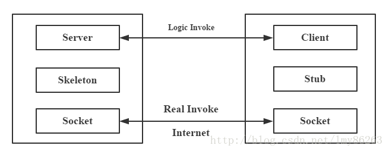
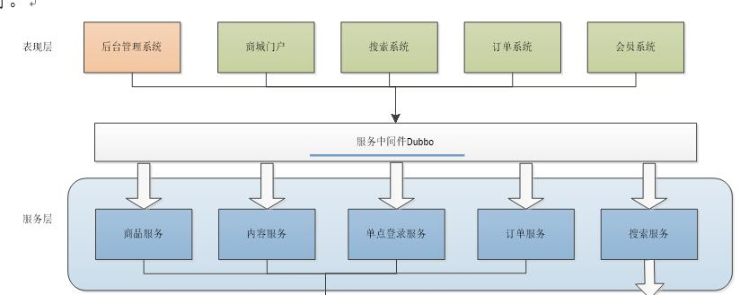

# 一、简介

- **RPC(Remote Procedure Call) 远程过程调用**： 一种通过网络从远程计算机程序上请求服务，而不需要了解底层网络技术的协议

  > - RPC 协议假定某些传输协议的存在，如TCP或UDP，为通信程序之间携带信息数据
  >
  > - OSI 网络通信模型中，RPC 跨越了传输层和应用层，使得开发分布式程序就像开发本地程序一样简单

- **RPC采用客户端(服务调用方) / 服务器端(服务提供方)模式**： 客户端只需要引入要使用的接口，接口的实现和运行都在服务器端

  > RPC 主要依赖的技术包括： 序列化、反序列化和数据传输协议

- **注意**： RPC 主要指内部服务之间的调用，RESTful 主要在于外部系统提供服务

# 二、RMI

## 1. 简介

- `Java RMI` 用于不同虚拟机之间的通信，一个虚拟机中的对象调用另一个虚拟上中的对象的方法，只不过是允许被远程调用的对象要通过一些标志加以标识

  > - 优点：避免重复造轮子
  > - 缺点：调用过程慢，且该过程不可靠，容易发生不可预料的错误

## 2. RMI 通信模型

- 从**方法调用**角度来看，RMI 让客户端对远程方法的调用相当于对本地方法的调用

- 从**客户端-服务器**模型来看，客户端程序直接调用服务端，两者之间是通过 `JRMP(Java Remote Method Protocol)` 协议通信

  > - 客户端只调用 Stub 对象中的本地方法
  > - Stub 对象是一个本地对象，实现了远程对象向外暴露的接口，即它的方法和远程对象暴露的方法的签名相同
  >
  > 可以理解为：Stub 对象是远程对象在本地的一个代理，当客户端调用方法的时候，Stub对象会将调用通过网络传递给远程对象

## 3. 难点

### 1. 数据传递问题

**分布式系统中的引用类型传递**： 

1. **将引用传递更改为值传递**： 将对象序列化为字节，然后使用该字节的副本在客户端和服务器之间传递

   > - 对象序列化的问题： 对象的嵌套引用会造成序列化的嵌套，导致数据量的激增
   >
   > - 有选择序列化： 对象能被序列化满足条件之一： 
   >   - 是 Java 的基本类型
   >   - 实现 java.io.Serializable 接口

2. **共享引用传递**： 每当远程主机调用本地主机方法时，该调用还要通过本地主机查询该引用对应的对象

RMI 中的**参数传递和结果返回**可以使用的三种机制(取决于数据类型)：

- 简单类型：按值传递，**直接传递数据拷贝**
- 远程对象引用(实现 Remote 接口)：**以远程对象的引用传递** 
- 远程对象引用(未实现 Remote 接口)：按值传递，通过**序列化对象传递副本** 

### 2. 远程对象发现问题

- **域名在 RMI 中相当于远程对象的标识符**，客户端提供远程对象的标识符访问注册表，来得到远程对象的引用

- 标识符类似 URL 地址格式，满足的规范：`rmi://host:port/name` 

  > `host` 指明注册表运行的注解，`port` 表明接收调用的端口，`name` 是一个标识该对象的简单名称

# 三、Dubbo

## 1. 背景

- **传统架构**：网站所有的功能和应用都集中在一起，方便开发同时节省成本

  > 当网站访问流量突然加大，通过不断增加服务器来提高并发量

- **分布式架构**：按照功能点把系统拆分，拆分成独立的功能

  > - 单独为某一个节点添加服务器，通过系统之间配合完成整个业务逻辑
  >
  > - 各个模块有一些通用的业务逻辑无法共用

- **面向服务架构**：把工程拆分成服务层、表现层两个工程

  > - 服务层包含业务逻辑，只需要对外提供服务
  > - 表现层只需要处理和页面的交互，业务逻辑都是调用服务层的服务来实现
  >
  > 这种架构的网站开发效率快，而且在扩展和升级相关服务时更加灵活

## 2. 简介

> - Dubbo是一个**高性能优秀的服务框架**，使得应用可通过高性能的 **RPC** 实现服务的输出和输入功能
>
> - 良好的 rpc 调用是面向服务的封装，针对服务的可用性和效率等都做了优化，单纯使用 http 调用则缺少这些特性

## 3. 架构

**上述节点说明**：

- `Provider`： 暴露服务的服务提供方
- `Consumer`： 调用远程服务的服务消费方
- `Registry`： 服务注册与发现的注册中心
- `Monitor`： 统计服务的调用次数和调用时间的监控中心
- `Container`： 服务运行容器

**调用关系说明**： 

1. 服务容器负责启动，加载，运行服务提供者
2. 服务提供者在启动时，向注册中心注册自己提供的服务
3. 服务消费者在启动时，向注册中心订阅自己所需的服务
4. 注册中心返回服务提供者地址列表给消费者，如果有变更，注册中心将基于长连接推送变更数据给消费者 
5. 服务消费者，从提供者地址列表中，基于软负载均衡算法，选一台提供者进行调用，如果调用失败，再选另一台调用
6. 服务消费者和提供者，在内存中累计调用次数和调用时间，定时每分钟发送一次统计数据到监控中心

**核心部分包含**:

- **远程通讯**： 提供对多种基于长连接的 NIO 框架抽象封装，包括多种线程模型，序列化，以及“请求-响应”模式的信息交换方式

- **集群容错**： 提供基于接口方法的透明远程过程调用，包括多协议支持，以及软负载均衡，失败容错，地址路由，动态配置等集群支持

- **自动发现**： 基于注册中心目录服务，使服务消费方能动态的查找服务提供方，使地址透明，使服务提供方可以平滑增加或减少机器

**主要功能**： 

- 透明化的远程方法调用，就像调用本地方法一样调用远程方法，只需简单配置，没有任何API侵入    
- 软负载均衡及容错机制，可在内网替代 F5 等硬件负载均衡器，降低成本，减少单点

- 服务自动注册与发现，不再需要写死服务提供方地址，注册中心基于接口名查询服务提供者的 IP 地址，并且能够平滑添加或删除服务提供者

# 四、Hessian

> 基于 HTTP 协议传输，使用 Hessian 二进制序列化，对于数据包比较大的情况比较友好，参数和返回值都需要实现 Serializable 接口

# 五、Thrift

> 跨语言的 RPC 通信框架，其跨语言特性和出色的性能

# 六、选择

- **是否允许代码侵入**： 即需要依赖相应的代码生成器生成代码，比如 Thrift
- **是否需要长连接获取高性能**： 如果对于性能需求较高，那么可以选择基于 TCP 的 Thrift、Dubbo
- **是否需要跨越网段、跨越防火墙**： 选择基于 HTTP 协议的 Hessian 和 Thrift 的 HTTP Transport