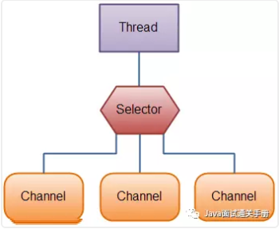

# 一、BIO(Blocking I/O)

> 同步阻塞 I/O 模式，数据的读取写入必须阻塞在一个线程内等待其完成

## 1. 传统 BIO

- **BIO 通信模型服务端**： 由一个独立的 Acceptor 线程负责监听客户端的连接

  > - 通过在 `while(true)`  循环中，调用 `accept()` 方法等待接收客户端的连接的方式监听请求
  > - 一旦接收到一个连接请求，就可以建立通信套接字进行读写操作
  > - 此时不能再接收其他客户端连接请求，只能等待同当前连接的客户端的操作执行完成，
  >
  > 不过可以通过多线程来支持多个客户端的连接：`socket.accept()`、`socket.read()`、`socket.write()` 三个主要函数都是同步阻塞

- **使用 BIO 处理多个客户端请求**： 使用多线程，即在接收到客户端连接请求后，为每个客户端创建一个新的线程进行链路处理，处理完成之后，通过输出流返回应答给客户端，线程销毁，即： **请求--应答通信模型** 


## 2. 伪异步 IO

- 解决同步阻塞 I/O 多请求的线程问题：后端通过一个线程池来处理多个客户端的请求接入

  > 通过线程池可以灵活地调配线程资源，设置线程的最大值，防止由于海量并发接入导致线程耗尽

- 采用线程池和任务队列可以实现一种**伪异步的 I/O 通信框架**
  - 当有新的客户端接入时，将客户端的 Socket 封装成一个 Task 投递到后端的线程池中进行处理
  - JDK 的线程池维护一个消息队列和 N 个活跃线程，对消息队列中的任务进行处理

> 伪异步 I/O 通信框架采用了线程池实现，避免了为每个请求都创建一个独立线程造成的线程资源耗尽问题


## 3. 代码示例

- **客户端**： 

  ```java
  public class IOClient {
      public static void main(String[] args) {
          // TODO 创建多个线程，模拟多个客户端连接服务端
          new Thread(() -> {
              try {
                  Socket socket = new Socket("127.0.0.1", 3333);
                  while (true) {
                      try {
                      	socket.getOutputStream().write((new Date() 
                                                      + ": hello world").getBytes());
                      	Thread.sleep(2000);
                      } catch (Exception e) { }
                  }
              } catch (IOException e) { }
          }).start();
      }
  }
  ```

- **服务端**： 

  ```java
  public class IOServer {
      public static void main(String[] args) throws IOException {
          // TODO 服务端处理客户端连接请求
          ServerSocket serverSocket = new ServerSocket(3333);
          // 接收到客户端连接请求之后为每个客户端创建一个新的线程进行链路处理
          new Thread(() -> {
              while (true) {
                  try {
                      // 阻塞方法获取新的连接
                      Socket socket = serverSocket.accept();
                      // 每一个新的连接都创建一个线程，负责读取数据
                      new Thread(() -> {
                          try {
                              int len;
                              byte[] data = new byte[1024];
                              InputStream inputStream = socket.getInputStream();
                              // 按字节流方式读取数据
                              while ((len = inputStream.read(data)) != -1) {
                                  System.out.println(new String(data, 0, len));
                              }
                          } catch (IOException e) { }
                      }).start();
                  } catch (IOException e) { }
              }
          }).start();
      }
  }
  ```

# 二、NIO(New I/O)

## 1. NIO 简介

- NIO 是一种同步非阻塞的 I/O 模型，提供了 Channel , Selector，Buffer 等抽象

- NIO 支持面向缓冲的，基于通道的 I/O 操作方法。

- NIO 提供了与传统 BIO 的 `Socket` 和 `ServerSocket` 对应的 `SocketChannel` 和 `ServerSocketChannel` 

  > 两种通道都支持阻塞和非阻塞两种模式： 
  >
  > 阻塞模式使用与传统的支持一样，比较简单，但是性能和可靠性都不好，非阻塞模式正好与之相反
  >
  > - 对于低负载、低并发的应用程序，可以使用同步阻塞 I/O 来提升开发速率和更好的维护性
  > - 对于高负载、高并发的（网络）应用，应使用 NIO 的非阻塞模式来开发

## 2. NIO 特性

- `Non-blocking IO`： 单线程从通道读取数据到 buffer，线程再继续处理数据，写数据也一样

- `buffer`： 包含一些要写入或读出的数据，所有的读写操作都在 buffer 中进行

  > 在面向流 I/O 中，可以将数据直接写入或读到 Stream 对象中
  >
  > - Stream 只是流的包装类，还是从流读到缓冲区
  > - NIO 直接读到 Buffer 中进行操作

- `channel`： NIO 通过 Channel(通道)进行读写

  > - 通道是双向的，可读也可写，而流的读写是单向的
  >
  > - 无论读写，通道只能和 Buffer 交互，因为 Buffer 可使通道异步读写
  >
  > NIO 中的所有读写都是从 Channel(通道)开始：
  >
  > - 从通道进行数据读取 ：创建一个缓冲区，然后请求通道读取数据
  >
  > - 从通道进行数据写入 ：创建一个缓冲区，填充数据，并要求通道写入数据
  >
  
- `selectors`： 选择器用于使单个线程处理多个通道



## 3. 代码示例

- 客户端： 

  ```java
  public class IOClient {
      public static void main(String[] args) {
          // TODO 创建多个线程，模拟多个客户端连接服务端
          new Thread(() -> {
              try {
                  Socket socket = new Socket("127.0.0.1", 3333);
                  while (true) {
                      try {
                      	socket.getOutputStream().write((new Date() 
                                                      + ": hello world").getBytes());
                      	Thread.sleep(2000);
                      } catch (Exception e) { }
                  }
              } catch (IOException e) { }
          }).start();
      }
  }
  ```

- 服务端： 

  ```java
  public class NIOServer {
      public static void main(String[] args) throws IOException {
          //1.serverSelector 轮询是否有新连接: 
          //监测到新连接后，不再创建新线程，而是直接将新连接绑定到 clientSelector 上
          Selector serverSelector = Selector.open();
          // 2. clientSelector 轮询连接是否有数据可读
          Selector clientSelector = Selector.open();
          new Thread(() -> {
              try {
                  // 对应IO编程中服务端启动
                  ServerSocketChannel listenerChannel = ServerSocketChannel.open();
                  listenerChannel.socket().bind(new InetSocketAddress(3333));
                  listenerChannel.configureBlocking(false);
                  listenerChannel.register(serverSelector, SelectionKey.OP_ACCEPT);
                  while (true) {
                      // 监测是否有新的连接，这里的1指的是阻塞的时间为 1ms
                      if (serverSelector.select(1) > 0) {
                          Set<SelectionKey> set = serverSelector.selectedKeys();
                          Iterator<SelectionKey> keyIterator = set.iterator();
                          while (keyIterator.hasNext()) {
                          SelectionKey key = keyIterator.next();
                              if (key.isAcceptable()) {
                                  try {
                                  // 每个新连接，不需要创建新线程，而直接注册到clientSelector
                                  SocketChannel clientChannel = 
                                      ((ServerSocketChannel) key.channel()).accept();
                                  clientChannel.configureBlocking(false);
                                  clientChannel.register(clientSelector, 
                                                         SelectionKey.OP_READ);
                                  } finally {
                                  	keyIterator.remove();
                                  }
                              }
                          }
                      }
                  }
              } catch (IOException ignored) { }
          }).start();
          
          new Thread(() -> {
              try {
                  while (true) {
                      // 批量轮询是否有哪些连接有数据可读，这里的1指的是阻塞的时间为 1ms
                      if (clientSelector.select(1) > 0) {
                          Set<SelectionKey> set = clientSelector.selectedKeys();
                          Iterator<SelectionKey> keyIterator = set.iterator();
                          while (keyIterator.hasNext()) {
                              SelectionKey key = keyIterator.next();
                              if (key.isReadable()) {
                                  try {
                                      SocketChannel clientChannel = 
                                          (SocketChannel) key.channel();
                                      ByteBuffer byteBuffer = ByteBuffer.allocate(1024);
                                      // 面向 Buffer
                                      clientChannel.read(byteBuffer);
                                      byteBuffer.flip();
                                      System.out.println(
                                          Charset.defaultCharset()
                                          .newDecoder()
                                          .decode(byteBuffer)
                                          .toString());
                                  } finally {
                                      keyIterator.remove();
                                      key.interestOps(SelectionKey.OP_READ);
                                  }
                              }
                          }
                      }
                  }
              } catch (IOException ignored) { }
          }).start();
      }
  }
  ```

## 4. 问题

为什么大家都不愿意用 JDK 原生 NIO 进行开发：

- 从上面的代码可以看出，编程复杂、编程模型难

- JDK 的 NIO 底层由 epoll 实现，该实现饱受诟病的空轮询 bug 会导致 cpu 飙升 100%
- 项目庞大之后，自行实现的 NIO 很容易出现各类 bug，维护成本较高

> Netty 的出现很大程度上改善了 JDK 原生 NIO 所存在的一些让人难以忍受的问题

# 三、AIO(Asynchronous I/O)

- 异步 IO 基于事件和回调机制实现，即应用操作之后会直接返回，不会堵塞，当后台处理完成，操作系统会通知相应的线程进行后续的操作