推荐阅读： [聊聊Linux 五种IO模型](<https://www.jianshu.com/p/486b0965c296>)

# 一、基本概念

## 1. 用户空间和内核空间

### 1. 基本概念

推荐阅读： **[Linux用户空间与内核空间（理解高端内存）](https://www.cnblogs.com/wuchanming/p/4360277.html)**

- 32 位操作系统的寻址空间（虚拟存储空间）为4G，**0~3G为用户空间，3~4G为内核空间** 

  

- **高端内存**： 

  > x 86架构中将内核地址空间划分三部分：
  >
  > - `ZONE_DMA`： 内存开始的16MB
  > - `ZONE_NORMAL`： 16MB~896MB
  > - `ZONE_HIGHMEM`： 896MB～1024MB
  >
  > 当内核想访问高于896MB物理地址内存时，从0xF8000000 ~ 0xFFFFFFFF地址空间范围内找一段相应大小空闲的逻辑地址空间，建立映射到想访问的那段物理内存，**临时使用，用完后归还**，实现了使用有限的地址空间
  >
  > 
  >
  > 端内存映射的三种方式：
  >
  > - **映射到”内核动态映射空间”（noncontiguous memory allocation）**：通过 `vmalloc()` 在”内核动态映射空间”申请内存，即高端内存可能映射到”内核动态映射空间”
  >
  > - **持久内核映射（permanent kernel mapping）**： 通过 `alloc_page()` 获得高端内存对应 page，从 PKMAP_BASE 到 FIXADDR_START ，用于映射高端内存
  >
  >   > **内核永久映射空间**： 
  >   >
  >   > - 在 2.6 内核上，地址范围是 4G-8M 到 4G-4M 之间，空间大小是 4M
  >   >
  >   > - 内核通过来 pkmap_page_table 寻找这个页表
  >   > - 通过 kmap() 把一个 page 映射到这个空间来，通过 kunmap() 把一个 page 对应的线性地址从这个空间释放出来
  >   > - 这个空间大小是 4M，最多能同时映射 1024 个 page
  >
  > - **临时映射（temporary kernel mapping）**
  >
  >   > **固定映射空间**： 内核在 FIXADDR_START 到 FIXADDR_TOP 之间，用于特殊需求
  >
  > 

### 2. 用户空间与内核空间的进程通信

推荐阅读： **[Linux 系统内核空间与用户空间通信的实现与分析](<https://www.ibm.com/developerworks/cn/linux/l-netlink/index.html>)**

#### 1. 简介

- **CPU 的四种状态**：

  1. 在处理一个**硬中断**

  2. 在处理一个**软中断**，如 softirq、tasklet 和 bh

  3. 运行于内核态，但有**进程上下文**，即与一个进程相关

  4. 运行一个**用户态进程**

  > - Linux 内核模块是一段可以动态在内核装载和卸载的代码
  > - Linux 内核代码的运行环境有三种：用户上下文环境、硬中断环境、软中断环境
  >
  > |     内核态环境     | 介绍                                                         | 局限性                                                       |
  > | :----------------: | :----------------------------------------------------------- | :----------------------------------------------------------- |
  > |     用户上下文     | 内核态代码的运行与用户空间进程相关，如系统调用中代码的运行环境 | **不可直接将本地变量传递给用户态的内存区**，因为内核态和用户态的内存映射机制不同 |
  > | 硬中断和软中断环境 | 硬中断或软中断过程代码的运行环境<br>如 IP 数据报的接收代码的运行环境，网络设备的驱动程序等 | **不可直接向用户态内存区传递数据**，代码在运行过程中不可阻塞 |

- **Linux 传统的进程间通信方式**：

  | 通信方法 | 无法介于内核态与用户态的原因       |
  | :------: | :--------------------------------- |
  |   管道   | 局限于父子进程间的通信             |
  | 消息队列 | 在硬、软中断中无法无阻塞地接收数据 |
  |  信号量  | 无法介于内核态和用户态使用         |
  | 内存共享 | 需要信号量辅助，而信号量又无法使用 |
  |  套接字  | 在硬、软中断中无法无阻塞地接收数据 |

#### 2. 实现

- **用户上下文环境**： 运行在用户上下文环境中的代码可以阻塞，便可以使用消息队列和 UNIX 域套接字来实现内核态与用户态的通信，但数据传输效率较低

  > Linux 内核提供 `copy_from_user()/copy_to_user()` 函数来实现内核态与用户态数据的拷贝，但这两个函数会引发阻塞，所以不能用在硬、软中断中
  >
  > 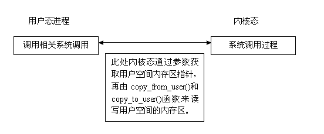

- **硬、软中断环境**： 

  - 通过**自旋锁**来实现中断环境与中断环境，中断环境与内核线程的同步

    > - 内核线程运行在有进程上下文环境中，这样便可以在内核线程中使用套接字或消息队列来取得用户空间的数据，然后再将数据通过临界区传递给中断过程
    >
    > 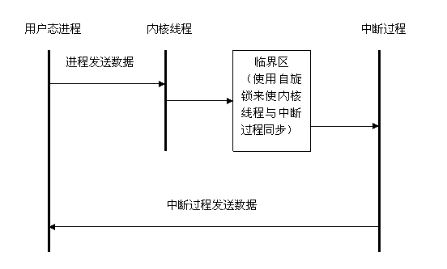
    >
    > - 中断过程不可能无休止地等待用户态进程发送数据，所以要通过一个内核线程来接收用户空间的数据，再通过临界区传给中断过程
    > - 中断过程向用户空间的数据发送必须是无阻塞的
    > - 内核线程是和其他用户态进程竞争CPU接收数据的，效率很低，这样中断过程便不能实时地接收来自用户空间的数据

  - **netlink 套接字**： 一个对应于进程的标识，一般定为该进程的 ID

    - 当通信的一端处于中断过程时，该标识为 0

    - 当使用 netlink 套接字进行通信，通信的双方都是用户态进程，则使用方法类似于消息队列

      > 通信双方有一端是中断过程，使用方法不同

    - 最大特点： 对中断过程的支持，在内核空间接收用户空间数据时不再需要用户自行启动一个内核线程，而是通过另一个软中断调用用户事先指定的接收函数

    > **使用软中断而不是内核线程来接收数据保证数据接收的实时性**
    >
    > 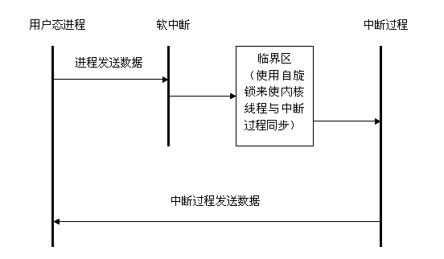
    >
    > **内核空间与用户空间的不同创建方式**： 
    >
    > 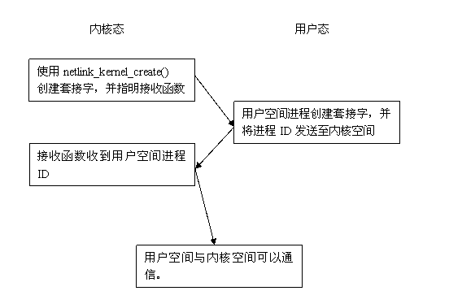

## 2. 进程切换

推荐阅读： **[进程切换（进程上下文和中断上下文）](https://www.cnblogs.com/zqz365001/p/4544741.html)**

- **进程切换(任务切换或上下文切换)**： 为了控制进程的执行，内核必须有能力挂起正在 CPU 上运行的进程，并恢复以前挂起的某个进程的执行

- 进程切换的过程： 
  - 保存处理机上下文，包括程序计数器和其他寄存器
  - 更新 PCB 信息
  - 把进程的 PCB 移入相应的队列，如就绪、在某事件阻塞等队列
  - 选择另一个进程执行，并更新其 PCB
  - 更新内存管理的数据结构
  - 恢复处理机上下文

- **进程上下文**： 一个进程在执行时，CPU 的所有寄存器中的值、进程的状态以及堆栈上的内容，当内核需要切换到另一个进程时，它需要保存当前进程的所有状态，即保存当前进程的进程上下文，以便再次执行该进程时，能够恢复切换时的状态，继续执行

- **中断上下文**： 可以看作是硬件传递的参数和内核需要保存的一些其他环境（主要是当前被中断的进程环境）

  > **硬件通过触发信号，导致内核调用中断处理程序**，进入内核空间

## 3. 进程的阻塞

- **进程的阻塞**： 正在执行的进程，由于期待的某些事件未发生，则由系统自动执行阻塞原语(Block)，使自己由运行状态变为阻塞状态

  > - 如请求系统资源失败、等待某种操作的完成、新数据尚未到达或无新工作做等
  >
  > - 进程阻塞是主动行为，因此只有处于运行态的进程，才能将其转为阻塞状态
  > - 当进程进入阻塞状态，不占用CPU资源

## 4. 文件描述符

- **文件描述符**：是一个用于表述指向文件的引用的抽象化概念

  > - 形式上是一个非负整数
  > - 实际上，是一个索引值，指向内核为每一个进程所维护的该进程打开文件的记录表
  > - 当程序打开一个现有文件或者创建一个新文件时，内核向进程返回一个文件描述符

## 5. 缓存 IO

- **缓存 IO(标准 IO)**： 在 Linux 的缓存 IO 机制中，操作系统会将 IO 的数据缓存在文件系统的页缓存中

  即数据会先被拷贝到操作系统内核的缓冲区中，然后才会从操作系统内核的缓冲区拷贝到应用程序的地址空间

  > 大多数文件系统的默认 IO 操作都是缓存 IO

- **缓存 IO 的缺点**： 数据在传输过程中需要在应用程序地址空间和内核进行多次数据拷贝操作，增大CPU 以及内存开销


# 二、I/O 模型

- 网络IO的本质是 socket 的读取，socket 在 linux 系统被抽象为流，IO 可以理解为对流的操作

- 对于一次 IO 访问，数据会先被拷贝到操作系统内核的缓冲区中，然后才会从操作系统内核的缓冲区拷贝到应用程序的地址空间

  > read 操作经历的两个阶段：
  >
  > - 第一阶段：等待数据准备
  > - 第二阶段：将数据从内核拷贝到进程中
  >
  > socket 流的两个阶段： 
  >
  > - 第一步：通常涉及等待网络上的数据分组到达，然后被复制到内核的某个缓冲区
  > - 第二步：把数据从内核缓冲区复制到应用进程缓冲区

## 1. 同步阻塞式 I/O

- 应用进程被阻塞，直到数据复制到应用进程缓冲区中才返回，socket 默认的方式

- 在这个 IO 模型中，用户空间的应用程序执行一个系统调用 `recvform`，会导致应用程序阻塞，直到数据准备好，并且将数据从内核复制到用户进程，最后进程再处理数据

  > - 在等待数据到处理数据的两个阶段，整个进程都被阻塞，不能处理别的网络 IO
  > - 调用应用程序处于一种不再消费 CPU 而只是简单等待响应的状

- 阻塞过程中，只阻塞当前进程，其它程序还可以执行，不消耗 CPU 时间，因此 CPU 利用率效率比较高

调用 `recv()/recvfrom()` 函数时，发生在内核中等待数据和复制数据的过程，如图：


```c
//recvfrom 用于接收 Socket 传来的数据，并复制到应用进程的缓冲区 buf 中
ssize_t recvfrom(int sockfd, void *buf, size_t len, int flags, struct sockaddr *src_addr, socklen_t *addrlen);
```

## 2. 同步非阻塞式 I/O

- **同步非阻塞**： **轮询方式**，设备以非阻塞形式打开

- 在网络 IO 时，非阻塞 IO 也进行 recvform 系统调用，检查数据是否准备好

  > 与阻塞 IO 不同： 非阻塞将整片时间的阻塞分成 N 多的小阻塞，所以进程不断地有机会被 CPU 光顾

- **轮询**： 非阻塞的 recvform 系统调用后，进程并没有被阻塞，内核马上返回给进程，如果数据还没准备好，此时会返回一个 error

  > - 轮询检查内核数据，直到数据准备好，再拷贝数据到进程，进行数据处理
  >
  > 注意： **拷贝数据的过程，进程仍然阻塞**


- 由于 CPU 要处理更多的系统调用，因此这种模型的 CPU 利用率比较低

## 3. I/O 复用

- **IO 多路复用**： **无差别轮询**，循环查询多个任务的完成状态，只要有任何一个任务完成，就处理

  > - UNIX/Linux 下的 select、poll、epoll 实现（epoll 比 poll、select 效率高)
  >
  > - 监视多个描述符，一旦某个描述符就绪，就通知程序进行相应的读写操作
  > - select/epoll 的优势并不是对于单个连接能处理得更快，而是**在于能处理更多的连接**

- **忙轮询**： 通过不停的把所有的流从头到尾轮询一遍，查询是否有流已经准备就绪，然后又从头开始，如果所有流都没有准备就绪，那么只会白白浪费 CPU 时间

  > ```java
  > while true {
  >       for i in stream[]; {
  >           if i has data
  >               read until unavailable
  >       }
  > }
  > ```

-  **无差别轮询**： 通过引进一个代理(select/poll)，同时观察多个流的 I/O 事件

  - 当所有的流都没有准备就绪时，把当前线程阻塞掉
  - 当有一个或多个流的 I/O 事件就绪时，就停止阻塞，然后轮询一遍所有的流，处理就绪的 I/O 事件

  > - 如果 I/O 事件准备就绪，则程序阻塞在 select 处
  > - 通过 select 只知道 I/O 事件准备好，但不知道具体是哪几个流，所以需要无差别的轮询所有的流，找出已经准备就绪的流
  > - 使用 select 时，需要 O(n) 的时间复杂度来处理流，处理的流越多，消耗的时间也就越多
  >
  > **缺点**： 随着监控的流越来越多，需要轮询的时间也会随之增加，效率也会随之降低
  >
  > ```java
  > while true {
  >     select(streams[])
  >     for i in streams[] {
  >         if i has data
  >               read until unavailable
  >     }
  > }
  > ```

- **最小轮询**： 通过 epoll 观察多个流，epoll 只通知 I/O 事件的流

  > 时间复杂度降低到O(k)，其中 k 为产生 I/O 事件的流个数
  >
  > ```java
  > while true {
  >       active_stream[] = epoll_wait(epollfd)
  >       for i in active_stream[] {
  >           read or write till unavailable
  >       }
  > }
  > ```


## 4. 信号驱动 I/O

- **信号驱动式 I/O**：
  - 通过系统调用先建立 SIGIO 的信号处理函数，立即返回而不阻塞，应用进程可以继续执行
  - 当内核准备好数据，向用户进程递交 SIGIO 信号，此时进程使用 recvfrom 系统调用，将数据复制到用户空间(阻塞)


## 5. 异步 I/O

- 应用进程执行 aio_read 系统调用会立即返回，应用进程可以继续执行，不会被阻塞，内核会在所有操作完成之后向应用进程发送信号

- **异步 I/O 与信号驱动 I/O 的区别**： 
  - 异步 I/O 的信号是通知应用进程 I/O 完成
  - 信号驱动 I/O 的信号是通知应用进程可以开始 I/O


## 6. 五大 I/O 模型比较

前四种 I/O 模型的主要区别在于第一个阶段，而第二个阶段是一样的：将数据从内核复制到应用进程过程中，应用进程会被阻塞


# 二、I/O 复用

## 1. select

```c
int select(int n, fd_set *readfds, fd_set *writefds, fd_set *exceptfds, struct timeval *timeout);
```

**参数说明**： 

- `int n`： 指定待测试的文件描述字个数，它的值是待测试的最大描述字加 1

- `fd_set`： 存放文件描述符，即文件句柄

  > 中间的三个参数指定让内核测试读、写和异常条件的文件描述符集合

- `const struct timeval *timeout`：`timeout` 告知内核等待所指定文件描述符集合中的任何一个就绪可花多少时间

  > timeval 结构用于指定这段时间的秒数和微秒数

**返回值**：

- `int`： 若有就绪描述符返回其数目，若超时则为 0，若出错则为 -1

**select 运行机制**： 

- `fd_set` 数据结构实际是一个 long 类型的数组，每一个数组元素都能与一打开的文件句柄建立联系
- 当调用 select() 时，由内核根据 IO 状态修改 fd_set 内容，通知执行 select() 进程哪个 Socket 或文件可读

**优点**： 

- 用户可以在一个线程内同时处理多个 socket 的 IO 请求，用户可以注册多个 socket，然后不断地调用 select读取被激活的 socket，即可达到在同一个线程内同时处理多个 IO 请求的目的
- 在同步阻塞模型中，必须通过多线程的方式才能达到这个目的

**缺点**： 

- 每次调用 select 都需要把 `fd_set` 集合从用户态拷贝到内核态，若 `fd_set` 集合很大，则开销也很大

- 每次调用 select 都需要在内核遍历传递进来的所有 `fd_set`，若 `fd_set` 集合很大，则开销也很大

**解决**： 

- 为减少数据拷贝带来的性能损坏，内核对被监控的 `fd_set` 集合大小做了限制，通过 `FD_SETSIZE ` 控制

## 2. poll

```c
int poll(struct pollfd *fds, unsigned int nfds, int timeout);
```

**参数说明**： 

- `struct pollfd *fds`：
  - `fds` 是一个 `struct pollfd` 类型的数组，用于存放需要检测其状态的 socket 描述符，并且调用 poll 函数后 `fds` 数组不会被清空
  - 一个`pollfd`结构体表示一个被监视的文件描述符，通过传递`fds`指示 poll() 监视多个文件描述符。其中，结构体的`events`域是监视该文件描述符的事件掩码，由用户来设置这个域，结构体的`revents`域是文件描述符的操作结果事件掩码，内核在调用返回时设置这个域

  ```c
  typedef struct pollfd {
      int fd;                         // 需要被检测或选择的文件描述符
      short events;                   // 对文件描述符fd上感兴趣的事件
      short revents;                  // 文件描述符fd上当前实际发生的事件
  } pollfd_t;
  ```

- `nfds_t nfds`： 记录数组 `fds` 中描述符的总数量

**返回值**： 

- `int`： 函数返回 fds 集合中就绪的读、写，或出错的描述符数量，返回0表示超时，返回-1表示出错

## 3. epoll

### 1. 简述

- epoll 没有描述符个数限制，使用一个文件描述符管理多个描述符，将用户关心的文件描述符的事件存放到内核的一个事件表中，这样在用户空间和内核空间的 copy 只需一次
- epoll 只需将描述符从进程缓冲区向内核缓冲区拷贝一次，并且进程不需要通过轮询来获得事件完成的描述符

```c
int epoll_create(int size);
int epoll_ctl(int epfd, int op, int fd, struct epoll_event *event)；
int epoll_wait(int epfd, struct epoll_event * events, int maxevents, int timeout);
```

- `epoll_create`： 创建一个 epoll 句柄，参数 `size` 表明内核要监听的描述符数量

  > 调用成功时返回一个 epoll 句柄描述符，失败时返回 -1

- `epoll_ctl`： 用于向内核注册新的描述符或者是改变某个文件描述符的状态

  > - 已注册的描述符在内核中会被维护在一棵红黑树上
  > - 通过回调函数，内核会将 I/O 准备好的描述符加入到一个链表中管理
  > - 进程调用 epoll_wait() 便可以得到事件完成的描述符

  -  `epfd`： 表示 epoll 句柄

  - `op`： 表示 fd 操作类型
    - `EPOLL_CTL_ADD`： 注册新的 fd 到 epfd 中
    - `EPOLL_CTL_MOD`： 修改已注册的 fd 的监听事件
    - `EPOLL_CTL_DEL`： 从 epfd 中删除一个 fd
  -  `fd`： 要监听的描述符
  -  `event`： 要监听的事件

- `epoll_wait`： 等待事件的就绪，成功时返回就绪的事件数目，调用失败时返回 -1，等待超时返回 0
  -  `epfd` 是 epoll 句柄
  -  `events` 表示从内核得到的就绪事件集合
  -  `maxevents` 告诉内核 events 的大小
  -  `timeout` 表示等待的超时事件

**优点**： 

- `epoll` 是 Linux 内核为处理大量文件描述符而改进的 poll，是Linux下多路复用IO接口select/poll的增强版本
- 能显著提高程序在大量并发连接中只有少量活跃的情况下的系统CPU利用率

**原理**： 

- 获取事件时，不遍历整个被侦听的描述符集，只遍历被内核 IO 事件异步唤醒而加入 Ready 队列的描述符集合

### 2. 工作模式

- epoll 除提供 select/poll 那种 IO 事件的水平触发，还提供边缘触发
- 边缘触发使得用户空间程序有可能缓存 IO 状态，减少 epoll_wait/epoll_pwait 的调用，提高应用程序效率

#### 1. 水平触发（LT）

- 默认工作模式，即当 epoll_wait 检测到某描述符事件就绪并通知应用程序时，应用程序可以不立即处理该事件；下次调用 epoll_wait 时，会再次通知此事件

#### 2. 边缘触发（ET）

- 当 epoll_wait 检测到某描述符事件就绪并通知应用程序时，应用程序必须立即处理该事件；如果不处理，下次调用 epoll_wait 时，不会再次通知此事件

  > 边缘触发只在状态由未就绪变为就绪时只通知一次

**优点**： 

- 减少了 epoll 事件被重复触发的次数，效率要比 LT 模式高
- 只支持 No-Blocking，以避免由于一个文件句柄的阻塞读/阻塞写操作把处理多个文件描述符的任务饿死

## 4. 比较

|            |                        select                         |                        poll                         |                            epoll                             |
| :--------- | :---------------------------------------------------: | :-------------------------------------------------: | :----------------------------------------------------------: |
| 操作方式   |                         遍历                          |                        遍历                         |                             回调                             |
| 底层实现   |                         数组                          |                        链表                         |                            哈希表                            |
| IO效率     |       每次调用都进行线性遍历，时间复杂度为O(n)        |      每次调用都进行线性遍历，时间复杂度为O(n)       | 事件通知方式，每当 fd 就绪，系统注册的回调函数就会被调用，将就绪 fd 放到 readyList 里面，时间复杂度O(1) |
| 最大连接数 |               1024（x86）或2048（x64）                |                       无上限                        |                            无上限                            |
| fd拷贝     | 每次调用 select，都需要把 fd 集合从用户态拷贝到内核态 | 每次调用 poll，都需要把 fd 集合从用户态拷贝到内核态 | 调用 epoll_ctl 时拷贝进内核并保存，之后每次epoll_wait 不拷贝 |

- select 和 poll 功能比较： 功能基本相同，实现细节有所不同
  - select 会修改描述符，而 poll 不会

  - select 的描述符类型使用数组实现，FD_SETSIZE 大小默认为 1024，默认监听 1024 个描述符

    > 如果要监听更多描述符的话，需要修改 FD_SETSIZE 之后重新编译

    poll 的描述符类型使用链表实现，没有描述符数量的限制

  - poll 提供了更多的事件类型，并且对描述符的重复利用上比 select 高

  - 如果一个线程对某个描述符调用 select 或者 poll，另一个线程关闭了该描述符，会导致调用结果不确定

- select 和 poll 速度比较： 都比较慢
  - select 和 poll 每次调用都需要将全部描述符从应用进程缓冲区复制到内核缓冲区
  - select 和 poll 的返回结果中没有声明哪些描述符已经准备好，所以如果返回值大于 0 时，应用进程都需要使用轮询的方式来找到 I/O 完成的描述符

## 5. 应用场景

### 1. select 应用场景

- select 的 timeout 参数精度为 1ns，而 poll 和 epoll 为 1ms，因此 select 更加适用于实时要求更高的场景

- select 可移植性更好，几乎被所有主流平台所支持

### 2. poll 应用场景

- poll 没有最大描述符数量的限制，如果平台支持并且对实时性要求不高，应该使用 poll 而不是 select

### 3. epoll 应用场景

- 只需要运行在 Linux 平台上，并且有非常大量的描述符需要同时轮询，而且这些连接最好是长连接

- 需要同时监控小于 1000 个描述符，就没有必要使用 epoll，因为这个应用场景下并不能体现 epoll 的优势

- 需要监控的描述符状态变化多，而且都是非常短暂的，也没有必要使用 epoll。因为 epoll 中的所有描述符都存储在内核中，造成每次需要对描述符的状态改变都需要通过 epoll_ctl() 进行系统调用，频繁系统调用降低效率。并且epoll 的描述符存储在内核，不容易调试

# 三、Socket 简介

## 1. 协议简介

- 协议： 规定了分组报文的结构、交换方式、包含的意义以及怎样对报文所包含的信息进行解析

  > TCP/IP 协议族有 IP 协议、TCP 协议和 UDP 协议

- TCP 协议和 UDP 协议使用的地址叫做端口号，用来区分同一主机上的不同应用程序，即端到端传输协议

  > - TCP/UDP 将数据从一个应用程序传输到另一个应用程序
  > - IP 协议只是将数据从一个主机传输到另一个主机
  > - 互联网地址由 IP 协议使用，而端口地址信息则由传输协议（TCP 或 UDP 协议）对其进行解析

- socket 类型： **流套接字（使用 TCP 协议）和数据报套接字（使用 UDP 协议）** 

  > 通过数据报套接字，应用程序一次只能发送最长 65507 个字节长度的信息

-  TCP/IP 套接字由一个互联网地址，一个端对端协议（TCP 协议或 UDP 协议）以及一个端口号唯一确定

- 一个端口确定一个主机上的一个套接字，多个程序可以同时访问同一个套接字

## 2. 基本套接字

- 编写 TCP 客户端程序，在实例化 Socket 类时，底层的 TCP 协议只能处理 IP 协议

  > 若传递的第一个参数是主机名字而非 IP 地址，则 Socket 类会将其解析成相应的 IP 地址

- TCP 协议读写数据时，read() 方法在没有可读数据时会阻塞等待，直到有新的数据可读

- TCP 服务器端的程序将在 accept() 方法处阻塞，以等待客户端的连接请求，一旦取得连接，便要为每个客户端的连接建立一个 Socket 实例来进行数据通信

- 在 UDP 程序中，创建 DatagramPacket 实例时： 
  - 如果没有指定远程主机地址和端口，则该实例用来接收数据
  - 如果指定了远程主机地址和端口，则该实例用来发送数据

- UDP 程序在 receive() 方法处阻塞，直到收到一个数据报文或等待超时

  > 在客户端使用 DatagramSocket 类的 setSoTimeout() 方法来规定 receive() 方法的最长阻塞时间，并指定重发数据报的次数，如果每次阻塞都超时，并且重发次数达到了设置的上限，则关闭客户端

- UDP 服务器的所有通信使用同一套接字，TCP 服务器为每个成功返回的 accept() 方法创建一个新的套接字

- 在 UDP 套接字编程中，如果 receive() 方法在一个缓冲区大小为 n 的 DatagramPscket 实例中调用，而接受队列中的第一个消息长度大于 n，则 receive()方法只返回这条消息的前 n 个字节，超出的其他字节部分将自动被丢弃，而且也没有任何消息丢失的提示

  > DatagramPacket 实例所运行传输的最大数据量为 65507 字节，即 UDP 数据报文所能负载的最多数据

- 在 UDP 套接字编程中，DatagramPacket 实例包含一个内部消息长度值，且随新消息，而改变该长度值，以反映实际接收的消息的字节数

  > 如果一个应用程序使用同一个 DatagramPacket 实例多次调用 receive()方法，每次调用前就必须显式地将消息的内部长度重置为缓冲区的实际长度

- DatagramPacket 类的 getData() 方法：总是返回缓冲区的原始大小，忽略实际数据的内部偏移量和长度信息

# 四、Socket 编程

## 1. TCP 网络通信(用户数据流协议)

### 1. 实现

1. 客户端Socket的工作过程： 
   - 创建 Socket：根据指定服务端的 IP 地址或端口号构造 Socket 类对象。若服务器端响应，则建立客户端到服务器的通信线路。若连接失败，会出现异常
   - 打开连接到 Socket 的输入/出流： 使用 getInputStream()方法获得输入流，使用 getOutputStream()方法获得输出流，进行数据传输
   - 按照一定的协议对 Socket  进行读/写操作：通过输入流读取服务器放入线路的信息（但不能读取自己放入线路的信息），通过输出流将信息写入线程
   - 关闭 Socket：断开客户端到服务器的连接，释放线路 
2. 服务器程序的工作过程：
   - 调用 ServerSocket(int port) ：创建一个服务器端套接字，并绑定到指定端口上。用于监听客户端的请求
   - 调用 accept()：监听连接请求，如果客户端请求连接，则接受连接，返回通信套接字对象
   - 调用 Socket 类对象的 getOutputStream() 和 getInputStream ()：获取输出流和输入流，开始网络数据的发送和接收
   - 关闭ServerSocket和Socket对象：客户端访问结束，关闭通信套接字


**1. TCP编程例一：客户端给服务端发送信息，服务端输出此信息到控制台上：** 

```java
public class TestTCP1 {
	// 客户端
	@Test
	public void client() {
		Socket socket = null;
		OutputStream os = null;
		try {
			// 1.创建一个Socket的对象，通过构造器指明服务端的IP地址，以及其接收程序的端口号
			socket = new Socket(InetAddress.getByName("127.0.0.1"), 9090);
			// 2.getOutputStream()：发送数据，方法返回OutputStream的对象
			os = socket.getOutputStream();
			// 3.具体的输出过程
			os.write("我是客户端，请多关照".getBytes());
		} catch (IOException e) {
			e.printStackTrace();
		} finally {
			// 4.关闭相应的流和Socket对象
            os.close();
            socket.close();
		}
	}

	// 服务端
	@Test
	public void server() {
		ServerSocket ss = null;
		Socket s = null;
		InputStream is = null;
		try {
			// 1.创建一个ServerSocket的对象，通过构造器指明自身的端口号
			ss = new ServerSocket(9090);
			// 2.调用其accept()方法，返回一个Socket的对象
			s = ss.accept();
			// 3.调用Socket对象的getInputStream()获取一个从客户端发送过来的输入流
			is = s.getInputStream();
			// 4.对获取的输入流进行的操作
			byte[] b = new byte[20];
			int len;
			while ((len = is.read(b)) != -1) {
				String str = new String(b, 0, len);
				System.out.print(str);
			}
			System.out.println("来自" + s.getInetAddress().getHostAddress());
		} catch (IOException e) {
			e.printStackTrace();
		} finally {
			// 5.关闭相应的流以及Socket、ServerSocket的对象
            is.close();
            s.close();
            ss.close();
		}
	}
}
```

**2. TCP编程例二：客户端给服务端发送信息，服务端将信息打印到控制台上，同时发送“已收到信息”给客户端** 

```java
public class TestTCP2 {
	//客户端
	@Test
	public void client(){
		Socket socket = null;
		OutputStream os = null;
		InputStream is = null;
		try {
			socket = new Socket(InetAddress.getByName("127.0.0.1"),8989);
			os = socket.getOutputStream();
			os.write("我是客户端".getBytes());
			//shutdownOutput():执行此方法，显式的告诉服务端发送完毕！
			socket.shutdownOutput();
			is = socket.getInputStream();
			byte[] b = new byte[20];
			int len;
			while((len = is.read(b)) != -1){
				String str = new String(b,0,len);
				System.out.print(str);
			}
		} catch (IOException e) {
			e.printStackTrace();
		}finally{
            is.close();
            os.close();
            socket.close();
		}
	}
  
	//服务端
	@Test
	public void server(){
		ServerSocket ss = null;
		Socket s = null;
		InputStream is = null;
		OutputStream os = null;
		try {
			ss = new ServerSocket(8989);
			s = ss.accept();
			is = s.getInputStream();
			byte[] b = new byte[20];
			int len;
			while((len = is.read(b)) != -1){
				String str = new String(b,0,len);
				System.out.print(str);
			}
			os = s.getOutputStream();
			os.write("我已收到你的情意".getBytes());
		} catch (IOException e) {
			e.printStackTrace();
		}finally{
            os.close();
            is.close();
            s.close();
            ss.close();
		}
	}
}
```

**3. TCP编程例三：从客户端发送文件给服务端，服务端保存到本地并返回“发送成功”给客户端，关闭相应的连接** 

```java
public class TestTCP3 {
	@Test
	public void client()throws Exception{
		//1.创建Socket的对象
		Socket socket = new Socket(InetAddress.getByName("127.0.0.1"), 9898);
		//2.从本地获取一个文件发送给服务端
		OutputStream os = socket.getOutputStream();
		FileInputStream fis = new FileInputStream(new File("1.jpg"));
		byte[] b = new byte[1024];
		int len;
		while((len = fis.read(b)) != -1){
			os.write(b,0,len);
		}
		socket.shutdownOutput();
		//3.接收来自于服务端的信息
		InputStream is = socket.getInputStream();
		byte[] b1 = new byte[1024];
		int len1;
		while((len1 = is.read(b1)) != -1){
			String str = new String(b1,0,len1);
			System.out.print(str);
		}
		//4.关闭相应的流和Socket对象
		is.close();
		os.close();
		fis.close();
		socket.close();
	}
	@Test
	public void server() throws Exception{
		//1.创建一个ServerSocket的对象
		ServerSocket ss = new ServerSocket(9898);
		//2.调用其accept()方法，返回一个Socket的对象
		Socket s = ss.accept();
		//3.将从客户端发送来的信息保存到本地
		InputStream is = s.getInputStream();
		FileOutputStream fos = new FileOutputStream(new File("3.jpg"));
		byte[] b = new byte[1024];
		int len;
		while((len = is.read(b)) != -1){
			fos.write(b, 0, len);
		}
		System.out.println("收到来自于" + s.getInetAddress().getHostAddress());
		//4.发送"接收成功"的信息反馈给客户端
		OutputStream os = s.getOutputStream();
		os.write("你发送的图片我已接收成功！".getBytes());
		//5.关闭相应的流和Socket及ServerSocket的对象
		os.close();
		fos.close();
		is.close();
		s.close();
		ss.close();
	}
}
```

**4. TCP 编程示例四：BIO 多线程处理**

```java
public class Server {
    public static void main(String[] args) {
        ServerSocket server = null;
        ExecutorService service = Executors.newFixedThreadPool(50);
        try{
            server = new ServerSocket(9898);
            while(true){
                Socket socket = server.accept();
                service.execute(new Handler(socket));
            }
        }catch(Exception e){
            e.printStackTrace();
        }finally{
            server.close();
        }
    }
    static class Handler implements Runnable{
        Socket socket = null;
        public Handler(Socket socket){
            this.socket = socket;
        }
        @Override
        public void run() {
            BufferedReader reader = null;
            PrintWriter writer = null;
            try{
                reader = new BufferedReader(
                        new InputStreamReader(socket.getInputStream(), "UTF-8"));
                writer = new PrintWriter(
                        new OutputStreamWriter(socket.getOutputStream(), "UTF-8"));
                String readMessage = null;
                while(true){
                    if((readMessage = reader.readLine()) == null){
                        break;
                    }
                    System.out.println(readMessage);
                    writer.println("server recive : " + readMessage);
                    writer.flush();
                }
            }catch(Exception e){
                e.printStackTrace();
            }finally{
                socket.close();
                reader.close();
                writer.close();
            }
        }
    }
}

public class Client {
    public static void main(String[] args) {
        Socket socket = null;
        BufferedReader reader = null;
        PrintWriter writer = null;
        try{
            socket = new Socket(InetAddress.getByName("127.0.0.1"), 9898);
            String message = null;
            reader = new BufferedReader(
                new InputStreamReader(socket.getInputStream(), "UTF-8"));
            writer = new PrintWriter(socket.getOutputStream(), true);
            while(true){
                message = s.nextLine();
                if(message.equals("exit")){
                    break;
                }
                writer.println(message);
                writer.flush();
                System.out.println(reader.readLine());
            }
        }catch(Exception e){
            e.printStackTrace();
        }finally{
            socket.close();
            reader.close();
            writer.close();
        }
    }
}
```

### 2. 通信死锁

- **原因**： 当 TCP 通信连接的一方关闭了套接字时，`read()` 会返回 -1

- **解决**： `shutdownOutput()` 和 `shutdownInput()` 分别关闭 Socket 的输出流和输入流，而不影响其对应的输入流和输出流

  > 可以在客户端发送完数据后，调用 shutdownOutput() 方法将套接字的输出流关闭，则服务端的 read()方法便会返回 -1，继续往下执行，最后关闭服务端的套接字，而后客户端的 read()()方法也会返回 -1，继续往下执行，直到关闭套接字

### 3. NIO TCP

基于 NIO 的 TCP 连接的建立步骤： 

- 创建一个 Selector 实例
- 将其注册到各种信道，并指定每个信道上感兴趣的I/O操作
- 重复执行：
  - 调用一种 select()方法
  - 获取选取的键列表
  - 对于已选键集中的每个键：
    - 获取信道，并从键中获取附件（如果为信道及其相关的 key 添加了附件的话）
    - 确定准备就绪的操纵并执行，若是 accept 操作，将接收的信道设置为非阻塞模式，并注册到选择器
    - 如果需要，修改键的兴趣操作集
    - 从已选键集中移除键

```java
public class TCPEchoClientNonblocking {  
    public static void main(String args[]) throws Exception{  
        //创建一个信道，并设为非阻塞模式  
        SocketChannel clntChan = SocketChannel.open();  
        clntChan.configureBlocking(false);  
        //向服务端发起连接  
        if (!clntChan.connect(new InetSocketAddress(127.0.0.1, 9898))){  
            //不断地轮询连接状态，直到完成连接  
            while (!clntChan.finishConnect()){  
                //在等待连接的时间里，可以执行其他任务，以充分发挥非阻塞IO的异步特性  
                //这里为了演示该方法的使用，只是一直打印"."  
                System.out.print(".");    
            }  
        }  
        String argument = "测试".getBytes();
        //分别实例化用来读写的缓冲区  
        ByteBuffer writeBuf = ByteBuffer.wrap(argument);  
        ByteBuffer readBuf = ByteBuffer.allocate(argument.length);  
        //接收到的总的字节数  
        int totalBytesRcvd = 0;   
        //每一次调用 read（）方法接收到的字节数  
        int bytesRcvd;   
        //循环执行，直到接收到的字节数与发送的字符串的字节数相等  
        while (totalBytesRcvd < argument.length){  
            //如果用来向通道中写数据的缓冲区中还有剩余的字节，则继续将数据写入信道  
            if (writeBuf.hasRemaining()){  
                clntChan.write(writeBuf);  
            }  
            //如果read（）接收到-1，表明服务端关闭，抛出异常  
            if ((bytesRcvd = clntChan.read(readBuf)) == -1){  
                throw new SocketException("Connection closed prematurely");  
            }  
            //计算接收到的总字节数  
            totalBytesRcvd += bytesRcvd;  
            //在等待通信完成的过程中，程序可以执行其他任务，以体现非阻塞IO的异步特性  
            //这里为了演示该方法的使用，同样只是一直打印"."  
            System.out.print(".");   
        }  
        //打印出接收到的数据  
        System.out.println("Received: " 
                           +  new String(readBuf.array(), 0, totalBytesRcvd));  
        //关闭信道  
        clntChan.close();  
    }  
}  

public class TCPServerSelector{  
    //缓冲区的长度  
    private static final int BUFSIZE = 256;   
    //select方法等待信道准备好的最长时间  
    private static final int TIMEOUT = 3000;   
    public static void main(String[] args) throws IOException {  
        //创建一个选择器  
        Selector selector = Selector.open();  
        for (String arg : args){  
            //实例化一个信道  
            ServerSocketChannel listnChannel = ServerSocketChannel.open();  
            //将该信道绑定到指定端口  
            listnChannel.socket().bind(new InetSocketAddress(9898));  
            //配置信道为非阻塞模式  
            listnChannel.configureBlocking(false);  
            //将选择器注册到各个信道  
            listnChannel.register(selector, SelectionKey.OP_ACCEPT);  
        }  
        //创建一个实现了协议接口的对象  
        TCPProtocol protocol = new EchoSelectorProtocol(BUFSIZE);  
        //不断轮询select方法，获取准备好的信道所关联的Key集  
        while (true){  
            //一直等待,直至有信道准备好了I/O操作  
            if (selector.select(TIMEOUT) == 0){  
                //在等待信道准备的同时，也可以异步地执行其他任务，  
                //这里只是简单地打印"."  
                System.out.print(".");  
                continue;  
            }  
            //获取准备好的信道所关联的Key集合的iterator实例  
            Iterator<SelectionKey> keyIter = selector.selectedKeys().iterator();  
            //循环取得集合中的每个键值  
            while (keyIter.hasNext()){  
                SelectionKey key = keyIter.next();   
                //如果服务端信道感兴趣的I/O操作为accept  
                if (key.isAcceptable()){  
                    protocol.handleAccept(key);  
                }  
                //如果客户端信道感兴趣的I/O操作为read  
                if (key.isReadable()){  
                    protocol.handleRead(key);  
                }  
                //如果该键值有效，并且其对应的客户端信道感兴趣的I/O操作为write  
                if (key.isValid() && key.isWritable()) {  
                    protocol.handleWrite(key);  
                }  
                //这里需要手动从键集中移除当前的key  
                keyIter.remove();   
            }  
        }  
    }  
}  

/** 
 * 该接口定义了通用 TCPSelectorServer 类与特定协议之间的接口 
 * 把与具体协议相关的处理各种 I/O 的操作分离出来，以使不同协议都能方便地使用这个基本的服务模式
*/  
public interface TCPProtocol{  
    //accept I/O形式  
    void handleAccept(SelectionKey key) throws IOException;  
    //read I/O形式  
    void handleRead(SelectionKey key) throws IOException;  
    //write I/O形式  
    void handleWrite(SelectionKey key) throws IOException;  
}  

public class EchoSelectorProtocol implements TCPProtocol {  
    private int bufSize; // 缓冲区的长度  
    public EchoSelectorProtocol(int bufSize){  
    	this.bufSize = bufSize;  
    }  
    //服务端信道已经准备好了接收新的客户端连接  
    public void handleAccept(SelectionKey key) throws IOException {  
        SocketChannel clntChan = ((ServerSocketChannel) key.channel()).accept();  
        clntChan.configureBlocking(false);  
        //将选择器注册到连接到的客户端信道，并指定该信道key值的属性为OP_READ
        clntChan.register(key.selector(), SelectionKey.OP_READ, 
                          ByteBuffer.allocate(bufSize));  
    }  
    //客户端信道已经准备好了从信道中读取数据到缓冲区  
    public void handleRead(SelectionKey key) throws IOException{  
        SocketChannel clntChan = (SocketChannel) key.channel();  
        //获取该信道所关联的附件，这里为缓冲区  
        ByteBuffer buf = (ByteBuffer) key.attachment();  
        long bytesRead = clntChan.read(buf);  
        if (bytesRead == -1){   
            clntChan.close();  
        }else if(bytesRead > 0){  
        	//如果缓冲区总读入了数据，则将该信道感兴趣的操作设置为为可读可写  
        	key.interestOps(SelectionKey.OP_READ | SelectionKey.OP_WRITE);  
        }  
    }  
    //客户端信道已经准备好了将数据从缓冲区写入信道  
    public void handleWrite(SelectionKey key) throws IOException {  
    	//获取与该信道关联的缓冲区，里面有之前读取到的数据  
    	ByteBuffer buf = (ByteBuffer) key.attachment();  
    	//重置缓冲区，准备将数据写入信道  
    	buf.flip();   
    	SocketChannel clntChan = (SocketChannel) key.channel();  
    	//将数据写入到信道中  
    	clntChan.write(buf);  
    	if (!buf.hasRemaining()){   
    		//如果缓冲区中的数据已经全部写入了信道，则将该信道感兴趣的操作设置为可读  
      		key.interestOps(SelectionKey.OP_READ);  
    	}  
    	//为读入更多的数据腾出空间  
    	buf.compact();   
  }  
}  
```

## 2. UDP 网络通信(用户数据报协议)

- 将数据、源、目的封装成数据包，不需要建立连接
- 每个数据报的大小限制在64K内
- 因无需连接，故是不可靠的
- 发送数据结束时无需释放资源，速度快

**示例一**： 

```java
public class TestUDP {
	// 发送端
	@Test
	public void send() {
		DatagramSocket ds = null;
		try {
			ds = new DatagramSocket();
			byte[] b = "你好，我是要发送的数据".getBytes();
			//创建一个数据报：每一个数据报不能大于64k，都记录着数据信息，发送端的IP、端口号,
            //以及要发送到的接收端的IP、端口号
			DatagramPacket pack = new DatagramPacket(b, 0, b.length,
					InetAddress.getByName("127.0.0.1"), 9090);
			ds.send(pack);
		}catch (IOException e) {
			e.printStackTrace();
		}finally{
			if(ds != null){
				ds.close();
			}
		}
	}

	// 接收端
	@Test
	public void rceive() {
		DatagramSocket ds = null;
		try {
			ds = new DatagramSocket(9090);
			byte[] b = new byte[1024];
			DatagramPacket pack = new DatagramPacket(b, 0, b.length);
			ds.receive(pack);
			String str = new String(pack.getData(), 0, pack.getLength());
			System.out.println(str);
		}catch (IOException e) {
			e.printStackTrace();
		}finally{
			if(ds != null){
				ds.close();
			}
		}
	}
}
```

**示例二**： 

```java
public class UDPClient {  
    private static final int TIMEOUT = 5000;  //设置接收数据的超时时间  
    private static final int MAXNUM = 5;      //设置重发数据的最多次数  
    public static void main(String args[])throws IOException{  
        String str_send = "Hello UDPserver";  
        byte[] buf = new byte[1024];  
        //客户端在9000端口监听接收到的数据  
        DatagramSocket ds = new DatagramSocket(9000);  
        InetAddress loc = InetAddress.getLocalHost();  
        //定义用来发送数据的DatagramPacket实例  
        DatagramPacket dp_send = 
            new DatagramPacket(str_send.getBytes(),str_send.length(),loc,3000);  
        //定义用来接收数据的DatagramPacket实例  
        DatagramPacket dp_receive = new DatagramPacket(buf, 1024);  
        //数据发向本地3000端口  
        ds.setSoTimeout(TIMEOUT);              //设置接收数据时阻塞的最长时间  
        int tries = 0;                         //重发数据的次数  
        boolean receivedResponse = false;     //是否接收到数据的标志位  
        //直到接收到数据，或者重发次数达到预定值，则退出循环  
        while(!receivedResponse && tries<MAXNUM){  
            //发送数据  
            ds.send(dp_send);  
            try{  
                //接收从服务端发送回来的数据  
                ds.receive(dp_receive);  
                //如果接收到数据。则将receivedResponse标志位改为true，从而退出循环  
                receivedResponse = true;  
            }catch(InterruptedIOException e){  
                //如果接收数据时阻塞超时，重发并减少一次重发的次数  
                tries += 1;  
            }  
        }  
        if(receivedResponse){  
            //如果收到数据，则打印出来  
            String str_receive = 
                new String(dp_receive.getData(),0,dp_receive.getLength()) 
                + " from " + dp_receive.getAddress().getHostAddress() + ":" 
                + dp_receive.getPort();  
            System.out.println(str_receive);  
            //由于dp_receive在接收了数据之后，其内部消息长度值会变为实际接收的消息的字节数，  
            //所以这里要将dp_receive的内部消息长度重新置为1024  
            dp_receive.setLength(1024);
        }
        ds.close();  
    }    
}   

public class UDPServer {   
    public static void main(String[] args)throws IOException{  
        String str_send = "Hello UDPclient";  
        byte[] buf = new byte[1024];  
        //服务端在3000端口监听接收到的数据  
        DatagramSocket ds = new DatagramSocket(3000);  
        //接收从客户端发送过来的数据  
        DatagramPacket dp_receive = new DatagramPacket(buf, 1024);  
        boolean f = true;  
        while(f){  
            //服务器端接收来自客户端的数据  
            ds.receive(dp_receive);  
            System.out.println("server received data from client：");  
            String str_receive = 
                new String(dp_receive.getData(),0,dp_receive.getLength()) 
                + " from " + dp_receive.getAddress().getHostAddress() + ":" 
                + dp_receive.getPort();  
            System.out.println(str_receive);  
            //数据发动到客户端的3000端口  
            DatagramPacket dp_send= 
                new DatagramPacket(str_send.getBytes(),str_send.length(),
                                   dp_receive.getAddress(),9000);  
            ds.send(dp_send);  
            //由于dp_receive在接收了数据之后，其内部消息长度值会变为实际接收的消息的字节数，  
            //所以这里要将dp_receive的内部消息长度重新置为1024  
            dp_receive.setLength(1024);  
        }  
        ds.close();  
    }  
}  
```

## 3. URL编程

### 1. URL 简介

- URL(Uniform Resource Locator)：统一资源定位符，它表示 Internet 上某一资源的地址。通过 URL 我们可以访问 Internet 上的各种网络资源，比如最常见的 www，ftp 站点。浏览器通过解析给定的 URL 可以在网络上查找相应的文件或其他资源。  

- URL的基本结构由5部分组成：<传输协议>://<主机名>:<端口号>/<文件名>例如: `http://192.168.1.100:8080/helloworld/index.jsp`

- URL 类的方法：

  ```java
  public String getProtocol(  )     获取该URL的协议名
  public String getHost(  )           获取该URL的主机名
  public String getPort(  )            获取该URL的端口号
  public String getPath(  )           获取该URL的文件路径
  public String getFile(  )             获取该URL的文件名
  public String getRef(  )             获取该URL在文件中的相对位置
  public String getQuery(   )        获取该URL的查询名
  ```

### 2. URLConnection 类

- URL的方法 openStream()：能从网络上读取数据
- 若希望输出数据，例如向服务器端的 CGI （公共网关接口-Common Gateway Interface-的简称，是用户浏览器和服务器端的应用程序进行连接的接口）程序发送一些数据，则必须先与URL建立连接，然后才能对其进行读写，此时需要使用 URLConnection 。
- URLConnection：表示到URL所引用的远程对象的连接。当与一个URL建立连接时，首先要在一个 URL 对象上通过方法 openConnection() 生成对应的 URLConnection 对象。如果连接过程失败，将产生IOException. 
  - URL netchinaren = new URL ("http://www.baidu.com/index.shtml"); 
  - URLConnectonn u = netchinaren.openConnection( ); 
- 通过URLConnection对象获取的输入流和输出流，即可以与现有的CGI程序进行交互

```java
public class TestURL {
	public static void main(String[] args) throws Exception {
		//1.创建一个URL的对象
		URL url = new URL("http://127.0.0.1:8080/examples/HelloWorld.txt?a=b");
		//如何将服务端的资源读取进来:openStream()
		InputStream is = url.openStream();
		byte[] b = new byte[20];
		int len;
		while((len = is.read(b)) != -1){
			String str = new String(b,0,len);
			System.out.print(str);
		}
		is.close();
		//如果既有数据的输入，又有数据的输出，则考虑使用URLConnection
		URLConnection urlConn = url.openConnection();
		InputStream is1 = urlConn.getInputStream();
		FileOutputStream fos = new FileOutputStream(new File("abc.txt"));
		byte[] b1 = new byte[20];
		int len1;
		while((len1 = is1.read(b1)) != -1){
			fos.write(b1, 0, len1);
		}
		fos.close();
		is1.close();
	}
}
```

## 4. InetAddress 类

```java
public class TestInetAddress {
	public static void main(String[] args) throws Exception {
		//创建一个InetAddress对象：getByName()
		InetAddress inet = InetAddress.getByName("www.baidu.com");
		//inet = InetAddress.getByName("111.13.100.92");
		System.out.println(inet);
		//两个方法
		System.out.println(inet.getHostName()); //获取 IP 地址对应的域名
		System.out.println(inet.getHostAddress()); //获取 IP 地址
		//获取本机的IP:getLocalHost()
		InetAddress inet1 = InetAddress.getLocalHost();
		System.out.println(inet1);
		System.out.println(inet1.getHostName());
		System.out.println(inet1.getHostAddress());
	}
}
```

# 五、netty

## 1. 简介

### 1. BIO 的局限性

- **简化的 reactor 模型**： 

  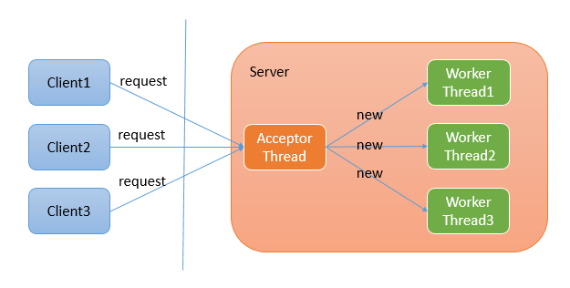

- **使用线程池改进**： **在阻塞 IO 下，线程池不成立** 

  > - **线程池工作原理**： 内部维护一系列线程，接受到一个任务时，会找一个当前空闲的线程来处理这个任务，任务处理完成后，再将这个线程返回到池子中
  >
  > - **不成立原因**： 
  >   - 在阻塞式 IO 中，需要不断的检查 client 是否有新的请求，即调用 read 方法，但该方法是阻塞的
  >   - 一旦调用这个方法，如果没有读取到数据，那么这个线程就会一直 block 在那里，直到有数据
  >   - 等到有数据时，处理完成，立即进行下一次判断，这个client有没有再次发送请求，如果没有，又block住了
  >   - 线程基本上是用一个少一个，因为对于一个client如果没有断开连接，就相当于这个任务没有处理完，任务没有处理完，线程永远不会返回到池子中，直到这个client断开连接

  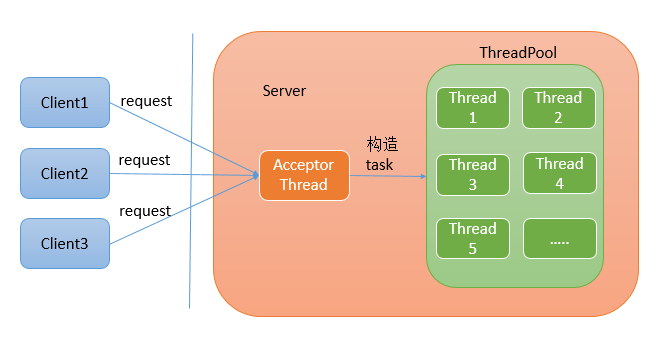

### 2. NIO Buffer

- **在 NIO 网络编程中，通道直接从 ByteBuffer 中读取数据**


#### 1. 基础

- **容量(Capacity)**： 缓冲区能够容纳的数据元素的最大数量，在缓冲区创建时被设定，且不能被改变

- **上界(Limit)**： 缓冲区的第一个不能被读或写的元素或缓冲区中现存元素的计数

- **位置(Position)**： 下一个要被读或写的元素的索引

  > Buffer 类提供了 get() 和 put() 函数来读取或存入数据，position 位置会自动进行相应的更新

- **标记(Mark)**： 备忘位置，标记在设定前未定义(undefined)

  - 调用 mark() 设定 mark = postion
  - 调用 reset( ) 设定 position = mark

#### 2. 缓冲区 API

- **分配(allocate)**： 创建一个缓冲区对象并分配一个私有空间来储存容量大小的数据元素

- **包装(wrap)**： 创建一个缓冲区对象但不分配任何空间来储存数据元素，但使用提供的数组作为存储空间来储存缓冲区中的数据元素

```java
public abstract class ByteBuffer {
    //缓冲区创建相关api
    public static ByteBuffer allocateDirect(int capacity)
    public static ByteBuffer allocate(int capacity)
    public static ByteBuffer wrap(byte[] array)
    public static ByteBuffer wrap(byte[] array,int offset, int length)
    //缓存区存取相关API
    public abstract byte get( );//从当前位置position上get，get之后，position会自动+1
    public abstract byte get (int index);//从绝对位置get
    public abstract ByteBuffer put (byte[] b);//从当前位置上普通，put之后，position会自动+1
    public abstract ByteBuffer put (int index, byte b);//从绝对位置上put
}
```

- **缓冲区创建**： 

  ```java
  //方式1：allocate方式直接分配，内部将隐含的创建一个数组
  ByteBuffer allocate = ByteBuffer.allocate(10);
  //方式2：通过wrap根据一个已有的数组创建
  byte[] bytes = new byte[10];
  ByteBuffer wrap = ByteBuffer.wrap(bytes);
  //方式3：通过wrap根据一个已有的数组指定区间创建
  ByteBuffer wrapoffset = ByteBuffer.wrap(bytes,2,5);
  ```

- **缓冲区的存取**： 

  ```java
  ByteBuffer buffer = ByteBuffer.allocate(10);
  buffer.put("Hello".getBytes());//放入
  //将 M 放到绝对位置 0 处，将 W 放到相对位置（不受前面绝对值 0 的影响）
  buffer.put(0,"M".getBytes()).put("W".getBytes());
  ```

  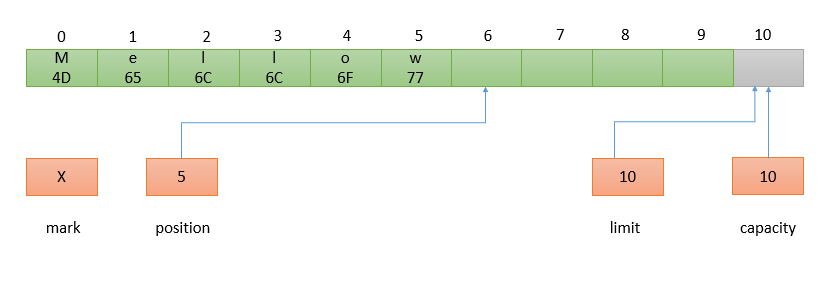

- **翻转 flip() 函数**： 将一个能够继续添加数据元素的填充状态的缓冲区翻转成一个准备读出元素的释放状态

  

- **rewind() 函数**： 与 flip() 相似，但不影响上界属性，即只是将位置值设回 0

  > 可以使用 rewind()后退，重读已经被翻转的缓冲区中的数据

  - **hasRemaining()**： 会在释放缓冲区时，告知是否已经达到缓冲区的上界

    ```java
    for (int i = 0; buffer.hasRemaining(), i++) {
          myByteArray [i] = buffer.get();
    }
    ```

  - **remaining()**：将告知从当前位置到上界还剩余的元素数目

    ```java
    int count = buffer.remaining();
    for (int i = 0; i < count; i++) {
        myByteArray [i] = buffer.get();
    }
    ```

  通过以下方式直接读取当前 buffer 中的所有元素：

  ```java
  buffer.flip();
  int count = buffer.remaining( );
  byte[] content = new  byte[count];//构造一个与剩余可读元素大小相同的数组
  buffer.get(content);
  System.out.println(new String(content));
  ```

- **清空 clear() 函数**： 让缓冲区恢复到初始状态，但不改变缓冲区中的任何数据元素，而仅仅将上界设为容量的值，并把位置设回 0，即position=0，limit=capacity，mark=-1

- **标记 mark() 函数与 reset() 函数**： mark 使缓冲区记住 position 并返回

  - 缓冲区的标记在 mark() 函数被调用之前未定义，值为 -1，调用时 mark 被设为当前 position 的值
  - reset() 函数将 position 设为当前的 mark 值，若 mark 未定义，将导致 InvalidMarkException 异常

  执行 `buffer.position(2).mark().position(4);` 的结果：

  

  执行 `reset()` 后的结果： 

  

- **压缩(compact)**： 丢弃已经释放的数据，保留未释放的数据，并使缓冲区对重新填充容量准备就绪

  原始状态： 

   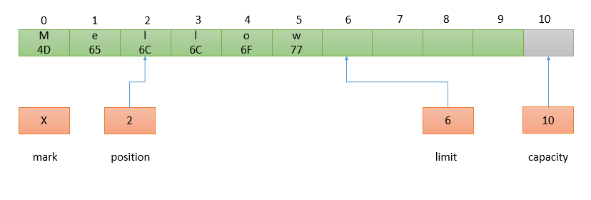

  调用 `compact()` 后的状态： 数据元素 2-5 被复制到 0-3 位置

  

- **复制缓冲区 duplicate() 函数**： 

  - **完全复制**：调用 `duplicate()` 函数或 `asReadOnlyBuffer()` 函数

  - **部分复制**：调用 `slice()` 函数

  `duplicate()` 函数执行流程： 

  - duplicate() 函数创建副本缓冲区，两个缓冲区共享数据元素，拥有同样的容量，但每个缓冲区拥有各自的位置，上界和标记属性
  - 对一个缓冲区内的数据元素所做的改变会反映在另外一个缓冲区上
  - 副本缓冲区具有与原始缓冲区同样的数据视图，如果原始的缓冲区为只读，或为直接缓冲区，副本缓冲区将继承这些属性

  ```java
  CharBuffer buffer = CharBuffer.allocate (8);
  buffer.position (3).limit (6).mark( ).position (5);
  CharBuffer dupeBuffer = buffer.duplicate( );
  buffer.clear( );
  ```

  - 可以使用 `asReadOnlyBuffer()` 函数来生成一个只读的缓冲区视图，与 duplicate() 相同，但只读

#### 3. 直接缓冲区

- **直接字节缓冲区**： `ByteBuffer.allocateDirect()` 

  > **Netty 零拷贝**： 指计算机在网络上发送文件时，不需要将文件内容拷贝到用户空间而直接在内核空间中传输到网络，即使用了直接缓冲区

  - 支持 JVM 可用的最高效 I/O 机制

  - 使用的内存通过调用本地操作系统方面的代码分配，绕过标准 JVM 堆栈

    > 建立和销毁直接缓冲区会明显比具有堆栈的缓冲区更加破费，这取决于主操作系统以及 JVM 实现

  - 直接缓冲区的内存区域不受无用存储单元收集支配，因为它们位于标准 JVM 堆栈之外

- **非直接字节缓冲区**： 

  - 可以被传递给通道，但会导致性能损耗
  - 不能成为一个本地 I/O 操作的目标

  如果向通道中传递非直接 ByteBuffer 对象用于写入，通道会在每次调用中隐含地进行下面的操作：

  - 创建一个临时的直接 ByteBuffer 对象

  - 将非直接缓冲区的内容复制到临时缓冲中

  - 使用临时缓冲区执行低层次 I/O 操作

  - 临时缓冲区对象离开作用域，并最终成为被回收的无用数据

- **直接内存的回收**： DirectByteBuffer位于堆内存中的，但直接内存不在 GC 范围内，无法自动回收

  > JDK 提供一种机制，可以为堆内存对象注册一个钩子函数，当堆内存对象被 GC 回收时，回调 run 方法，并执行释放 DirectByteBuffer 引用的直接内存，即在 run 方法中调用 Unsafe 的 freeMemory 方法

  ```java
  class DirectByteBuffer extends MappedByteBuffer  implements DirectBuffer{
      //构造方法
      DirectByteBuffer(int cap) {                   
          super(-1, 0, cap, cap);
          boolean pa = VM.isDirectMemoryPageAligned();
          int ps = Bits.pageSize();
          //对申请的直接内存大小，进行重新计算
          long size = Math.max(1L, (long)cap + (pa ? ps : 0));
          Bits.reserveMemory(size, cap);
          long base = 0;
          try {
              //分配直接内存，base表示的是直接内存的开始地址
              base = unsafe.allocateMemory(size); 
          } catch (OutOfMemoryError x) {
              Bits.unreserveMemory(size, cap);
              throw x;
          }
          unsafe.setMemory(base, size, (byte) 0);
          if (pa && (base % ps != 0)) {
              // Round up to page boundary
              address = base + ps - (base & (ps - 1));
          } else {
              address = base;
          }
          //注册钩子函数，释放直接内存
          cleaner = Cleaner.create(this, new Deallocator(base, size, cap));
          att = null;
      }
  }
  ```

#### 4. 内存映射缓冲区

- 映射缓冲区是带有存储在文件，通过内存映射来存取数据元素的字节缓冲区
- 映射缓冲区通常直接存取内存，通过 FileChannel 类创建
- MappedByteBuffer 对象可以处理独立于文件存取形式的的许多特定字符

> MappedByteBuffer 在大文件处理方面性能比较高，文件存储服务器可以考虑使用 MappedByteBuffer

### 3. Channel

#### 1. 简介


- Socket 通道有可以直接创建新 socket 通道的工厂方法
- FileChannel 对象不能直接创建一个 FileChannel 对象，只能通过在一个打开的 RandomAccessFile、 FileInputStream 或 FileOutputStream对象上调用 getChannel( )方法来获取

```java
SocketChannel sc = SocketChannel.open();
sc.connect(new InetSocketAddress ("somehost", someport));
 
ServerSocketChannel ssc = ServerSocketChannel.open();
ssc.socket().bind(new InetSocketAddress(somelocalport));
 
DatagramChannel dc = DatagramChannel.open();
 
RandomAccessFile raf = new RandomAccessFile("somefile", "r");
FileChannel fc = raf.getChannel();
```

#### 2. socket 通道

**通道区别**： 

- DatagramChannel 和 SocketChannel 实现定义读和写功能的接口
- ServerSocketChannel 负责监听传入的连接和创建新的 SocketChannel 对象，它本身从不传输数据

**通道的获取**： 

- socket 通道类在被实例化时都会创建一个对等的 BIO socket 对象

- socket 通道类都定义了 socket() 方法获取其关联的 socket 对象
- socket 通道类都定义了 getChannel() 方法获取对应的通道

**通道设为非阻塞模式**： `configureBlocking(boolean)`

- 传递参数值为 true 设为阻塞模式，参数值为 false 值设为非阻塞模式
- `isBlocking()`： 判断某个 socket 通道当前处于哪种模式

- `blockingLock()`：返回一个非透明的对象引用

  - 返回的对象是通道实现修改阻塞模式时内部使用的
  - 只有拥有此对象的锁的线程才能更改通道的阻塞模式

  ```java
  Socket socket = null;
  Object lockObj = serverChannel.blockingLock();
  // 执行关键代码部分的时候，使用这个锁进行同步
  synchronize(lockObj){
  	// 一旦进入这个部分，锁就被获取到了，其他线程不能改变这个channel的阻塞模式
  	boolean prevState = serverChannel.isBlocking();
  	serverChannel.configureBlocking(false);
  	socket = serverChannel.accept();
  	serverChannel.configureBlocking(prevState);
  }
  // 释放锁，此时其他线程可以修改channel的阻塞模式
  if (socket != null) {
  	doSomethingWithTheSocket(socket);
  }
  ```

通道实例：

- `ServerSocketChannel`

  ```java
  ServerSocketChannel ssc = ServerSocketChannel.open();
  ServerSocket serverSocket = ssc.socket();
  // Listen on port 1234
  serverSocket.bind(new InetSocketAddress (1234));
  ```

- `SocketChannel`

  ```java
  //通过open方法
  SocketChannel socketChannel = 
      SocketChannel.open(new InetSocketAddress ("somehost", somePort));
   
  //通过connect方法
  SocketChannel socketChannel = SocketChannel.open();
  socketChannel.connect(new InetSocketAddress ("somehost", somePort));
  ```

**Channel 案例**：

```java
public class TimeServer {
    private  BlockingQueue<SocketChannel> idleQueue =
        new LinkedBlockingQueue<SocketChannel>();
    private  BlockingQueue<Future<SocketChannel>> workingQueue=
        new LinkedBlockingQueue<Future<SocketChannel>>();
    private  ExecutorService executor = Executors.newSingleThreadExecutor();
     {
        new Thread(){
            @Override
            public void run() {
            try {
               while (true) {
                   //task1：迭代当前idleQueue中的SocketChannel
                   //提交到线程池中执行任务，并将其移到workingQueue中
                        for (int i = 0; i < idleQueue.size(); i++) {
                            SocketChannel socketChannel = idleQueue.poll();
                            if (socketChannel != null) {
                                Future<SocketChannel> result = executor.submit(new TimeServerHandleTask(socketChannel), socketChannel);
                                workingQueue.put(result);
                            }
                        }
                        //task2：迭代当前workingQueue中的SocketChannel
                        //如果任务执行完成，将其移到idleQueue中
                        for (int i = 0; i < workingQueue.size(); i++) {
                            Future<SocketChannel> future = workingQueue.poll();
                            if (!future.isDone()){
                                workingQueue.put(future);
                                continue;
                            }
                            SocketChannel channel  = null;
                            try {
                                channel = future.get();
                                idleQueue.put(channel);
                            } catch (ExecutionException e) {
                                //如果future.get()抛出异常，关闭SocketChannel，
                                //不再放回idleQueue
                                channel.close();
                                e.printStackTrace();
                            }
                        }
                    }
            } catch (Exception e) {
               e.printStackTrace();
            }
            }
        }.start();
    }
    public static void main(String[] args) throws Exception{
        TimeServer timeServer = new TimeServer();
        ServerSocketChannel ssc = ServerSocketChannel.open();
        ssc.configureBlocking(false);
        ssc.socket().bind(new InetSocketAddress(8080));
        while (true){
            SocketChannel socketChannel = ssc.accept();
            if(socketChannel==null){
                continue;
            }else{
                socketChannel.configureBlocking(false);
                timeServer.idleQueue.add(socketChannel);
            }
        }
    }
}
 
public class TimeServerHandleTask implements Runnable {
    SocketChannel socketChannel;
    ExecutorService executorService;
    ByteBuffer byteBuffer = ByteBuffer.allocateDirect(1024);
 
    public TimeServerHandleTask(SocketChannel socketChannel, 
                                ExecutorService executorService) {
        this.socketChannel = socketChannel;
        this.executorService = executorService;
    }
 
    @Override
    public void run() {
            try {
                if(socketChannel.read(byteBuffer)>0){
                    while (true){
                        byteBuffer.flip();
                        if(byteBuffer.remaining() < "GET CURRENT TIME".length()){
                            byteBuffer.compact();
                            socketChannel.read(byteBuffer);
                            continue;
                        }
                        byte[] request=new byte[byteBuffer.remaining()];
                        byteBuffer.get(request);
                        String requestStr = new String(request);
                        byteBuffer.clear();
                        if (!"GET CURRENT TIME".equals(requestStr)) {
                            socketChannel.write(byteBuffer
                                                .put("BAD_REQUEST".getBytes()));
                        } else {
                            ByteBuffer byteBuffer = 
                                this.byteBuffer.put(Calendar.getInstance()
                                           .getTime().toLocaleString().getBytes());
                            byteBuffer.flip();
                            socketChannel.write(byteBuffer);
                        }
                       
                    }
                }
                        TimeServerHandleTask currentTask = 
                           new TimeServerHandleTask(socketChannel, executorService);
                        executorService.submit(currentTask);
            } catch (Exception e) {
                e.printStackTrace();
            }
    }
}

public class TimeServerHandleTask implements Runnable {
   SocketChannel socketChannel;
   public TimeServerHandleTask(SocketChannel socketChannel) {
      this.socketChannel = socketChannel;
   }
   @Override
   public void run() {
      try {
         ByteBuffer requestBuffer = ByteBuffer
             			.allocate("GET CURRENT TIME".length());
         //尝试读取数据，因为是非阻塞，所以如果没有数据会立即返回。
         int bytesRead = socketChannel.read(requestBuffer);
        //如果没有读取到数据，说明当前SocketChannel并没有发送请求，不需要处理
         if (bytesRead <= 0) {
            return;
         }
         //如果读取到了数据，则需要考虑粘包、解包问题，这个while代码是为了读取一个完整的请求信息"GET CURRENT TIME"，
         while (requestBuffer.hasRemaining()) {
            socketChannel.read(requestBuffer);
         }
         String requestStr = new String(requestBuffer.array());
         if (!"GET CURRENT TIME".equals(requestStr)) {
            String bad_request = "BAD_REQUEST";
            ByteBuffer responseBuffer = ByteBuffer.allocate(bad_request.length());
                responseBuffer.put(bad_request.getBytes());
                responseBuffer.flip();
                socketChannel.write(responseBuffer);
         } else {
                String timeStr = Calendar.getInstance().getTime().toLocaleString();
                ByteBuffer responseBuffer = ByteBuffer.allocate(timeStr.length());
                responseBuffer.put(timeStr.getBytes());
                responseBuffer.flip();
            socketChannel.write(responseBuffer);
         }
      } catch (Exception e) {
         throw new RuntimeException(e);
      }
   }
}

public class TimeClient {
    //连接超时时间
    static int connectTimeOut=3000;
    static ByteBuffer buffer=ByteBuffer.allocateDirect(1024);
    public static void main(String[] args) throws Exception{
        SocketChannel socketChannel = 
            SocketChannel.open(new InetSocketAddress(8080));
        socketChannel.configureBlocking(false);
        long start=System.currentTimeMillis();
        while (!socketChannel.finishConnect()){
            if (System.currentTimeMillis()-start>=connectTimeOut){
                throw new RuntimeException("尝试建立连接超过3秒");
            }
        }
        //如果走到这一步，说明连接建立成功
        while (true){
            buffer.put("GET CURRENT TIME".getBytes());
            buffer.flip();
            socketChannel.write(buffer);
            buffer.clear();
            if(socketChannel.read(buffer)>0){
                buffer.flip();
                byte[] response=new byte[buffer.remaining()];
                buffer.get(response);
                System.out.println("reveive response:"+new String(response));
                buffer.clear();
            }
            Thread.sleep(5000);
        }
    }
}
```

### 4. selector

- `ServerSocketChannel`：只会在选择器上注册一个，操作是ACCEPT，表示其只关心客户端的连接请求

- `SocketChannel`：通常会注册多个，操作是 CONNECT、READ、WRITE

  > 因为其要于 server 建立连接，也需要进行读、写数据

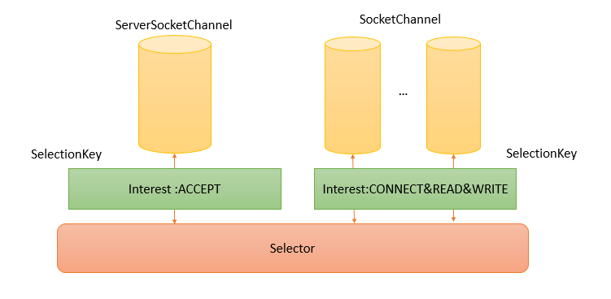

- 调用 Selector 对象的 select() 方法时，相关的 SelectionKey 会被更新，用来检查所有被注册到该选择器的通道是否已经准备就绪

#### 1. 创建

```java
//方式一：
Selector selector = Selector.open( );
 
//方式二：
SelectorProvider provider = SelectorProvider.provider();
Selector abstractSelector = provider.openSelector();
```

#### 2. 注册

```java
ServerSocketChannel ssc = ServerSocketChannel.open();
ssc.socket().bind(new InetSocketAddress("localhost",80));
ssc.configureBlocking(false);//必须先设置为非阻塞模式
Selector selector = Selector.open();
SelectionKey sscSelectionKey = ssc.register(selector, SelectionKey.OP_ACCEPT);//注册
while(true){
    SocketChannel sc = ssc.accept();
    if(sc == null){
        continue;
    }
    sc.configureBlocking(false);
    //注册SocketChannel
    SelectionKey scselectionKey = 
        sc.register(selector, SelectionKey.OP_ACCEPT | SelectionKey.OP_WRITE);
}
```

#### 3. 选择键

- SelectionKey 对象被 register() 方法返回，并提供方法来表示这种注册关系

- `public abstract int interestOps()`：获取通道中的所有操作
- `public abstract int readyOps()`： 获取相关的通道的已经就绪的操作

#### 4. 使用

```java
public abstract class Selector{
	public abstract Set keys();
	public abstract Set selectedKeys();
	public abstract int select() throws IOException;
	public abstract int select(long timeout) throws IOException;
	public abstract int selectNow() throws IOException;
	public abstract void wakeup();
}
```

**Selector 对象维护三个键的集合**：

- **已注册的键的集合**： 通过 `keys()` 方法返回，与选择器关联的已经注册的键的集合

- **已选择的键的集合**： 通过 `selectedKeys()` 方法返回

- **已取消的键的集合**： 包含 `cancel()` 方法被调用过的键，但还没有被注销

```java
public abstract class AbstractSelector extends Selector{
    //取消的keys
	private final Set<SelectionKey> cancelledKeys = new HashSet<SelectionKey>();
}
 
public abstract class SelectorImpl extends AbstractSelector {
    protected Set<SelectionKey> selectedKeys = new HashSet();//选择的key
    protected HashSet<SelectionKey> keys = new HashSet();//注册的keys
}
```

**Selector 类的 select() 方法的三种不同形式**：

- `select()`： 返回值是已经确定就绪的通道数目
  - 在没有通道就绪时将无限阻塞
  - 有一个已注册的通道就绪，选择器的选择键就会被更新，且每个就绪的通道的 ready 集合也将被更新
- `select(long timeout)`： 
  - 限制线程等待通道就绪的时间
  - 若在超时时间内没有通道就绪，将返回 0
  - 参数为 0 表示将无限期等待，等同于无参数版本的 select()
- `selectNow()`：执行就绪检查过程，但不阻塞。如果当前没有通道就绪，立即返回 0

**Selector 的执行步骤**： 

- 已取消键的集合将会被检查，如果非空，每个已取消键的集合中的键将从另外两个集合中移除，并且相关的通道将被注销。步骤结束后，已取消键的集合将为空

- 已注册键的集合中键的 interest 集合将被检查，对 interest 集合的改动不会影响剩余的检查过程

  - 就绪条件确定后，底层操作系统将会进行查询，以确定每个通道所关心操作的真实就绪状态

  - 如果没有通道已经准备好，线程会阻塞一个超时值

    已经准备好 interest 集合中的一种操作的通道，将执行以下两种操作中的一种：
    - 如果通道的键还没有处于已选择的键的集合中，那么键的 ready 集合将被清空，然后表示操作系统发现的当前通道已经准备好的操作的比特掩码将被设置

    - 如果通道的键在已选择的键的集合中，键的 ready 集合将被表示操作系统发现的当前已经准备好的操作的比特掩码更新。所有之前的已经不再是就绪状态的操作不会被清除。事实上，所有的比特位都不会被清理

> 使用内部的已取消的键的集合来延迟注销，是一种防止线程在取消键时阻塞，并防止与正在进行的选择操作冲突的优化

**唤醒在 select()方法中睡眠的线程**：使线程从被阻塞的 select() 方法中退出

- `wakeup()`：
  - 使选择器上的第一个还没有返回的选择操作立即返回
  - 如果当前没有在进行中的选择，那么下一次对 select() 方法的调用将立即返回，后续选择操作将正常进行

- `close()`：任何一个在选择操作中阻塞的线程都将被唤醒，与选择器相关的通道将被注销， 而键将被取消

- `interrupt()`： 线程的返回状态将被设置

## 2. netty

### 1. netty Channel

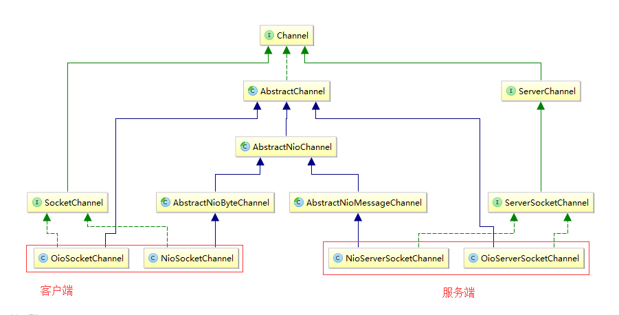

#### 1. ChannelConfig

Netty 中，每种 Channel 都有对应的配置，用 `ChannelConfig` 接口来表示

每个特定的 Channel 实现类都有自己对应的 ChannelConfig 实现类：

- `NioSocketChannel` 的对应的配置类为 `NioSocketChannelConfig`

- `NioServerSocketChannel` 的对应的配置类为 `NioServerSocketChannelConfig` 


- 在 Channel 接口中定义的 `config()` 方法，用于获取特定通道实现的配置，子类需要实现这个接口

- ChannelOption 类： 定义了 ChannelConfig 支持的所有参数类型

  > 可以认为 ChannelConfig 中用了一个Map来保存参数，Map的key是ChannelOption
  >
  > ChannelConfig 定义了相关方法来获取和修改Map中的值
  >
  > ```java
  > public interface ChannelConfig {
  >     Map<ChannelOption<?>, Object> getOptions();//获取所有参数
  >     boolean setOptions(Map<ChannelOption<?>, ?> options);//替换所有参数
  >     <T> T getOption(ChannelOption<T> option);//获取以某个ChannelOption为key的参数
  >     //替换某个ChannelOption为key的参数值
  >     <T> boolean setOption(ChannelOption<T> option, T value);
  > }
  > ```

**ChannelOption 详解**： 

- `ChannelOption.SO_KEEPALIVE --> StandardSocketOptions.SO_KEEPALIVE`： 是否启用心跳机制，默认false

  > - 该心跳机制只是操作系统底层使用的一个被动机制，原理上不应该被上层应用层使用
  >
  > - 当系统关闭一个由 KEEPALIVE 机制检查出来的死连接时，是不会主动通知上层应用的，只有在调用相应的 IO 操作在返回值中检查出来
  >
  > - SO_KEEPALIVE 保持连接检测对方主机是否崩溃，避免（服务器）永远阻塞于TCP连接的输入
  >
  > 若 2 小时内在此套接口的任一方向都没有数据交换，TCP 就自动给对方发一个保持存活探测分节：
  >
  > - 对方接收一切正常：以期望的 ACK 响应，2小时后，TCP将发出另一个探测分节
  > - 对方已崩溃且已重新启动：以 RST 响应，套接口的待处理错误被置为 ECONNRESET，套接口本身则被关闭
  > - 对方无任何响应：源自 berkeley 的 TCP 发送另外 8 个探测分节，相隔 75 秒一个，试图得到响应

- `ChannelOption.SO_REUSEADDR --> StandardSocketOptions.SO_REUSEADDR`： 重用处于 TIME_WAIT 状态的地址，默认 false

- `ChannelOption.SO_LINGER --> StandardSocketOptions.SO_LINGER`： 关闭套接字

  > 调用 closesocket 关闭套接字时，SO_LINGER 将决定系统如何处理残存在套接字发送队列中的数据
  >
  > - 丢弃或将数据继续发送至对端，优雅关闭连接
  >
  > SO_LINGER 以秒为单位，最大取值为 65535，即指定时间内残余数据尚未发送完成，也关闭

- `ChannelOption.SO_SNDBUF --> StandardSocketOptions.SO_SNDBUF`： 发送缓冲区的大小，默认 8K

- `ChannelOption.SO_RCVBUF --> StandardSocketOptions.SO_RCVBUF`： 接收缓冲区大小，默认 8K

- `ChannelOption.TCP_NODELAY --> StandardSocketOptions.TCP_NODELAY`： 是否一有数据就马上发送

  > **Nagle 算法目的**： 尽可能发送大块数据，避免网络中充斥着许多小数据块
  >
  > - 如果要求高实时性，有数据发送时就马上发送，就将该选项设置为 true 关闭 Nagle 算法
  > - 如果要减少发送次数减少网络交互，就设置为 false 等累积一定大小后再发送，默认为 false

- `ChannelOption.IP_TOS --> StandardSocketOptions.IP_TOS`

- `ChannelOption#SO_BACKLOG`： 用于构造服务端套接字 ServerSocket 对象，标识当服务器请求处理线程全满时，用于临时存放已完成三次握手的请求的队列的最大长度

  > 如果未设置或设置的值小于1，Java 将使用默认值 50
  >
  > Netty 中默认读取文件 /proc/sys/net/core/somaxconn 的值，如果没有读到，默认取值为 3072

#### 2. ChannelHander

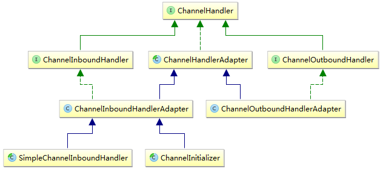

- **ChannelPipeline**： Netty 通过 `ChannelPipeline` 来保证 ChannelHandler 的处理顺序，每个 Channel 对象创建时，都会自动创建一个关联的 ChannelPipeline 对象

  > 通过 io.netty.channel.Channel 对象的 `pipeline()`方法获取该对象实例

- **ChannelHandlerContext**： ChannelHandler 先封装成`ChannelHandlerContext`，再封装进ChannelPipeline 中

  > 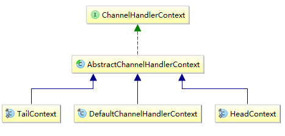
  >
  > 

### 2. netty 线程模型

#### 1. 基本并发编程模型

- **串行工作者模型**： 

  > 

- **并行工作者模型：**： 一个 accpet thread，多个 worker thread

  - 并行工作者线程模型设计方式一：**基于公共任务队列**，如： `ThreadPoolExecutor `

    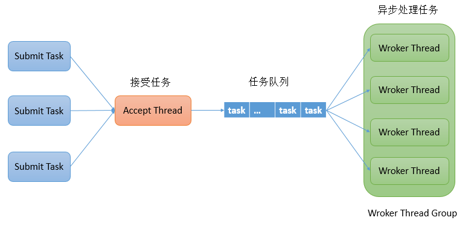

  - 并行工作者线程模型设计方式二：**每个worker thread维护自己的任务队列**，如： Reactor

    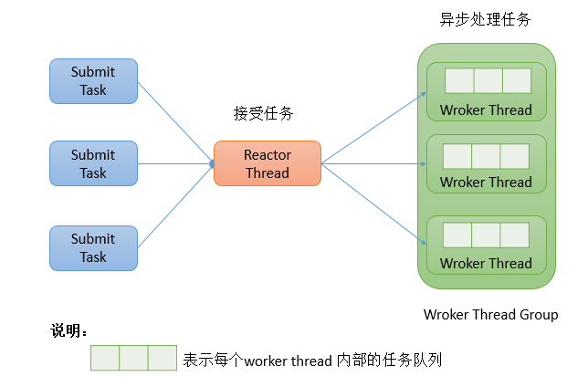

#### 2. Reactor 线程模型

**reactor 线程模型**：任务接受后，对处理过程继续进行切分，划分为多个不同的步骤，每个步骤用不同的线程来处理，即原本由一个线程处理的任务现在由多个线程来处理，每个线程在处理完自己的步骤之后，还需要将任务转发到线程继续进行处理

- **单线程 reactor 线程模型**： 以比较耗时的操作为切分点

  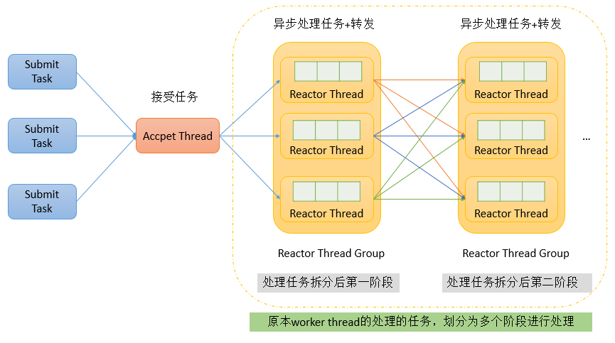

- **多线程 reactor 线程模型**： 有多个accpet线程

  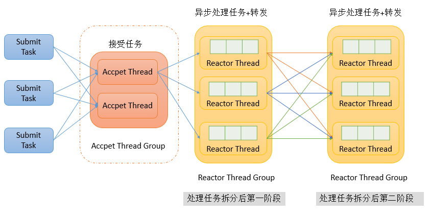

- **混合型 reactor 线程模型**： 

  - 将任务处理切分成多个阶段进行，每个阶段处理完自己的部分之后，转发到下一个阶段进行处理

    > 不同的阶段之间的执行是异步的，可以认为每个阶段都有一个独立的线程池

  - 不同类型的任务，有着不同的处理流程，划分时需要划分成不同的阶段

  

#### 3. Netty 中的 Reactor 线程模型

```java
EventLoopGroup bossGroup = new NioEventLoopGroup(1); //parentGroup
EventLoopGroup workerGroup = new NioEventLoopGroup(3); //childGroup
ServerBootstrap b = new ServerBootstrap(); 
b.group(bossGroup, workerGroup)
        .channel(NioServerSocketChannel.class)
		.handler(new LoggingHandler(LogLevel.INFO))
        .option(ChannelOption.SO_BACKLOG, 128)
      	.attr(AttributeKey.valueOf("ssc.key"),"scc.value")
        .childHandler(new ChannelInitializer<SocketChannel>() {
            @Override
            public void initChannel(SocketChannel ch) throws Exception {
                ch.pipeline().addLast(new DiscardServerHandler());
            }
        }) 
        .childOption(ChannelOption.SO_KEEPALIVE, true); 
        .childAttr(AttributeKey.valueOf("sc.key"),"sc.value")
        .bind(port);
```


- `group()`： 设置执行任务的线程池

- `channel()`： 用于构造通道的工厂类 ChannelFactory 实例，在之后需要创建通道实例

  > 通过调用 `ChannelFactory.newChannel()` 方法来创建

- `handler --> childHandler`：分别用于设置 NioServerSocketChannel和NioSocketChannel 的处理器链，即当有一个 NIO 事件时，应该按照怎样的步骤进行处理
- `option --> childOption`：分别用于设置 NioServerSocketChannel和 NioSocketChannel 的 TCP 连接参数，在 ChannelOption 类中可以看到 Netty 支持的所有 TCP 连接参数
- `attr --> childAttr`：用于给 channel 设置一个 key/value，之后可以根据 key 获取

- `bind()`： 调用bind方法，相当于启动服务端

  > 调用过程： `doBind() --> initAndRegister()`
  >
  > **doBind 方法**： 
  >
  > - 创建 NioServerSocketChannel 实例，通过之前创建的 ChannelFactory 实例的 newChannel 完成
  >
  > - 初始化 NioServerSocketChannel，即将通过 handler，option，attr 等方法设置的参数应用到NioServerSocketChannel 
  >
  >   > ServerBootStrap 的 `init()` 方法会在 NioServerSocketChannel 处理器链的最后添加一个默认的处理器 ServerBootstrapAcceptor
  >   >
  >   > - ServerBootstrapAcceptor 是客户端连接请求的处理器，当接受到一个客户端请求后，Netty 将创建一个代表客户端的 NioSocketChannel 对象
  >
  > - 将 NioServerSocketChannel 注册到 parentGroup 中，parentGroup 会选择一个 NioEventLoop 来运行该 NioServerSocketChannel 要完成的功能，即监听客户端的连接
  >
  >   > ServerBootStrap 通过调用 register 方法将 NioServerSocketChannel 注册到 parentGroup 中

#### 4. ServerBootStrap 启动流程


## 3. TCP粘包、拆包与通信协议

### 1. 简介

> TCP 无消息保护边界，需要在消息接收端处理消息边界问题，即粘包、拆包问题；而 UDP 通信则不需要


假设客户端发送两个数据包 D1和D2 给服务端，由于服务端一次读取字节数不确定，故存在以下四种情况：

- 服务端分两次读取到了两个独立的数据包，分别是 D1和D2，没有粘包和拆包
- 服务端一次接受到了两个数据包，D1和D2 粘合在一起，称之为 **TCP 粘包**
- 服务端分两次读取数据包，第一次读取到了完整的D1包和D2包的部分内容，第二次读取到了D2包的剩余内容，称之为**TCP 拆包**
- 服务端分两次读取数据包，第一次读取到了D1包的部分内容D1_1，第二次读取到了D1包的剩余部分内容D1_2和完整的D2包

> 注意： 如果 TCP 的接受滑窗非常小，而数据包 D1和D2 比较大，很有可能会发生第五种情况，即服务端分多次才能将D1和D2包完全接受，期间发生多次拆包

### 2. 原因

#### 1. socket 缓冲区与滑动窗口

每个 TCP socket 在内核中都有一个发送缓冲区(SO_SNDBUF )和一个接收缓冲区(SO_RCVBUF)

> TCP 的全双工的工作模式以及 TCP 的滑动窗口便是依赖于这两个独立的buffer以及此buffer的填充状态
>
> SO_SNDBUF 和 SO_RCVBUF 在windows操作系统中默认情况下都是 8K

- `SO_SNDBUF`：进程发送数据时，将数据拷贝进 socket 的内核发送缓冲区中，然后 send 便会在上层返回

  > send 返回时，数据不一定会发送到对端去
  >
  > send 仅仅是把应用层 buffer 的数据拷贝进 socke t的内核发送 buffer 中

- `SO_RCVBUF`： 把接受到的数据缓存入内核，应用进程一直没有调用 read 进行读取的话，此数据会一直缓存在相应socket的接收缓冲区内

  > read 的工作，就是把内核缓冲区中的数据拷贝到应用层用户的buffer里面

- **滑动窗口**： TCP 链接在三次握手时，会将自己的窗口大小(window size)发送给对方，即 SO_RCVBUF 指

  > 之后在发送数据时，发送方要先确认接收方的窗口没有被填充满，如果没有填满，则可以发送

**缓冲区和滑动窗口造成粘包、拆包**： 

- **粘包：**由于数据处理不及时，接收方的 SO_RCVBUF 缓存多个报文

- **拆包：** 假设接收方的 window size 只剩 128，则发送方还可以发送 128 字节，而由于发送方的数据大小是256字节，因此只能发送前 128 字节，等到接收方ack后，才能发送剩余字节

#### 2. MSS/MTU 限制

- `MSS(Maximum Segement Size)`： 表示 TCP 报文中 data 部分的最大长度

  > 是 TCP 协议在 OSI 五层网络模型中传输层对一次可以发送的最大数据的限制

- `MTU(Maxitum Transmission Unit)`： 是OSI五层网络模型中链路层对一次可以发送的最大数据的限制

当需要传输的数据大于MSS或者MTU时，数据会被拆分成多个包进行传输


- 应用层只关心发送的数据 DATA，将数据写入socket在内核中的缓冲区SO_SNDBUF即返回，操作系统会将SO_SNDBUF中的数据取出来进行发送
- 传输层会在DATA前面加上TCP Header,构成一个完整的TCP报文
- 当数据到达网络层(network layer)时，网络层会在TCP报文的基础上再添加一个IP Header，也就是将自己的网络地址加入到报文中
- 到数据链路层时，还会加上Datalink Header和CRC
- 当到达物理层时，会将SMAC(Source Machine，数据发送方的MAC地址)，DMAC(Destination Machine，数据接受方的MAC地址 )和Type域加入

#### 3. Nagle 算法

- Nagle算法为了尽可能发送大块数据，避免网络中充斥着许多小数据块

  > Nagle算法的基本定义是任意时刻，最多只能有一个未被确认的小段
  >
  > - 小段： 指是小于MSS尺寸的数据块
  > - 未被确认： 指一个数据块发送出去后，没有收到对方发送的 ACK 确认该数据已收到

**Nagle算法的规则：**

- 如果 SO_SNDBUF 中的数据长度达到 MSS，则允许发送

- 如果 SO_SNDBUF 中含有 FIN，表示请求关闭连接，则先将 SO_SNDBUF 中的剩余数据发送，再关闭

- 设置 `TCP_NODELAY=true` 选项，则允许发送

  > TCP_NODELAY 是取消TCP的确认延迟机制，相当于禁用 Negale 算法
  >
  > - 正常情况下，Server 端收到数据后，会将 ACK 的发送延迟一段时间，和应答数据一起发送，就像是应答数据捎带着ACK过去
  >
  > - TCP 连接的延迟确认时间一般初始化为最小值 40ms，随后根据连接的重传超时时间（RTO）、上次收到数据包与本次接收数据包的时间间隔等参数进行不断调整
  >
  >   > 可以通过设置 TCP_QUICKACK 选项来取消确认延迟

- 未设置 TCP_CORK 选项时，若所有发出去的小数据包均被确认，则允许发送

- 上述条件都未满足，但发生了超时（一般为200ms），则立即发送

### 3. 解决方案：定义通信协议

- 协议的作用： 定义传输数据的格式

  > 在接受到数据时：
  >
  > - 如果粘包，可以根据这个格式来区分不同的包
  > - 如果拆包，就等待数据可以构成一个完整的消息来处理

主流协议方案： 

- **定长协议**： 规定每几个字节，表示一个有效报文

- **特殊字符分隔符协议**： 在包尾部增加回车或空格符等特殊字符进行分割 

- **长度编码**： 将消息分为消息头和消息体，消息头中用一个 int 型数据(4字节)，表示消息体长度的字段

  > 在解析时： 
  >
  > - 先读取内容长度 Length，其值为实际消息体内容占用的字节数
  > - 之后读取到这么多字节的内容，才认为是一个完整的数据报文

## 4. Netty 编解码框架

- **编码**： 发送方将发送的二进制数据转换成协议规定格式的二进制数据流，由编码器(encoder)完成

- **解码**： 接收方根据协议格式，对二进制数据进行解析，由解码器(decoder)完成

- **编解码**： 既能编码，又能解码

### 1. 协议

- 公有协议： 指业界普遍遵循的通信协议
- 私有协议

### 2. 解码器

对于解码器，Netty 提供了抽象基类`ByteToMessageDecoder`和`MessageToMessageDecoder` 

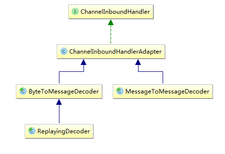

- `ByteToMessageDecoder`： 用于将接收到的二进制数据(Byte)解码，得到完整的请求报文

  > - ByteToMessageDecoder 解码后会得到一个 ByteBuf 实例列表，每个 ByteBuf 实例都包含一个完整的报文信息
  >
  > - 可以把 ByteBuf 实例直接交给 ChannelInboundHandler 处理，或者解析封装到不同的 Java 对象实例后，再交其处理
  >
  >   > ChannelInboundHandler 在处理时不需要在考虑粘包、拆包问题
  >
  > ByteToMessageDecoder **提供的常见实现类**：直接将 ByteBuf 交给 ChannelInboundHandler 处理
  >
  > - `FixedLengthFrameDecoder`：定长协议解码器，可以指定固定的字节数来计算算一个完整报文
  > - `LineBasedFrameDecoder`：行分隔符解码器，遇到\n或者\r\n，则认为是一个完整的报文
  > - `DelimiterBasedFrameDecoder`：分隔符解码器，分隔符可以自己指定
  > - `LengthFieldBasedFrameDecoder`：长度编码解码器，将报文划分为报文头/报文体，根据报文头中的Length字段确定报文体的长度，报文长度可变
  > - `JsonObjectDecoder`：json 格式解码器，当检测到匹配数量的"{" 、”}”或”[””]”时，则认为是一个完整的json对象或者json数组
  >
  > **自定义** ByteToMessageDecoder，需要覆盖 ByteToMessageDecoder 的 `decode` 方法： 
  >
  > `protected abstract void decode(ChannelHandlerContext ctx,ByteBuf in,List<Object>out)`
  >
  > - `in`：需要解码的二进制数据
  >
  > - `List<Object> out`：解码后的有效报文列表，需要将解码后的报文添加到 List 中
  >
  >   > 使用 List 表示原因： 考虑到粘包问题
  >
  > 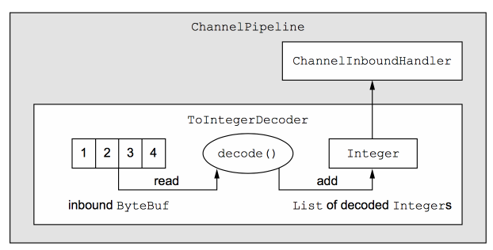
  >
  > 注意： 
  >
  > - 解码时，首先判断能否构成一个有效报文，然后再调用 ByteBuf 的 readXXX 方法来读取数据
  >
  > - 当存在剩余可读字节时，ByteToMessageDecoder 会自动回调子类 decode 方法
  >
  >   > 因此在实现 ByteToMessageDecoder 时，decode 方法每次只解析一个有效报文即可

- `MessageToMessageDecoder`： 将一个本身就包含完整报文信息的对象转换成另一个Java对象

  > Netty 提供的 MessageToMessageDecoder 实现类：
  >
  > - `StringDecoder`：将包含完整报文信息的 ByteBuf 转换成字符串
  >
  > - `Base64Decoder`：用于 Base64 编码
  >
  > 自定义 MessageToMessageDecoder：
  >
  > `protected abstract void decode(ChannelHandlerContext ctx,I msg,List<Object> out)`
  >
  > - `msg`： 需要进行解码的参数
  >
  >   > 注意： `I`： 为泛型
  >
  > - `List<Object> out`： 将 msg 经过解析后得到的 java 对象添加到 `List<Object> out` 中
  >
  > 

ByteToMessageDecoder 除进行解码，还会对不足以构成一个完整数据的报文拆包数据(拆包)进行缓存。而MessageToMessageDecoder则没有这样的逻辑

**使用建议**： 

- 先使用 ByteToMessageDecoder 进行粘包、拆包处理，得到完整的有效报文的 ByteBuf 实例
- 再交由 MessageToMessageDecoder 对 ByteBuf 实例中的数据进行解析，转换成 POJO 类

### 3. 编码器

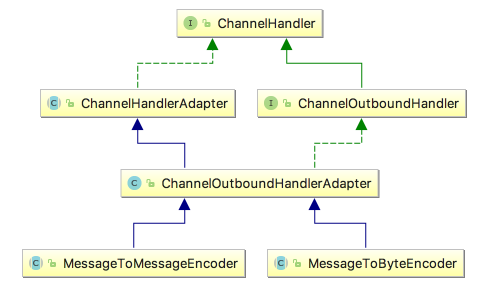

- `MessageToByteEncoder`： 是一个泛型类，泛型参数 I 表示将需要编码的对象的类型，编码的结果是将信息转换成二进制流放入 ByteBuf 中，子类通过覆写其抽象方法 `encode` 来实现编码

  > `protected abstract void encode(ChannelHandlerContext ctx, I msg, ByteBuf out)`

- `MessageToMessageEncoder`： 是一个泛型类，泛型参数 I 表示将需要编码的对象的类型，编码的结果是将信息放到一个 List 中，子类通过覆写其抽象方法 encode 来实现编码

  > `protected abstract void encode(ChannelHandlerContext ctx, I msg, List<Object> out)`
  >
  > MessageToMessageEncoder 提供的常见子类：
  >
  > - `LineEncoder`：按行编码，给定一个 CharSequence，在其之后添加换行符\n或者\r\n，并封装到ByteBuf 进行输出，与LineBasedFrameDecoder相对应
  > - `Base64Encoder`：给定一个 ByteBuf，得到对其包含的二进制数据进行Base64编码后的新的ByteBuf进行输出，与Base64Decoder相对应
  > - `LengthFieldPrepender`：给定一个 ByteBuf，为其添加报文头Length字段，得到一个新的ByteBuf进行输出。Length字段表示报文长度，与LengthFieldBasedFrameDecoder相对应。
  > - `StringEncoder`：给定一个 CharSequence，将其转换成ByteBuf进行输出，与StringDecoder对应

### 4. 编码解码器


## 5. 协议

### 1. 按行分割协议

`LineBasedFrameDecoder` 和 `LineEncoder`：按照行进行分割，遇到换行符，则认为是一个完整的报文

> - 在发送方，使用 LineEncoder 为数据添加换行符
>
> - 在接受方，使用 LineBasedFrameDecoder 对换行符进行解码

- `LineBasedFrameDecoder`： 使用换行符 `\n或\r\n` 作为依据，遇到 `\n或\r\n` 都认为是一条完整的消息

  > 构造方法： 
  >
  > ```java
  > public LineBasedFrameDecoder(final int maxLength) {
  >     this(maxLength, true, false);
  > }
  > public LineBasedFrameDecoder(final int maxLength, final boolean stripDelimiter, final boolean failFast) {
  >     this.maxLength = maxLength;
  >     this.failFast = failFast;
  >     this.stripDelimiter = stripDelimiter;
  > }
  > ```
  >
  > - `maxLength`：一行的最大长度，若超过长度没有检测到\n或\r\n，抛出 `TooLongFrameException`
  >
  > - `failFast`： 表示超过 maxLength 后，抛出 TooLongFrameException 的时机，与 maxLength 联合使用
  >   - 如果为 true，则超出 maxLength 后立即抛出 TooLongFrameException，不继续进行解码
  >   - 如果为 false，则等到完整的消息被解码后，再抛出 TooLongFrameException 异常
  >
  > - `stripDelimiter`：解码后的消息是否去除 `\n，\r\n` 分隔符

- `LineEncoder`： 按行编码，给定一个 CharSequence，在其之后添加换行符 `\n或\r\n`，并封装到ByteBuf 进行输出，与 LineBasedFrameDecoder 相对应

  > ```java
  > public final class LineSeparator {
  >     //读取系统属性line.separator，如果读取不到，默认为\n
  >     public static final LineSeparator DEFAULT = 
  >         	new LineSeparator(StringUtil.NEWLINE);
  >     //unix操作系统换行符
  >     public static final LineSeparator UNIX = new LineSeparator("\n");
  >     //windows操作系统换行度
  >     public static final LineSeparator WINDOWS = new LineSeparator("\r\n");
  >     
  >     /**
  >      * lineSeparator： 换行符号
  >      * charset： 换行符编码，默认为CharsetUtil.UTF_8
  >      */
  >     public LineEncoder(LineSeparator lineSeparator, Charset charset);
  >                                                                   
  > }
  > ```

**使用案例**：

- **server端：LineBasedFrameDecoderServer** 

  ```java
  public class LineBasedFrameDecoderServer {
     public static void main(String[] args) throws Exception {
        EventLoopGroup bossGroup = new NioEventLoopGroup(); // 1
        EventLoopGroup workerGroup = new NioEventLoopGroup();
        try {
           ServerBootstrap b = new ServerBootstrap(); // 2
           b.group(bossGroup, workerGroup).channel(NioServerSocketChannel.class)// 3
                 .childHandler(new ChannelInitializer<SocketChannel>() { // 4
                    @Override
                    public void initChannel(SocketChannel ch) throws Exception {
                       // 使用LineBasedFrameDecoder解决粘包问题，
                       //其会根据"\n"或"\r\n"对二进制数据进行拆分，封装到不同的ByteBuf实例中
                       ch.pipeline().addLast
                           (new LineBasedFrameDecoder(1024, true, true));
                       // 自定义这个ChannelInboundHandler打印拆包后的结果
                       ch.pipeline().addLast(new ChannelInboundHandlerAdapter() {
                          @Override
                          public void channelRead(ChannelHandlerContext ctx, 
                                                  Object msg) throws Exception {
                             if (msg instanceof ByteBuf) {
                                ByteBuf packet = (ByteBuf) msg;
                                System.out.println(
                                      new Date().toLocaleString() + ":" 
                                    + packet.toString(Charset.defaultCharset()));
                             }
                          }
                       });
                    }
                 });
           // Bind and start to accept incoming connections.
           ChannelFuture f = b.bind(8080).sync(); // (7)
           System.out.println("LineBasedFrameDecoderServer Started on 8080...");
           f.channel().closeFuture().sync();
        } finally {
           workerGroup.shutdownGracefully();
           bossGroup.shutdownGracefully();
        }
     }
  }
  ```

- **client端：LineBasedFrameDecoderClient** 

  ```java
  public class LineBasedFrameDecoderClient {
     public static void main(String[] args) throws Exception {
        EventLoopGroup workerGroup = new NioEventLoopGroup();
        try {
           Bootstrap b = new Bootstrap(); // 1
           b.group(workerGroup); // 2
           b.channel(NioSocketChannel.class); // 3
           b.option(ChannelOption.SO_KEEPALIVE, true); // 4
           b.handler(new ChannelInitializer<SocketChannel>() {
              @Override
              public void initChannel(SocketChannel ch) throws Exception {
                 ch.pipeline().addLast(new ChannelInboundHandlerAdapter() {
                     //在于server建立连接后，即发送请求报文
                    public void channelActive(ChannelHandlerContext ctx) {
                       byte[] req1 = ("hello1" + System
                                      .getProperty("line.separator")).getBytes();
                       byte[] req2 = ("hello2" + System
                                      .getProperty("line.separator")).getBytes();
                       byte[] req3_1 = ("hello3").getBytes();
                              byte[] req3_2 = (System.getProperty("line.separator"))
                                  			.getBytes();
                       ByteBuf buffer = Unpooled.buffer();
                       buffer.writeBytes(req1);
                       buffer.writeBytes(req2);
                       buffer.writeBytes(req3_1);
                       ctx.writeAndFlush(buffer);
                              try {
                                  TimeUnit.SECONDS.sleep(2);
                              } catch (InterruptedException e) {
                                  e.printStackTrace();
                              }
                              buffer = Unpooled.buffer();
                              buffer.writeBytes(req3_2);
                              ctx.writeAndFlush(buffer);
                          }
                 });
              }
           });
           // Start the client.
           ChannelFuture f = b.connect("127.0.0.1",8080).sync(); // 5
           // Wait until the connection is closed.
           f.channel().closeFuture().sync();
        } finally {
           workerGroup.shutdownGracefully();
        }
     }
  }
  ```

### 2. 分隔符与 Base64 编解码

- `DelimiterBasedFrameDecoder`： 允许指定任意特殊字符作为分隔符，还可以同时指定多个分隔符，如果在请求中有多个分隔符，将会选择内容最短的一个分隔符作为依据

  > `public DelimiterBasedFrameDecoder(int maxFrameLength,boolean stripDelimiter,boolean failFast,ByteBuf ... delimiters)` 
  >
  > - `maxLength`：一行的最大长度，若超过长度没有检测到\n或\r\n，抛出 `TooLongFrameException`
  >
  > - `failFast`： 表示超过 maxLength 后，抛出 TooLongFrameException 的时机，与 maxLength 联合使用
  >   - 如果为 true，则超出 maxLength 后立即抛出 TooLongFrameException，不继续进行解码
  >   - 如果为 false，则等到完整的消息被解码后，再抛出 TooLongFrameException 异常
  >
  > - `stripDelimiter`：解码后的消息是否去除 `\n，\r\n` 分隔符
  >
  > - `delimiters`：将分割符写入到 ByteBuf 中，然后当做参数传入
  >
  >   > 注意： netty 没有提供 DelimiterBasedFrameDecoder 对应的编码器实现，因此在发送端需要自行编码，添加分隔符

- **Base64 编码**：`Base64Encoder 和 Base64Decoder` 

  | 索引 | 对应字符 | 索引 | 对应字符 | 索引 | 对应字符 | 索引 | 对应字符 |
  | :--: | :------: | :--: | :------: | :--: | :------: | :--: | :------: |
  |  0   |  **A**   |  17  |  **R**   |  34  |  **i**   |  51  |  **z**   |
  |  1   |  **B**   |  18  |  **S**   |  35  |  **j**   |  52  |  **0**   |
  |  2   |  **C**   |  19  |  **T**   |  36  |  **k**   |  53  |  **1**   |
  |  3   |  **D**   |  20  |  **U**   |  37  |  **l**   |  54  |  **2**   |
  |  4   |  **E**   |  21  |  **V**   |  38  |  **m**   |  55  |  **3**   |
  |  5   |  **F**   |  22  |  **W**   |  39  |  **n**   |  56  |  **4**   |
  |  6   |  **G**   |  23  |  **X**   |  40  |  **o**   |  57  |  **5**   |
  |  7   |  **H**   |  24  |  **Y**   |  41  |  **p**   |  58  |  **6**   |
  |  8   |  **I**   |  25  |  **Z**   |  42  |  **q**   |  59  |  **7**   |
  |  9   |  **J**   |  26  |  **a**   |  43  |  **r**   |  60  |  **8**   |
  |  10  |  **K**   |  27  |  **b**   |  44  |  **s**   |  61  |  **9**   |
  |  11  |  **L**   |  28  |  **c**   |  45  |  **t**   |  62  |  **+**   |
  |  12  |  **M**   |  29  |  **d**   |  46  |  **u**   |  63  |  **/**   |
  |  13  |  **N**   |  30  |  **e**   |  47  |  **v**   |      |          |
  |  14  |  **O**   |  31  |  **f**   |  48  |  **w**   |      |          |
  |  15  |  **P**   |  32  |  **g**   |  49  |  **x**   |      |          |
  |  16  |  **Q**   |  33  |  **h**   |  50  |  **y**   |      |          |

**使用案例**： 

- **Server端：**DelimiterBasedFrameDecoderServer

  ```java
  public class DelimiterBasedFrameDecoderServer {
     public static void main(String[] args) throws Exception {
        EventLoopGroup bossGroup = new NioEventLoopGroup(); // 1
        EventLoopGroup workerGroup = new NioEventLoopGroup();
        try {
           ServerBootstrap b = new ServerBootstrap(); // 2
           b.group(bossGroup, workerGroup).channel(NioServerSocketChannel.class)// 3
                 .childHandler(new ChannelInitializer<SocketChannel>() { // 4
                    @Override
                    public void initChannel(SocketChannel ch) throws Exception {
                       ByteBuf delemiter= Unpooled.buffer();
                       delemiter.writeBytes("&".getBytes());
                      //先使用DelimiterBasedFrameDecoder解码，以&作为分割符
                      ch.pipeline().addLast(new DelimiterBasedFrameDecoder(
                          		1024, true, true,delemiter));
                      //之后使用Base64Decoder对数据进行解码，得到报文的原始的二进制流
                      ch.pipeline().addLast(new Base64Decoder());
                      //对请求报文进行处理
                       ch.pipeline().addLast(new ChannelInboundHandlerAdapter() {
                          @Override
                          public void channelRead(ChannelHandlerContext ctx, 
                                                  Object msg) throws Exception {
                             if (msg instanceof ByteBuf) {
                                ByteBuf packet = (ByteBuf) msg;
                                System.out.println(
                                      new Date().toLocaleString() + ":" 
                                    + packet.toString(Charset.defaultCharset()));
                             }
                          }
                       });
                    }
                 });
           // Bind and start to accept incoming connections.
           ChannelFuture f = b.bind(8080).sync(); // (7)
           System.out.println("DelimiterBasedFrameDecoderServer Started on 8080");
           f.channel().closeFuture().sync();
        } finally {
           workerGroup.shutdownGracefully();
           bossGroup.shutdownGracefully();
        }
     }
  }
  ```

- **client端**：DelimiterBasedFrameDecoderClient 

  ```java
  public class DelimiterBasedFrameDecoderClient {
     public static void main(String[] args) throws Exception {
        EventLoopGroup workerGroup = new NioEventLoopGroup();
        try {
           Bootstrap b = new Bootstrap(); // 1
           b.group(workerGroup); // 2
           b.channel(NioSocketChannel.class); // 3
           b.option(ChannelOption.SO_KEEPALIVE, true); // 4
           b.handler(new ChannelInitializer<SocketChannel>() {
              @Override
              public void initChannel(SocketChannel ch) throws Exception {
                 ch.pipeline().addLast(new ChannelInboundHandlerAdapter() {
                     //在于server建立连接后，即发送请求报文
                    public void channelActive(ChannelHandlerContext ctx) {
                       //先对要发送的原始内容进行base64编码
                       ByteBuf content = Base64.encode(
                           Unpooled.buffer()
                           .writeBytes("hello&tianshouzhi&".getBytes()));
                       //之后添加分隔符
                       ByteBuf req = Unpooled.copiedBuffer(content);
                       req.writeBytes("&".getBytes());
                       ctx.writeAndFlush(req);
                          }
                 });
              }
           });
           // Start the client.
           ChannelFuture f = b.connect("127.0.0.1",8080).sync(); // 5
           // Wait until the connection is closed.
           f.channel().closeFuture().sync();
        } finally {
           workerGroup.shutdownGracefully();
        }
     }
  }
  ```

### 3. 定长协议

- `FixedLengthFrameDecoder`： 把固定的长度的字节数当做一个完整的消息

### 4. 变长协议

- `LengthFieldBasedFrameDecoder 和 LengthFieldPrepender`： 

  - 协议头中会携带长度字段，用于标识消息体或者整包消息的长度
  - 自动屏蔽 TCP 底层的拆包和粘包问题，只需要传入正确的参数，即可轻松解决“读半包“问题

  > - 发送方使用 LengthFieldPrepende r给实际内容 Content 进行编码添加报文头**Length字段**
  >
  > - 接受方使用 LengthFieldBasedFrameDecoder 进行解码 
  >
  > 协议格式： `Length | Content`
  >
  > - `Length`： 表示 Conent 的字节数，Length 本身是整数
  >
  > - `Content`： 要处理的二进制数据。
  >
  >   > 发送 Content 内容前，先获取真实长度，添加在内容二进制流之前，然后再发送
  >   >
  >   > 总共要发送的字节： Length 占用的字节数 + Content 占用的字节数

- `LengthFieldPrepender`： 

  > 构造方法： 
  >
  > `public LengthFieldPrepender(ByteOrder byteOrder,int lengthFieldLength,int lengthAdjustment,boolean lengthIncludesLengthFieldLength)`
  >
  > - `byteOrder`：表示 Length 字段本身占用的字节数使用的是大端还是小端编码
  > - `lengthFieldLength`：表示 Length 字段本身占用的字节数，可以指定 1, 2, 3, 4, 或 8
  > - `lengthAdjustment`：表示 Length 字段调整值
  > - `lengthIncludesLengthFieldLength`：表示 Length 字段占用的字节数是否包含在 Length 字段表示的值中

- `LengthFieldBasedFrameDecoder `： 

  > ```java
  > public LengthFieldBasedFrameDecoder(
  >     ByteOrder byteOrder,
  >     int maxFrameLength,
  >     int lengthFieldOffset,
  >     int lengthFieldLength,
  >     int lengthAdjustment,
  >     int initialBytesToStrip,
  >     boolean failFast)
  > ```
  >
  > - `byteOrder`：协议中 Length 字段的字节是大端还是小端
  >
  > - `maxFrameLength`：协议中 Content 字段的最大长度，如果超出，则抛出TooLongFrameException
  >
  > - `lengthFieldOffset`：Length 字段的偏移量，即在读取一个二进制流时，跳过指定长度个字节之后的才是Length字段
  >
  > - `lengthFieldLength`：Length 字段占用的字节数
  >   - ​    如果lengthFieldLength是1个字节，那么限制为 128bytes
  >   - ​    如果lengthFieldLength是2个字节，那么限制为 32767(约等于32K)
  >   - ​    如果lengthFieldLength是3个字节，那么限制为 8388608(约等于8M)
  >   - ​    如果lengthFieldLength是4个字节，那么限制为 2147483648(约等于2G)
  >
  > - `lengthAdjustment`：Length字段补偿值，用于处理 Length 字段前后还有其他报文头的情况
  >
  > - `initialBytesToStrip`：解码后跳过的初始字节数，表示获取完一个完整的数据报文之后，忽略前面指定个数的字节
  >
  > - `failFast`：
  >
  >   - `true`： 读取到 Length 字段时，值超过 maxFrameLength，则抛出 TooLongFrameException
  >
  >   - `false`： 只有当真正读取完长度域的值表示的字节后，抛出 TooLongFrameException

## 6. webSocket

### 1. 简介

- `WebSocket`： 用于解决浏览器与后台服务器双向通讯的问题

  > - 使用 WebSocket 技术，后台可以随时向前端推送消息，以保证前后台状态统一
  >
  > - 传统的服务端向浏览器推送消息的技术：ajax、flash、comet、java applet
  >
  >   > 每隔一段时间去请求后台，以获取最新状态
  >
  > WebSocket 协议支持服务端与浏览器建立长连接，双方可以随时发送数据给对方，不再是由客户端控制的一问一答的方式

基于长轮循(polling)和websocket推送的浏览器(browser)和服务端(Server)的交互对比图：

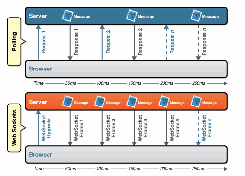

**实现消息推送**： 

- 服务端保存用户唯一标记(userId)与其对应的 SocketChannel 的对应关系

- 通过userId给用户推送消息
- **客户端 ack 接受到消息**： 推送消息都有唯一的 msgId，客户端接收推送消息后，需要对这条消息进行ack，也就是告诉服务端自己接收到了这条消息，ack时需要将msgId带回来
- **离线消息**： 当给某用户推送消息时，其不在线，可以将消息保存下来，当用户与服务端建立连接时，首先检查缓存服务器中有没有其对应的离线消息，如果有直接取出来发送给用户
- **消息推送记录的存储**： 服务端推送完成消息记录后，存储这些消息，以支持一个用户查看自己曾经受到过的推送消息
- **疲劳度控制**： 限制给一个用户每天推送消息的数量，以免频繁的推送消息给用户造成不好的体验