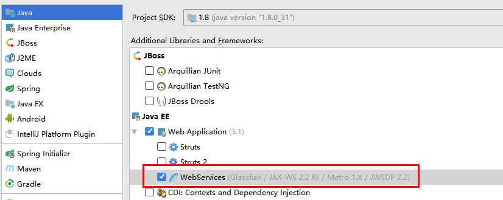
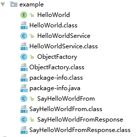
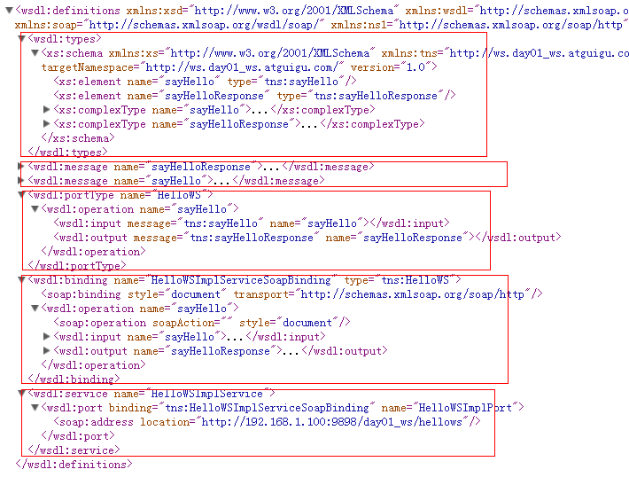

# 一、复习准备

## 1. Schema 约束

- **namespace**： 相当于 schema 文件的 id

- **targetNamespace**： 用来指定 schema 文件的 namespace 的值 

- **xmlns**： 引入一个约束, 它的值是一个 schema 文件的 namespace 值 

- **schemaLocation**： 用来指定引入的 schema 文件的位置

 

**schema 规范**： 

- 所有标签和属性都需要有 schema 文件来定义 

- 所有的schema文件都需要有一个 id，但在这里它叫 namespace

- namespace 的值由 targetNamespace 属性来指定，它的值是一个 url(很有可能不存在)

- 引入一个 Schema 约束：
  - 属性： 用 xmlns 属性

  - 属性值： 对应 schema 文件的 id(namespace值)

- 如果引入的 schema 不是 w3c 组织定义，必须指定 schema 文件的位置

- schema 文件的位置指定： 

  - 属性： schemaLocation

  - 属性值： namespace path

- 如果引入了 N 个约束, 需要给 n-1 个取别名


book.xsd 文件

```xsd
<?xml version="1.0" encoding="UTF-8" ?> 
<schema xmlns="http://www.w3.org/2001/XMLSchema"
  			targetNamespace="aaa"
  			elementFormDefault="qualified">
    <element name="书架">
        <complexType>
            <sequence maxOccurs="unbounded">
                <element name="书">
                    <complexType>
                        <sequence>
                            <element name="书名" type="string" />
                            <element name="作者" type="string" />
                            <element name="售价" type="string" />
                        </sequence>
                    </complexType>
                </element>
            </sequence>
        </complexType>
    </element>
</schema>
```

book.xml 文件

```xml
<?xml version="1.0" encoding="UTF-8"?>
<书架 xmlns="aaa"
	xmlns:xsi="http://www.w3.org/2001/XMLSchema-instance"
	xsi:schemaLocation="aaa book.xsd">
	<书>
		<书名>JavaScript开发</书名>
		<作者>老佟</作者>
		<售价>28.00元</售价>
	</书>
</书架>
```

## 2. HTTP 协议

|  状态码  | 含义                                                         |
| :------: | ------------------------------------------------------------ |
| 100～199 | 表示成功接收请求，但要求客户端继续提交下一次请求才能完成整个处理过程 |
| 200～299 | 表示成功接收请求并已完成整个处理过程，常用200                |
| 300～399 | 为完成请求，客户需进一步细化请求。例如，请求的资源已经移动一个新地址，常用302 |
| 400～499 | 客户端的请求有错误，常用404                                  |
| 500～599 | 服务器端出现错误，常用 500                                   |

**响应头**： 

- `Location`： /index.jsp  告诉浏览器重新定向到指定的路径
- `Server`： apache tomcat 使用的什么web服务器
- `Content-Encoding`： gzip  告诉浏览器我传给你的数据用的压缩方式
- `Content-Length`： 80 响应体的字节数
- `Content-Language`： zh-cn 响应体数据的语言
- `Content-type`： text/html; charset=GB2312 响应体内容的类型　html/ css / image
- `Last-Modified`： Tue, 11 Jul 2000 18:23:51 GMT 资源最后被修改的时间
- `Refresh`： 1定时刷新
- `Content-Disposition`： attachment; filename=aaa.zip 提示用户下载
- `Set-Cookie`： SS=Q0=5Lb_nQ; path=/search 将 cookie 数据回送给 ie
- `Expires`：-1  告诉浏览器不要缓存起来　
- `Cache-Control`： no-cache  
- `Pragma`： no-cache   
- `Connection`： close/Keep-Alive   是否保持连接
- `Date`： Tue, 11 Jul 2000 18:23:51 GMT 响应的时间

# 二、 webService

## 1. 概述

- `WSDL`： web service definition language

  - 对应一种类型的文件 `.wsdl` 
  - 定义了 web service 的服务器端与客户端应用交互传递请求和响应数据的格式和方式

  - 一个 web service 对应一个唯一的 wsdl 文档

- `SOAP`： simple object  access protocal

  - 是一种简单的、基于HTTP和XML协议，用于在WEB上交换结构化的数据

  - soap 消息：请求消息和响应消息

  - http+xml 片断

- `SEI`： WebService EndPoint Interface
  - WebService 服务器端用来处理请求的接口

- `CXF`： Celtix + XFire
  - apache 开发的用于 webservice 服务器端和客户端的框架

## 2. 入门

### 1. 服务器端

通过 Idea 创建： 



会发现自动生成的 HelloWorld 代码： 

```java
@WebService()
public class HelloWorld {
    @WebMethod
    public String sayHelloWorldFrom(String from) {
        String result = "Hello, world, from " + from;
        System.out.println(result);
        return result;
    }

    public static void main(String[] argv) {
        Object implementor = new HelloWorld();
        String address = "http://localhost:9000/HelloWorld";
        Endpoint.publish(address, implementor);
    }
}
```

然后通过浏览器访问 `http://localhost:9000/HelloWorld/service`： 


### 2. 客户端

新建一个新的空 java 项目，然后在终端进入该项目的 src 文件夹下，输入：

`wsimport -keep http://localhost:9000/HelloWorld?wsdl` ，该 url 地址与上述客户端的 address 对应

运行成功后，会发现生成如下代码： 



然后编写 ClientTest 文件： 

```java
public class ClientTest {

    public static void main(String[] args) {
        HelloWorldService helloWorldService = new HelloWorldService();
        HelloWorld helloWorld = helloWorldService.getHelloWorldPort();
        System.out.println(helloWorld.getClass());

        helloWorld.sayHelloWorldFrom("Tom");
    }
}
```

运行，然后会发现服务端(保持运行状态)会显示输出

## 3. 调用免费 webservice

### 1. 通过 wsdl 生成 java 代码

**正常操作生成**： 

- 在终端输入： `wsimport -keep url`，如： `wsimport -keep http://ws.webxml.com.cn/WebServices/WeatherWS.asmx?wsdl` 
- 若该 webservice 的编写代码不是 java 则会出现错误

**出现错误时的解决方式**：

- 在项目中，新建 `.wsdl` 文件，然后将上述 url 的 wsdl 复制粘贴(右键查看源代码)
- 将所有的 `<s:element ref="s:schema" /><s:any />` 替换成 `<s:any minOccurs="2" maxOccurs="2"/>`
- 然后再在终端进行 wsimport 操作

### 2. 编写测试代码

```java
public class ClientTest {

    public static void main(String[] args) {
        WeatherWS weatherWS = new WeatherWS();
        WeatherWSSoap weatherWSSoap = weatherWS.getWeatherWSSoap();
        ArrayOfString weather = weatherWSSoap.getWeather("襄阳", null);
        List<String> list = weather.getString();
        System.out.println(list);
    }
}
```

## 4. wsdl 文档解析



文档结构： 

```xml
<definitions>
	<types>
		<schema>
			<element>
	</types>
	<message>
		<part>
	</message>
	<portType>
		<operation>
			<input>
			<output>
	</portType>
	<binding>
		<operation>
			<input>
			<output>
	</binding>
	<service>
		<port>
			<address>
	</service>
</definitions>
```

标签说明： 

- `types`： 数据类型(标签)定义的容器，里面使用 schema 定义了一些标签结构供 message 引用 

- `message`： 通信消息的数据结构的抽象类型化定义，引用 types 中定义的标签

- `operation`： 对服务中所支持的操作的抽象描述，一个 operation 描述一个访问入口请求消息与响应消息对

- `portType`： 对于某个访问入口点类型所支持的操作的抽象集合，可由一个或多个服务访问点来支持

- `binding`： 特定端口类型的具体协议和数据格式规范的绑定

- `service`： 相关服务访问点的集合

- `port`： 定义为协议/数据格式绑定与具体 Web 访问地址组合的单个服务访问点