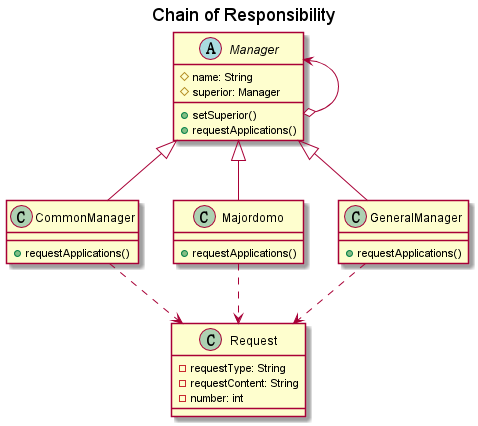
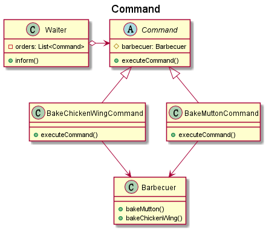
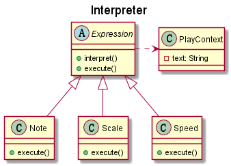
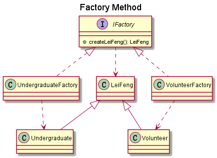
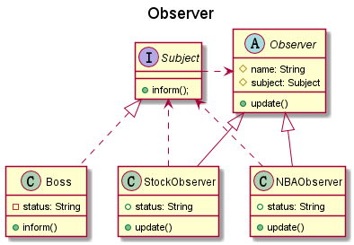
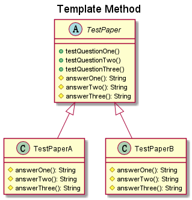
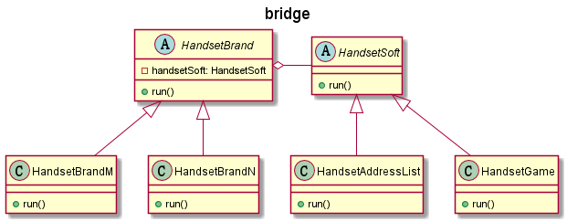
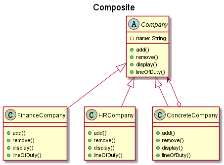

推荐阅读： ==[设计模式图解与代码实现](https://github.com/ToryZhou/design-pattern)== 


设计模式分为三大类：

- **创建型模式(五种)**：工厂方法模式、抽象工厂模式、单例模式、建造者模式、原型模式

- **结构型模式(七种)**： 适配器模式、装饰器模式、代理模式、外观模式、桥接模式、组合模式、享元模式

- **行为型模式(十一种)**： 策略模式、模板方法模式、观察者模式、迭代子模式、责任链模式、命令模式、备忘录模式、状态模式、访问者模式、中介者模式、解释器模式

> 其实还有两类：并发型模式和线程池模式

# 一、设计模式六大原则

- **单一职责原则**： 一个类只负责一项职责，防止职责扩散

- **里氏替换原则**： 类 B 继承类 A 时，除添加新的方法完成新增功能外，尽量不要重写父类 A 的方法，也尽量不要重载父类 A 的方法

- **依赖倒置原则**： 高层模块不依赖低层模块，二者都依赖其抽象；抽象不依赖细节，细节应该依赖抽象

  > 类 B 和类 C 各自实现接口 I，类 A 通过接口 I 间接与类B或者类C发生联系，则会降低修改类A的几率

- **接口隔离原则**： 将臃肿的接口拆分为独立的几个接口，类A和类C分别与他们需要的接口建立依赖关系

- **迪米特法则**： 尽量降低类与类之间的耦合

- **开闭原则**： 当软件变化时，通过扩展软件实体的行为来实现变化，而不是通过修改已有的代码来实现变化

# 二、创建型

## 1. 单例模式(Singleton)

### 1.1 简介

**意图：**保证一个类仅有一个实例，并提供一个访问它的全局访问点

**主要解决：**一个全局使用的类频繁地创建与销毁，减少内存开销

**何时使用：**当您想控制实例数目，节省系统资源时

**缺点：**没有接口，不能继承，与单一职责原则冲突，一个类应该只关心内部逻辑，而不关心外面怎么样来实例化

### 1.2 适用性

- 当类只能有一个实例而且客户可以从一个众所周知的访问点访问它时 

- 当这个唯一实例应该是通过子类化可扩展的，并且客户应该无需更改代码就能使用一个扩展的实例时

### 1.3 类设计

- 使用一个私有构造函数、一个私有静态变量以及一个公有静态函数来实现

- 私有构造函数保证了不能通过构造函数来创建对象实例，只能通过公有静态函数返回唯一的私有静态变量


### 1.4 代码实现

#### Ⅰ 懒汉式-线程不安全

- 私有静态变量 `uniqueInstance` 被延迟实例化

  > 好处： 如果没有用到该类，则不用实例化 `uniqueInstance`，从而节约资源

- 在多线程环境下不安全

```java
public class Singleton {
    private static Singleton uniqueInstance;
    private Singleton() {
    }
    public static Singleton getUniqueInstance() {
        if (uniqueInstance == null) {
            uniqueInstance = new Singleton();
        }
        return uniqueInstance;
    }
}
```

#### Ⅱ 饿汉式-线程安全

- 采取直接实例化 `uniqueInstance` 方式解决线程不安全问题

- 缺点： 直接实例化方式丢失了延迟实例化带来的节约资源的好处

```java
private static Singleton uniqueInstance = new Singleton();
```

#### Ⅲ 懒汉式-线程安全

- 通过加锁避免实例化多次 `uniqueInstance`
- 缺点： 当一个线程进入该方法之后，其它试图进入该方法的线程都必须等待

```java
public static synchronized Singleton getUniqueInstance() {
    if (uniqueInstance == null) {
        uniqueInstance = new Singleton();
    }
    return uniqueInstance;
}
```

#### Ⅳ 双重校验锁-线程安全

- 只有当 `uniqueInstance` 没有被实例化时，才需要进行加锁

```java
public class Singleton {
    //使用 volatile 可以禁止 JVM 的指令重排，保证在多线程环境下也能正常运行
    private volatile static Singleton uniqueInstance; 
    private Singleton() {
    }
    public static Singleton getUniqueInstance() {
        if (uniqueInstance == null) {
            synchronized (Singleton.class) {
                if (uniqueInstance == null) {
                    uniqueInstance = new Singleton();
                }
            }
        }
        return uniqueInstance;
    }
}
```

`uniqueInstance = new Singleton();`  其实分为三步执行：

1. 为 uniqueInstance 分配内存空间
2. 初始化 uniqueInstance
3. 将 uniqueInstance 指向分配的内存地址

例如，线程 T<sub>1</sub> 执行了 1 和 3，此时 T<sub>2</sub> 调用 getUniqueInstance() 后发现 uniqueInstance 不为空，因此返回 uniqueInstance，但此时 uniqueInstance 还未被初始化

使用 volatile 可以禁止 JVM 的指令重排，保证在多线程环境下也能正常运行

#### Ⅴ 静态内部类实现

- 当 Singleton 类加载时，静态内部类 SingletonHolder 没有被加载进内存，当调用 `getUniqueInstance()` 方法从而触发 `SingletonHolder.INSTANCE` 时 SingletonHolder 才会被加载，

- 这种方式不仅具有延迟初始化的好处，而且由 JVM 提供了对线程安全的支持

```java
public class Singleton {

    private Singleton() {
    }

    private static class SingletonHolder {
        private static final Singleton INSTANCE = new Singleton();
    }

    public static Singleton getUniqueInstance() {
        return SingletonHolder.INSTANCE;
    }
}
```

#### Ⅵ 枚举实现

 ```java
public enum Singleton {
    INSTANCE;
    private String objName;

    public String getObjName() {
        return objName;
    }
    public void setObjName(String objName) {
        this.objName = objName;
    }
    public static void main(String[] args) {
        // 单例测试
        Singleton firstSingleton = Singleton.INSTANCE;
        firstSingleton.setObjName("firstName");
        System.out.println(firstSingleton.getObjName());
        Singleton secondSingleton = Singleton.INSTANCE;
        secondSingleton.setObjName("secondName");
        System.out.println(firstSingleton.getObjName());
        System.out.println(secondSingleton.getObjName());
        // 反射获取实例测试
        try {
            Singleton[] enumConstants = Singleton.class.getEnumConstants();
            for (Singleton enumConstant : enumConstants) {
                System.out.println(enumConstant.getObjName());
            }
        } catch (Exception e) {
            e.printStackTrace();
        }
    }
}
 ```

- 该实现在多次序列化再进行反序列化之后，不会得到多个实例

### JDK使用

- [java.lang.Runtime#getRuntime()](http://docs.oracle.com/javase/8/docs/api/java/lang/Runtime.html#getRuntime%28%29)
- [java.awt.Desktop#getDesktop()](http://docs.oracle.com/javase/8/docs/api/java/awt/Desktop.html#getDesktop--)
- [java.lang.System#getSecurityManager()](http://docs.oracle.com/javase/8/docs/api/java/lang/System.html#getSecurityManager--)

## 2. 工厂模式(Factory Method)

### 2.1 简介

**意图：**定义一个创建对象的接口，让其子类决定实例化哪一个工厂类，工厂模式使其创建过程延迟到子类进行

**主要解决：**主要解决接口选择的问题

**何时使用：**我们明确地计划不同条件下创建不同实例时

**如何解决：**让其子类实现工厂接口，返回的也是一个抽象的产品

### 2.2 适用性

- 当一个类不知道它所必须创建的对象的类的时候

- 当一个类希望由它的子类来指定它所创建的对象的时候

- 当类将创建对象的职责委托给多个帮助子类中的某一个时候

### 2.3 类设计

- 在简单工厂中，创建对象的是另一个类，而在工厂方法中，由子类来创建对象

  

### 2.4 代码实现

```java
public abstract class Factory {
    abstract public Product factoryMethod();
    public void doSomething() {
        Product product = factoryMethod();
        // do something with the product
    }
}
```

```java
public class ConcreteFactory extends Factory {
    public Product factoryMethod() {
        return new ConcreteProduct();
    }
}
```

```java
public class ConcreteFactory1 extends Factory {
    public Product factoryMethod() {
        return new ConcreteProduct1();
    }
}
```

```java
public class ConcreteFactory2 extends Factory {
    public Product factoryMethod() {
        return new ConcreteProduct2();
    }
}
```

### JDK使用

- [java.util.Calendar](http://docs.oracle.com/javase/8/docs/api/java/util/Calendar.html#getInstance--)
- [java.util.ResourceBundle](http://docs.oracle.com/javase/8/docs/api/java/util/ResourceBundle.html#getBundle-java.lang.String-)
- [java.text.NumberFormat](http://docs.oracle.com/javase/8/docs/api/java/text/NumberFormat.html#getInstance--)
- [java.nio.charset.Charset](http://docs.oracle.com/javase/8/docs/api/java/nio/charset/Charset.html#forName-java.lang.String-)
- [java.net.URLStreamHandlerFactory](http://docs.oracle.com/javase/8/docs/api/java/net/URLStreamHandlerFactory.html#createURLStreamHandler-java.lang.String-)
- [java.util.EnumSet](https://docs.oracle.com/javase/8/docs/api/java/util/EnumSet.html#of-E-)
- [javax.xml.bind.JAXBContext](https://docs.oracle.com/javase/8/docs/api/javax/xml/bind/JAXBContext.html#createMarshaller--)

## 3. 抽象工厂模式(Abstract Factory)

### 3.1 简介

**意图**： 提供一个创建一系列相关或相互依赖对象的接口，而无需指定它们具体的类

**主要解决**： 主要解决接口选择的问题

**何时使用**： 系统的产品有多于一个的产品族，而系统只消费其中某一族的产品

**如何解决**： 在一个产品族里面，定义多个产品

### 3.2 适用性

- 一个系统要独立于它的产品的创建、组合和表示时

- 一个系统要由多个产品系列中的一个来配置时

- 当你要强调一系列相关的产品对象的设计以便进行联合使用时

- 当你提供一个产品类库，而只想显示它们的接口而不是实现时

### 3.3 类设计

从高层次来看，抽象工厂使用了组合，即 Cilent 组合了 AbstractFactory，而工厂方法模式使用了继承


### 3.4 代码实现

```java
public class AbstractProductA {
}
```

```java
public class AbstractProductB {
}
```

```java
public class ProductA1 extends AbstractProductA {
}
```

```java
public class ProductA2 extends AbstractProductA {
}
```

```java
public class ProductB1 extends AbstractProductB {
}
```

```java
public class ProductB2 extends AbstractProductB {
}
```

```java
public abstract class AbstractFactory {
    abstract AbstractProductA createProductA();
    abstract AbstractProductB createProductB();
}
```

```java
public class ConcreteFactory1 extends AbstractFactory {
    AbstractProductA createProductA() {
        return new ProductA1();
    }

    AbstractProductB createProductB() {
        return new ProductB1();
    }
}
```

```java
public class ConcreteFactory2 extends AbstractFactory {
    AbstractProductA createProductA() {
        return new ProductA2();
    }

    AbstractProductB createProductB() {
        return new ProductB2();
    }
}
```

```java
public class Client {
    public static void main(String[] args) {
        AbstractFactory abstractFactory = new ConcreteFactory1();
        AbstractProductA productA = abstractFactory.createProductA();
        AbstractProductB productB = abstractFactory.createProductB();
        // do something with productA and productB
    }
}
```

### JDK使用

- [javax.xml.parsers.DocumentBuilderFactory](http://docs.oracle.com/javase/8/docs/api/javax/xml/parsers/DocumentBuilderFactory.html)
- [javax.xml.transform.TransformerFactory](http://docs.oracle.com/javase/8/docs/api/javax/xml/transform/TransformerFactory.html#newInstance--)
- [javax.xml.xpath.XPathFactory](http://docs.oracle.com/javase/8/docs/api/javax/xml/xpath/XPathFactory.html#newInstance--)

## 4. 建造者模式(Builder)

### 4.1 简介

**意图**： 将一个复杂的构建与其表示相分离，使得同样的构建过程可以创建不同的表示

**何时使用**： 一些基本部件不会变，而其组合经常变化的时候

### 4.2 适用性 

- 当创建复杂对象的算法应该独立于该对象的组成部分以及它们的装配方式时

- 当构造过程必须允许被构造的对象有不同的表示时

### 4.3 类设计


### 4.4 代码实现

简易的 StringBuilder 实现：

```java
public class AbstractStringBuilder {
    protected char[] value;
    protected int count;

    public AbstractStringBuilder(int capacity) {
        count = 0;
        value = new char[capacity];
    }
    public AbstractStringBuilder append(char c) {
        ensureCapacityInternal(count + 1);
        value[count++] = c;
        return this;
    }
    private void ensureCapacityInternal(int minimumCapacity) {
        // overflow-conscious code
        if (minimumCapacity - value.length > 0)
            expandCapacity(minimumCapacity);
    }
    void expandCapacity(int minimumCapacity) {
        int newCapacity = value.length * 2 + 2;
        if (newCapacity - minimumCapacity < 0)
            newCapacity = minimumCapacity;
        if (newCapacity < 0) {
            if (minimumCapacity < 0) // overflow
                throw new OutOfMemoryError();
            newCapacity = Integer.MAX_VALUE;
        }
        value = Arrays.copyOf(value, newCapacity);
    }
}
```

```java
public class StringBuilder extends AbstractStringBuilder {
    public StringBuilder() {
        super(16);
    }
    @Override
    public String toString() {
        // Create a copy, don't share the array
        return new String(value, 0, count);
    }
}
```

```java
public class Client {
    public static void main(String[] args) {
        StringBuilder sb = new StringBuilder();
        final int count = 26;
        for (int i = 0; i < count; i++) {
            sb.append((char) ('a' + i));
        }
        System.out.println(sb.toString());
    }
}
```

```html
abcdefghijklmnopqrstuvwxyz
```

### JDK使用

- [java.lang.StringBuilder](http://docs.oracle.com/javase/8/docs/api/java/lang/StringBuilder.html)
- [java.nio.ByteBuffer](http://docs.oracle.com/javase/8/docs/api/java/nio/ByteBuffer.html#put-byte-)
- [java.lang.StringBuffer](http://docs.oracle.com/javase/8/docs/api/java/lang/StringBuffer.html#append-boolean-)
- [java.lang.Appendable](http://docs.oracle.com/javase/8/docs/api/java/lang/Appendable.html)
- [Apache Camel builders](https://github.com/apache/camel/tree/0e195428ee04531be27a0b659005e3aa8d159d23/camel-core/src/main/java/org/apache/camel/builder)

## 5. 原型模式(Prototype)

### 5.1 简介

**意图**： 用原型实例指定创建对象的种类，并且通过拷贝这些原型创建新的对象

**主要解决**： 在运行期建立和删除原型

**如何解决**： 利用已有的一个原型对象，快速地生成和原型对象一样的实例

### 5.2 适用性

- 当要实例化的类是在运行时刻指定时，例如：通过动态装载

- 为了避免创建一个与产品类层次平行的工厂类层次时

- 当一个类的实例只能有几个不同状态组合中的一种时

> 建立相应数目的原型并克隆它们可能比每次用合适的状态手工实例化该类更方便一些

### 5.3 类设计


### 5.4 代码实现

```java
public abstract class Prototype {
    abstract Prototype myClone();
}
```

```java
public class ConcretePrototype extends Prototype {
    private String filed;
    
    public ConcretePrototype(String filed) {
        this.filed = filed;
    }
    @Override
    Prototype myClone() {
        return new ConcretePrototype(filed);
    }
    @Override
    public String toString() {
        return filed;
    }
}
```

```java
public class Client {
    public static void main(String[] args) {
        Prototype prototype = new ConcretePrototype("abc");
        Prototype clone = prototype.myClone();
        System.out.println(clone.toString());
    }
}
```

```html
abc
```

### JDK使用

- [java.lang.Object#clone()](http://docs.oracle.com/javase/8/docs/api/java/lang/Object.html#clone%28%29)

# 三、行为型

## 1. 责任链模式(Chain Of Responsibility)

### 1.1 简介

**意图**： 避免请求发送者与接收者耦合，让多个对象都有可能接收请求，将这些对象连接成一条链，并且沿着这条链传递请求，直到有对象处理它为止

**何时使用**： 在处理消息的时候以过滤很多道

**如何解决**： 拦截的类都实现统一接口

### 1.2 适用性

- 有多个的对象可以处理一个请求，哪个对象处理该请求运行时刻自动确定

- 想在不明确指定接收者的情况下，向多个对象中的一个提交一个请求

- 可处理一个请求的对象集合应被动态指定

### 1.3 类设计

- Handler：定义处理请求的接口，并且实现后继链（successor）



### Implementation

```java
public abstract class Handler {
    protected Handler successor;

    public Handler(Handler successor) {
        this.successor = successor;
    }
    protected abstract void handleRequest(Request request);
}
```

```java
public class ConcreteHandler1 extends Handler {
    public ConcreteHandler1(Handler successor) {
        super(successor);
    }
    @Override
    protected void handleRequest(Request request) {
        if (request.getType() == RequestType.TYPE1) {
            System.out.println(request.getName() + " is handle by ConcreteHandler1");
            return;
        }
        if (successor != null) {
            successor.handleRequest(request);
        }
    }
}
```

```java
public class ConcreteHandler2 extends Handler {
    public ConcreteHandler2(Handler successor) {
        super(successor);
    }
    @Override
    protected void handleRequest(Request request) {
        if (request.getType() == RequestType.TYPE2) {
            System.out.println(request.getName() + " is handle by ConcreteHandler2");
            return;
        }
        if (successor != null) {
            successor.handleRequest(request);
        }
    }
}
```

```java
public class Request {
    private RequestType type;
    private String name;

    public Request(RequestType type, String name) {
        this.type = type;
        this.name = name;
    }
    public RequestType getType() {
        return type;
    }
    public String getName() {
        return name;
    }
}
```

```java
public enum RequestType {
    TYPE1, TYPE2
}
```

```java
public class Client {
    public static void main(String[] args) {
        Handler handler2 = new ConcreteHandler2(handler1);

        Request request1 = new Request(RequestType.TYPE1, "request1");
        handler2.handleRequest(request1);

        Request request2 = new Request(RequestType.TYPE2, "request2");
        handler2.handleRequest(request2);
    }
}
```

```html
request1 is handle by ConcreteHandler1
request2 is handle by ConcreteHandler2
```

### JDK使用

- [java.util.logging.Logger#log()](http://docs.oracle.com/javase/8/docs/api/java/util/logging/Logger.html#log%28java.util.logging.Level,%20java.lang.String%29)
- [Apache Commons Chain](https://commons.apache.org/proper/commons-chain/index.html)
- [javax.servlet.Filter#doFilter()](http://docs.oracle.com/javaee/7/api/javax/servlet/Filter.html#doFilter-javax.servlet.ServletRequest-javax.servlet.ServletResponse-javax.servlet.FilterChain-)

## 2. 命令模式(Command)

### 2.1 简介

**意图**： 将一个请求封装成一个对象，从而可以用不同的请求对客户进行参数化

**何时使用**： 要对行为进行"记录、撤销/重做、事务"等处理时，将一组行为抽象为对象，实现二者之间的松耦合

**如何解决**： 通过调用者调用接受者执行命令，顺序：调用者→接受者→命令

将命令封装成对象中，具有以下作用：

- 使用命令来参数化其它对象
- 将命令放入队列中进行排队
- 将命令的操作记录到日志中
- 支持可撤销的操作

### 2.2 适用性 

- 抽象出待执行的动作以参数化某对象，可用过程语言中的回调函数表达这种参数化机制

  > 回调函数： 函数先在某处注册，而它将在稍后某个需要的时候被调用

### 2.3 类设计

- Command：命令
- Receiver：命令接收者，也就是命令真正的执行者
- Invoker：通过它来调用命令
- Client：可以设置命令与命令的接收者



### 2.4 代码实现

设计一个遥控器，可以控制电灯开关

```java
public interface Command {
    void execute();
}
```

```java
public class LightOnCommand implements Command {
    Light light;

    public LightOnCommand(Light light) {
        this.light = light;
    }
    @Override
    public void execute() {
        light.on();
    }
}
```

```java
public class LightOffCommand implements Command {
    Light light;

    public LightOffCommand(Light light) {
        this.light = light;
    }
    @Override
    public void execute() {
        light.off();
    }
}
```

```java
public class Light {
    public void on() {
        System.out.println("Light is on!");
    }
    public void off() {
        System.out.println("Light is off!");
    }
}
```

```java
//遥控器
public class Invoker {
    private Command[] onCommands;
    private Command[] offCommands;
    private final int slotNum = 7;

    public Invoker() {
        this.onCommands = new Command[slotNum];
        this.offCommands = new Command[slotNum];
    }
    public void setOnCommand(Command command, int slot) {
        onCommands[slot] = command;
    }
    public void setOffCommand(Command command, int slot) {
        offCommands[slot] = command;
    }
    public void onButtonWasPushed(int slot) {
        onCommands[slot].execute();
    }
    public void offButtonWasPushed(int slot) {
        offCommands[slot].execute();
    }
}
```

```java
public class Client {
    public static void main(String[] args) {
        Invoker invoker = new Invoker();
        Light light = new Light();
        Command lightOnCommand = new LightOnCommand(light);
        Command lightOffCommand = new LightOffCommand(light);
        invoker.setOnCommand(lightOnCommand, 0);
        invoker.setOffCommand(lightOffCommand, 0);
        invoker.onButtonWasPushed(0);
        invoker.offButtonWasPushed(0);
    }
}
```

### JDK使用

- [java.lang.Runnable](http://docs.oracle.com/javase/8/docs/api/java/lang/Runnable.html)
- [Netflix Hystrix](https://github.com/Netflix/Hystrix/wiki)
- [javax.swing.Action](http://docs.oracle.com/javase/8/docs/api/javax/swing/Action.html)

## 3. 解释器模式(Interpreter)

### 3.1 简介

**主要解决**： 对于一些固定文法构建一个解释句子的解释器

**何时使用**： 如果特定类型问题发生的频率足够高，则就值得将该问题的各个实例表述为一个简单语言中的句子

**如何解决**： 构建语法树，定义终结符与非终结符

### 3.2 适用性 

- 当有一个语言需要解释执行, 并且你可将该语言中的句子表示为一个抽象语法树时，可使用解释器模式

### 3.3 类设计

- TerminalExpression：终结符表达式，每个终结符都需要一个 TerminalExpression
- Context：上下文，包含解释器之外的一些全局信息



### 3.4 代码实现

以下是一个规则检验器实现，具有 and 和 or 规则，通过规则可以构建一颗解析树，用来检验一个文本是否满足解析树定义的规则

例如一颗解析树为 D And (A Or (B C))，文本 "D A" 满足该解析树定义的规则

这里的 Context 指的是 String

```java
public abstract class Expression {
    public abstract boolean interpret(String str);
}
```

```java
public class TerminalExpression extends Expression {

    private String literal = null;

    public TerminalExpression(String str) {
        literal = str;
    }
    public boolean interpret(String str) {
        StringTokenizer st = new StringTokenizer(str);
        while (st.hasMoreTokens()) {
            String test = st.nextToken();
            if (test.equals(literal)) {
                return true;
            }
        }
        return false;
    }
}
```

```java
public class AndExpression extends Expression {
    private Expression expression1 = null;
    private Expression expression2 = null;

    public AndExpression(Expression expression1, Expression expression2) {
        this.expression1 = expression1;
        this.expression2 = expression2;
    }
    public boolean interpret(String str) {
        return expression1.interpret(str) && expression2.interpret(str);
    }
}
```

```java
public class OrExpression extends Expression {
    private Expression expression1 = null;
    private Expression expression2 = null;

    public OrExpression(Expression expression1, Expression expression2) {
        this.expression1 = expression1;
        this.expression2 = expression2;
    }
    public boolean interpret(String str) {
        return expression1.interpret(str) || expression2.interpret(str);
    }
}
```

```java
public class Client {
    //构建解析树
    public static Expression buildInterpreterTree() {
        // Literal
        Expression terminal1 = new TerminalExpression("A");
        Expression terminal2 = new TerminalExpression("B");
        Expression terminal3 = new TerminalExpression("C");
        Expression terminal4 = new TerminalExpression("D");
        // B C
        Expression alternation1 = new OrExpression(terminal2, terminal3);
        // A Or (B C)
        Expression alternation2 = new OrExpression(terminal1, alternation1);
        // D And (A Or (B C))
        return new AndExpression(terminal4, alternation2);
    }

    public static void main(String[] args) {
        Expression define = buildInterpreterTree();
        String context1 = "D A";
        String context2 = "A B";
        System.out.println(define.interpret(context1));
        System.out.println(define.interpret(context2));
    }
}
```

```html
true
false
```

### JDK使用

- [java.util.Pattern](http://docs.oracle.com/javase/8/docs/api/java/util/regex/Pattern.html)
- [java.text.Normalizer](http://docs.oracle.com/javase/8/docs/api/java/text/Normalizer.html)
- All subclasses of [java.text.Format](http://docs.oracle.com/javase/8/docs/api/java/text/Format.html)
- [javax.el.ELResolver](http://docs.oracle.com/javaee/7/api/javax/el/ELResolver.html)

## 4. 迭代器模式(Iterator)

### 4.1 简介

**意图**： 提供一种方法顺序访问一个聚合对象中各个元素，而又无须暴露该对象的内部表示

**主要解决**： 不同的方式来遍历整个整合对象

**何时使用**： 遍历一个聚合对象

**如何解决**： 把在元素之间游走的责任交给迭代器，而不是聚合对象

### 4.2 适用性

- 访问一个聚合对象的内容而无需暴露它的内部表示

- 支持对聚合对象的多种遍历

- 为遍历不同的聚合结构提供一个统一的接口(即, 支持多态迭代)

### 4.3 类设计

- Aggregate 是聚合类，其中 createIterator() 方法可以产生一个 Iterator
- Iterator 主要定义了 hasNext() 和 next() 方法
- Client 组合了 Aggregate，为了迭代遍历 Aggregate，也需要组合 Iterator


### 4.4 代码实现

```java
public interface Aggregate {
    Iterator createIterator();
}
```

```java
public class ConcreteAggregate implements Aggregate {
    private Integer[] items;

    public ConcreteAggregate() {
        items = new Integer[10];
        for (int i = 0; i < items.length; i++) {
            items[i] = i;
        }
    }
    @Override
    public Iterator createIterator() {
        return new ConcreteIterator<Integer>(items);
    }
}
```

```java
public interface Iterator<Item> {
    Item next();
    boolean hasNext();
}
```

```java
public class ConcreteIterator<Item> implements Iterator {
    private Item[] items;
    private int position = 0;

    public ConcreteIterator(Item[] items) {
        this.items = items;
    }
    @Override
    public Object next() {
        return items[position++];
    }
    @Override
    public boolean hasNext() {
        return position < items.length;
    }
}
```

```java
public class Client {
    public static void main(String[] args) {
        Aggregate aggregate = new ConcreteAggregate();
        Iterator<Integer> iterator = aggregate.createIterator();
        while (iterator.hasNext()) {
            System.out.println(iterator.next());
        }
    }
}
```

### JDK使用

- [java.util.Iterator](http://docs.oracle.com/javase/8/docs/api/java/util/Iterator.html)
- [java.util.Enumeration](http://docs.oracle.com/javase/8/docs/api/java/util/Enumeration.html)

## 5. 中介者模式(Mediator)

### 5.1 简介

**意图**： 用一个中介对象来封装一系列的对象交互，中介者使各对象不需要显式地相互引用，从而使其耦合松散，而且可以独立地改变它们之间的交互

**何时使用**： 多个类相互耦合，形成网状结构

**如何解决**： 将上述网状结构分离为星型结构

### 5.2 适用性 

- 一组对象以定义良好但复杂的方式进行通信，产生的相互依赖关系结构混乱且难以理解

- 一个对象引用其他很多对象并且直接与这些对象通信，导致难以复用该对象

- 想定制一个分布在多个类中的行为，而又不想生成太多的子类

### 5.3 类设计

- Mediator：中介者，定义一个接口用于与各同事（Colleague）对象通信
- Colleague：同事，相关对象


### 5.4 代码实现

Alarm（闹钟）、CoffeePot（咖啡壶）、Calendar（日历）、Sprinkler（喷头）是一组相关的对象，在某个对象的事件产生时需要去操作其它对象，形成了下面这种依赖结构：



使用中介者模式可以将复杂的依赖结构变成星形结构：


```java
public abstract class Colleague {
    public abstract void onEvent(Mediator mediator);
}
```

```java
public class Alarm extends Colleague {
    @Override
    public void onEvent(Mediator mediator) {
        mediator.doEvent("alarm");
    }
    public void doAlarm() {
        System.out.println("doAlarm()");
    }
}
```

```java
public class CoffeePot extends Colleague {
    @Override
    public void onEvent(Mediator mediator) {
        mediator.doEvent("coffeePot");
    }
    public void doCoffeePot() {
        System.out.println("doCoffeePot()");
    }
}
```

```java
public class Calender extends Colleague {
    @Override
    public void onEvent(Mediator mediator) {
        mediator.doEvent("calender");
    }
    public void doCalender() {
        System.out.println("doCalender()");
    }
}
```

```java
public class Sprinkler extends Colleague {
    @Override
    public void onEvent(Mediator mediator) {
        mediator.doEvent("sprinkler");
    }
    public void doSprinkler() {
        System.out.println("doSprinkler()");
    }
}
```

```java
public abstract class Mediator {
    public abstract void doEvent(String eventType);
}
```

```java
public class ConcreteMediator extends Mediator {
    private Alarm alarm;
    private CoffeePot coffeePot;
    private Calender calender;
    private Sprinkler sprinkler;

    public ConcreteMediator(Alarm alarm, CoffeePot coffeePot, 
                            Calender calender, Sprinkler sprinkler) {
        this.alarm = alarm;
        this.coffeePot = coffeePot;
        this.calender = calender;
        this.sprinkler = sprinkler;
    }
    @Override
    public void doEvent(String eventType) {
        switch (eventType) {
            case "alarm":
                doAlarmEvent();
                break;
            case "coffeePot":
                doCoffeePotEvent();
                break;
            case "calender":
                doCalenderEvent();
                break;
            default:
                doSprinklerEvent();
        }
    }
    public void doAlarmEvent() {
        alarm.doAlarm();
        coffeePot.doCoffeePot();
        calender.doCalender();
        sprinkler.doSprinkler();
    }
    public void doCoffeePotEvent() {
        // ...
    }
    public void doCalenderEvent() {
        // ...
    }
    public void doSprinklerEvent() {
        // ...
    }
}
```

```java
public class Client {
    public static void main(String[] args) {
        Alarm alarm = new Alarm();
        CoffeePot coffeePot = new CoffeePot();
        Calender calender = new Calender();
        Sprinkler sprinkler = new Sprinkler();
        Mediator mediator = new ConcreteMediator(alarm, coffeePot, calender, sprinkler);
        // 闹钟事件到达，调用中介者就可以操作相关对象
        alarm.onEvent(mediator);
    }
}
```

```java
doAlarm()
doCoffeePot()
doCalender()
doSprinkler()
```

### JDK使用

- All scheduleXXX() methods of [java.util.Timer](http://docs.oracle.com/javase/8/docs/api/java/util/Timer.html)
- [java.util.concurrent.Executor#execute()](http://docs.oracle.com/javase/8/docs/api/java/util/concurrent/Executor.html#execute-java.lang.Runnable-)
- submit() and invokeXXX() methods of [java.util.concurrent.ExecutorService](http://docs.oracle.com/javase/8/docs/api/java/util/concurrent/ExecutorService.html)
- scheduleXXX() methods of [java.util.concurrent.ScheduledExecutorService](http://docs.oracle.com/javase/8/docs/api/java/util/concurrent/ScheduledExecutorService.html)
- [java.lang.reflect.Method#invoke()](http://docs.oracle.com/javase/8/docs/api/java/lang/reflect/Method.html#invoke-java.lang.Object-java.lang.Object...-)

## 6. 备忘录模式(Memento)

### 6.1 简介

**意图**： 在不破坏封装性的前提下，捕获一个对象的内部状态，并在该对象之外保存这个状态

**何时使用**： 需要记录一个对象的内部状态，为了允许用户取消不确定或错误的操作，能够恢复到他原先的状态，使得他有"后悔药"可吃

**如何解决：**通过一个备忘录类专门存储对象状态

### 6.2 适用性 

- 必须保存一个对象在某一个时刻的(部分)状态, 这样以后需要时它才能恢复到先前的状态

- 如果一个用接口来让其它对象直接得到这些状态，将会暴露对象的实现细节并破坏对象的封装性

### 6.3 类设计

- Originator：原始对象
- Caretaker：负责保存好备忘录
- Menento：备忘录，存储原始对象的的状态。备忘录实际上有两个接口，一个是提供给 Caretaker 的窄接口：它只能将备忘录传递给其它对象；一个是提供给 Originator 的宽接口，允许它访问到先前状态所需的所有数据。理想情况是只允许 Originator 访问本备忘录的内部状态


### 6.4 代码实现

以下实现了一个简单计算器程序，可以输入两个值，然后计算这两个值的和。备忘录模式允许将这两个值存储起来，然后在某个时刻用存储的状态进行恢复

实现参考：[Memento Pattern - Calculator Example - Java Sourcecode](https://www.oodesign.com/memento-pattern-calculator-example-java-sourcecode.html)

```java
//Originator Interface
public interface Calculator {
    // Create Memento
    PreviousCalculationToCareTaker backupLastCalculation();
    // setMemento
    void restorePreviousCalculation(PreviousCalculationToCareTaker memento);
    int getCalculationResult();
    void setFirstNumber(int firstNumber);
    void setSecondNumber(int secondNumber);
}
```

```java
//Originator Implementation
public class CalculatorImp implements Calculator {
    private int firstNumber;
    private int secondNumber;

    @Override
    public PreviousCalculationToCareTaker backupLastCalculation() {
        // create a memento object used for restoring two numbers
        return new PreviousCalculationImp(firstNumber, secondNumber);
    }
    @Override
    public void restorePreviousCalculation(PreviousCalculationToCareTaker memento) {
        this.firstNumber = 
            ((PreviousCalculationToOriginator) memento).getFirstNumber();
        this.secondNumber = 
            ((PreviousCalculationToOriginator) memento).getSecondNumber();
    }
    @Override
    public int getCalculationResult() {
        // result is adding two numbers
        return firstNumber + secondNumber;
    }
    @Override
    public void setFirstNumber(int firstNumber) {
        this.firstNumber = firstNumber;
    }
    @Override
    public void setSecondNumber(int secondNumber) {
        this.secondNumber = secondNumber;
    }
}
```

```java
/**
 * Memento Interface to Originator
 *
 * This interface allows the originator to restore its state
 */
public interface PreviousCalculationToOriginator {
    int getFirstNumber();
    int getSecondNumber();
}
```

```java
//Memento interface to CalculatorOperator (Caretaker)
public interface PreviousCalculationToCareTaker {
    // no operations permitted for the caretaker
}
```

```java
/**
 * Memento Object Implementation
 * 
 * Note that this object implements both interfaces to Originator and CareTaker
 */
public class PreviousCalculationImp implements PreviousCalculationToCareTaker,
        PreviousCalculationToOriginator {

    private int firstNumber;
    private int secondNumber;

    public PreviousCalculationImp(int firstNumber, int secondNumber) {
        this.firstNumber = firstNumber;
        this.secondNumber = secondNumber;
    }
    @Override
    public int getFirstNumber() {
        return firstNumber;
    }
    @Override
    public int getSecondNumber() {
        return secondNumber;
    }
}
```

```java
//CareTaker object
public class Client {
    public static void main(String[] args) {
        // program starts
        Calculator calculator = new CalculatorImp();
        // assume user enters two numbers
        calculator.setFirstNumber(10);
        calculator.setSecondNumber(100);
        // find result
        System.out.println(calculator.getCalculationResult());
        // Store result of this calculation in case of error
        PreviousCalculationToCareTaker memento = calculator.backupLastCalculation();
        // user enters a number
        calculator.setFirstNumber(17);
        // user enters a wrong second number and calculates result
        calculator.setSecondNumber(-290);
        // calculate result
        System.out.println(calculator.getCalculationResult());
        // user hits CTRL + Z to undo last operation and see last result
        calculator.restorePreviousCalculation(memento);
        // result restored
        System.out.println(calculator.getCalculationResult());
    }
}
```

```html
110
-273
110
```

### JDK使用

- java.io.Serializable

## 7. 观察者模式(Observer)

### 7.1 简介

**意图**： 定义对象间的一种一对多的依赖关系，当一个对象的状态发生改变时，所有依赖于它的对象都得到通知并被自动更新

**主要解决**： 一个对象状态改变给其他对象通知的问题，而且要考虑到易用和低耦合，保证高度的协作

**何时使用**： 一个对象(目标对象)的状态发生改变，所有的依赖对象(观察者对象)都将得到通知，进行广播通知

**如何解决**： 使用面向对象技术，可以将这种依赖关系弱化

### 7.2 适用性 

当一个抽象模型有两个方面, 其中一个方面依赖于另一方面。将这二者封装在独立的对象中以使它们可以各自独立地改变和复用

当对一个对象的改变需要同时改变其它对象, 而不知道具体有多少对象有待改变

当一个对象必须通知其它对象，而它又不能假定其它对象是谁。换言之, 你不希望这些对象是紧密耦合的

### 7.3 类设计

主题(Subject)具有注册和移除观察者、并通知所有观察者的功能，通过维护一张观察者列表来实现这些操作

观察者（Observer）的注册功能需要调用主题的 registerObserver() 方法



### 7.4 代码实现

天气数据布告板会在天气信息发生改变时更新其内容，布告板有多个，并且在将来会继续增加

```java
public interface Subject {
    void resisterObserver(Observer o);
    void removeObserver(Observer o);
    void notifyObserver();
}
```

```java
public class WeatherData implements Subject {
    private List<Observer> observers;
    private float temperature;
    private float humidity;
    private float pressure;

    public WeatherData() {
        observers = new ArrayList<>();
    }
    public void setMeasurements(float temperature, float humidity, float pressure) {
        this.temperature = temperature;
        this.humidity = humidity;
        this.pressure = pressure;
        notifyObserver();
    }
    @Override
    public void resisterObserver(Observer o) {
        observers.add(o);
    }
    @Override
    public void removeObserver(Observer o) {
        int i = observers.indexOf(o);
        if (i >= 0) {
            observers.remove(i);
        }
    }
    @Override
    public void notifyObserver() {
        for (Observer o : observers) {
            o.update(temperature, humidity, pressure);
        }
    }
}
```

```java
public interface Observer {
    void update(float temp, float humidity, float pressure);
}
```

```java
public class StatisticsDisplay implements Observer {
    public StatisticsDisplay(Subject weatherData) {
        weatherData.resisterObserver(this);
    }
    @Override
    public void update(float temp, float humidity, float pressure) {
        System.out.println("StatisticsDisplay.update: " + temp + " " 
                           + humidity + " " + pressure);
    }
}
```

```java
public class CurrentConditionsDisplay implements Observer {
    public CurrentConditionsDisplay(Subject weatherData) {
        weatherData.resisterObserver(this);
    }
    @Override
    public void update(float temp, float humidity, float pressure) {
        System.out.println("CurrentConditionsDisplay.update: " + temp + " " 
                           + humidity + " " + pressure);
    }
}
```

```java
public class WeatherStation {
    public static void main(String[] args) {
        WeatherData weatherData = new WeatherData();
        CurrentConditionsDisplay currentConditionsDisplay = 
            new CurrentConditionsDisplay(weatherData);
        StatisticsDisplay statisticsDisplay = new StatisticsDisplay(weatherData);

        weatherData.setMeasurements(0, 0, 0);
        weatherData.setMeasurements(1, 1, 1);
    }
}
```

```html
CurrentConditionsDisplay.update: 0.0 0.0 0.0
StatisticsDisplay.update: 0.0 0.0 0.0
CurrentConditionsDisplay.update: 1.0 1.0 1.0
StatisticsDisplay.update: 1.0 1.0 1.0
```

### JDK使用

- [java.util.Observer](http://docs.oracle.com/javase/8/docs/api/java/util/Observer.html)
- [java.util.EventListener](http://docs.oracle.com/javase/8/docs/api/java/util/EventListener.html)
- [javax.servlet.http.HttpSessionBindingListener](http://docs.oracle.com/javaee/7/api/javax/servlet/http/HttpSessionBindingListener.html)
- [RxJava](https://github.com/ReactiveX/RxJava)

## 8. 状态模式(State)

### 8.1 简介

**意图**： 允许对象在内部状态发生改变时改变它的行为，对象看起来好像修改了它的类

**主要解决**： 对象的行为依赖于它的状态(属性)，并且可以根据它的状态改变而改变它的相关行为

**何时使用**： 代码中包含大量与对象状态有关的条件语句

**如何解决**： 将各种具体的状态类抽象出来

### 8.2 适用性 

- 一个对象的行为取决于它的状态，并且它必须在运行时刻根据状态改变它的行为

### 8.3 类设计


### 8.4 代码实现

糖果销售机有多种状态，每种状态下销售机有不同的行为，状态可以发生转移，使得销售机的行为也发生改变


```java
public interface State {
    //投入 25 分钱
    void insertQuarter();
	//退回 25 分钱
    void ejectQuarter();
	//转动曲柄
    void turnCrank();
	//发放糖果
    void dispense();
}
```

```java
public class HasQuarterState implements State {
    private GumballMachine gumballMachine;

    public HasQuarterState(GumballMachine gumballMachine) {
        this.gumballMachine = gumballMachine;
    }
    @Override
    public void insertQuarter() {
        System.out.println("You can't insert another quarter");
    }
    @Override
    public void ejectQuarter() {
        System.out.println("Quarter returned");
        gumballMachine.setState(gumballMachine.getNoQuarterState());
    }
    @Override
    public void turnCrank() {
        System.out.println("You turned...");
        gumballMachine.setState(gumballMachine.getSoldState());
    }
    @Override
    public void dispense() {
        System.out.println("No gumball dispensed");
    }
}
```

```java
public class NoQuarterState implements State {
    GumballMachine gumballMachine;

    public NoQuarterState(GumballMachine gumballMachine) {
        this.gumballMachine = gumballMachine;
    }
    @Override
    public void insertQuarter() {
        System.out.println("You insert a quarter");
        gumballMachine.setState(gumballMachine.getHasQuarterState());
    }
    @Override
    public void ejectQuarter() {
        System.out.println("You haven't insert a quarter");
    }
    @Override
    public void turnCrank() {
        System.out.println("You turned, but there's no quarter");
    }
    @Override
    public void dispense() {
        System.out.println("You need to pay first");
    }
}
```

```java
public class SoldOutState implements State {
    GumballMachine gumballMachine;

    public SoldOutState(GumballMachine gumballMachine) {
        this.gumballMachine = gumballMachine;
    }
    @Override
    public void insertQuarter() {
        System.out.println("You can't insert a quarter, the machine is sold out");
    }
    @Override
    public void ejectQuarter() {
        System.out.println("You can't eject, you haven't inserted a quarter yet");
    }
    @Override
    public void turnCrank() {
        System.out.println("You turned, but there are no gumballs");
    }
    @Override
    public void dispense() {
        System.out.println("No gumball dispensed");
    }
}
```

```java
public class SoldState implements State {
    GumballMachine gumballMachine;

    public SoldState(GumballMachine gumballMachine) {
        this.gumballMachine = gumballMachine;
    }
    @Override
    public void insertQuarter() {
        System.out.println("Please wait, we're already giving you a gumball");
    }
    @Override
    public void ejectQuarter() {
        System.out.println("Sorry, you already turned the crank");
    }
    @Override
    public void turnCrank() {
        System.out.println("Turning twice doesn't get you another gumball!");
    }
    @Override
    public void dispense() {
        gumballMachine.releaseBall();
        if (gumballMachine.getCount() > 0) {
            gumballMachine.setState(gumballMachine.getNoQuarterState());
        } else {
            System.out.println("Oops, out of gumballs");
            gumballMachine.setState(gumballMachine.getSoldOutState());
        }
    }
}
```

```java
public class GumballMachine {
    private State soldOutState;
    private State noQuarterState;
    private State hasQuarterState;
    private State soldState;

    private State state;
    private int count = 0;

    public GumballMachine(int numberGumballs) {
        count = numberGumballs;
        soldOutState = new SoldOutState(this);
        noQuarterState = new NoQuarterState(this);
        hasQuarterState = new HasQuarterState(this);
        soldState = new SoldState(this);
        if (numberGumballs > 0) {
            state = noQuarterState;
        } else {
            state = soldOutState;
        }
    }
    public void insertQuarter() {
        state.insertQuarter();
    }
    public void ejectQuarter() {
        state.ejectQuarter();
    }
    public void turnCrank() {
        state.turnCrank();
        state.dispense();
    }
    public void setState(State state) {
        this.state = state;
    }
    public void releaseBall() {
        System.out.println("A gumball comes rolling out the slot...");
        if (count != 0) {
            count -= 1;
        }
    }
    public State getSoldOutState() {
        return soldOutState;
    }
    public State getNoQuarterState() {
        return noQuarterState;
    }
    public State getHasQuarterState() {
        return hasQuarterState;
    }
    public State getSoldState() {
        return soldState;
    }
    public int getCount() {
        return count;
    }
}
```

```java
public class Client {
    public static void main(String[] args) {
        GumballMachine gumballMachine = new GumballMachine(5);

        gumballMachine.insertQuarter();
        gumballMachine.turnCrank();

        gumballMachine.insertQuarter();
        gumballMachine.ejectQuarter();
        gumballMachine.turnCrank();

        gumballMachine.insertQuarter();
        gumballMachine.turnCrank();
        gumballMachine.insertQuarter();
        gumballMachine.turnCrank();
        gumballMachine.ejectQuarter();

        gumballMachine.insertQuarter();
        gumballMachine.insertQuarter();
        gumballMachine.turnCrank();
        gumballMachine.insertQuarter();
        gumballMachine.turnCrank();
        gumballMachine.insertQuarter();
        gumballMachine.turnCrank();
    }
}
```

```html
You insert a quarter
You turned...
A gumball comes rolling out the slot...
You insert a quarter
Quarter returned
You turned, but there's no quarter
You need to pay first
You insert a quarter
You turned...
A gumball comes rolling out the slot...
You insert a quarter
You turned...
A gumball comes rolling out the slot...
You haven't insert a quarter
You insert a quarter
You can't insert another quarter
You turned...
A gumball comes rolling out the slot...
You insert a quarter
You turned...
A gumball comes rolling out the slot...
Oops, out of gumballs
You can't insert a quarter, the machine is sold out
You turned, but there are no gumballs
No gumball dispensed
```

## 9. 策略模式(Strategy)

### 9.1 简介

**意图**： 定义一系列的算法，把它们一个个封装起来，并且使它们可相互替换

**主要解决**： 在有多种算法相似的情况下，使用 if...else 所带来的复杂和难以维护

**何时使用**： 一个系统有许多许多类，而区分它们的只是他们直接的行为

**如何解决**： 将这些算法封装成一个一个的类，任意地替换

### 9.2 适用性 

- “策略”提供了一种用多个行为中的一个行为来配置一个类的方法

- 一个类定义了多种行为，并且这些行为在这个类的操作中以多个条件语句的形式出现，将相关的条件分支移入它们各自的 Strategy 类中以代替这些条件语句

### 9.3 类设计

- Strategy 接口定义了一个算法族，它们都实现了  behavior() 方法
- Context 是使用到该算法族的类，其中的 doSomething() 方法会调用 behavior()，setStrategy(Strategy) 方法可以动态地改变 strategy 对象，也就是说能动态地改变 Context 所使用的算法


### 9.4 代码实现

设计一个鸭子，它可以动态地改变叫声。这里的算法族是鸭子的叫声行为

```java
public interface QuackBehavior {
    void quack();
}
```

```java
public class Quack implements QuackBehavior {
    @Override
    public void quack() {
        System.out.println("quack!");
    }
}
```

```java
public class Squeak implements QuackBehavior{
    @Override
    public void quack() {
        System.out.println("squeak!");
    }
}
```

```java
public class Duck {
    private QuackBehavior quackBehavior;

    public void performQuack() {
        if (quackBehavior != null) {
            quackBehavior.quack();
        }
    }
    public void setQuackBehavior(QuackBehavior quackBehavior) {
        this.quackBehavior = quackBehavior;
    }
}
```

```java
public class Client {
    public static void main(String[] args) {
        Duck duck = new Duck();
        duck.setQuackBehavior(new Squeak());
        duck.performQuack();
        duck.setQuackBehavior(new Quack());
        duck.performQuack();
    }
}
```

```html
squeak!
quack!
```

### JDK使用

- java.util.Comparator#compare()
- javax.servlet.http.HttpServlet
- javax.servlet.Filter#doFilter()

## 10. 模板模式(Template)

### 10.1 简介

**意图**： 定义一个操作中的算法的骨架，而将一些步骤延迟到子类中

**主要解决**： 一些方法通用，却在每一个子类都重新写了这一方法

**何时使用**： 有一些通用的方法

**如何解决**： 将这些通用算法抽象出来

**关键代码**： 在抽象类实现，其他步骤在子类实现

### 10.2 适用性 

- 一次性实现一个算法的不变的部分，并将可变的行为留给子类来实现

### 10.3 类设计



### 10.4 代码实现

冲咖啡和冲茶都有类似的流程，但是某些步骤会有点不一样，要求复用那些相同步骤的代码


```java
public abstract class CaffeineBeverage {
    final void prepareRecipe() {
        boilWater();
        brew();
        pourInCup();
        addCondiments();
    }
    abstract void brew();
    abstract void addCondiments();
    void boilWater() {
        System.out.println("boilWater");
    }
    void pourInCup() {
        System.out.println("pourInCup");
    }
}
```

```java
public class Coffee extends CaffeineBeverage {
    @Override
    void brew() {
        System.out.println("Coffee.brew");
    }
    @Override
    void addCondiments() {
        System.out.println("Coffee.addCondiments");
    }
}
```

```java
public class Tea extends CaffeineBeverage {
    @Override
    void brew() {
        System.out.println("Tea.brew");
    }
    @Override
    void addCondiments() {
        System.out.println("Tea.addCondiments");
    }
}
```

```java
public class Client {
    public static void main(String[] args) {
        CaffeineBeverage caffeineBeverage = new Coffee();
        caffeineBeverage.prepareRecipe();
        System.out.println("-----------");
        caffeineBeverage = new Tea();
        caffeineBeverage.prepareRecipe();
    }
}
```

```html
boilWater
Coffee.brew
pourInCup
Coffee.addCondiments
-----------
boilWater
Tea.brew
pourInCup
Tea.addCondiments
```

### JDK使用

- java.util.Collections#sort()
- java.io.InputStream#skip()
- java.io.InputStream#read()
- java.util.AbstractList#indexOf()

## 11. 访问者模式(Visitor)

### 11.1 简介

**主要解决**： 稳定的数据结构和易变的操作耦合问题

**何时使用**： 需要对一个对象结构中的对象进行很多不同的并且不相关的操作，而需要避免让这些操作"污染"这些对象的类，使用访问者模式将这些封装到类中

**如何解决**： 在被访问的类里面加一个对外提供接待访问者的接口

**关键代码**： 在数据基础类里面有一个方法接受访问者，将自身引用传入访问者

### 11.2 适用性 

- 一次性实现一个算法的不变的部分，并将可变的行为留给子类来实现

### 11.3 类设计

- Visitor：访问者，为每一个 ConcreteElement 声明一个 visit 操作
- ConcreteVisitor：具体访问者，存储遍历过程中的累计结果
- ObjectStructure：对象结构，可以是组合结构，或者是一个集合


### 11.4 代码实现

```java
public interface Element {
    void accept(Visitor visitor);
}
```

```java
class CustomerGroup {
    private List<Customer> customers = new ArrayList<>();

    void accept(Visitor visitor) {
        for (Customer customer : customers) {
            customer.accept(visitor);
        }
    }
    void addCustomer(Customer customer) {
        customers.add(customer);
    }
}
```

```java
public class Customer implements Element {
    private String name;
    private List<Order> orders = new ArrayList<>();

    Customer(String name) {
        this.name = name;
    }
    String getName() {
        return name;
    }
    void addOrder(Order order) {
        orders.add(order);
    }
    public void accept(Visitor visitor) {
        visitor.visit(this);
        for (Order order : orders) {
            order.accept(visitor);
        }
    }
}
```

```java
public class Order implements Element {
    private String name;
    private List<Item> items = new ArrayList();

    Order(String name) {
        this.name = name;
    }
    Order(String name, String itemName) {
        this.name = name;
        this.addItem(new Item(itemName));
    }
    String getName() {
        return name;
    }
    void addItem(Item item) {
        items.add(item);
    }
    public void accept(Visitor visitor) {
        visitor.visit(this);
        for (Item item : items) {
            item.accept(visitor);
        }
    }
}
```

```java
public class Item implements Element {
    private String name;

    Item(String name) {
        this.name = name;
    }
    String getName() {
        return name;
    }
    public void accept(Visitor visitor) {
        visitor.visit(this);
    }
}
```

```java
public interface Visitor {
    void visit(Customer customer);
    void visit(Order order);
    void visit(Item item);
}
```

```java
public class GeneralReport implements Visitor {
    private int customersNo;
    private int ordersNo;
    private int itemsNo;

    public void visit(Customer customer) {
        System.out.println(customer.getName());
        customersNo++;
    }
    public void visit(Order order) {
        System.out.println(order.getName());
        ordersNo++;
    }
    public void visit(Item item) {
        System.out.println(item.getName());
        itemsNo++;
    }
    public void displayResults() {
        System.out.println("Number of customers: " + customersNo);
        System.out.println("Number of orders:    " + ordersNo);
        System.out.println("Number of items:     " + itemsNo);
    }
}
```

```java
public class Client {
    public static void main(String[] args) {
        Customer customer1 = new Customer("customer1");
        customer1.addOrder(new Order("order1", "item1"));
        customer1.addOrder(new Order("order2", "item1"));
        customer1.addOrder(new Order("order3", "item1"));

        Order order = new Order("order_a");
        order.addItem(new Item("item_a1"));
        order.addItem(new Item("item_a2"));
        order.addItem(new Item("item_a3"));
        Customer customer2 = new Customer("customer2");
        customer2.addOrder(order);

        CustomerGroup customers = new CustomerGroup();
        customers.addCustomer(customer1);
        customers.addCustomer(customer2);

        GeneralReport visitor = new GeneralReport();
        customers.accept(visitor);
        visitor.displayResults();
    }
}
```

```html
customer1
order1
item1
order2
item1
order3
item1
customer2
order_a
item_a1
item_a2
item_a3
Number of customers: 2
Number of orders:    4
Number of items:     6
```

### JDK使用

- javax.lang.model.element.Element and javax.lang.model.element.ElementVisitor
- javax.lang.model.type.TypeMirror and javax.lang.model.type.TypeVisitor

# 四、结构型

## 1. 适配器模式(Adapter)

### 1.1 简介

**意图**： 将一个类的接口转换成客户希望的另外一个接口，使得原本不兼容的接口可以一起工作

**主要解决**： 在软件系统中，常常要将一些"现存的对象"放到新的环境中，而新环境要求的接口不能满足

**如何解决**： 继承或依赖（推荐）

### 1.2 适用性

- 使用一个已经存在的类，而它的接口不符合你的需求

- 创建一个可以复用的类，该类可以与其他不相关的类或不可预见的类协同工作

### 1.3 类设计


### 1.4 代码实现

```java
public interface Duck {
    void quack();
}
```

```java
public interface Turkey {
    void gobble();
}
```

```java
public class WildTurkey implements Turkey {
    @Override
    public void gobble() {
        System.out.println("gobble!");
    }
}
```

```java
public class TurkeyAdapter implements Duck {
    Turkey turkey;

    public TurkeyAdapter(Turkey turkey) {
        this.turkey = turkey;
    }
    @Override
    public void quack() {
        turkey.gobble();
    }
}
```

```java
public class Client {
    public static void main(String[] args) {
        Turkey turkey = new WildTurkey();
        Duck duck = new TurkeyAdapter(turkey);
        duck.quack();
    }
}
```

### JDK使用

- [java.util.Arrays#asList()](http://docs.oracle.com/javase/8/docs/api/java/util/Arrays.html#asList%28T...%29)
- [java.util.Collections#list()](https://docs.oracle.com/javase/8/docs/api/java/util/Collections.html#list-java.util.Enumeration-)
- [java.util.Collections#enumeration()](https://docs.oracle.com/javase/8/docs/api/java/util/Collections.html#enumeration-java.util.Collection-)
- [javax.xml.bind.annotation.adapters.XMLAdapter](http://docs.oracle.com/javase/8/docs/api/javax/xml/bind/annotation/adapters/XmlAdapter.html#marshal-BoundType-)

## 2. 桥接模式(Bridge)

### 2.1 简介

**意图**： 将抽象部分与实现部分分离，使它们都可以独立的变化

**主要解决**： 在有多种可能会变化的情况下，用继承会造成类爆炸问题，扩展起来不灵活

**何时使用**： 实现系统可能有多个角度分类，每一种角度都可能变化

**如何解决**： 把这种多角度分类分离出来，让它们独立变化，减少它们之间耦合

### 2.2 适用性

- 不希望在抽象和实现部分之间有固定的绑定关

- 类的抽象及其实现都应该可以通过生成子类的方法加以扩

### 2.3 类设计

- Abstraction：定义抽象类的接口
- Implementor：定义实现类接口



### 2.4 代码实现

```java
public abstract class TV {
    public abstract void on();
    public abstract void off();
    public abstract void tuneChannel();
}
```

```java
public class Sony extends TV {
    @Override
    public void on() {
        System.out.println("Sony.on()");
    }
    @Override
    public void off() {
        System.out.println("Sony.off()");
    }
    @Override
    public void tuneChannel() {
        System.out.println("Sony.tuneChannel()");
    }
}
```

```java
public class RCA extends TV {
    @Override
    public void on() {
        System.out.println("RCA.on()");
    }
    @Override
    public void off() {
        System.out.println("RCA.off()");
    }
    @Override
    public void tuneChannel() {
        System.out.println("RCA.tuneChannel()");
    }
}
```

```java
public abstract class RemoteControl {
    protected TV tv;

    public RemoteControl(TV tv) {
        this.tv = tv;
    }

    public abstract void on();
    public abstract void off();
    public abstract void tuneChannel();
}
```

```java
public class ConcreteRemoteControl1 extends RemoteControl {
    public ConcreteRemoteControl1(TV tv) {
        super(tv);
    }
    @Override
    public void on() {
        System.out.println("ConcreteRemoteControl1.on()");
        tv.on();
    }
    @Override
    public void off() {
        System.out.println("ConcreteRemoteControl1.off()");
        tv.off();
    }
    @Override
    public void tuneChannel() {
        System.out.println("ConcreteRemoteControl1.tuneChannel()");
        tv.tuneChannel();
    }
}
```

```java
public class ConcreteRemoteControl2 extends RemoteControl {
    public ConcreteRemoteControl2(TV tv) {
        super(tv);
    }
    @Override
    public void on() {
        System.out.println("ConcreteRemoteControl2.on()");
        tv.on();
    }
    @Override
    public void off() {
        System.out.println("ConcreteRemoteControl2.off()");
        tv.off();
    }
    @Override
    public void tuneChannel() {
        System.out.println("ConcreteRemoteControl2.tuneChannel()");
        tv.tuneChannel();
    }
}
```

```java
public class Client {
    public static void main(String[] args) {
        RemoteControl remoteControl1 = new ConcreteRemoteControl1(new RCA());
        remoteControl1.on();
        remoteControl1.off();
        remoteControl1.tuneChannel();
    }
}
```

### JDK使用

- AWT (It provides an abstraction layer which maps onto the native OS the windowing support.)
- JDBC

## 3. 组合模式(Composite)

### 3.1 简介

**意图**： 将对象组合成树形结构以表示"部分-整体"的层次结构，使得用户对单个对象和组合对象的使用具有一致性

**主要解决**： 模糊了简单元素和复杂元素的概念，客户程序可以像处理简单元素一样来处理复杂元素，从而使得客户程序与复杂元素的内部结构解耦

**如何解决**： 树枝和叶子实现统一接口，树枝内部组合该接口

### 3.2 适用性

- 想表示对象的部分-整体层次结构

- 希望用户忽略组合对象与单个对象的不同，用户将统一地使用组合结构中的所有对象

### 3.3 类设计

- 组件 `Component` 类是组合类 `Composite` 和叶子类 `Leaf` 的父类，可以把组合类看成是树的中间节点

- 组合对象拥有一个或多个组件对象，因此组合对象的操作可以委托给组件对象去处理，而组件对象可以是另一个组合对象或者叶子对象



### 3.4 代码实现

```java
public abstract class Component {
    protected String name;

    public Component(String name) {
        this.name = name;
    }
    public void print() {
        print(0);
    }
    abstract void print(int level);
    abstract public void add(Component component);
    abstract public void remove(Component component);
}
```

```java
public class Composite extends Component {
    private List<Component> child;

    public Composite(String name) {
        super(name);
        child = new ArrayList<>();
    }
    @Override
    void print(int level) {
        for (int i = 0; i < level; i++) {
            System.out.print("--");
        }
        System.out.println("Composite:" + name);
        for (Component component : child) {
            component.print(level + 1);
        }
    }
    @Override
    public void add(Component component) {
        child.add(component);
    }
    @Override
    public void remove(Component component) {
        child.remove(component);
    }
}
```

```java
public class Leaf extends Component {
    public Leaf(String name) {
        super(name);
    }
    @Override
    void print(int level) {
        for (int i = 0; i < level; i++) {
            System.out.print("--");
        }
        System.out.println("left:" + name);
    }
    @Override
    public void add(Component component) {
        // 牺牲透明性换取单一职责原则，这样就不用考虑是叶子节点还是组合节点
        throw new UnsupportedOperationException(); 
    }
    @Override
    public void remove(Component component) {
        throw new UnsupportedOperationException();
    }
}
```

```java
public class Client {
    public static void main(String[] args) {
        Composite root = new Composite("root");
        Component node1 = new Leaf("1");
        Component node2 = new Composite("2");
        Component node3 = new Leaf("3");
        root.add(node1);
        root.add(node2);
        root.add(node3);
        Component node21 = new Leaf("21");
        Component node22 = new Composite("22");
        node2.add(node21);
        node2.add(node22);
        Component node221 = new Leaf("221");
        node22.add(node221);
        root.print();
    }
}
```

```html
Composite:root
--left:1
--Composite:2
----left:21
----Composite:22
------left:221
--left:3
```

### JDK使用

- javax.swing.JComponent#add(Component)
- java.awt.Container#add(Component)
- java.util.Map#putAll(Map)
- java.util.List#addAll(Collection)
- java.util.Set#addAll(Collection)

## 4. 装饰器模式(Decorator)

### 4.1 简介

**意图**： 动态地给一个对象添加一些额外的职责

**主要解决**：扩展类时，由于继承为类引入静态特征，并且随着扩展功能的增多，子类会很膨胀

**何时使用：**在不想增加很多子类的情况下扩展类

**如何解决：**将具体功能职责划分，同时继承装饰者模式

### 4.2 适用性

- 在不影响其他对象的情况下，以动态、透明的方式给单个对象添加职责

### 4.3 类设计

- 装饰者 `Decorator` 和具体组件 `ConcreteComponent` 都继承自组件 `Component`

- 具体组件的方法不需要依赖于其它对象，而装饰者组合了一个组件，这样它可以装饰其它装饰者或具体组件
- 具体组件应当是装饰层次的最低层，因为只有具体组件的方法实现不需要依赖于其它对象


### 4.4 代码实现

```java
public interface Beverage {
    double cost();
}
```

```java
public class DarkRoast implements Beverage {
    @Override
    public double cost() {
        return 1;
    }
}
```

```java
public class HouseBlend implements Beverage {
    @Override
    public double cost() {
        return 1;
    }
}
```

```java
public abstract class CondimentDecorator implements Beverage {
    protected Beverage beverage;
}
```

```java
public class Milk extends CondimentDecorator {
    public Milk(Beverage beverage) {
        this.beverage = beverage;
    }
    @Override
    public double cost() {
        return 1 + beverage.cost();
    }
}
```

```java
public class Mocha extends CondimentDecorator {
    public Mocha(Beverage beverage) {
        this.beverage = beverage;
    }
    @Override
    public double cost() {
        return 1 + beverage.cost();
    }
}
```

```java
public class Client {
    public static void main(String[] args) {
        Beverage beverage = new HouseBlend();
        beverage = new Mocha(beverage);
        beverage = new Milk(beverage);
        System.out.println(beverage.cost());
    }
}
```

```html
3.0
```

### JDK使用

- java.io.BufferedInputStream(InputStream)
- java.io.DataInputStream(InputStream)
- java.io.BufferedOutputStream(OutputStream)
- java.util.zip.ZipOutputStream(OutputStream)
- java.util.Collections#checked[List|Map|Set|SortedSet|SortedMap]()

## 5. 外观模式(Facade)

### 5.1 简介

**意图**： 为子系统中的一组接口提供一个一致的界面，定义了一个高层接口，使得这一子系统更加容易使用

**主要解决**： 降低访问复杂系统的内部子系统时的复杂度，简化客户端与之的接口

**如何解决**： 客户端不与系统耦合，外观类与系统耦合

### 5.2 适用性

- 需要构建一个层次结构的子系统时，使用 facade 模式定义子系统中每层的入口点
- 如果子系统之间相互依赖，可以让它们仅通过 facade 进行通讯，从而简化它们之间的依赖关系

### 5.3 类设计


### 5.4 代码实现

```java
public class SubSystem {
    public void turnOnTV() {
        System.out.println("turnOnTV()");
    }
    public void setCD(String cd) {
        System.out.println("setCD( " + cd + " )");
    }
    public void starWatching(){
        System.out.println("starWatching()");
    }
}
```

```java
public class Facade {
    private SubSystem subSystem = new SubSystem();

    public void watchMovie() {
        subSystem.turnOnTV();
        subSystem.setCD("a movie");
        subSystem.starWatching();
    }
}
```

```java
public class Client {
    public static void main(String[] args) {
        Facade facade = new Facade();
        facade.watchMovie();
    }
}
```

## 6. 享元模式(Flyweight)

### 6.1 简介

**意图**： 运用共享技术有效地支持大量细粒度的对象

**主要解决**： 在有大量对象时，可能造成内存溢出，把其中共同的部分抽象出来，如果有相同的业务请求，直接返回在内存中已有的对象，避免重新创建

**如何解决**： 用唯一标识码判断，如果在内存中有，则返回这个唯一标识码所标识的对象

### 6.2 适用性

- 一个应用程序使用了大量的对象

- 完全由于使用大量的对象，造成很大的存储开销

- 对象的大多数状态都可变为外部状态

### 6.3 类设计

- Flyweight：享元对象
- IntrinsicState：内部状态，享元对象共享内部状态
- ExtrinsicState：外部状态，每个享元对象的外部状态不同


### 6.4 代码实现

```java
public interface Flyweight {
    void doOperation(String extrinsicState);
}
```

```java
public class ConcreteFlyweight implements Flyweight {
    private String intrinsicState;

    public ConcreteFlyweight(String intrinsicState) {
        this.intrinsicState = intrinsicState;
    }
    @Override
    public void doOperation(String extrinsicState) {
        System.out.println("Object address: " + System.identityHashCode(this));
        System.out.println("IntrinsicState: " + intrinsicState);
        System.out.println("ExtrinsicState: " + extrinsicState);
    }
}
```

```java
public class FlyweightFactory {
    private HashMap<String, Flyweight> flyweights = new HashMap<>();

    Flyweight getFlyweight(String intrinsicState) {
        if (!flyweights.containsKey(intrinsicState)) {
            Flyweight flyweight = new ConcreteFlyweight(intrinsicState);
            flyweights.put(intrinsicState, flyweight);
        }
        return flyweights.get(intrinsicState);
    }
}
```

```java
public class Client {
    public static void main(String[] args) {
        FlyweightFactory factory = new FlyweightFactory();
        Flyweight flyweight1 = factory.getFlyweight("aa");
        Flyweight flyweight2 = factory.getFlyweight("aa");
        flyweight1.doOperation("x");
        flyweight2.doOperation("y");
    }
}
```

```html
Object address: 1163157884
IntrinsicState: aa
ExtrinsicState: x
Object address: 1163157884
IntrinsicState: aa
ExtrinsicState: y
```

### JDK使用

Java 利用缓存来加速大量小对象的访问时间。

- java.lang.Integer#valueOf(int)
- java.lang.Boolean#valueOf(boolean)
- java.lang.Byte#valueOf(byte)
- java.lang.Character#valueOf(char)

## 7. 代理模式(Proxy)

### 7.1 简介

**意图**： 为其他对象提供一种代理以控制对这个对象的访问

**何时使用**： 想在访问一个类时做一些控制

**如何解决**： 增加中间层

### 7.2 适用性

在需要用比较通用和复杂的对象指针代替简单的指针时，使用Proxy模式：

1. 远程代理 `Remote Proxy`： 为一个对象在不同的地址空间提供局部代表
2. 虚代理 `Virtual Proxy`： 根据需要创建开销很大的对象
3. 保护代理 `Protection Proxy`： 控制对原始对象的访问
4. 智能指引 `Smart Reference`： 取代简单的指针，在访问对象时执行一些附加操作，典型用途包括：
   1. 对指向实际对象的引用计数，这样当该对象没有引用时，可以自动释放
   2. 第一次引用一个持久对象时，将它装入内存
   3. 在访问一个实际对象前，检查是否已经锁定了它，以确保其他对象不能改变它

### 7.3 类设计


### 7.4 代码实现

以下是一个虚拟代理的实现，模拟了图片延迟加载的情况下使用与图片大小相等的临时内容去替换原始图片，直到图片加载完成才将图片显示出来

```java
public interface Image {
    void showImage();
}
```

```java
public class HighResolutionImage implements Image {
    private URL imageURL;
    private long startTime;
    private int height;
    private int width;

    public int getHeight() {
        return height;
    }
    public int getWidth() {
        return width;
    }
    public HighResolutionImage(URL imageURL) {
        this.imageURL = imageURL;
        this.startTime = System.currentTimeMillis();
        this.width = 600;
        this.height = 600;
    }
    public boolean isLoad() {
        // 模拟图片加载，延迟 3s 加载完成
        long endTime = System.currentTimeMillis();
        return endTime - startTime > 3000;
    }
    @Override
    public void showImage() {
        System.out.println("Real Image: " + imageURL);
    }
}
```

```java
public class ImageProxy implements Image {
    private HighResolutionImage highResolutionImage;

    public ImageProxy(HighResolutionImage highResolutionImage) {
        this.highResolutionImage = highResolutionImage;
    }
    @Override
    public void showImage() {
        while (!highResolutionImage.isLoad()) {
            try {
                System.out.println("Temp Image: " + highResolutionImage.getWidth() 
                                   + " " + highResolutionImage.getHeight());
                Thread.sleep(100);
            } catch (InterruptedException e) {
                e.printStackTrace();
            }
        }
        highResolutionImage.showImage();
    }
}
```

```java
public class ImageViewer {
    public static void main(String[] args) throws Exception {
        String image = "http://image.jpg";
        URL url = new URL(image);
        HighResolutionImage highResolutionImage = new HighResolutionImage(url);
        ImageProxy imageProxy = new ImageProxy(highResolutionImage);
        imageProxy.showImage();
    }
}
```

### JDK使用

- java.lang.reflect.Proxy
- RMI
