推荐阅读： ==[设计模式图解与代码实现](https://github.com/ToryZhou/design-pattern)== 


设计模式分为三大类：

- **创建型模式(五种)**：工厂方法模式、抽象工厂模式、单例模式、建造者模式、原型模式

- **结构型模式(七种)**： 适配器模式、装饰器模式、代理模式、外观模式、桥接模式、组合模式、享元模式

- **行为型模式(十一种)**： 策略模式、模板方法模式、观察者模式、迭代子模式、责任链模式、命令模式、备忘录模式、状态模式、访问者模式、中介者模式、解释器模式

> 其实还有两类：并发型模式和线程池模式

# 一、设计模式六大原则

- **单一职责原则**： 一个类只负责一项职责，防止职责扩散

- **里氏替换原则**： 类 B 继承类 A 时，除添加新的方法完成新增功能外，尽量不要重写父类 A 的方法，也尽量不要重载父类 A 的方法

- **依赖倒置原则**： 高层模块不依赖低层模块，二者都依赖其抽象；抽象不依赖细节，细节应该依赖抽象

  > 类 B 和类 C 各自实现接口 I，类 A 通过接口 I 间接与类B或者类C发生联系，则会降低修改类A的几率

- **接口隔离原则**： 将臃肿的接口拆分为独立的几个接口，类A和类C分别与他们需要的接口建立依赖关系

- **迪米特法则**： 尽量降低类与类之间的耦合

- **开闭原则**： 当软件变化时，通过扩展软件实体的行为来实现变化，而不是通过修改已有的代码来实现变化

# 二、创建型

## 1. 单例模式(Singleton)

### 1.1 简介

- **意图**： 保证一个类仅有一个实例，并提供一个全局访问点

- **主要解决**： 一个全局使用的类频繁地创建与销毁，减少内存开销

- **何时使用**： 当想控制实例数目，节省系统资源时

- **缺点**： 没有接口，不能继承，与单一职责原则冲突，一个类应该只关心内部逻辑，而不关心外面怎么样来实例化

### 1.2 适用性

- 当类只能有一个实例而且客户可以从一个众所周知的访问点访问它时 

- 当这个唯一实例应该是通过子类化可扩展的，并且客户应该无需更改代码就能使用一个扩展的实例时

### 1.3 类设计

- 使用一个私有构造函数、一个私有静态变量以及一个公有静态函数来实现

- 私有构造函数保证了不能通过构造函数来创建对象实例，只能通过公有静态函数返回唯一的私有静态变量


### 1.4 代码实现

#### (1) 懒汉式-线程不安全

- 私有静态变量 `uniqueInstance` 被延迟实例化

  > 好处： 如果没有用到该类，则不用实例化 `uniqueInstance`，从而节约资源

- 在多线程环境下不安全

```java
public class Singleton {
    private static Singleton uniqueInstance;
    private Singleton() {
    }
    public static Singleton getUniqueInstance() {
        if (uniqueInstance == null) {
            uniqueInstance = new Singleton();
        }
        return uniqueInstance;
    }
}
```

#### (2) 饿汉式-线程安全

- 采取直接实例化 `uniqueInstance` 方式解决线程不安全问题

- 缺点： 直接实例化方式丢失了延迟实例化带来的节约资源的好处

```java
private static Singleton uniqueInstance = new Singleton();
```

#### (3) 懒汉式-线程安全

- 通过加锁避免实例化多次 `uniqueInstance`
- 缺点： 当一个线程进入该方法之后，其它试图进入该方法的线程都必须等待

```java
public static synchronized Singleton getUniqueInstance() {
    if (uniqueInstance == null) {
        uniqueInstance = new Singleton();
    }
    return uniqueInstance;
}
```

#### (4) 双重校验锁-==线程安全== 

- 只有当 `uniqueInstance` 没有被实例化时，才需要进行加锁

```java
public class Singleton {
    //使用 volatile 可以禁止 JVM 的指令重排，保证在多线程环境下也能正常运行
    private volatile static Singleton uniqueInstance; 
    private Singleton() {
    }
    public static Singleton getUniqueInstance() {
        if (uniqueInstance == null) {
            synchronized (Singleton.class) {
                if (uniqueInstance == null) {
                    uniqueInstance = new Singleton();
                }
            }
        }
        return uniqueInstance;
    }
}
```

`uniqueInstance = new Singleton();`  其实分为三步执行：

1. 为 uniqueInstance 分配内存空间
2. 初始化 uniqueInstance
3. 将 uniqueInstance 指向分配的内存地址

例如，线程 T<sub>1</sub> 执行了 1 和 3，此时 T<sub>2</sub> 调用 getUniqueInstance() 后发现 uniqueInstance 不为空，因此返回 uniqueInstance，但此时 uniqueInstance 还未被初始化

使用 volatile 可以禁止 JVM 的指令重排，保证在多线程环境下也能正常运行

#### (5) 静态内部类实现(==最优==)

- 当 Singleton 类加载时，静态内部类 SingletonHolder 没有被加载进内存，当调用 `getUniqueInstance()` 方法从而触发 `SingletonHolder.INSTANCE` 时 SingletonHolder 才会被加载，

- 这种方式不仅具有延迟初始化的好处，而且由 JVM 提供了对线程安全的支持

```java
public class Singleton {

    private Singleton() {
    }

    private static class SingletonHolder {
        private static final Singleton INSTANCE = new Singleton();
    }

    public static Singleton getUniqueInstance() {
        return SingletonHolder.INSTANCE;
    }
}
```

#### (6) 枚举实现

 ```java
public enum Singleton {
    INSTANCE;
    private String objName;

    public String getObjName() {
        return objName;
    }
    public void setObjName(String objName) {
        this.objName = objName;
    }
    public static void main(String[] args) {
        // 单例测试
        Singleton firstSingleton = Singleton.INSTANCE;
        firstSingleton.setObjName("firstName");
        System.out.println(firstSingleton.getObjName());
        Singleton secondSingleton = Singleton.INSTANCE;
        secondSingleton.setObjName("secondName");
        System.out.println(firstSingleton.getObjName());
        System.out.println(secondSingleton.getObjName());
        // 反射获取实例测试
        try {
            Singleton[] enumConstants = Singleton.class.getEnumConstants();
            for (Singleton enumConstant : enumConstants) {
                System.out.println(enumConstant.getObjName());
            }
        } catch (Exception e) {
            e.printStackTrace();
        }
    }
}
 ```

- 该实现在多次序列化再进行反序列化之后，不会得到多个实例

### JDK使用

- [java.lang.Runtime#getRuntime()](http://docs.oracle.com/javase/8/docs/api/java/lang/Runtime.html#getRuntime%28%29)
- [java.awt.Desktop#getDesktop()](http://docs.oracle.com/javase/8/docs/api/java/awt/Desktop.html#getDesktop--)
- [java.lang.System#getSecurityManager()](http://docs.oracle.com/javase/8/docs/api/java/lang/System.html#getSecurityManager--)

## 2. 简单/静态工厂模式(Factory Method)

### 2.1 简介

- **意图**： 定义一个创建对象的接口，让其子类决定实例化哪一个工厂类，工厂模式使其创建过程延迟到子类进行

- **主要解决**： 主要解决接口选择的问题

- **何时使用**： 明确地计划不同条件下创建不同实例时

- **如何解决**： 让其子类实现工厂接口，返回的也是一个抽象的产品

### 2.2 适用性

- 当一个类不知道其所必须创建的对象的类时

- 当一个类希望由它的子类来指定它所创建的对象时

- 当类将创建对象的职责委托给多个帮助子类中的某一个时刻

### 2.3 类设计

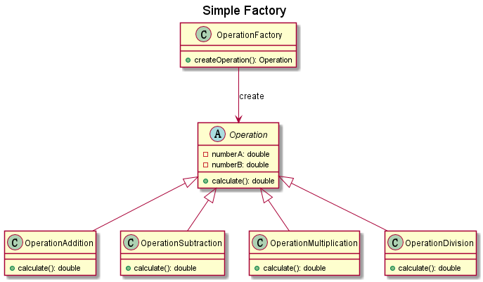

### 2.4 代码实现

```java
import lombok.Data;

@Data
public abstract class Operation {
    private double numberA;
    private double numberB;

    public double calculate() {
        return 0.0;
    }
}
```

```java
public class OperationAddition extends Operation {
    @Override
    public double calculate() {
        return super.getNumberA() + super.getNumberB();
    }
}
```

```java
public class OperationSubtraction extends Operation {
    @Override
    public double calculate() {
        return super.getNumberA() - super.getNumberB();
    }
}
```

```java
public class OperationMultiplication  extends Operation{
    @Override
    public double calculate() {
        return super.getNumberA() * super.getNumberB();
    }
}
```

```java
public class OperationDivision extends Operation {
    @Override
    public double calculate() {
        return super.getNumberA() / super.getNumberB();
    }
}
```

```java
public class OperationFactory {
    public static final String ADD = "+";
    public static final String SUB = "-";
    public static final String MUL = "*";
    public static final String DIV = "/";

    public static Operation createOperation(String type) {
        Operation operation = null;
        switch (type) {
            case ADD:
                operation = new OperationAddition();
                break;
            case SUB:
                operation = new OperationSubtraction();
                break;
            case MUL:
                operation = new OperationMultiplication();
                break;
            case DIV:
                operation = new OperationDivision();
                break;
            default:
        }
        return operation;
    }
}
```

### JDK使用

- [java.util.Calendar](http://docs.oracle.com/javase/8/docs/api/java/util/Calendar.html#getInstance--)
- [java.util.ResourceBundle](http://docs.oracle.com/javase/8/docs/api/java/util/ResourceBundle.html#getBundle-java.lang.String-)
- [java.text.NumberFormat](http://docs.oracle.com/javase/8/docs/api/java/text/NumberFormat.html#getInstance--)
- [java.nio.charset.Charset](http://docs.oracle.com/javase/8/docs/api/java/nio/charset/Charset.html#forName-java.lang.String-)
- [java.net.URLStreamHandlerFactory](http://docs.oracle.com/javase/8/docs/api/java/net/URLStreamHandlerFactory.html#createURLStreamHandler-java.lang.String-)
- [java.util.EnumSet](https://docs.oracle.com/javase/8/docs/api/java/util/EnumSet.html#of-E-)
- [javax.xml.bind.JAXBContext](https://docs.oracle.com/javase/8/docs/api/javax/xml/bind/JAXBContext.html#createMarshaller--)

## 3. 工厂方法模式(Factory Method)


```java
public interface IFactory {
    LeiFeng createLeiFeng();
}
```

```java
import lombok.Data;

@Data
public class LeiFeng {
    private boolean doSweep;
    private boolean doWash;
    private boolean doBuyRice;
    private String whichOne;

    public void sweep() {
        this.doSweep = true;
    }

    public void wash() {
        this.doWash = true;
    }

    public void buyRice() {
        this.doBuyRice = true;
    }
}
```

```java
public class UndergraduateFactory implements IFactory {
    @Override
    public LeiFeng createLeiFeng() {
        return new Undergraduate();
    }
}
```

```java
public class VolunteerFactory implements IFactory {
    @Override
    public LeiFeng createLeiFeng() {
        return new Volunteer();
    }
}
```

```java
public class Undergraduate extends LeiFeng {
    public Undergraduate() {
        setWhichOne(this.getClass().getSimpleName());
    }
}
```

```java
public class Volunteer extends LeiFeng {
    public Volunteer() {
        setWhichOne(this.getClass().getSimpleName());
    }
}
```

## 4. 抽象工厂模式(Abstract Factory)

### 4.1 简介

- **意图**： 提供一个创建一系列相关或相互依赖对象的接口，而无需指定它们具体的类

- **主要解决**： 主要解决接口选择的问题

- **何时使用**： 系统的产品有多于一个的产品族，而系统只消费其中某一族的产品

- **如何解决**： 在一个产品族里面，定义多个产品

### 4.2 适用性

- 一个系统要独立于它的产品的创建、组合和表示时

- 一个系统要由多个产品系列中的一个来配置时

- 当你要强调一系列相关的产品对象的设计以便进行联合使用时

- 当你提供一个产品类库，而只想显示它们的接口而不是实现时

### 4.3 类设计

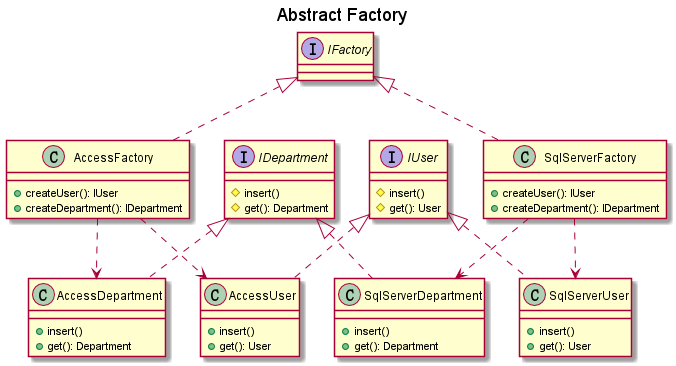

### 4.4 代码实现

```java
public interface IFactory {
    IUser createUser();

    IDepartment createDepartment();
}
```

```java
public interface IUser {
    void insert(User user);

    User get(String id);
}
```

```java
public interface IDepartment {
    void insert(Department department);

    Department get(String id);
}
```

```java
public class AccessFactory implements IFactory {
    @Override
    public IUser createUser() {
        return new AccessUser();
    }

    @Override
    public IDepartment createDepartment() {
        return new AccessDepartment();
    }
}
```

```java
public class SqlServerFactory implements IFactory {
    @Override
    public IUser createUser() {
        return new SqlServerUser();
    }
    @Override
    public IDepartment createDepartment() {
        return new SqlServerDepartment();
    }
}
```

```java
public class AccessDepartment implements IDepartment {
    @Override
    public void insert(Department department) {
        Access.getInstance().addDepartment(department);
    }
    @Override
    public Department get(String id) {
        return Access.getInstance().getDepartment(id);
    }
}
```

```java
public class AccessUser implements IUser {
    @Override
    public void insert(User user) {
        Access.getInstance().addUser(user);
    }
    @Override
    public User get(String id) {
        return Access.getInstance().getUser(id);
    }
}
```

```java
public class SqlServerDepartment implements IDepartment {
    @Override
    public void insert(Department department) {
        SqlServer.getInstance().addDepartment(department);
    }

    @Override
    public Department get(String id) {
        return SqlServer.getInstance().getDepartment(id);
    }
}
```

```java
public class SqlServerUser implements IUser {
    @Override
    public void insert(User user) {
        SqlServer.getInstance().addUser(user);
    }

    @Override
    public User get(String id) {
        return SqlServer.getInstance().getUser(id);
    }
}
```

```java
public class Access {

    private static Access access = new Access();

    private Map<String, User> userMap;
    private Map<String, Department> departmentMap;

    private Access() {
        this.userMap = new HashMap<>();
        this.departmentMap = new HashMap<>();
    }

    public synchronized static Access getInstance() {
        return access;
    }

    public Map<String, User> getUserMap() {
        return userMap;
    }

    public void setUserMap(Map<String, User> userMap) {
        this.userMap = userMap;
    }

    public Map<String, Department> getDepartmentMap() {
        return departmentMap;
    }

    public void setDepartmentMap(Map<String, Department> departmentMap) {
        this.departmentMap = departmentMap;
    }

    public void addUser(User user) {
        this.userMap.put(user.getId(), user);
    }

    public User getUser(String id) {
        return this.userMap.get(id);
    }

    public void addDepartment(Department department) {
        this.departmentMap.put(department.getId(), department);
    }

    public Department getDepartment(String id) {
        return this.departmentMap.get(id);
    }
}
```

```java
@Data
public class Department {
    private String id;
    private String name;

    public Department(String id, String name) {
        this.id = id;
        this.name = name;
    }
}
```

```java
public class SqlServer {

    private static SqlServer sqlServer = new SqlServer();

    private Map<String, User> userMap;
    private Map<String, Department> departmentMap;

    private SqlServer() {
        this.userMap = new HashMap<>();
        this.departmentMap = new HashMap<>();
    }

    public synchronized static SqlServer getInstance() {
        return sqlServer;
    }

    public Map<String, User> getUserMap() {
        return userMap;
    }

    public void setUserMap(Map<String, User> userMap) {
        this.userMap = userMap;
    }

    public Map<String, Department> getDepartmentMap() {
        return departmentMap;
    }

    public void setDepartmentMap(Map<String, Department> departmentMap) {
        this.departmentMap = departmentMap;
    }

    public void addUser(User user) {
        this.userMap.put(user.getId(), user);
    }

    public User getUser(String id) {
        return this.userMap.get(id);
    }

    public void addDepartment(Department department) {
        this.departmentMap.put(department.getId(), department);
    }

    public Department getDepartment(String id) {
        return this.departmentMap.get(id);
    }
}
```

```java
@Data
public class User {
    private String id;
    private String name;

    public User(String id, String name) {
        this.id = id;
        this.name = name;
    }
}
```

### JDK使用

- [javax.xml.parsers.DocumentBuilderFactory](http://docs.oracle.com/javase/8/docs/api/javax/xml/parsers/DocumentBuilderFactory.html)
- [javax.xml.transform.TransformerFactory](http://docs.oracle.com/javase/8/docs/api/javax/xml/transform/TransformerFactory.html#newInstance--)
- [javax.xml.xpath.XPathFactory](http://docs.oracle.com/javase/8/docs/api/javax/xml/xpath/XPathFactory.html#newInstance--)

## 5. 建造者模式(Builder)

### 4.1 简介

**意图**： 将一个复杂的构建与其表示相分离，使得同样的构建过程可以创建不同的表示

**何时使用**： 一些基本部件不会变，而其组合经常变化的时候

### 4.2 适用性 

- 当创建复杂对象的算法应该独立于该对象的组成部分以及它们的装配方式时

- 当构造过程必须允许被构造的对象有不同的表示时

### 4.3 类设计

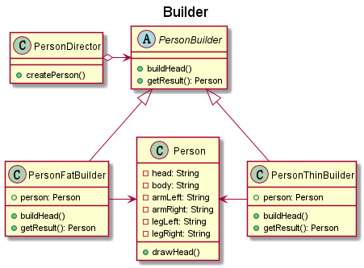

### 4.4 代码实现

```java
public abstract class PersonBuilder {
    public abstract void buildHead();

    public abstract void buildBody();

    public abstract void buildArmLeft();

    public abstract void buildArmRight();

    public abstract void buildLegLeft();

    public abstract void buildLegRight();

    public abstract Person getResult();
}
```

```java
public class PersonDirector {
    public void createPerson(PersonBuilder personBuilder) {
        personBuilder.buildHead();
        personBuilder.buildBody();
        personBuilder.buildArmLeft();
        personBuilder.buildArmRight();
        personBuilder.buildLegLeft();
        personBuilder.buildLegRight();
    }
}
```

```java
public class PersonFatBuilder extends PersonBuilder {
    public static final String FAT = "Fat";

    private Person person;

    public PersonFatBuilder() {
        this.person = new Person();
    }
    @Override
    public void buildHead() {
        person.drawHead(FAT);
    }
    @Override
    public void buildBody() {
        person.drawBody(FAT);
    }
    @Override
    public void buildArmLeft() {
        person.drawArmLeft(FAT);
    }
    @Override
    public void buildArmRight() {
        person.drawArmRight(FAT);
    }
    @Override
    public void buildLegLeft() {
        person.drawLegLeft(FAT);
    }
    @Override
    public void buildLegRight() {
        person.drawLegRight(FAT);
    }
    @Override
    public Person getResult() {
        return person;
    }
}
```

```java
public class PersonThinBuilder extends PersonBuilder {
    public static final String THIN = "Thin";

    private Person person;

    public PersonThinBuilder() {
        this.person = new Person();
    }
    @Override
    public void buildHead() {
        person.drawHead(THIN);
    }
    @Override
    public void buildBody() {
        person.drawBody(THIN);
    }
    @Override
    public void buildArmLeft() {
        person.drawArmLeft(THIN);
    }
    @Override
    public void buildArmRight() {
        person.drawArmRight(THIN);
    }
    @Override
    public void buildLegLeft() {
        person.drawLegLeft(THIN);
    }
    @Override
    public void buildLegRight() {
        person.drawLegRight(THIN);
    }
    @Override
    public Person getResult() {
        return person;
    }
}
```

```java
@Data
public class Person {
    private String head;
    private String body;
    private String armLeft;
    private String armRight;
    private String legLeft;
    private String legRight;

    public static final String HEAD = "head";
    public static final String BODY = "body";
    public static final String ARM_LEFT = "armLeft";
    public static final String ARM_RIGHT = "armRight";
    public static final String LEG_LEFT = "legLeft";
    public static final String LEG_RIGHT = "legRight";

    public void drawHead(String characteristic) {
        this.head = HEAD + characteristic;
    }

    public void drawBody(String characteristic) {
        this.body = BODY + characteristic;
    }

    public void drawArmLeft(String characteristic) {
        this.armLeft = ARM_LEFT + characteristic;
    }

    public void drawArmRight(String characteristic) {
        this.armRight = ARM_RIGHT + characteristic;
    }

    public void drawLegLeft(String characteristic) {
        this.legLeft = LEG_LEFT + characteristic;
    }

    public void drawLegRight(String characteristic) {
        this.legRight = LEG_RIGHT + characteristic;
    }
}
```

### JDK使用

- [java.lang.StringBuilder](http://docs.oracle.com/javase/8/docs/api/java/lang/StringBuilder.html)
- [java.nio.ByteBuffer](http://docs.oracle.com/javase/8/docs/api/java/nio/ByteBuffer.html#put-byte-)
- [java.lang.StringBuffer](http://docs.oracle.com/javase/8/docs/api/java/lang/StringBuffer.html#append-boolean-)
- [java.lang.Appendable](http://docs.oracle.com/javase/8/docs/api/java/lang/Appendable.html)
- [Apache Camel builders](https://github.com/apache/camel/tree/0e195428ee04531be27a0b659005e3aa8d159d23/camel-core/src/main/java/org/apache/camel/builder)

## 5. 原型模式(Prototype)

### 5.1 简介

**意图**： 用原型实例指定创建对象的种类，并且通过拷贝这些原型创建新的对象

**主要解决**： 在运行期建立和删除原型

**如何解决**： 利用已有的一个原型对象，快速地生成和原型对象一样的实例

### 5.2 适用性

- 当要实例化的类是在运行时刻指定时，例如：通过动态装载

- 为了避免创建一个与产品类层次平行的工厂类层次时

- 当一个类的实例只能有几个不同状态组合中的一种时

> 建立相应数目的原型并克隆它们可能比每次用合适的状态手工实例化该类更方便一些

### 5.3 类设计

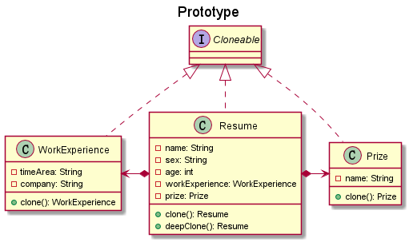

### 5.4 代码实现

```java
@Data
public class Resume implements Cloneable {
    private String name;
    //String 是特殊的引用类型会进行深拷贝
    private String sex;
    //值类型在clone时会复制到新对象
    private int age;
    private WorkExperience workExperience;
    //引用类型会浅拷贝，拷贝时引用的还是同一个对象，要深拷贝需要一层一层拷贝
    private Prize prize;

    public Resume(String name) {
        this.name = name;
        this.workExperience = new WorkExperience();
    }
    public void setPersonalInfo(String sex, int age) {
        this.sex = sex;
        this.age = age;
    }
    public void setWorkExperience(String timeArea, String company) {
        this.workExperience.setTimeArea(timeArea);
        this.workExperience.setCompany(company);
    }
    @Override
    public Resume clone() throws CloneNotSupportedException {
        return (Resume) super.clone();
    }
    public Resume deepClone() throws CloneNotSupportedException {
        Resume resume = (Resume) super.clone();
        resume.workExperience = workExperience.clone();
        resume.prize = prize.clone();
        return resume;
    }
}
```

```java
import lombok.Data;

@Data
public class Prize implements Cloneable {
    private String name;

    public Prize(String name) {
        this.name = name;
    }
    @Override
    public Prize clone() throws CloneNotSupportedException {
        return (Prize) super.clone();
    }
}
```

```java
@Data
public class WorkExperience implements Cloneable {
    private String timeArea;
    private String company;

    public WorkExperience clone() throws CloneNotSupportedException {
        return (WorkExperience) super.clone();
    }
}
```

### JDK使用

- [java.lang.Object#clone()](http://docs.oracle.com/javase/8/docs/api/java/lang/Object.html#clone%28%29)

# 三、行为型

## 1. 责任链模式(Chain Of Responsibility)

### 1.1 简介

**意图**： 避免请求发送者与接收者耦合，让多个对象都有可能接收请求，将这些对象连接成一条链，并且沿着这条链传递请求，直到有对象处理它为止

**何时使用**： 在处理消息的时候以过滤很多道

**如何解决**： 拦截的类都实现统一接口

### 1.2 适用性

- 有多个的对象可以处理一个请求，哪个对象处理该请求运行时刻自动确定

- 想在不明确指定接收者的情况下，向多个对象中的一个提交一个请求

- 可处理一个请求的对象集合应被动态指定

### 1.3 类设计


```java
public abstract class Manager {
    protected String name;
    protected Manager superior;

    public Manager(String name) {
        this.name = name;
    }

    public void setSuperior(Manager superior) {
        this.superior = superior;
    }

    public abstract void requestApplications(Request request);
}
```

```java
public class CommonManager extends Manager {
    public CommonManager(String name) {
        super(name);
    }

    @Override
    public void requestApplications(Request request) {
        if (Request.REQUEST_TYPE_LEAVE.equals(request.getRequestType()) && request.getNumber() <= 2) {
            request.setHandler(this.getClass().getSimpleName());
            request.setStatus(Request.STATUS_YES);
            RequestData.getInstance().getRequestList().add(request);
        } else if (Objects.nonNull(superior)) {
            superior.requestApplications(request);
        }
    }
}
```

```java
import java.util.Objects;

public class Majordomo extends Manager {
    public Majordomo(String name) {
        super(name);
    }
    @Override
    public void requestApplications(Request request) {
        if (Request.REQUEST_TYPE_LEAVE.equals(request.getRequestType()) && request.getNumber() <= 5) {
            request.setHandler(this.getClass().getSimpleName());
            request.setStatus(Request.STATUS_YES);
            RequestData.getInstance().getRequestList().add(request);
        } else if (Objects.nonNull(superior)) {
            superior.requestApplications(request);
        }
    }
}
```

```java
public class GeneralManager extends Manager {
    public GeneralManager(String name) {
        super(name);
    }

    @Override
    public void requestApplications(Request request) {
        request.setHandler(this.getClass().getSimpleName());
        if (Request.REQUEST_TYPE_LEAVE.equals(request.getRequestType())) {
            request.setStatus(Request.STATUS_YES);
        } else if (Request.REQUEST_TYPE_RAISE
                   	.equals(request.getRequestType()) && request.getNumber() <= 500) {
            request.setStatus(Request.STATUS_YES);
        } else if (request.getNumber() > 500) {
            request.setStatus(Request.STATUS_NO);
        }
        RequestData.getInstance().getRequestList().add(request);
    }
}
```

```java
import lombok.Data;

@Data
public class Request {
    private String requestType;
    private String requestContent;
    private int number;

    private String handler;

    private String status;

    public static String REQUEST_TYPE_LEAVE = "leave";
    public static String REQUEST_TYPE_RAISE = "raise";

    public static String STATUS_YES = "yes";
    public static String STATUS_NO = "no";
}
```

```java
import lombok.Getter;
import lombok.Setter;

import java.util.ArrayList;
import java.util.List;

public class RequestData {
    private static RequestData requestData = new RequestData();
    @Getter
    @Setter
    private List<Request> requestList = new ArrayList<>();

    private RequestData() {
    }
    public static RequestData getInstance() {
        return requestData;
    }
}
```

### JDK使用

- [java.util.logging.Logger#log()](http://docs.oracle.com/javase/8/docs/api/java/util/logging/Logger.html#log%28java.util.logging.Level,%20java.lang.String%29)
- [Apache Commons Chain](https://commons.apache.org/proper/commons-chain/index.html)
- [javax.servlet.Filter#doFilter()](http://docs.oracle.com/javaee/7/api/javax/servlet/Filter.html#doFilter-javax.servlet.ServletRequest-javax.servlet.ServletResponse-javax.servlet.FilterChain-)

## 2. 命令模式(Command)

### 2.1 简介

**意图**： 将一个请求封装成一个对象，从而可以用不同的请求对客户进行参数化

**何时使用**： 要对行为进行"记录、撤销/重做、事务"等处理时，将一组行为抽象为对象，实现二者之间的松耦合

**如何解决**： 通过调用者调用接受者执行命令，顺序：调用者→接受者→命令

将命令封装成对象中，具有以下作用：

- 使用命令来参数化其它对象
- 将命令放入队列中进行排队
- 将命令的操作记录到日志中
- 支持可撤销的操作

### 2.2 适用性 

- 抽象出待执行的动作以参数化某对象，可用过程语言中的回调函数表达这种参数化机制

  > 回调函数： 函数先在某处注册，而它将在稍后某个需要的时候被调用

### 2.3 类设计


### 2.4 代码实现

```java
public abstract class Command {
    protected Barbecuer barbecuer;

    public Command(Barbecuer barbecuer) {
        this.barbecuer = barbecuer;
    }

    public abstract void executeCommand();
}
```

```java
import java.util.ArrayList;
import java.util.List;

public class Waiter {

    private List<Command> orders = new ArrayList<>();

    public void setOrder(Command command) {
        if (BakeChickenWingCommand.class.getSimpleName().equals(command.getClass().getSimpleName())) {
            CommandData.getInstance().getLogList().add("No chicken wing");
        } else {
            orders.add(command);
            CommandData.getInstance().getLogList().add(Thread.currentThread().getStackTrace()[1]
              																	.getMethodName() + command.getClass().getSimpleName());
        }
    }

    public void cancelOrder(Command command) {
        orders.remove(command);
        CommandData.getInstance().getLogList().add(Thread.currentThread().getStackTrace()[1]
                                                   	.getMethodName() + command.getClass().getSimpleName());
    }

    public void inform() {
        orders.forEach(Command::executeCommand);
    }
}
```

```java
public class BakeChickenWingCommand extends Command {
    public BakeChickenWingCommand(Barbecuer barbecuer) {
        super(barbecuer);
    }

    @Override
    public void executeCommand() {
        barbecuer.bakeChickenWing();
    }
}
```

```java
public class BakeMuttonCommand extends Command {
    public BakeMuttonCommand(Barbecuer barbecuer) {
        super(barbecuer);
    }
    @Override
    public void executeCommand() {
        barbecuer.bakeMutton();
    }
}
```

```java
public class Barbecuer {
    public void bakeMutton(){
        String methodName = Thread.currentThread().getStackTrace()[1].getMethodName();
        CommandData.getInstance().getBakeList().add(methodName);
    }

    public void bakeChickenWing(){
        String methodName = Thread.currentThread().getStackTrace()[1].getMethodName();
        CommandData.getInstance().getBakeList().add(methodName);
    }
}
```

```java
import lombok.Getter;
import lombok.Setter;

import java.util.ArrayList;
import java.util.List;

public class CommandData {
    private static CommandData commandData = new CommandData();
    @Getter
    @Setter
    private List<String> bakeList = new ArrayList<>();
    @Getter
    @Setter
    private List<String> logList = new ArrayList<>();

    private CommandData() {

    }

    public static CommandData getInstance() {
        return commandData;
    }
}
```

### JDK使用

- [java.lang.Runnable](http://docs.oracle.com/javase/8/docs/api/java/lang/Runnable.html)
- [Netflix Hystrix](https://github.com/Netflix/Hystrix/wiki)
- [javax.swing.Action](http://docs.oracle.com/javase/8/docs/api/javax/swing/Action.html)

## 3. 解释器模式(Interpreter)

### 3.1 简介

**主要解决**： 对于一些固定文法构建一个解释句子的解释器

**何时使用**： 如果特定类型问题发生的频率足够高，则就值得将该问题的各个实例表述为一个简单语言中的句子

**如何解决**： 构建语法树，定义终结符与非终结符

### 3.2 适用性 

- 当有一个语言需要解释执行, 并且你可将该语言中的句子表示为一个抽象语法树时，可使用解释器模式

### 3.3 类设计


### 3.4 代码实现

```java
public abstract class Expression {
    public void interpret(PlayContext context) {
        if (context.getText().length() == 0) {
        } else {
            String playKey = context.getText().substring(0, 1);
            context.setText(context.getText().substring(2));
            double playValue = 
              						Double.valueOf(context.getText().substring(0, context.getText().indexOf(" ")));
            context.setText(context.getText().substring(context.getText().indexOf(" ") + 1));
            execute(playKey, playValue);
        }
    }
    public abstract void execute(String key, double value);
}
```

```java
import lombok.Data;

@Data
public class PlayContext {
    private String text;
}
```

```java
public class Note extends Expression {
    @Override
    public void execute(String key, double value) {
        String note = "";
        switch (key) {
            case "C":
                note = "1";
                break;
            case "D":
                note = "2";
                break;
            case "E":
                note = "3";
                break;
            case "F":
                note = "4";
                break;
            case "G":
                note = "5";
                break;
            case "A":
                note = "6";
                break;
            case "B":
                note = "7";
                break;
        }
        PlayData playData = PlayData.getInstance();
        playData.setPlay(playData.getPlay() + " " + note);
    }
}
```

```java
public class Scale extends Expression {
    @Override
    public void execute(String key, double value) {
        String scale = "";
        switch ((int) value) {
            case 1:
                scale = "bass";
                break;
            case 2:
                scale = "mediant";
                break;
            case 3:
                scale = "alt";
                break;
        }
        PlayData playData = PlayData.getInstance();
        playData.setPlay(playData.getPlay() + " " + scale);
    }
}
```

```java
public class Speed extends Expression {
    @Override
    public void execute(String key, double value) {
        String speed = "";
        if (value < 500) {
            speed = "fast";
        } else if (value >= 1000) {
            speed = "slow";
        } else {
            speed = "medium";
        }
        PlayData playData = PlayData.getInstance();
        playData.setPlay(playData.getPlay()+ " " + speed);
    }
}
```

```java
import lombok.Getter;
import lombok.Setter;

public class PlayData {
    private static PlayData playData = new PlayData();
    @Getter
    @Setter
    private String play = "";

    private PlayData() {
    }

    public static PlayData getInstance() {
        return playData;
    }
}
```

### JDK使用

- [java.util.Pattern](http://docs.oracle.com/javase/8/docs/api/java/util/regex/Pattern.html)
- [java.text.Normalizer](http://docs.oracle.com/javase/8/docs/api/java/text/Normalizer.html)
- All subclasses of [java.text.Format](http://docs.oracle.com/javase/8/docs/api/java/text/Format.html)
- [javax.el.ELResolver](http://docs.oracle.com/javaee/7/api/javax/el/ELResolver.html)

## 4. 迭代器模式(Iterator)

### 4.1 简介

**意图**： 提供一种方法顺序访问一个聚合对象中各个元素，而又无须暴露该对象的内部表示

**主要解决**： 不同的方式来遍历整个整合对象

**何时使用**： 遍历一个聚合对象

**如何解决**： 把在元素之间游走的责任交给迭代器，而不是聚合对象

### 4.2 适用性

- 访问一个聚合对象的内容而无需暴露它的内部表示

- 支持对聚合对象的多种遍历

- 为遍历不同的聚合结构提供一个统一的接口(即, 支持多态迭代)

### 4.3 类设计

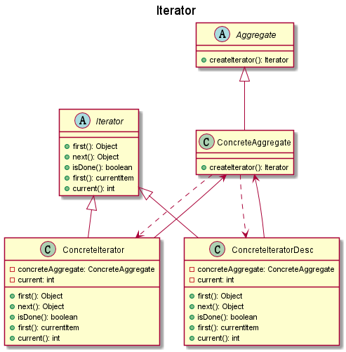

### 4.4 代码实现

```java
public abstract class Aggregate {
    public abstract Iterator createIterator();
}
```

```java
public abstract class Iterator {
    public abstract Object first();
    public abstract Object next();
    public abstract boolean isDone();
    public abstract Object currentItem();
    public abstract int current();
}
```

```java
public class ConcreteAggregate extends Aggregate {
    private List<Object> list = new ArrayList<>();

    @Override
    public Iterator createIterator() {
        return new ConcreteIterator(this);
    }

    public int count() {
        return list.size();
    }

    public Object get(int index) {
        return list.get(index);
    }

    public void add(Object object) {
        list.add(object);
    }

    public void set(int index, Object object) {
        list.set(index, object);
    }
}
```

```java
public class ConcreteIterator extends Iterator {
    private ConcreteAggregate concreteAggregate;
    private int current = 0;

    public ConcreteIterator(ConcreteAggregate concreteAggregate) {
        this.concreteAggregate = concreteAggregate;
    }
    @Override
    public Object first() {
        return concreteAggregate.get(0);
    }
    @Override
    public Object next() {
        Object result = null;
        current++;
        if (current < concreteAggregate.count()) {
            result = concreteAggregate.get(current);
        }
        return result;
    }
    @Override
    public boolean isDone() {
        return current >= concreteAggregate.count();
    }
    @Override
    public Object currentItem() {
        return concreteAggregate.get(current);
    }
    @Override
    public int current() {
        return current;
    }
}
```

```java
public class ConcreteIteratorDesc extends Iterator {
    private ConcreteAggregate concreteAggregate;
    private int current;

    public ConcreteIteratorDesc(ConcreteAggregate concreteAggregate) {
        this.concreteAggregate = concreteAggregate;
        this.current = concreteAggregate.count()-1;
    }
    @Override
    public Object first() {
        return concreteAggregate.get(current);
    }
    @Override
    public Object next() {
        Object result = null;
        current--;
        if (current >= 0) {
            result = concreteAggregate.get(current);
        }
        return result;
    }
    @Override
    public boolean isDone() {
        return current < 0;
    }
    @Override
    public Object currentItem() {
        return concreteAggregate.get(current);
    }
    @Override
    public int current() {
        return current;
    }
}

```

### JDK使用

- [java.util.Iterator](http://docs.oracle.com/javase/8/docs/api/java/util/Iterator.html)
- [java.util.Enumeration](http://docs.oracle.com/javase/8/docs/api/java/util/Enumeration.html)

## 5. 中介者模式(Mediator)

### 5.1 简介

**意图**： 用一个中介对象来封装一系列的对象交互，中介者使各对象不需要显式地相互引用，从而使其耦合松散，而且可以独立地改变它们之间的交互

**何时使用**： 多个类相互耦合，形成网状结构

**如何解决**： 将上述网状结构分离为星型结构

### 5.2 适用性 

- 一组对象以定义良好但复杂的方式进行通信，产生的相互依赖关系结构混乱且难以理解

- 一个对象引用其他很多对象并且直接与这些对象通信，导致难以复用该对象

- 想定制一个分布在多个类中的行为，而又不想生成太多的子类

### 5.3 类设计

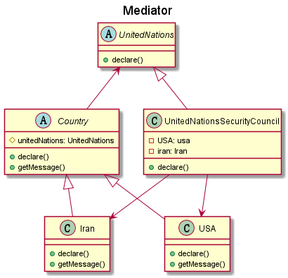

### 5.4 代码实现

```java
public abstract class UnitedNations {
    public abstract void declare(String message, Country country);
}
```

```java
public abstract class Country {
    protected UnitedNations unitedNations;

    public Country(UnitedNations unitedNations) {
        this.unitedNations = unitedNations;
    }
    public abstract void declare(String message);

    public abstract void getMessage(String message);
}
```

```java
import lombok.Getter;
import lombok.Setter;
public class UnitedNationsSecurityCouncil extends  UnitedNations {
    @Getter
    @Setter
    private USA usa;
    @Getter
    @Setter
    private Iran iran;
    @Override
    public void declare(String message, Country country) {
        if (country instanceof USA){
            iran.getMessage(message);
        }else if(country instanceof Iran){
            usa.getMessage(message);
        }
    }
}
```

```java
public class Iran extends Country {
    public Iran(UnitedNations unitedNations) {
        super(unitedNations);
    }
    @Override
    public void declare(String message) {
        unitedNations.declare(message, this);
    }
    @Override
    public void getMessage(String message) {
        MessageData.getInstance().getList().add(
          																	this.getClass().getSimpleName() 
          																	+ Thread.currentThread().getStackTrace()[1].getMethodName() 
          																	+ message);
    }
}
```

```java
public class USA extends Country {
    public USA(UnitedNations unitedNations) {
        super(unitedNations);
    }
    @Override
    public void declare(String message) {
        unitedNations.declare(message, this);
    }
    @Override
    public void getMessage(String message) {
        MessageData.getInstance().getList().add(
          																	this.getClass().getSimpleName() 
          																	+ Thread.currentThread().getStackTrace()[1].getMethodName() 
          																	+ message);
    }
}
```

```java
import lombok.Getter;
import lombok.Setter;
import java.util.ArrayList;
import java.util.List;

public class MessageData {
    private static MessageData messageData = new MessageData();
    @Getter
    @Setter
    private List<String> list = new ArrayList<>();

    private MessageData() {
    }

    public static MessageData getInstance() {
        return messageData;
    }
}
```

### JDK使用

- All scheduleXXX() methods of [java.util.Timer](http://docs.oracle.com/javase/8/docs/api/java/util/Timer.html)
- [java.util.concurrent.Executor#execute()](http://docs.oracle.com/javase/8/docs/api/java/util/concurrent/Executor.html#execute-java.lang.Runnable-)
- submit() and invokeXXX() methods of [java.util.concurrent.ExecutorService](http://docs.oracle.com/javase/8/docs/api/java/util/concurrent/ExecutorService.html)
- scheduleXXX() methods of [java.util.concurrent.ScheduledExecutorService](http://docs.oracle.com/javase/8/docs/api/java/util/concurrent/ScheduledExecutorService.html)
- [java.lang.reflect.Method#invoke()](http://docs.oracle.com/javase/8/docs/api/java/lang/reflect/Method.html#invoke-java.lang.Object-java.lang.Object...-)

## 6. 备忘录模式(Memento)

### 6.1 简介

**意图**： 在不破坏封装性的前提下，捕获一个对象的内部状态，并在该对象之外保存这个状态

**何时使用**： 需要记录一个对象的内部状态，为了允许用户取消不确定或错误的操作，能够恢复到他原先的状态，使得他有"后悔药"可吃

**如何解决：**通过一个备忘录类专门存储对象状态

### 6.2 适用性 

- 必须保存一个对象在某一个时刻的(部分)状态, 这样以后需要时它才能恢复到先前的状态

- 如果一个用接口来让其它对象直接得到这些状态，将会暴露对象的实现细节并破坏对象的封装性

### 6.3 类设计


### 6.4 代码实现

```java
import lombok.Data;

@Data
public class GameRole {
    private int vitality;
    private int attack;
    private int defense;

    public void initState() {
        this.vitality = 100;
        this.attack = 100;
        this.defense = 100;
    }

    public void fight() {
        this.vitality = 0;
        this.attack = 0;
        this.defense = 0;
    }

    public RoleStateMemento saveState() {
        return new RoleStateMemento(vitality, attack, defense);
    }

    public void recoveryState(RoleStateMemento roleStateMemento) {
        this.vitality = roleStateMemento.getVitality();
        this.attack = roleStateMemento.getAttack();
        this.defense = roleStateMemento.getDefense();
    }
}
```

```java
import lombok.AllArgsConstructor;
import lombok.Data;

@Data
@AllArgsConstructor
public class RoleStateMemento {
    private int vitality;
    private int attack;
    private int defense;
}
```

```java
import lombok.Data;

@Data
public class RoleStateCaretaker {
    private RoleStateMemento roleStateMemento;
}
```

### JDK使用

- java.io.Serializable

## 7. 观察者模式(Observer)

### 7.1 简介

**意图**： 定义对象间的一种一对多的依赖关系，当一个对象的状态发生改变时，所有依赖于它的对象都得到通知并被自动更新

**主要解决**： 一个对象状态改变给其他对象通知的问题，而且要考虑到易用和低耦合，保证高度的协作

**何时使用**： 一个对象(目标对象)的状态发生改变，所有的依赖对象(观察者对象)都将得到通知，进行广播通知

**如何解决**： 使用面向对象技术，可以将这种依赖关系弱化

### 7.2 适用性 

当一个抽象模型有两个方面, 其中一个方面依赖于另一方面。将这二者封装在独立的对象中以使它们可以各自独立地改变和复用

当对一个对象的改变需要同时改变其它对象, 而不知道具体有多少对象有待改变

当一个对象必须通知其它对象，而它又不能假定其它对象是谁。换言之, 你不希望这些对象是紧密耦合的

### 7.3 类设计


### 7.4 代码实现

```java
public interface Subject {
    void attach(Observer observer);
    void detach(Observer observer);
    void inform();
    String getStatus();
    void setStatus(String status);
}
```

```java
public abstract class Observer {
    protected String name;
    protected Subject subject;

    public Observer(String name, Subject subject) {
        this.name = name;
        this.subject = subject;
    }
    public abstract void update();
}
```

```java
import lombok.Getter;
import lombok.Setter;

@Getter
@Setter
public class StockObserver extends Observer {
    private boolean watchingStock;
    private String status;

    public StockObserver(String name, Subject subject) {
        super(name, subject);
        this.watchingStock = true;
    }
    @Override
    public void update() {
        this.watchingStock = false;
        this.status = subject.getStatus();
    }
}
```

```java
import lombok.Getter;
import lombok.Setter;

@Setter
@Getter
public class NBAObserver extends Observer {
    private boolean watchingNBA;
    private String status;

    public NBAObserver(String name, Subject subject) {
        super(name, subject);
        this.watchingNBA = true;
    }
    @Override
    public void update() {
        this.watchingNBA = false;
        this.status = subject.getStatus();
    }
}
```

```java
import java.util.ArrayList;
import java.util.List;

public class Boss implements Subject {
    private List<Observer> observerList = new ArrayList<>();
    private String status;

    @Override
    public void attach(Observer observer) {
        observerList.add(observer);
    }
    @Override
    public void detach(Observer observer) {
        observerList.remove(observer);
    }
    @Override
    public void inform() {
        //当所需要通知的对象方法不一致时，得使用事件委托，可以用放射来获取委托的参数和方法
        observerList.forEach(Observer::update);
    }
    @Override
    public String getStatus() {
        return status;
    }
    @Override
    public void setStatus(String status) {
        this.status = status;
    }
}
```

### JDK使用

- [java.util.Observer](http://docs.oracle.com/javase/8/docs/api/java/util/Observer.html)
- [java.util.EventListener](http://docs.oracle.com/javase/8/docs/api/java/util/EventListener.html)
- [javax.servlet.http.HttpSessionBindingListener](http://docs.oracle.com/javaee/7/api/javax/servlet/http/HttpSessionBindingListener.html)
- [RxJava](https://github.com/ReactiveX/RxJava)

## 8. 状态模式(State)

### 8.1 简介

**意图**： 允许对象在内部状态发生改变时改变它的行为，对象看起来好像修改了它的类

**主要解决**： 对象的行为依赖于它的状态(属性)，并且可以根据它的状态改变而改变它的相关行为

**何时使用**： 代码中包含大量与对象状态有关的条件语句

**如何解决**： 将各种具体的状态类抽象出来

### 8.2 适用性 

- 一个对象的行为取决于它的状态，并且它必须在运行时刻根据状态改变它的行为

### 8.3 类设计

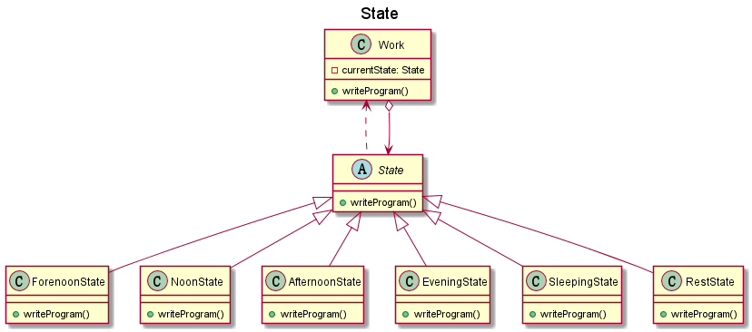

### 8.4 代码实现

```java
import lombok.Data;

@Data
public class Work {
    private int hour;
    private boolean finished = false;
    private State currentState;
    private String stateName;

    public Work() {
        currentState = new ForenoonState();
    }

    public void writeProgram() {
        currentState.writeProgram(this);
    }
}
```

```java
public abstract class State {
    public abstract void writeProgram(Work work);
}
```

```java
public class AfternoonState extends State {
    @Override
    public void writeProgram(Work work) {
        if (work.getHour() < 17) {
            work.setStateName(this.getClass().getSimpleName());
        } else {
            work.setCurrentState(new EveningState());
            work.writeProgram();
        }
    }
}
```

```java
public class EveningState extends State {
    @Override
    public void writeProgram(Work work) {
        if (work.isFinished()) {
            work.setCurrentState(new RestState());
            work.writeProgram();
        } else {
            if (work.getHour() < 21) {
                work.setStateName(this.getClass().getSimpleName());
            } else {
                work.setCurrentState(new SleepingState());
                work.writeProgram();
            }
        }
    }
}
```

```java
public class ForenoonState extends State {
    @Override
    public void writeProgram(Work work) {
        if(work.getHour()<12){
            work.setStateName(this.getClass().getSimpleName());
        }else {
            work.setCurrentState(new NoonState());
            work.writeProgram();
        }
    }
}
```

```java
public class NoonState extends State {
    @Override
    public void writeProgram(Work work) {
        if (work.getHour() < 13) {
            work.setStateName(this.getClass().getSimpleName());
        } else {
            work.setCurrentState(new AfternoonState());
            work.writeProgram();
        }
    }
}
```

```java
public class RestState extends State {
    @Override
    public void writeProgram(Work work) {
        work.setStateName(this.getClass().getSimpleName());
    }
}
```

```java
public class SleepingState extends State {
    @Override
    public void writeProgram(Work work) {
        if (work.isFinished()) {
            work.setCurrentState(new RestState());
            work.writeProgram();
        }else{
            work.setStateName(this.getClass().getSimpleName());
        }
    }
}
```

## 9. 策略模式(Strategy)

### 9.1 简介

**意图**： 定义一系列的算法，把它们一个个封装起来，并且使它们可相互替换

**主要解决**： 在有多种算法相似的情况下，使用 if...else 所带来的复杂和难以维护

**何时使用**： 一个系统有许多许多类，而区分它们的只是他们直接的行为

**如何解决**： 将这些算法封装成一个一个的类，任意地替换

### 9.2 适用性 

- “策略”提供了一种用多个行为中的一个行为来配置一个类的方法

- 一个类定义了多种行为，并且这些行为在这个类的操作中以多个条件语句的形式出现，将相关的条件分支移入它们各自的 Strategy 类中以代替这些条件语句

### 9.3 类设计

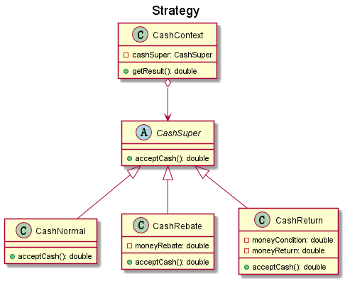

### 9.4 代码实现

```java
public class CashContext {
    private CashSuper cashSuper;

    public CashContext(CashSuper cashSuper) {
        this.cashSuper = cashSuper;
    }
    public double getResult(double money) {
        return cashSuper.acceptCash(money);
    }
}
```

```java
public abstract class CashSuper {
    public double acceptCash(double money) {
        return money;
    }
}
```

```java
public class CashNormal extends CashSuper {
    @Override
    public double acceptCash(double money) {
        return super.acceptCash(money);
    }
}
```

```java
public class CashRebate extends CashSuper {
    private double moneyRebate;

    public CashRebate(double moneyRebate) {
        this.moneyRebate = moneyRebate;
    }
    @Override
    public double acceptCash(double money) {
        return money * moneyRebate;
    }
}
```

```java
public class CashReturn extends CashSuper {
    private double moneyCondition;
    private double moneyReturn;

    public CashReturn(double moneyCondition, double moneyReturn) {
        this.moneyCondition = moneyCondition;
        this.moneyReturn = moneyReturn;
    }
    @Override
    public double acceptCash(double money) {
        return money - Math.floor(money / moneyCondition) * moneyReturn;
    }
}
```

### JDK使用

- java.util.Comparator#compare()
- javax.servlet.http.HttpServlet
- javax.servlet.Filter#doFilter()

## 10. 模板模式(Template)

### 10.1 简介

**意图**： 定义一个操作中的算法的骨架，而将一些步骤延迟到子类中

**主要解决**： 一些方法通用，却在每一个子类都重新写了这一方法

**何时使用**： 有一些通用的方法

**如何解决**： 将这些通用算法抽象出来

**关键代码**： 在抽象类实现，其他步骤在子类实现

### 10.2 适用性 

- 一次性实现一个算法的不变的部分，并将可变的行为留给子类来实现

### 10.3 类设计


### 10.4 代码实现

```java
import lombok.Data;

@Data
public abstract class TestPaper {
    private String answer1;
    private String answer2;
    private String answer3;

    public static final String TEST_QUESTION_ONE = "testQuestionOne:";
    public static final String TEST_QUESTION_TWO = "testQuestionTwo:";
    public static final String TEST_QUESTION_THREE = "testQuestionThree:";

    public void testQuestionOne() {
        this.answer1 = TEST_QUESTION_ONE + answerOne();
    }
    public void testQuestionTwo() {
        this.answer2 = TEST_QUESTION_TWO + answerTwo();
    }
    public void testQuestionThree() {
        this.answer3 = TEST_QUESTION_THREE + answerThree();
    }

    protected abstract String answerOne();
    protected abstract String answerTwo();
    protected abstract String answerThree();
}
```

```java
public class TestPaperA extends TestPaper {
    public static final String ANSWER_ONE = "A";
    public static final String ANSWER_TWO = "B";
    public static final String ANSWER_THREE = "C";

    protected String answerOne() {
        return ANSWER_ONE;
    }

    protected String answerTwo() {
        return ANSWER_TWO;
    }

    protected String answerThree() {
        return ANSWER_THREE;
    }
}
```

```java
public class TestPaperB extends TestPaper {
    public static final String ANSWER_ONE = "B";
    public static final String ANSWER_TWO = "C";
    public static final String ANSWER_THREE = "D";

    protected String answerOne() {
        return ANSWER_ONE;
    }

    protected String answerTwo() {
        return ANSWER_TWO;
    }

    protected String answerThree() {
        return ANSWER_THREE;
    }
}
```

### JDK使用

- java.util.Collections#sort()
- java.io.InputStream#skip()
- java.io.InputStream#read()
- java.util.AbstractList#indexOf()

## 11. 访问者模式(Visitor)

### 11.1 简介

**主要解决**： 稳定的数据结构和易变的操作耦合问题

**何时使用**： 需要对一个对象结构中的对象进行很多不同的并且不相关的操作，而需要避免让这些操作"污染"这些对象的类，使用访问者模式将这些封装到类中

**如何解决**： 在被访问的类里面加一个对外提供接待访问者的接口

**关键代码**： 在数据基础类里面有一个方法接受访问者，将自身引用传入访问者

### 11.2 适用性 

- 一次性实现一个算法的不变的部分，并将可变的行为留给子类来实现

### 11.3 类设计


### 11.4 代码实现

```java
public abstract class Person {
    public abstract void accept(Action action);
}
```

```java
import java.util.ArrayList;
import java.util.List;

public class ObjectStructure {
    private List<Person> personList = new ArrayList<>();

    public void attach(Person person) {
        personList.add(person);
    }
    public void detach(Person person) {
        personList.remove(person);
    }
    public void display(Action action) {
        personList.forEach(item -> item.accept(action));
    }
}
```

```java
public class Man extends Person {
    @Override
    public void accept(Action action) {
        action.getManConclusion(this);
    }
}
```

```java
public class Woman extends Person {
    @Override
    public void accept(Action action) {
        action.getWomanConclusion(this);
    }
}
```

```java
public abstract class Action {
    public abstract void getManConclusion(Man man);
    public abstract void getWomanConclusion(Woman woman);
}
```

```java
public class Amativeness extends Action {
    @Override
    public void getManConclusion(Man man) {
        ConclusionData.getInstance().getList()
          				.add(man.getClass().getSimpleName() + this.getClass().getSimpleName());
    }

    @Override
    public void getWomanConclusion(Woman woman) {
        ConclusionData.getInstance().getList()
          				.add(woman.getClass().getSimpleName() + this.getClass().getSimpleName());
    }
}
```

```java
public class Marriage extends Action {
    @Override
    public void getManConclusion(Man man) {
        ConclusionData.getInstance().getList()
          				.add(man.getClass().getSimpleName() + this.getClass().getSimpleName());
    }

    @Override
    public void getWomanConclusion(Woman woman) {
        ConclusionData.getInstance().getList()
          				.add(woman.getClass().getSimpleName() + this.getClass().getSimpleName());
    }
}
```

```java
public class Success extends Action {
    @Override
    public void getManConclusion(Man man) {
        ConclusionData.getInstance().getList()
          				.add(man.getClass().getSimpleName() + this.getClass().getSimpleName());
    }

    @Override
    public void getWomanConclusion(Woman woman) {
        ConclusionData.getInstance().getList()
          				.add(woman.getClass().getSimpleName() + this.getClass().getSimpleName());
    }
}
```

```java
public class Failing extends Action {
    @Override
    public void getManConclusion(Man man) {
        ConclusionData.getInstance().getList()
          				.add(man.getClass().getSimpleName() + this.getClass().getSimpleName());
    }

    @Override
    public void getWomanConclusion(Woman woman) {
        ConclusionData.getInstance().getList()
          				.add(woman.getClass().getSimpleName() + this.getClass().getSimpleName());
    }
}
```

```java
import lombok.Getter;
import lombok.Setter;
import java.util.ArrayList;
import java.util.List;

public class ConclusionData {
    private static ConclusionData conclusionData = new ConclusionData();
    @Getter
    @Setter
    private List<String> list = new ArrayList<>();

    private ConclusionData() {
    }

    public static ConclusionData getInstance() {
        return conclusionData;
    }
}
```

### JDK使用

- javax.lang.model.element.Element and javax.lang.model.element.ElementVisitor
- javax.lang.model.type.TypeMirror and javax.lang.model.type.TypeVisitor

# 四、结构型

## 1. 适配器模式(Adapter)

### 1.1 简介

**意图**： 将一个类的接口转换成客户希望的另外一个接口，使得原本不兼容的接口可以一起工作

**主要解决**： 在软件系统中，常常要将一些"现存的对象"放到新的环境中，而新环境要求的接口不能满足

**如何解决**： 继承或依赖（推荐）

### 1.2 适用性

- 使用一个已经存在的类，而它的接口不符合你的需求

- 创建一个可以复用的类，该类可以与其他不相关的类或不可预见的类协同工作

### 1.3 类设计

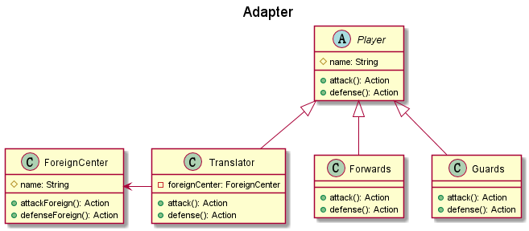

### 1.4 代码实现

```java
public abstract class Player {
    protected String name;

    public Player(String name) {
        this.name = name;
    }
    public abstract Action attack();
    public abstract Action defense();
}
```

```java
public class Translator extends Player {
    private ForeignCenter foreignCenter;

    public Translator(String name) {
        super(name);
        this.foreignCenter = new ForeignCenter(name);
    }
    @Override
    public Action attack() {
        return foreignCenter.attackForeign();
    }
    @Override
    public Action defense() {
        return foreignCenter.defenseForeign();
    }
}
```

```java
public class ForeignCenter {
    private String name;

    public ForeignCenter(String name) {
        this.name = name;
    }

    public Action attackForeign() {
        return new Action(this.name, Thread.currentThread().getStackTrace()[1].getClassName(), 
                          		Thread.currentThread().getStackTrace()[1].getMethodName());
    }

    public Action defenseForeign() {
        return new Action(this.name, Thread.currentThread().getStackTrace()[1].getClassName(), 
                          		Thread.currentThread().getStackTrace()[1].getMethodName());
    }
}
```

```java
public class Forwards extends Player {
    public Forwards(String name) {
        super(name);
    }

    @Override
    public Action attack() {
        return new Action(super.name, Thread.currentThread().getStackTrace()[1].getClassName(), 
                          		Thread.currentThread().getStackTrace()[1].getMethodName());
    }

    @Override
    public Action defense() {
        return new Action(super.name, Thread.currentThread().getStackTrace()[1].getClassName(), 
                          		Thread.currentThread().getStackTrace()[1].getMethodName());
    }
}
```

```java
public class Guards extends Player {
    public Guards(String name) {
        super(name);
    }

    @Override
    public Action attack() {
        return new Action(super.name, Thread.currentThread().getStackTrace()[1].getClassName(), 
                          		Thread.currentThread().getStackTrace()[1].getMethodName());
    }

    @Override
    public Action defense() {
        return new Action(super.name, Thread.currentThread().getStackTrace()[1].getClassName(), 
                          		Thread.currentThread().getStackTrace()[1].getMethodName());
    }

}
```

```java
import lombok.Data;
import java.util.UUID;

@Data
public class Action {
    private String id;
    private String name;
    private String clazz;
    private String method;

    public Action(String name, String clazz, String method) {
        this.id = UUID.randomUUID().toString();
        this.name = name;
        this.clazz = clazz;
        this.method = method;
    }
}
```

### JDK使用

- [java.util.Arrays#asList()](http://docs.oracle.com/javase/8/docs/api/java/util/Arrays.html#asList%28T...%29)
- [java.util.Collections#list()](https://docs.oracle.com/javase/8/docs/api/java/util/Collections.html#list-java.util.Enumeration-)
- [java.util.Collections#enumeration()](https://docs.oracle.com/javase/8/docs/api/java/util/Collections.html#enumeration-java.util.Collection-)
- [javax.xml.bind.annotation.adapters.XMLAdapter](http://docs.oracle.com/javase/8/docs/api/javax/xml/bind/annotation/adapters/XmlAdapter.html#marshal-BoundType-)

## 2. 桥接模式(Bridge)

### 2.1 简介

**意图**： 将抽象部分与实现部分分离，使它们都可以独立的变化

**主要解决**： 在有多种可能会变化的情况下，用继承会造成类爆炸问题，扩展起来不灵活

**何时使用**： 实现系统可能有多个角度分类，每一种角度都可能变化

**如何解决**： 把这种多角度分类分离出来，让它们独立变化，减少它们之间耦合

### 2.2 适用性

- 不希望在抽象和实现部分之间有固定的绑定关

- 类的抽象及其实现都应该可以通过生成子类的方法加以扩

### 2.3 类设计


### 2.4 代码实现

```java
public abstract class HandsetSoft {
    public abstract void run();
}
```

```java
public abstract class HandsetBrand {
    protected HandsetSoft handsetSoft;

    public void setHandsetSoft(HandsetSoft handsetSoft) {
        this.handsetSoft = handsetSoft;
    }
    public abstract void run();
}
```

```java
public class HandsetBrandM extends HandsetBrand {
    @Override
    public void run() {
        handsetSoft.run();
    }
}
```

```java
public class HandsetBrandN extends HandsetBrand {
    @Override
    public void run() {
        handsetSoft.run();
    }
}
```

```java
public class HandsetAddressList extends HandsetSoft {
    @Override
    public void run() {
        HandsetData.getInstance().getList().add(this.getClass().getSimpleName());
    }
}
```

```java
public class HandsetGame extends HandsetSoft {
    @Override
    public void run() {
        HandsetData.getInstance().getList().add(this.getClass().getSimpleName());
    }
}
```

```java
import lombok.Getter;
import lombok.Setter;
import java.util.ArrayList;
import java.util.List;

public class HandsetData {
    private static HandsetData handsetData = new HandsetData();
    @Getter
    @Setter
    private List<String> list =new ArrayList<>();

    private HandsetData() {
    }

    public static HandsetData getInstance(){
        return handsetData;
    }
}
```

### JDK使用

- AWT (It provides an abstraction layer which maps onto the native OS the windowing support.)
- JDBC

## 3. 组合模式(Composite)

### 3.1 简介

**意图**： 将对象组合成树形结构以表示"部分-整体"的层次结构，使得用户对单个对象和组合对象的使用具有一致性

**主要解决**： 模糊了简单元素和复杂元素的概念，客户程序可以像处理简单元素一样来处理复杂元素，从而使得客户程序与复杂元素的内部结构解耦

**如何解决**： 树枝和叶子实现统一接口，树枝内部组合该接口

### 3.2 适用性

- 想表示对象的部分-整体层次结构

- 希望用户忽略组合对象与单个对象的不同，用户将统一地使用组合结构中的所有对象

### 3.3 类设计


### 3.4 代码实现

```java
public abstract class Company {
    protected String name;

    public Company(String name) {
        this.name = name;
    }
    public abstract void add(Company company);
    public abstract void remove(Company company);
    public abstract void display(int depth);
    public abstract void lineOfDuty();
}
```

```java
import java.util.ArrayList;
import java.util.List;

public class ConcreteCompany extends Company {
    private List<Company> companyList;

    public ConcreteCompany(String name) {
        super(name);
        this.companyList = new ArrayList<>();
    }
    @Override
    public void add(Company company) {
        companyList.add(company);
    }
    @Override
    public void remove(Company company) {
        companyList.remove(company);
    }
    @Override
    public void display(int depth) {
        Database.getInstance().addDuty(new Duty(this.name, depth));
        companyList.forEach(item -> item.display(depth + 2));
    }
    @Override
    public void lineOfDuty() {
        companyList.forEach(Company::lineOfDuty);
    }
}
```

```java
public class FinanceCompany extends Company {
    public FinanceCompany(String name) {
        super(name);
    }
    @Override
    public void add(Company company) {
    }
    @Override
    public void remove(Company company) {
    }
    @Override
    public void display(int depth) {
        Database.getInstance().addDuty(new Duty(this.name, depth));
    }
    @Override
    public void lineOfDuty() {
        Database.getInstance().getDuty(this.name).setDutyName(this.getClass().getSimpleName());
    }
}
```

```java
public class HRCompany extends Company {
        super(name);
    }
    @Override
    public void add(Company company) {
    }
    @Override
    public void remove(Company company) {
    }
    @Override
    public void display(int depth) {
        Database.getInstance().addDuty(new Duty(this.name, depth));
    }
    @Override
    public void lineOfDuty() {
        Database.getInstance().getDuty(this.name).setDutyName(this.getClass().getSimpleName());
    }
}
```

```java
import java.util.HashMap;
import java.util.Map;

public class Database {
    private static Database database = new Database();
    private Map<String, Duty> dutyMap;

    private Database() {
        this.dutyMap = new HashMap<>();
    }
    public synchronized static Database getInstance() {
        return database;
    }
    public void addDuty(Duty duty) {
        this.dutyMap.put(duty.getCompanyName(), duty);
    }
    public Duty getDuty(String companyName) {
        return this.dutyMap.get(companyName);
    }
}
```

```java
import lombok.Data;

@Data
public class Duty {
    private String companyName;
    private int depth;
    private String dutyName;

    public Duty(String companyName, int depth) {
        this.companyName = companyName;
        this.depth = depth;
    }
}
```

### JDK使用

- javax.swing.JComponent#add(Component)
- java.awt.Container#add(Component)
- java.util.Map#putAll(Map)
- java.util.List#addAll(Collection)
- java.util.Set#addAll(Collection)

## 4. 装饰器模式(Decorator)

### 4.1 简介

**意图**： 动态地给一个对象添加一些额外的职责

**主要解决**：扩展类时，由于继承为类引入静态特征，并且随着扩展功能的增多，子类会很膨胀

**何时使用：**在不想增加很多子类的情况下扩展类

**如何解决：**将具体功能职责划分，同时继承装饰者模式

### 4.2 适用性

- 在不影响其他对象的情况下，以动态、透明的方式给单个对象添加职责

### 4.3 类设计

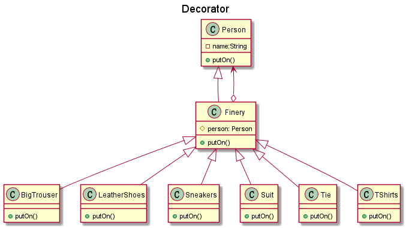

### 4.4 代码实现

```java
import lombok.Getter;
import java.util.List;

public class Person {
    @Getter
    private String name;

    public Person() {
    }
    public Person(String name) {
        this.name = name;
    }
    public void show() {
        System.out.println("装扮的 " + name);
    }
    public List<String> putOn(List<String> fineryList) {
        fineryList.add(Person.class.getSimpleName());
        return fineryList;
    }
}
```

```java
import java.util.List;

public class Finery extends Person {
    protected Person component;

    public void decorate(Person component) {
        this.component = component;
    }
    @Override
    public void show() {
        component.show();
    }
    @Override
    public List<String> putOn(List<String> fineryList) {
        return component.putOn(fineryList);
    }
}
```

```java
import java.util.List;

public class BigTrouser extends Finery {
    @Override
    public void show() {
        System.out.println(this.getClass().getSimpleName());
        super.show();
    }
    @Override
    public List<String> putOn(List<String> fineryList) {
        fineryList.add(this.getClass().getSimpleName());
        return super.putOn(fineryList);
    }
}
```

```java
import java.util.List;

public class LeatherShoes extends Finery {
    @Override
    public void show() {
        System.out.println(this.getClass().getSimpleName());
        super.show();
    }
    @Override
    public List<String> putOn(List<String> fineryList) {
        fineryList.add(this.getClass().getSimpleName());
        return super.putOn(fineryList);
    }
}
```

```java
import java.util.List;

public class Sneakers extends Finery {
    @Override
    public void show() {
        System.out.println(this.getClass().getSimpleName());
        super.show();
    }
    @Override
    public List<String> putOn(List<String> fineryList) {
        fineryList.add(this.getClass().getSimpleName());
        return super.putOn(fineryList);
    }
}
```

```java
import java.util.List;

public class Suit extends Finery {
    @Override
    public void show() {
        System.out.println(this.getClass().getSimpleName());
        super.show();
    }
    @Override
    public List<String> putOn(List<String> fineryList) {
        fineryList.add(this.getClass().getSimpleName());
        return super.putOn(fineryList);
    }
}
```

```java
import java.util.List;

public class Tie extends Finery {
    @Override
    public void show() {
        System.out.println(this.getClass().getSimpleName());
        super.show();
    }
    @Override
    public List<String> putOn(List<String> fineryList) {
        fineryList.add(this.getClass().getSimpleName());
        return super.putOn(fineryList);
    }
}
```

```java
import java.util.List;

public class TShirts extends Finery {
    @Override
    public void show() {
        System.out.println(this.getClass().getSimpleName());
        super.show();
    }
    @Override
    public List<String> putOn(List<String> fineryList) {
        fineryList.add(this.getClass().getSimpleName());
        return super.putOn(fineryList);
    }
}
```

### JDK使用

- java.io.BufferedInputStream(InputStream)
- java.io.DataInputStream(InputStream)
- java.io.BufferedOutputStream(OutputStream)
- java.util.zip.ZipOutputStream(OutputStream)
- java.util.Collections#checked[List|Map|Set|SortedSet|SortedMap]()

## 5. 外观模式(Facade)

### 5.1 简介

**意图**： 为子系统中的一组接口提供一个一致的界面，定义了一个高层接口，使得这一子系统更加容易使用

**主要解决**： 降低访问复杂系统的内部子系统时的复杂度，简化客户端与之的接口

**如何解决**： 客户端不与系统耦合，外观类与系统耦合

### 5.2 适用性

- 需要构建一个层次结构的子系统时，使用 facade 模式定义子系统中每层的入口点
- 如果子系统之间相互依赖，可以让它们仅通过 facade 进行通讯，从而简化它们之间的依赖关系

### 5.3 类设计


### 5.4 代码实现

```java
import java.util.List;

public class Fund {
    private NationalDept nationalDept;
    private Realty realty;
    private Stock stock;

    public Fund() {
        this.nationalDept = new NationalDept();
        this.realty = new Realty();
        this.stock = new Stock();
    }
    public void buyFund(List<String> assetList) {
        nationalDept.buy(assetList);
        realty.buy(assetList);
        stock.buy(assetList);
    }
    public void sellFund(List<String> assetList) {
        nationalDept.sell(assetList);
        realty.sell(assetList);
        stock.sell(assetList);
    }
}
```

```java
import java.util.List;

public class NationalDept {
    public void buy(List<String> assetList) {
        assetList.add(this.getClass().getSimpleName());
    }

    public void sell(List<String> assetList) {
        assetList.remove(this.getClass().getSimpleName());
    }
}
```

```java
import java.util.List;

public class Realty {
    public void buy(List<String> assetList) {
        assetList.add(this.getClass().getSimpleName());
    }

    public void sell(List<String> assetList) {
        assetList.remove(this.getClass().getSimpleName());
    }
}
```

```java
import java.util.List;

public class Stock {
    public void buy(List<String> assetList) {
        assetList.add(this.getClass().getSimpleName());
    }

    public void sell(List<String> assetList) {
        assetList.remove(this.getClass().getSimpleName());
    }
}
```

## 6. 享元模式(Flyweight)

### 6.1 简介

**意图**： 运用共享技术有效地支持大量细粒度的对象

**主要解决**： 在有大量对象时，可能造成内存溢出，把其中共同的部分抽象出来，如果有相同的业务请求，直接返回在内存中已有的对象，避免重新创建

**如何解决**： 用唯一标识码判断，如果在内存中有，则返回这个唯一标识码所标识的对象

### 6.2 适用性

- 一个应用程序使用了大量的对象

- 完全由于使用大量的对象，造成很大的存储开销

- 对象的大多数状态都可变为外部状态

### 6.3 类设计

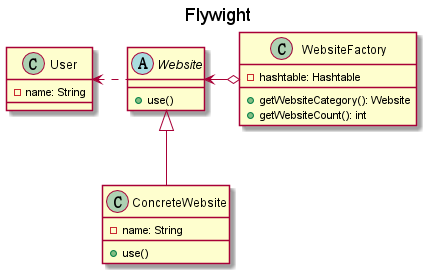

### 6.4 代码实现

```java
import java.util.Hashtable;

public class WebsiteFactory {
    private Hashtable<String, Website> hashtable = new Hashtable<>();

    public Website getWebsiteCategory(String key) {
        if (!hashtable.contains(key)) {
            hashtable.put(key, new ConcreteWebsite(key));
        }
        return hashtable.get(key);
    }

    public int getWebsiteCount(){
        return this.hashtable.size();
    }
}
```

```java
public abstract class Website {
    public abstract void use(User user);
}
```

```java
import lombok.AllArgsConstructor;
import lombok.Data;

@Data
@AllArgsConstructor
public class User {
    private String name;
}
```

```java
import lombok.Getter;
import lombok.Setter;

public class ConcreteWebsite extends Website {
    @Getter
    @Setter
    private String name;

    public ConcreteWebsite(String name) {
        this.name = name;
    }
    @Override
    public void use(User user) {
        UseData.getInstance().getList().add(user.getName() + " " 
                                            + Thread.currentThread().getStackTrace()[1].getMethodName() 
                                            + " " + this.name);
    }
}
```

```java
import lombok.Getter;
import lombok.Setter;
import java.util.ArrayList;
import java.util.List;

public class UseData {
    private static UseData useData = new UseData();
    @Getter
    @Setter
    private List<String> list = new ArrayList<>();

    private UseData() {
    }

    public static UseData getInstance(){
        return useData;
    }
}
```

### JDK使用

Java 利用缓存来加速大量小对象的访问时间。

- java.lang.Integer#valueOf(int)
- java.lang.Boolean#valueOf(boolean)
- java.lang.Byte#valueOf(byte)
- java.lang.Character#valueOf(char)

## 7. 代理模式(Proxy)

### 7.1 简介

**意图**： 为其他对象提供一种代理以控制对这个对象的访问

**何时使用**： 想在访问一个类时做一些控制

**如何解决**： 增加中间层

### 7.2 适用性

在需要用比较通用和复杂的对象指针代替简单的指针时，使用Proxy模式：

1. 远程代理 `Remote Proxy`： 为一个对象在不同的地址空间提供局部代表
2. 虚代理 `Virtual Proxy`： 根据需要创建开销很大的对象
3. 保护代理 `Protection Proxy`： 控制对原始对象的访问
4. 智能指引 `Smart Reference`： 取代简单的指针，在访问对象时执行一些附加操作，典型用途包括：
   1. 对指向实际对象的引用计数，这样当该对象没有引用时，可以自动释放
   2. 第一次引用一个持久对象时，将它装入内存
   3. 在访问一个实际对象前，检查是否已经锁定了它，以确保其他对象不能改变它

### 7.3 类设计

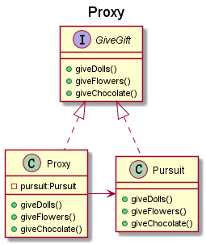

### 7.4 代码实现

```java
public interface GiveGift {
    void giveDolls();
    void giveFlowers();
    void giveChocolate();
}
```

```java
public class Proxy implements GiveGift {
    private Pursuit pursuit;

    public Proxy(SchoolGirl schoolGirl) {
        this.pursuit = new Pursuit(schoolGirl);
    }
    @Override
    public void giveDolls() {
        pursuit.giveDolls();
    }
    @Override
    public void giveFlowers() {
        pursuit.giveFlowers();
    }
    @Override
    public void giveChocolate() {
        pursuit.giveChocolate();
    }
}
```

```java
public class Pursuit implements GiveGift {
    private SchoolGirl schoolGirl;

    public Pursuit(SchoolGirl schoolGirl) {
        this.schoolGirl = schoolGirl;
    }
    @Override
    public void giveDolls() {
        schoolGirl.setHasDolls(true);
    }
    @Override
    public void giveFlowers() {
        schoolGirl.setHasFlowers(true);
    }
    @Override
    public void giveChocolate() {
        schoolGirl.setHasChocolate(true);
    }
}
```

```java
import lombok.Data;

@Data
public class SchoolGirl {
    boolean hasDolls;
    boolean hasFlowers;
    boolean hasChocolate;
}
```

### JDK使用

- java.lang.reflect.Proxy
- RMI
